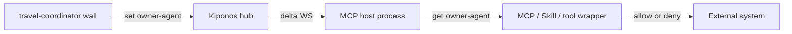

I have sat next to the travel-coordinator wall at 21:03 while MCP host was *this close* to calling the wrong MCP tool.

Not a model failure. A **posture** failure.

Hevruta/collab patterns exist. Agent folders without a hub become paste-ownership.

Someone on the floor said, out loud, **you take MCP write, I'll just read — wait, both wrote**. MCP host had started earlier. The tool list was frozen in `config.toml` / `.mcp.json` / a skill file. The only “safe” move anyone trusted was:

1. Kill MCP host (or its MCP child)
2. Edit the server list
3. Restart the host
4. Lose the plan the model already paid for

That is the ceremony. **Shared checkout. Both Grok Build and Cursor thought they were leader.**

**The Aha:** `owner-agent=travel-coordinator`. Unowned writes refuse. No honor system. Real-time nested state is now a **primitive** — as native as a hashmap — via [Kiponos.io](https://kiponos.io). The host stays up. The leaf moves. The next tool call already obeys.

## The problem: Live owner for who may call mutating tools

Agentic programming in 2026 has a public fight: MCP vs CLI vs Skills. The likes on MCP and Grok Build posts are the tell. The industry is stuck on *how to expose tools*.

The missing primitive is **live nested state**:

| Where the roster hid | What you restart | What you lose |
|----------------------|------------------|---------------|
| MCP schema dump at session start | The host, sometimes the child `npx` | 16–72% of the window before the user speaks |
| `~/.grok/config.toml` / Cursor `mcp.json` | MCP host | The open turn |
| SKILL.md / AGENTS.md | The next turn, sometimes the host | Context you already bought |
| “Just reconnect the server” | The MCP session | Tool-space you finally had right |

Shared checkout. Both Grok Build and Cursor thought they were leader.

That is not a protocol bug you wait out. That is a process that cannot `get()` a tree that moved.

## What teams believe

| Belief | Production |
|--------|------------|
| Put the SDK in the SPA so the tile matches | Connect tokens do not belong in a browser |
| Feature flags cover MCP write | Flags are another product, another delay |
| Restart the agent host — it is cheap | Cheap until 21:03 ate the open turn |
| MCP is the standard so we are done | MCP is how you call. It is not live posture |

## What is Kiponos here

Kiponos is a **live nested config hub**. Dashboard edit → WebSocket delta → in-memory tree on every connected process. Hot-path `get()` is a local map lookup. One WebSocket per process lifetime.

It is not an MCP server. It is not a Skill. It is the **control plane those things do not ship**: which tools may run, how fat a result may be, whether execute is allowed, whether a child inherits posture — *this turn*.

Profile shape: `['my-app']['v1.0.0']['dev']['base']`. The leaf in this story is `owner-agent` under `examples/agentic-mcp-1005-am-owner-folder/owner-agent`.

## Architecture



The model still calls tools. The wrapper reads `owner-agent` **before** the call. No schema dump policy in argv.

## Config tree

```yaml
examples/agentic-mcp-1005-am-owner-folder:
  owner-agent: travel-coordinator
  schema-budget: "4000"
  result-cap: "2000"
  tool-search: "on"
  execute-gate: "plan"
```

Eight-plus keys when you pair `owner-agent` with sister dials (budget, mute, pause). They move together on the travel-coordinator wall.

## Integration

Java tool wrapper (MCP host just *calls* it):

```java
import io.kiponos.Kiponos;
import io.kiponos.Folder;

Folder gate = Kiponos.createForCurrentTeam()
    .getFolder("examples/agentic-mcp-1005-am-owner-folder");
String roster = String.valueOf(gate.get("owner-agent"));
// MCP host tool: refuse the dangerous MCP call when posture moved
```

Python peer:

```python
from kiponos import Kiponos

k = Kiponos.connect(quiet=True)
try:
    posture = k.get("examples/agentic-mcp-1005-am-owner-folder/owner-agent", "live")
    if not str(posture):
        raise PermissionError("Live owner for who may call mutating tools gated live — host not restarted")
finally:
    k.disconnect()
```

React/Angular: **Node BFF** `@kiponos/react/server` / `@kiponos/angular/server`. SPA never holds Connect tokens.

Runnable mesh: `https://github.com/kiponos-io/kiponos-io/tree/master/examples/java/agentic-mcp-1005-am-owner-folder` — `./gradlew test run`.

## Real scenarios

| Event | Without Kiponos | With Kiponos |
|-------|-----------------|--------------|
| Three MCP servers at boot | 72% of the window gone | Live roster / schema-budget; dump shrinks |
| User says “no writes” mid-turn | Restart MCP host | Set `owner-agent`; next call already denies |
| Second host started earlier | Paste the json into chat | Both `get()` the same leaf |
| Subagent spawned | Frozen argv copy | Child `get()`s `inherit-posture` |
| Tool returns 500k tokens | Context rot, doom loop | `result-cap` in the wrapper |

## Performance (this path)

- Wrapper `get()` is in-process after bootstrap.
- One WebSocket per MCP host lifetime — not per MCP call.
- A dashboard edit is a **delta** of `owner-agent`, not a config.toml reload.
- You do not spend model tokens to “please restart MCP host.”
- Schema tax is optional once the live set is small.

## Compare to alternatives

| Approach | Honest fit | Why it still restarts |
|----------|------------|------------------------|
| More MCP servers | More integrations | More schema, worse selection |
| Skills progressive disclosure | Good docs, lazy load | Not a multi-host bus |
| Claude Code tool search | Better client | Other hosts still dump |
| Redis poll in the tool | Shared, extra RTT | You invented a hub with worse UX |
| Feature-flag SaaS | Product experiments | Rarely session-safe for MCP |
| Kill -9 the npx child | Janitor | The turn still died |

## When not to use Kiponos

| Situation | Why |
|-----------|-----|
| Tool schema itself changed (new argument) | That *is* a code/MCP host restart |
| Secret rotation of Connect / MCP OAuth tokens | Credentials are not live knobs |
| One-off local script, no peers | A hub is overkill |
| Browser-only “SDK in the SPA” | Forbidden — tokens leak or defaults lie |

## Pair `owner-agent` with a sister dial

`owner-agent` rarely moves alone on the travel-coordinator wall. Pair it with `schema-budget`, `result-cap`, or `execute-gate` so you do not fix Live owner for who may call mutating tools by inventing a second incident.

## Why MCP host is the wrong restart target

MCP host is good at calling tools. It is not a control plane. Killing it to flip `owner-agent` teaches the on-call that judgment requires a process ID. The travel-coordinator wall already disagrees.

## Getting started (15 minutes)

1. TeamPro on [kiponos.io](https://kiponos.io) → Connect → `KIPONOS_ID` / `KIPONOS_ACCESS` / profile `['my-app']['v1.0.0']['dev']['base']`.
2. Clone [github.com/kiponos-io/kiponos-io](https://github.com/kiponos-io/kiponos-io).
3. `cd examples/java/agentic-mcp-1005-am-owner-folder && cp kiponos.local.env.example kiponos.local.env`
4. `./gradlew test run` — prints `examples/agentic-mcp-1005-am-owner-folder/owner-agent=...`
5. In the dashboard, change `owner-agent`. Keep MCP host up. No MCP reconnect.
6. Point the tool wrapper at the same leaf. Do not ship a new server binary to flip Live owner for who may call mutating tools.

## Further reading

- [Developer Quickstart](https://github.com/kiponos-io/kiponos-io/blob/master/docs/devto-getting-started-developer-guide.md)
- [Product tour](https://dev.to/kiponos/getting-started-with-kiponosio-p5k)
- [GETTING-STARTED.md](https://github.com/kiponos-io/kiponos-io/blob/master/docs/GETTING-STARTED.md)
- [github.com/kiponos-io/kiponos-io](https://github.com/kiponos-io/kiponos-io)

## The moral

If flipping **Live owner for who may call mutating tools** requires restarting MCP host or reconnecting MCP, you do not have agentic control. You have a hope with a process ID.

MCP, Skills, and tools are how agents *act*. **Kiponos is the live primitive they do not ship** — so the travel-coordinator wall can change its mind without killing the session.

How to try: `examples/java/agentic-mcp-1005-am-owner-folder` and `./gradlew test`.
