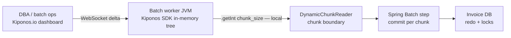

Tuesday 11:40 PM. The nightly billing extract has been running for **six hours**. DBA Slack lights up: redo logs are screaming, replication lag is climbing, and finance needs the `invoices` table unlocked by 7 AM for month-end close.

Your Spring Batch step uses `.chunk(500, tx)` — a number from a happy-path integration test in 2021 when the database had half the row count and nobody ran extracts during peak replication.

Killing the job means **reprocessing eight million rows from the last checkpoint** — if you even have a clean checkpoint. Letting it run at 500-row transactions might hold locks until lunch and blow the finance deadline.

The batch lead says what every senior Java engineer has internalized:

> "Chunk size is **job configuration**. You do not change it mid-flight."

But chunk size is not architecture. It is **backpressure** — how much work you ask the database to hold per transaction **tonight**. It should move when the database tells you 500 is too greedy.

Here is the Aha:

**`chunk(500)` behaves like a performance constant, but chunk size is operational backpressure.**

You can drop to `chunk_size: 100` **while the job runs** — no redeploy, no JVM restart, no killing eight million rows of progress. The next chunk boundary already uses the new integer. That is [Kiponos.io](https://kiponos.io).

## The problem — frozen chunk size on the DB hot path

Spring Batch makes chunk size feel permanent at step construction:

```java
@Bean
public Step extractStep(JobRepository repo, PlatformTransactionManager tx) {
    return new StepBuilder("extract", repo)
            .<Invoice, InvoiceDto>chunk(500, tx)
            .reader(invoiceReader())
            .processor(processor())
            .writer(writer())
            .build();
}
```

Every chunk commit holds locks, generates redo, and pressures replication. The DBA cannot reach into your running JVM. Ops cannot soften the hammer without a release. Senior developers **know** batch tuning matters — they do not know chunk boundaries can respect **live** integers.

| What teams believe | What production does |
|--------------------|---------------------|
| "Chunk size is a one-time performance constant" | DB health changes hour by hour |
| "Restart the job with new config" | Six hours of progress at risk |
| "We'll tune chunks in the next release" | Finance deadline is immutable |
| "Job parameters fix this" | Parameters freeze at launch unless you relaunch |

## The Aha — dynamic chunk policy between commits

Move chunk policy into Kiponos under profile `['billing']['batch']['prod']`:

```yaml
batch/
  billing_extract/
    chunk_size: 500
    skip_limit: 50
    throttle_enabled: true
    max_items_per_second: 0
  payment_reconcile/
    chunk_size: 200
    skip_limit: 10
    throttle_enabled: false
  archive_purge/
    chunk_size: 1000
    skip_limit: 0
    throttle_enabled: true
```

DBA begs for smaller transactions? Ops sets `chunk_size: 100`. WebSocket delta patches the SDK tree. **Next chunk boundary** reads `getInt()` locally — zero network. Job id unchanged. JVM still running.

## What is Kiponos.io — for long-running batch jobs

Kiponos is a real-time configuration hub. Your batch worker JVM connects once, loads a typed tree, and holds values in memory. Between chunk commits, your listener or reader calls `kiponos.path("batch", "billing_extract").getInt("chunk_size")` — a **local read** that does not add latency to the item loop itself.

That matters because batch jobs run for hours: polling a remote config store on every row would be absurd, but reading a local integer once per chunk boundary is free. Kiponos gives you dashboard-speed course correction when the DBA pages you at midnight — without the multi-hour cost of stopping and restarting a million-row step.

`afterValueChanged` can log audit events when ops changes chunk policy mid-job — critical for post-mortems when finance asks why throughput shifted at 2 AM.

## Architecture — chunk boundaries without restart



1. **Connect once** when the worker starts.
2. **Snapshot** loads `batch/billing_extract/*`.
3. **Delta** arrives when ops lowers `chunk_size`.
4. **Reader enforces boundary** — returns `null` to force commit.
5. **Next chunk** already uses the new limit.

## Bootstrap Kiponos in Spring Boot 3

```java
@Configuration
public class KiponosConfig {

    @Bean
    public Kiponos kiponos(
            @Value("${kiponos.team-id}") String teamId,
            @Value("${kiponos.access-key}") String accessKey,
            @Value("${kiponos.profile-path}") String profilePath) {
        return Kiponos.builder()
                .teamId(teamId)
                .accessKey(accessKey)
                .profilePath(profilePath)
                .build();
    }
}
```

## Integration — dynamic chunk reader on the hot path

Policy holder:

```java
@Component
public class LiveChunkSizePolicy {

    private final Kiponos kiponos;

    public LiveChunkSizePolicy(Kiponos kiponos) {
        this.kiponos = kiponos;
    }

    public int currentChunkSize(String jobKey) {
        return kiponos.path("batch", jobKey).getInt("chunk_size", 500);
    }

    public boolean throttleEnabled(String jobKey) {
        return kiponos.path("batch", jobKey).getBool("throttle_enabled", false);
    }
}
```

Reader that re-reads limit each item and forces chunk boundaries:

```java
public class DynamicChunkReader implements ItemReader<Invoice> {

    private final Kiponos kiponos;
    private final ItemReader<Invoice> delegate;
    private final String jobKey;
    private int itemsInCurrentChunk;

    public DynamicChunkReader(Kiponos kiponos, ItemReader<Invoice> delegate, String jobKey) {
        this.kiponos = kiponos;
        this.delegate = delegate;
        this.jobKey = jobKey;
    }

    @Override
    public Invoice read() throws Exception {
        int limit = kiponos.path("batch", jobKey).getInt("chunk_size", 500);
        if (itemsInCurrentChunk >= limit) {
            itemsInCurrentChunk = 0;
            return null; // force chunk boundary; next chunk sees new limit
        }
        Invoice item = delegate.read();
        if (item != null) {
            itemsInCurrentChunk++;
        }
        return item;
    }
}
```

Step wiring:

```java
@Bean
public Step extractStep(JobRepository repo, PlatformTransactionManager tx, Kiponos kiponos) {
    ItemReader<Invoice> baseReader = invoiceReader();
    DynamicChunkReader dynamicReader = new DynamicChunkReader(kiponos, baseReader, "billing_extract");

    return new StepBuilder("extract", repo)
            .<Invoice, InvoiceDto>chunk(500, tx) // max ceiling; reader enforces live size
            .reader(dynamicReader)
            .processor(processor())
            .writer(writer())
            .listener(new ChunkAuditListener(kiponos, "billing_extract"))
            .build();
}
```

Audit listener:

```java
public class ChunkAuditListener implements ChunkListener {

    private final Kiponos kiponos;
    private final String jobKey;

    public ChunkAuditListener(Kiponos kiponos, String jobKey) {
        this.kiponos = kiponos;
        kiponos.afterValueChanged(c -> {
            if (c.path().startsWith("batch/" + jobKey)) {
                log.warn("[kiponos] batch policy {} → {}", c.path(), c.newValue());
            }
        });
    }

    @Override
    public void afterChunk(ChunkContext context) {
        int size = kiponos.path("batch", jobKey).getInt("chunk_size", 500);
        context.setAttribute("live_chunk_size", size);
    }
}
```

DB recovered at 3 AM? Raise `chunk_size` back to `500` live and watch throughput climb without restarting the job.

## Real scenarios

| Event | Frozen `chunk(500)` | Live chunk via Kiponos |
|-------|----------------------|------------------------|
| Redo log pressure | Kill job, lose hours | `chunk_size: 100` now |
| Replication lag spike | Pause job, manual intervention | Throttle + smaller chunks live |
| DB recovered | Stay cautious until next deploy | Raise to `500` with audit trail |
| Month-end surge | Emergency PR | Hub tweak while job runs |
| Bad data burst | Fixed skip limit needs deploy | Adjust `skip_limit` live |

## Compare to alternatives

| Approach | Mid-job retune | Progress lost |
|----------|----------------|---------------|
| Hard-coded `chunk(500)` | Stop job, redeploy | Hours |
| Job parameters at launch only | Relaunch with new param | Checkpoint-dependent |
| `@RefreshScope` step bean | Actuator refresh | Step bean recycle risk |
| Poll DB config table | Possible | JDBC RTT per item — too expensive |
| **Kiponos SDK** | **Dashboard seconds** | **None** |

## Performance — why batch teams care

- `getInt("chunk_size")` once per item is O(1) local — negligible vs DB I/O
- Chunk boundary forced by `return null` — no Spring Batch internals fork required
- WebSocket delta does not block item processing thread
- `max_items_per_second` can gate writes when `throttle_enabled` without new deployment
- Audit listener records live policy in `ChunkContext` for observability pipelines

## When not to use Kiponos for batch tuning

| Case | Use instead |
|------|-------------|
| Job definition structure (steps, order, split flows) | Git + deployment |
| ItemReader SQL query shape or partition strategy | Code review |
| Database credentials | Vault |
| Replacing Spring Batch with streaming framework | Architecture migration |

## Getting started (15 minutes)

1. [TeamPro at kiponos.io](https://kiponos.io) — profile `['billing']['batch']['prod']`.
2. Move `chunk_size` and `skip_limit` for one long-running step into the hub.
3. Wrap your `ItemReader` with `DynamicChunkReader` that re-reads limit locally.
4. Add `ChunkAuditListener` with `afterValueChanged` for midnight policy changes.
5. Staging game day: start extract job, inject DB pressure, lower `chunk_size` live, watch redo metrics calm **without killing the job**.
6. Document boundary: Git declares step wiring; hub declares **operational backpressure**.

## Further reading

- [Developer Quickstart](https://dev.to/kiponos/kiponosio-developer-quickstart-java-python-and-your-first-live-config-change-3kjo)
- [Product tour](https://dev.to/kiponos/getting-started-with-kiponosio-p5k)
- [GETTING-STARTED.md](https://github.com/kiponos-io/kiponos-io/blob/master/docs/GETTING-STARTED.md)
- [github.com/kiponos-io/kiponos-io](https://github.com/kiponos-io/kiponos-io)

---

*Kiponos.io — chunk size is backpressure, not a tattoo.*