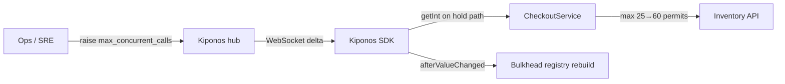

Flash sale redirect. Marketing sends two million users to checkout — inventory p99 is 120ms, but checkout p99 is 4.2s because Resilience4j allows only **25 concurrent** inventory calls. `maxConcurrentCalls: 25` was "capacity architecture" signed off in Q2.

Staff engineer: "Bulkhead sizing is **capacity architecture**."

But `maxConcurrentCalls` is **how many inventory slots checkout may occupy right now** — not a foundation slab.

## The problem: YAML-cast concurrency on checkout path

Resilience4j bulkhead config freezes at startup:

```yaml
resilience4j.bulkhead:
  instances:
    inventory:
      maxConcurrentCalls: 25
      maxWaitDuration: 500ms
```

Checkout calls inventory on every cart validation:

```java
@Bulkhead(name = "inventory", type = Bulkhead.Type.SEMAPHORE)
public InventoryHold holdInventory(HoldRequest req) {
    return inventoryClient.reserve(req);
}
```

Spring wires the semaphore once. Twenty-five permits for the JVM lifetime unless you restart or rebuild beans. During a traffic shift:

1. **Checkout threads block** on `BulkheadFullException` while inventory sits idle
2. **Raising the limit requires deploy** — marketing clock keeps ticking
3. **Per-tenant tuning** means YAML sprawl or feature branches

The checkout hot path needs **local reads** of current permit count and optional **live rebuild** when ops changes policy.

## What teams believe

| What teams say | What production does |
|----------------|---------------------|
| "Bulkhead limits were sized with load tests" | Traffic shape shifts hourly during campaigns |
| "Protecting downstream is always correct" | Healthy downstream + starved caller = wrong tradeoff |
| "Increase pods instead of bulkhead" | Pods multiply concurrent calls — bulkhead still caps at 25 |
| "Concurrency limits belong in architecture docs" | Ops needs a dial during the flash sale |

## The Aha

Read `max_concurrent_calls` from [Kiponos.io](https://kiponos.io) and rebuild the bulkhead registry entry on `afterValueChanged`. Ops raises inventory bulkhead to `60` in the dashboard — checkout immediately gains permits **without recycling pods**.

## What is Kiponos.io (for bulkhead concurrency)

[Kiponos.io](https://kiponos.io) holds operational resilience floats under profile `['checkout']['prod']['bulkhead']`. The SDK syncs `bulkhead/inventory/max_concurrent_calls` via WebSocket deltas into an in-process tree.

`kiponos.path("bulkhead", "inventory").getInt("max_concurrent_calls")` is a **local read** on the checkout thread — no HTTP to a config API before every `holdInventory()` call.

`afterValueChanged` triggers `BulkheadRegistry` rebuild when ops edits concurrency. Git keeps **which dependencies get bulkheads**. The hub keeps **how many concurrent calls each may use during this campaign**.

## Architecture



## Config tree

```yaml
bulkhead/
  inventory/
    max_concurrent_calls: 25
    max_wait_duration_ms: 500
    enabled: true
  payments/
    max_concurrent_calls: 15
    max_wait_duration_ms: 1000
  campaign/
    flash_sale_mode: false
    flash_sale_inventory_calls: 80
```

## Integration (Spring Boot + Resilience4j bulkhead)

```java
@Configuration
public class KiponosConfig {

    @Bean
    public Kiponos kiponos(
            @Value("${kiponos.team-id}") String teamId,
            @Value("${kiponos.access-key}") String accessKey,
            @Value("${kiponos.profile-path}") String profilePath) {
        return Kiponos.builder()
                .teamId(teamId)
                .accessKey(accessKey)
                .profilePath(profilePath)
                .build();
    }
}
```

```java
@Service
public class CheckoutInventoryGateway {

    private final Kiponos kiponos;
    private final InventoryClient inventoryClient;
    private final BulkheadRegistry bulkheadRegistry;
    private volatile Bulkhead inventoryBulkhead;

    public CheckoutInventoryGateway(Kiponos kiponos, InventoryClient inventoryClient,
                                    BulkheadRegistry bulkheadRegistry) {
        this.kiponos = kiponos;
        this.inventoryClient = inventoryClient;
        this.bulkheadRegistry = bulkheadRegistry;
        kiponos.afterValueChanged(this::onBulkheadChange);
        inventoryBulkhead = rebuildBulkhead();
    }

    public InventoryHold holdInventory(HoldRequest req) {
        var cfg = kiponos.path("bulkhead", "inventory");
        if (!cfg.getBool("enabled", true)) {
            return inventoryClient.reserve(req);
        }
        int maxCalls = resolveMaxConcurrent(cfg);
        return inventoryBulkhead.executeSupplier(() -> inventoryClient.reserve(req));
    }

    private void onBulkheadChange(ValueChange change) {
        if (change.path().startsWith("bulkhead/")) {
            inventoryBulkhead = rebuildBulkhead();
            log.info("Inventory bulkhead rebuilt: max_concurrent_calls={}",
                    resolveMaxConcurrent(kiponos.path("bulkhead", "inventory")));
        }
    }

    private Bulkhead rebuildBulkhead() {
        var cfg = kiponos.path("bulkhead", "inventory");
        return bulkheadRegistry.bulkhead("inventory", BulkheadConfig.custom()
                .maxConcurrentCalls(resolveMaxConcurrent(cfg))
                .maxWaitDuration(Duration.ofMillis(cfg.getInt("max_wait_duration_ms", 500)))
                .build());
    }

    private int resolveMaxConcurrent(ConfigPath cfg) {
        if (kiponos.path("bulkhead", "campaign").getBool("flash_sale_mode", false)) {
            return kiponos.path("bulkhead", "campaign")
                    .getInt("flash_sale_inventory_calls", 80);
        }
        return cfg.getInt("max_concurrent_calls", 25);
    }
}
```

Flash sale? Ops enables `flash_sale_mode` and sets `flash_sale_inventory_calls: 80`. Checkout stops shedding valid traffic while inventory latency stays green.

## Real scenarios

| Event | Without Kiponos | With Kiponos |
|-------|-----------------|--------------|
| Marketing traffic redirect | BulkheadFullException storm | Raise `max_concurrent_calls` live |
| Inventory degradation | Manual deploy to lower cap | Drop to 10 without touching checkout pods |
| Load test week | Branch per bulkhead value | Hub profile `loadtest/checkout` |
| Post-campaign calm | Wait for release train | Disable `flash_sale_mode` |

## Performance — why bulkhead reads stay cheap

- **`getInt()` local read** before `executeSupplier` — noise vs inventory HTTP RTT
- **Registry rebuild on change only** — not per checkout request
- **One WebSocket** per checkout pod — not Redis semaphore sync
- **Delta patch** — raising 25 → 60 sends one integer, not full resilience YAML
- **Semaphore resize via new bulkhead** — avoids blocking checkout during policy flip

## Compare to alternatives

| Approach | Reallocate permits during sale | Hot-path read cost |
|----------|-------------------------------|-------------------|
| Resilience4j YAML | PR + rolling restart | Zero (frozen) |
| `@RefreshScope` beans | Context refresh | Bean recycle risk |
| Ad-hoc `Semaphore` in code | Redeploy to change | Zero (frozen) |
| Redis distributed semaphore | Yes | RTT per acquire |
| **Kiponos SDK** | **Dashboard, seconds** | **Memory read** |

## When not to use Kiponos

| Case | Better approach |
|------|-----------------|
| Bulkhead instance naming and fallback wiring | Git |
| Service mesh circuit breaking migration | Istio/Linkerd policy |
| OS thread pool sizing (Tomcat) | Live Tomcat binder article |
| Unlimited concurrency without backpressure | Fix architecture — bulkhead exists for a reason |

## Getting started (15 minutes)

1. [Free TeamPro at kiponos.io](https://kiponos.io) — profile `['checkout']['prod']['bulkhead']`.
2. Add `io.kiponos:sdk-boot-3` and Resilience4j to checkout service.
3. Set `KIPONOS_ID`, `KIPONOS_ACCESS`, and `-Dkiponos="['checkout']['prod']['bulkhead']"`.
4. Create `bulkhead/inventory` tree with campaign override keys.
5. Wire `CheckoutInventoryGateway` with `afterValueChanged` rebuild.
6. Staging game day: simulate flash traffic, raise `max_concurrent_calls`, confirm rejections drop **without pod restart**.

## Further reading

- [Developer Quickstart](https://dev.to/kiponos/kiponosio-developer-quickstart-java-python-and-your-first-live-config-change-3kjo)
- [Product tour](https://dev.to/kiponos/getting-started-with-kiponosio-p5k)
- [GETTING-STARTED.md](https://github.com/kiponos-io/kiponos-io/blob/master/docs/GETTING-STARTED.md)
- [github.com/kiponos-io/kiponos-io](https://github.com/kiponos-io/kiponos-io)

---

*Kiponos.io — bulkhead permits are capacity dials, not bronze plaques from the architecture review.*