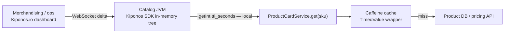

Flash sale Friday, 9:07 AM. Merchandising pushes a new price matrix every **five minutes** — flash tiers, bundle discounts, inventory-linked markdowns. Your catalog service caches product cards with Caffeine `expireAfterWrite(3600, TimeUnit.SECONDS)` because someone copy-pasted "one hour is fine" into a `@Bean` method during a calm sprint in 2020.

By 9:22 AM, customers screenshot stale prices on Twitter. Support tickets cite advertised discounts that the PDP no longer shows. Legal pings about promotional accuracy. Finance sees conversion drop while the cart service is healthy — the catalog is **lying**, not slow.

The platform lead says what every senior engineer has said during peak traffic:

> "TTL is **cache tuning**. We cannot redeploy the catalog service while checkout is hot."

But TTL is not folklore from a performance blog. It is **how wrong you are willing to be, for how long, right now**. During a flash sale, one hour is absurd. During steady state at 3 AM, five seconds might burn your primary database. The number should move when merchandising moves — not when CI finishes.

Here is the Aha that lands for staff engineers who have lived through sale weekends:

**`expireAfterWrite` behaves like a sacred constant, but TTL is operational freshness policy.**

You can change `ttl_seconds` **while the JVM keeps serving catalog traffic** — no redeploy, no restart, no `@RefreshScope` bean recycle. The next cache miss already respects the new TTL. That is [Kiponos.io](https://kiponos.io).

## The problem — frozen TTL on the hot path

Spring Boot makes it trivial to bake cache policy into startup configuration:

```java
@Bean
public Cache<String, ProductCard> productCache() {
    return Caffeine.newBuilder()
            .expireAfterWrite(3600, TimeUnit.SECONDS)
            .maximumSize(10_000)
            .recordStats()
            .build();
}
```

Every `productCache.get(sku)` on the PDP hot path inherits that one-hour decision. Merchandising cannot reach into your running pods. Ops cannot shorten freshness without a release train. The pain is not ignorance — senior developers **know** stale cache costs money. They do not know there is a clean way to retune TTL **without recycling the JVM**.

| What teams believe | What production does |
|------------------|---------------------|
| "Longer TTL = faster catalog" | Stale prices = revenue loss + trust erosion |
| "We'll shorten TTL in the next release" | The sale ends Sunday; the PR merges Monday |
| "Cache config is performance art" | TTL is merchandising policy for **this hour** |
| "Caffeine builder runs once at startup" | Startup is not the only moment that matters |

## The Aha — live cache policy while traffic runs

Move TTL and capacity knobs into Kiponos. Your service still boots from minimal Spring wiring — but **live cache policy** lives in the hub:

```yaml
cache/
  product_cards/
    ttl_seconds: 3600
    max_entries: 10000
    negative_ttl_seconds: 60
    invalidate_on_policy_change: true
  pricing/
    ttl_seconds: 300
    max_entries: 5000
  search_facets/
    ttl_seconds: 120
    max_entries: 2000
```

During the flash sale, merchandising sets `product_cards/ttl_seconds` to `30` in the dashboard. WebSocket delivers a **delta** — only that key patches into the SDK's in-memory tree. Your lookup wrapper reads the new integer on the **next** `get(sku)` — local `getInt()`, zero network. Running pods unchanged. When the sale ends, restore `3600` without redeploy.

## What is Kiponos.io — for catalog freshness

Kiponos is a real-time configuration hub. Your Java SDK connects once at startup, loads a typed tree for a profile path like `['catalog']['prod']['cache']`, and holds the latest values **in process memory**. Dashboard edits arrive as WebSocket **deltas** — not a 40 KB YAML redeploy. Your request thread calls `kiponos.path("cache", "product_cards").getInt("ttl_seconds")` and gets a **local read** in microseconds. No HTTP round trip. No Redis poll on every lookup.

That matters on the catalog hot path: thousands of PDP requests per second, each potentially touching cache policy. You cannot afford remote config fetches per SKU. Kiponos separates **wiring** (team id, access key, profile path in `application.yml`) from **operational floats** (TTL seconds, max entries, negative cache duration) that merchandising and ops need to move during events.

`afterValueChanged` lets you react when policy flips hard — for example, calling `cache.invalidateAll()` when `invalidate_on_policy_change` is true so a major TTL change does not leave hour-old entries behind.

## Architecture — how freshness flows without redeploy



1. **Connect once** at startup — `Kiponos.createForCurrentTeam()`.
2. **Full tree snapshot** loads for profile `['catalog']['prod']['cache']`.
3. **Dashboard edit** sends **delta only** — not the entire cache policy file.
4. **SDK merges async** on a WebSocket worker thread.
5. **Reads are local** — your request thread never waits on the network.

This is why the Aha lands hard: the mental model flips from "cache bean + restart culture" to **"freshness policy my process already holds."**

## Bootstrap Kiponos in Spring Boot 3

```java
@Configuration
public class KiponosConfig {

    @Bean
    public Kiponos kiponos(
            @Value("${kiponos.team-id}") String teamId,
            @Value("${kiponos.access-key}") String accessKey,
            @Value("${kiponos.profile-path}") String profilePath) {
        return Kiponos.builder()
                .teamId(teamId)
                .accessKey(accessKey)
                .profilePath(profilePath)
                .build();
    }
}
```

Keep **only** team id, access key, and profile path in `application.yml` — not the operational TTL floats.

## Integration — Kiponos-backed lookup on the hot path

Wrap Caffeine with a policy-aware TTL instead of baking `expireAfterWrite` at bean creation:

```java
@Service
public class ProductCardService {

    private final Kiponos kiponos;
    private final ProductRepository repo;
    private final Cache<String, TimedValue<ProductCard>> cache = Caffeine.newBuilder()
            .maximumSize(50_000)
            .recordStats()
            .build();

    public ProductCardService(Kiponos kiponos, ProductRepository repo) {
        this.kiponos = kiponos;
        this.repo = repo;
    }

    public ProductCard get(String sku) {
        var policy = kiponos.path("cache", "product_cards");
        int ttl = policy.getInt("ttl_seconds", 3600);
        int negativeTtl = policy.getInt("negative_ttl_seconds", 60);

        TimedValue<ProductCard> hit = cache.getIfPresent(sku);
        if (hit != null) {
            if (hit.isNegative() && !hit.isExpired(negativeTtl)) {
                return null;
            }
            if (!hit.isNegative() && !hit.isExpired(ttl)) {
                return hit.value();
            }
        }

        Optional<ProductCard> loaded = repo.load(sku);
        if (loaded.isEmpty()) {
            cache.put(sku, TimedValue.negative());
            return null;
        }
        ProductCard fresh = loaded.get();
        cache.put(sku, TimedValue.of(fresh));
        return fresh;
    }
}
```

Binder for hard freshness flips when merchandising changes policy aggressively:

```java
@Component
public class LiveCachePolicyBinder {

    private final Kiponos kiponos;
    private final Cache<String, TimedValue<ProductCard>> cache;

    public LiveCachePolicyBinder(Kiponos kiponos,
                                 @Qualifier("productCardCache") Cache<String, TimedValue<ProductCard>> cache) {
        this.kiponos = kiponos;
        this.cache = cache;
        kiponos.afterValueChanged(this::onChange);
    }

    private void onChange(ValueChange change) {
        if (!change.path().startsWith("cache/product_cards")) return;
        var policy = kiponos.path("cache", "product_cards");
        if (policy.getBool("invalidate_on_policy_change", false)) {
            cache.invalidateAll();
        }
    }
}
```

Sale starts? Merchandising sets `ttl_seconds: 30`. **Next cache miss** uses thirty seconds. Major policy flip with `invalidate_on_policy_change: true`? Entire cache clears without pod restart.

## Real scenarios — emotional → operational

| Moment | Hard-coded TTL reflex | Kiponos path |
|--------|------------------------|--------------|
| Flash sale price churn | Redeploy or accept stale PDPs | `cache/product_cards/ttl_seconds: 30` live |
| Partner pricing API flaky | Long negative cache amplifies pain | Drop `negative_ttl_seconds` instantly |
| Post-sale steady state | Leave aggressive TTL burning DB | Raise `ttl_seconds` back to `3600` |
| Search facet explosion | Emergency branch per environment | Hub profile `catalog/sale-weekend` |
| Legal audit of advertised price | Forensics on deploy timing | Hub audit trail shows who changed TTL when |

Pair with [live Tomcat thread tuning](https://github.com/kiponos-io/kiponos-io/blob/master/docs/devto-aha-tomcat-threads.md) — catalog slowness and thread exhaustion often arrive together during sale traffic.

## Compare to alternatives

| Approach | Mid-sale TTL change | Read cost on hot path |
|----------|---------------------|------------------------|
| `@Bean` Caffeine `expireAfterWrite` | PR + deploy (25+ min) | Zero (frozen) |
| `@RefreshScope` cache bean | Actuator refresh | Bean rebuild + cache cold start |
| Poll Redis for TTL policy | Dashboard-fast | Network RTT per lookup |
| Env var + rolling restart | ConfigMap rollout | Same restart blast radius |
| **Kiponos SDK** | **Dashboard delta (seconds)** | **Memory read** |

## Performance — why catalog teams care

- One WebSocket per JVM lifetime — not one config fetch per SKU
- `getInt("ttl_seconds")` is O(1) on the cached tree — safe inside tight lookup loops
- `invalidateAll()` runs on `afterValueChanged`, not per request
- Caffeine still owns eviction and size policy — Kiponos only feeds the integers
- Negative TTL reads share the same local path — no second config source

## When not to use Kiponos for cache policy

| Case | Better approach |
|------|-----------------|
| Redis cluster topology (shards, replicas) | GitOps / infra-as-code |
| Serialization format or compression codec | Code review + deployment |
| Secrets embedded in cached objects | Never cache secrets; use Vault |
| Replacing Caffeine with a distributed cache layer | Architecture migration |
| "Set TTL to 0" without DB capacity planning | Load testing discipline first |

## Getting started (15 minutes)

1. [TeamPro at kiponos.io](https://kiponos.io) — create profile `['catalog']['prod']['cache']`.
2. Move **three** keys out of code: `ttl_seconds`, `max_entries`, `negative_ttl_seconds`.
3. Replace `expireAfterWrite` in your `@Bean` with a `TimedValue` wrapper that reads TTL from Kiponos.
4. Add `LiveCachePolicyBinder` with `afterValueChanged` for optional `invalidateAll()`.
5. Rehearsal: simulate flash sale in staging, drop `ttl_seconds` to `30` from the dashboard, verify PDP freshness **without pod restart**.
6. Document boundary: Git declares cache wiring; hub declares **operational freshness**.

## Further reading

- [Developer Quickstart](https://dev.to/kiponos/kiponosio-developer-quickstart-java-python-and-your-first-live-config-change-3kjo)
- [Product tour](https://dev.to/kiponos/getting-started-with-kiponosio-p5k)
- [GETTING-STARTED.md](https://github.com/kiponos-io/kiponos-io/blob/master/docs/GETTING-STARTED.md)
- [github.com/kiponos-io/kiponos-io](https://github.com/kiponos-io/kiponos-io)

---

*Kiponos.io — TTL is how stale you agree to be, not a constant.*