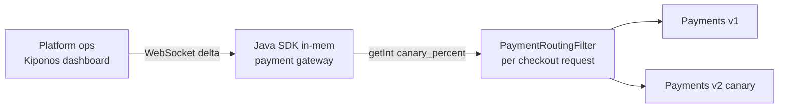

The new payments service survived four hours at **5% canary**. Error rate flat. P99 latency down 18%. The platform lead still cannot send more traffic — because `private static final int CANARY_PERCENT = 5` is compiled into the edge routing filter, and Helm values for Istio require a change window that opens tomorrow.

Product asks:

> "Metrics are green. Why are 95% of users still on the old path?"

Platform:

> "Canary percent is **deployment config**. It moves with the pipeline."

But `CANARY_PERCENT` is not pipeline scripture. It is **how much confidence you have right now** — 5% on hour one, 40% when dashboards stay green, 100% when you're ready. Waiting on a mesh values PR while metrics glow is how rollouts lose momentum and trust.

## The problem: frozen traffic weight on every request

Your monolith-or-gateway filter picks the payments implementation per request:

```java
public class PaymentRoutingFilter extends OncePerRequestFilter {
    private static final int CANARY_PERCENT = 5;

    @Override
    protected void doFilterInternal(HttpServletRequest req, HttpServletResponse res,
                                    FilterChain chain) throws ServletException, IOException {
        String userId = req.getHeader("X-User-Id");
        boolean canary = Math.floorMod(userId.hashCode(), 100) < CANARY_PERCENT;
        req.setAttribute("payments.impl", canary ? "v2" : "v1");
        chain.doFilter(req, res);
    }
}
```

Service mesh weights in Helm are often **Git-backed** too. Every checkout request evaluates routing. The read must be **local** — you cannot call a deployment API per HTTP round-trip. Yet the weight must change **during** the rollout hour when observability says go.

## What teams believe

| What teams say | What production does |
|----------------|---------------------|
| "Canary weight belongs in the service mesh" | Mesh PRs lag behind metrics by hours |
| "Argo Rollouts owns progressive delivery" | Not every team runs Argo; Java filter still routes |
| "5% until automated analysis passes" | Analysis passed; constant still says 5 |
| "Changing weight without pipeline is unsafe" | **Frozen** weight is also unsafe when v2 is clearly healthy |

The pain is treating **live confidence** like **immutable pipeline state**.

## The Aha

**`CANARY_PERCENT = 5` looks like deployment pipeline config cast in code, but traffic percentage is an operational confidence dial** — ramp to 40 when metrics hold, roll back to 0 on anomaly, promote to 100 when ready. [Kiponos.io](https://kiponos.io) feeds `canary_percent` with local `getInt()` on every routing decision — no mesh PR, no redeploy.

## What is Kiponos.io (for canary routing)

[Kiponos.io](https://kiponos.io) stores routing weights under profile `['payments']['gateway']['prod']['live']` → `routing/payments`. WebSocket deltas update `canary_percent` in every gateway pod's in-memory tree.

`kiponos.path("routing", "payments").getInt("canary_percent", 5)` on each request is a **local read** — microseconds, zero network. Ops moves the slider in the dashboard; the **next** checkout sees the new split. `afterValueChanged` logs audit events for compliance — who ramped to 40% and when.

## Architecture



1. **Connect once** at gateway startup.
2. **Store weight** beside `canary_enabled` kill switch.
3. **Hash-route locally** — stable per user, adjustable percent.
4. **Audit** every weight change via listener.

## Config tree

```yaml
routing/
  payments/
    canary_percent: 5
    canary_enabled: true
    sticky_by_user_id: true
    rollback_percent: 0
    max_canary_percent: 50
  checkout/
    canary_percent: 10
    canary_enabled: false
```

## Integration (Spring Boot 3 gateway)

```java
@Configuration
public class KiponosConfig {

    @Bean
    public Kiponos kiponos(
            @Value("${kiponos.team-id}") String teamId,
            @Value("${kiponos.access-key}") String accessKey,
            @Value("${kiponos.profile-path}") String profilePath) {
        return Kiponos.builder()
                .teamId(teamId)
                .accessKey(accessKey)
                .profilePath(profilePath)
                .build();
    }
}
```

```java
@Component
@Order(Ordered.HIGHEST_PRECEDENCE + 20)
public class LiveCanaryRoutingFilter extends OncePerRequestFilter {

    private final Kiponos kiponos;

    public LiveCanaryRoutingFilter(Kiponos kiponos) {
        this.kiponos = kiponos;
        kiponos.afterValueChanged(c -> {
            if (c.path().startsWith("routing/payments")) {
                log.info("Canary routing changed: {} → {}", c.path(), c.newValue());
            }
        });
    }

    @Override
    protected void doFilterInternal(HttpServletRequest req, HttpServletResponse res,
                                    FilterChain chain) throws ServletException, IOException {
        if (!req.getRequestURI().startsWith("/api/payments")) {
            chain.doFilter(req, res);
            return;
        }
        String impl = useCanary(req) ? "payments-v2" : "payments-v1";
        req.setAttribute("payments.target", impl);
        chain.doFilter(req, res);
    }

    boolean useCanary(HttpServletRequest req) {
        var routing = kiponos.path("routing", "payments");
        if (!routing.getBool("canary_enabled", true)) {
            return false;
        }
        int pct = routing.getInt("canary_percent", 5);
        if (pct <= 0) return false;
        if (pct >= 100) return true;

        String key = routing.getBool("sticky_by_user_id", true)
                ? req.getHeader("X-User-Id")
                : req.getSession().getId();
        if (key == null) key = req.getRemoteAddr();
        return Math.floorMod(key.hashCode(), 100) < pct;
    }
}
```

Downstream controllers read `payments.target` from the request attribute and proxy to v1 or v2. Every `getInt("canary_percent")` is a local memory read — safe at checkout QPS.

## Real scenarios

| Event | Without Kiponos | With Kiponos |
|-------|-----------------|--------------|
| Metrics green after 4h at 5% | Wait for pipeline promotion | Ramp `canary_percent` to 40 live |
| Error spike on v2 | Emergency Helm rollback PR | Set `canary_percent: 0` in seconds |
| Black Friday freeze | Stuck at partial canary | `canary_enabled: false` — instant full v1 |
| Per-env testing | Branch per weight | Profile `['payments']['staging']['live']` at 100% |

## Performance — why canary reads are free

- **One WebSocket** per gateway pod — not a deployment API per checkout
- **`getInt()` is O(1)** — nanoseconds vs payment authorization I/O
- **Sticky hash uses local percent** — no shared Redis for weight
- **Delta ramp** 5 → 40 sends one integer patch across fleet

Routing policy is noise compared to downstream payment latency.

## Compare to alternatives

| Approach | Ramp weight during green metrics | Hot-path read cost | Instant rollback |
|----------|----------------------------------|-------------------|------------------|
| `static final` constant | Redeploy | Zero (frozen) | No |
| Istio / Envoy Helm weights | PR + mesh apply | N/A at app layer | Minutes |
| Argo Rollouts | Automated steps | N/A in-app filter | Pipeline-bound |
| Redis-stored weight | Yes | RTT per request | Custom |
| **Kiponos SDK** | **Dashboard, seconds** | **Memory read** | **`canary_percent: 0`** |

## When not to use Kiponos

| Case | Better home |
|------|-------------|
| Kubernetes Deployment replica counts | HPA / GitOps |
| mTLS and upstream cluster definitions | Service mesh baseline |
| Payment API contract versioning | Git + schema registry |
| Full blue-green at load balancer | Infra traffic manager |

## Getting started (15 minutes)

1. [TeamPro at kiponos.io](https://kiponos.io) — profile `['payments']['gateway']['prod']['live']`.
2. Add `io.kiponos:sdk-boot-3` to the routing gateway.
3. Create `routing/payments` tree with `canary_percent` and `canary_enabled`.
4. Replace `CANARY_PERCENT` constant with `LiveCanaryRoutingFilter`.
5. Shadow checkout traffic, ramp 5 → 25 in dashboard — observe v2 share shift without restart.

## Further reading

- [Developer Quickstart](https://dev.to/kiponos/kiponosio-developer-quickstart-java-python-and-your-first-live-config-change-3kjo)
- [Product tour](https://dev.to/kiponos/getting-started-with-kiponosio-p5k)
- [GETTING-STARTED.md](https://github.com/kiponos-io/kiponos-io/blob/master/docs/GETTING-STARTED.md)
- [github.com/kiponos-io/kiponos-io](https://github.com/kiponos-io/kiponos-io)

---

*Kiponos.io — canary percent is today's confidence dial, not pipeline wallpaper.*