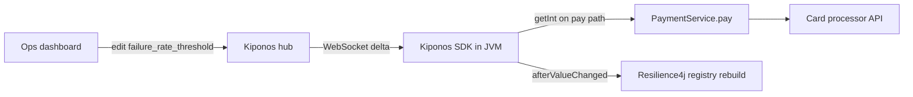

Tuesday 14:07. The card processor returns intermittent 503s — a known brownout, not a full outage. Your payment service wraps every authorization in a Resilience4j circuit breaker named `payments`. Within four minutes the breaker opens. Legitimate customers start seeing `CallNotPermittedException` because half of recent calls failed.

The on-call SRE pulls up Grafana and says what resilience teams say in every postmortem:

> "Circuit breaker config is **resilience architecture**. It ships with the service."

But `failureRateThreshold: 50` is not architecture. It is **how allergic you are to errors right now** — tighter when the platform is stable, looser when a partner is flapping and you still need revenue to flow.

Someone opens `application-prod.yml` — `50` since a template copy three years ago. **`failureRateThreshold` behaves like a sacred constant, but it is an operational dial you turn during incidents.**

## The problem: frozen thresholds on the payment hot path

Resilience4j makes it easy to bake breaker policy into Spring Boot YAML:

```yaml
resilience4j.circuitbreaker:
  instances:
    payments:
      failureRateThreshold: 50
      waitDurationInOpenState: 30s
      slidingWindowSize: 100
      minimumNumberOfCalls: 20
```

Your authorization service evaluates this on every transaction:

```java
@CircuitBreaker(name = "payments", fallbackMethod = "payFallback")
public PaymentResult pay(PaymentRequest req) {
    return processorClient.authorize(req);
}
```

Spring wires the breaker once at startup. The threshold is **fixed for the JVM lifetime** unless you recycle the process or trigger a fragile `@RefreshScope` refresh.

That hurts on the hot path because:

1. **Brownouts are time-bounded** — you need to ride out a 20-minute partner flap without rejecting good traffic for an hour
2. **Threshold tuning is iterative** — ops wants 65 now, 55 after recovery, without a deploy window
3. **Per-environment variance** — staging can stay aggressive; prod needs breathing room during the same incident

Polling a config table or Redis on every `pay()` adds RTT to a path that already talks to card networks. You need **local reads** and **async updates**.

## What teams believe

| What teams say | What production does |
|----------------|---------------------|
| "Breaker thresholds were sized in the architecture review" | Partner health changes minute to minute |
| "Opening the circuit protects us — leave it" | Open circuits reject revenue after the blast radius is contained |
| "We'll tune it in the next resilience sprint" | Checkout abandonment does not wait for sprints |
| "Resilience4j YAML is the source of truth" | YAML is a snapshot; incidents need live policy |

Senior developers **know** circuit breakers matter. They do not always know the threshold can move **while the JVM keeps authorizing cards**.

## The Aha

Wire `failure_rate_threshold` into [Kiponos.io](https://kiponos.io). Your service reads it locally on every guarded call; ops changes the number in the dashboard while pods run. WebSocket delivers a **delta** — only that key patches into the SDK's in-memory tree. The next `getInt()` returns `65`. No redeploy. No restart. No Spring context recycle.

## What is Kiponos.io (for circuit breaker policy)

[Kiponos.io](https://kiponos.io) connects once at startup (`Kiponos.createForCurrentTeam()`), loads profile `['payments']['prod']['resilience']`, and merges **WebSocket deltas** into an in-process tree. Every `getInt("failure_rate_threshold")` is a **local memory read** on the authorization path — no HTTP, no JDBC.

Register `afterValueChanged` to rebuild the Resilience4j registry when ops edits thresholds. Git keeps **wiring**; the hub keeps **operational floats**.

## Architecture



1. **Connect once** at service startup.
2. **Full tree snapshot** loads for `['payments']['prod']['resilience']`.
3. **Dashboard edit** sends one key patch — not a 40 KB YAML redeploy.
4. **Reads are local** — request threads never wait on the network.
5. **Binder optional** — `afterValueChanged` applies new breaker config to the live registry.

## Config tree

```yaml
resilience/
  payments/
    failure_rate_threshold: 50
    wait_duration_open_ms: 30000
    sliding_window_size: 100
    minimum_number_of_calls: 20
    enabled: true
  global/
    audit_breaker_changes: true
    default_slow_call_threshold_ms: 2000
```

## Integration (Spring Boot + Resilience4j)

Wire `Kiponos` via `@Bean` (team id, access key, profile path only in `application.yml`). Service with hot-path read and live registry rebuild:

```java
@Service
public class PaymentRouter {
    private final Kiponos kiponos;
    private final PaymentProcessorClient processor;
    private final CircuitBreakerRegistry registry;
    private volatile CircuitBreaker paymentsBreaker;

    public PaymentRouter(Kiponos kiponos, PaymentProcessorClient processor,
                         CircuitBreakerRegistry registry) {
        this.kiponos = kiponos;
        this.processor = processor;
        this.registry = registry;
        kiponos.afterValueChanged(this::onBreakerConfigChange);
        paymentsBreaker = rebuildBreaker();
    }

    public PaymentResult pay(PaymentRequest req) {
        var cfg = kiponos.path("resilience", "payments");
        if (!cfg.getBool("enabled", true)) {
            return processor.authorize(req);
        }
        // Local read — safe on every transaction
        int threshold = cfg.getInt("failure_rate_threshold", 50);
        return paymentsBreaker.executeSupplier(() -> processor.authorize(req));
    }

    private void onBreakerConfigChange(ValueChange change) {
        if (change.path().startsWith("resilience/payments")) {
            paymentsBreaker = rebuildBreaker();
            log.info("Payments breaker rebuilt: threshold now {}",
                    kiponos.path("resilience", "payments").getInt("failure_rate_threshold"));
        }
    }

    private CircuitBreaker rebuildBreaker() {
        var cfg = kiponos.path("resilience", "payments");
        return registry.circuitBreaker("payments", CircuitBreakerConfig.custom()
                .failureRateThreshold(cfg.getInt("failure_rate_threshold", 50))
                .waitDurationInOpenState(Duration.ofMillis(cfg.getInt("wait_duration_open_ms", 30000)))
                .slidingWindowSize(cfg.getInt("sliding_window_size", 100))
                .minimumNumberOfCalls(cfg.getInt("minimum_number_of_calls", 20))
                .build());
    }
}
```

Partner brownout? Ops sets `failure_rate_threshold` to `65`. The next rebuild tolerates more failures while the processor recovers. When green returns, drop it back to `50` from the dashboard.

## Real scenarios

| Event | Without Kiponos | With Kiponos |
|-------|-----------------|--------------|
| Processor brownout at peak | Circuit trips; good traffic rejected for 30+ min | Raise threshold temporarily; ride out flap |
| Recovery after outage | Manual half-open wait; still shedding revenue | Lower threshold live; audit trail in hub |
| Black Friday load test | Branch per threshold value | Same JAR, hub profile `loadtest/aggressive` |
| Post-incident tuning | Debate "correct" threshold in Slack | Tune with dashboard history; no pod churn |

## Performance — why breaker reads stay cheap

- **One WebSocket** per JVM — not one config fetch per authorization
- **`getInt()` is O(1)** on the cached tree — noise next to processor RTT
- **Registry rebuild runs on `afterValueChanged`** — not per `pay()` call
- **Delta updates** — changing threshold 50 → 65 sends one patch, not the full resilience tree
- **No GC pressure** from parsing YAML or hitting Redis inside the breaker window

## Compare to alternatives

| Approach | Mid-flight threshold change | Hot-path read cost | Ops audit |
|----------|----------------------------|--------------------|-----------|
| Static `application.yml` | PR + rolling restart | Zero (frozen) | Git history |
| `@RefreshScope` + actuator | Context refresh risk | Post-refresh local | Actuator logs |
| Redis / DB poll per call | Yes | Network RTT every auth | Custom |
| Feature-flag SaaS | Booleans only | Network evaluation | Per-flag UI |
| **Kiponos SDK** | **Dashboard, seconds** | **Memory read** | **Hub + listeners** |

## When not to use Kiponos

| Case | Better approach |
|------|-----------------|
| Breaker instance naming and fallback class wiring | Git review — structure, not floats |
| Replacing Resilience4j with a service mesh | Architecture migration |
| Setting threshold to 100% to "disable" breakers | Fix upstream; use `enabled: false` key |
| Cross-service breaker coordination policy | Dedicated traffic management / mesh |

## Getting started (15 minutes)

1. [Free TeamPro at kiponos.io](https://kiponos.io) — create profile `['payments']['prod']['resilience']`.
2. Add `io.kiponos:sdk-boot-3` to your Spring Boot payment service.
3. Set `KIPONOS_ID`, `KIPONOS_ACCESS`, and `-Dkiponos="['payments']['prod']['resilience']"`.
4. Move `failure_rate_threshold`, `sliding_window_size`, and `wait_duration_open_ms` into the hub tree above.
5. Wire `PaymentRouter` with local `getInt()` and `afterValueChanged` registry rebuild.
6. Game day: simulate processor 503s, raise threshold from the dashboard, watch good traffic flow **without pod restart**.

## Further reading

- [Developer Quickstart](https://dev.to/kiponos/kiponosio-developer-quickstart-java-python-and-your-first-live-config-change-3kjo)
- [Product tour](https://dev.to/kiponos/getting-started-with-kiponosio-p5k)
- [GETTING-STARTED.md](https://github.com/kiponos-io/kiponos-io/blob/master/docs/GETTING-STARTED.md)
- [github.com/kiponos-io/kiponos-io](https://github.com/kiponos-io/kiponos-io)

---

*Kiponos.io — circuit breaker thresholds are not tattoos. They are live operational policy while money keeps moving.*