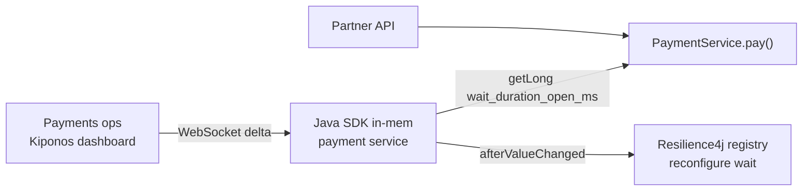

Payments partner blips for six seconds — a transient TLS handshake stall. Your Resilience4j circuit opens correctly. Then it **stays open for thirty seconds** because `waitDurationInOpenState: 30s` was copied from a resilience template and blessed as "architecture."

Partner recovers at second seven. Your service still returns `CallNotPermittedException` until second thirty. Checkout abandonment climbs while the downstream is healthy.

The resilience guild says:

> "Open-state wait is **circuit design**. You don't tune it during incidents."

But `waitDurationInOpenState` is not design. It is **recovery tempo** — how long you punish callers after a fault clears. Thirty seconds made sense when the partner averaged twenty-minute outages. Today their MTTR is under a minute. The YAML did not get the memo.

## The problem: frozen half-open timing on the call path

Resilience4j bakes wait duration at bean creation:

```yaml
resilience4j.circuitbreaker:
  instances:
    paymentsPartner:
      waitDurationInOpenState: 30s
      failureRateThreshold: 50
      slidingWindowSize: 100
```

Or worse — a manual registry:

```java
CircuitBreakerConfig config = CircuitBreakerConfig.custom()
        .waitDurationInOpenState(Duration.ofSeconds(30))
        .failureRateThreshold(50f)
        .build();
```

Once the circuit opens, **every payment call** hits the open state until the wait elapses. You cannot shorten recovery without redeploying while revenue bleeds. The evaluation path itself is hot — thousands of `executeSupplier()` calls per minute. Policy reads must be local; registry updates must happen via `afterValueChanged`, not per-request HTTP.

## What teams believe

| What teams say | What production does |
|----------------|---------------------|
| "Wait duration is resilience architecture" | Partner MTTR dropped from 20m to 45s |
| "Short wait causes half-open flapping" | Long wait causes **unnecessary revenue loss** |
| "We'll add a second breaker config in the next release" | Incidents do not wait for semver |
| "Actuator refresh fixes it" | `@RefreshScope` recycles beans mid-traffic |

Teams understand circuit breakers. They underestimate how painful a **fixed open-state prison** is when recovery is fast.

## The Aha

**`waitDurationInOpenState` looks like resilience architecture frozen in YAML, but open-state seconds are an operational tempo dial** — drop to 5000ms when the partner is known-flaky, restore 30000ms after stability returns. [Kiponos.io](https://kiponos.io) feeds `wait_duration_open_ms` locally; `afterValueChanged` rebuilds the breaker config while JVMs keep running.

## What is Kiponos.io (for circuit breaker timing)

[Kiponos.io](https://kiponos.io) stores breaker policy under `['payments']['core']['prod']['live']` → `resilience/payments`. WebSocket deltas update `wait_duration_open_ms` in every pod's SDK cache.

On each `pay()` call, `kiponos.path("resilience", "payments").getLong("wait_duration_open_ms")` is a **local read** — no config server, no Redis. When ops shortens wait during an incident, `afterValueChanged` triggers `circuitBreakerRegistry.circuitBreaker("paymentsPartner").reset()` or applies a new `CircuitBreakerConfig` — **without** restarting the payment service.

## Architecture



1. **Connect once** at payment service startup.
2. **Store timing** beside `failure_rate_threshold` in one folder.
3. **Read wait ms** when acquiring breaker (or on registry rebuild).
4. **Rebind registry** on delta — open circuits respect new tempo on next cycle.

## Config tree

```yaml
resilience/
  payments/
    wait_duration_open_ms: 30000
    failure_rate_threshold: 50
    sliding_window_size: 100
    enabled: true
    fast_recovery_mode: false
    fast_recovery_wait_ms: 5000
  partner_adyen/
    wait_duration_open_ms: 15000
    failure_rate_threshold: 40
```

## Integration (Spring Boot 3 + Resilience4j)

```java
@Configuration
public class KiponosConfig {

    @Bean
    public Kiponos kiponos(
            @Value("${kiponos.team-id}") String teamId,
            @Value("${kiponos.access-key}") String accessKey,
            @Value("${kiponos.profile-path}") String profilePath) {
        return Kiponos.builder()
                .teamId(teamId)
                .accessKey(accessKey)
                .profilePath(profilePath)
                .build();
    }
}
```

```java
@Component
public class LiveCircuitBreakerBinder {

    private static final String BREAKER_NAME = "paymentsPartner";

    private final Kiponos kiponos;
    private final CircuitBreakerRegistry registry;

    public LiveCircuitBreakerBinder(Kiponos kiponos, CircuitBreakerRegistry registry) {
        this.kiponos = kiponos;
        this.registry = registry;
        kiponos.afterValueChanged(c -> {
            if (c.path().startsWith("resilience/payments")) reconfigure();
        });
        reconfigure();
    }

    void reconfigure() {
        var cfg = kiponos.path("resilience", "payments");
        if (!cfg.getBool("enabled", true)) return;

        long waitMs = cfg.getBool("fast_recovery_mode", false)
                ? cfg.getLong("fast_recovery_wait_ms", 5000)
                : cfg.getLong("wait_duration_open_ms", 30000);

        CircuitBreakerConfig config = CircuitBreakerConfig.custom()
                .waitDurationInOpenState(Duration.ofMillis(waitMs))
                .failureRateThreshold(cfg.getInt("failure_rate_threshold", 50))
                .slidingWindowSize(cfg.getInt("sliding_window_size", 100))
                .build();

        registry.circuitBreaker(BREAKER_NAME, config);
        log.info("Circuit {} waitDurationInOpenState={}ms", BREAKER_NAME, waitMs);
    }
}
```

Hot-path `pay()` uses the registry breaker rebuilt by the binder — optional local `getLong("wait_duration_open_ms")` feeds metrics gauges without opening the circuit.

## Real scenarios

| Event | Without Kiponos | With Kiponos |
|-------|-----------------|--------------|
| Six-second partner blip | 30s open state, carts abandoned | Flip `fast_recovery_mode: true` → 5s wait |
| Known maintenance window | Same aggressive open timing | Pre-raise wait to 60s to avoid flapping |
| Post-incident stability | PR to restore YAML | Dashboard clears `fast_recovery_mode` |
| Load test | Git branch per wait value | Hub profile `staging/resilience` |

## Performance — why breaker policy reads are free

- **One WebSocket** per payment pod — not a config pull per `pay()`
- **`getLong()` is O(1)** on cached tree — nanoseconds vs partner HTTP
- **Registry rebuild on `afterValueChanged`** — not on every request
- **Delta patch** — changing wait from 30000 → 5000 sends one key

Breaker overhead is already in the call path. Kiponos adds no remote RTT.

## Compare to alternatives

| Approach | Shorten wait mid-outage | Hot-path read cost | Half-open behavior |
|----------|-------------------------|-------------------|-------------------|
| Static YAML | No | Zero (frozen) | Fixed 30s |
| `@RefreshScope` beans | Context refresh | Bean churn | Risky mid-traffic |
| Redis-stored breaker config | Yes | RTT per read | Custom glue |
| **Kiponos SDK** | **Dashboard, seconds** | **Memory read** | **Registry reconfigure live** |

## When not to use Kiponos

| Case | Better home |
|------|-------------|
| Breaker instance naming and fallback class wiring | Git |
| Bulkhead thread pool sizes (separate knob) | See [live bulkhead article](https://dev.to/kiponos) |
| Replacing Resilience4j with a service mesh | Architecture migration |
| Failure rate threshold semantics (sliding vs count) | Code-reviewed defaults in Git |

## Getting started (15 minutes)

1. [TeamPro at kiponos.io](https://kiponos.io) — profile `['payments']['core']['prod']['live']`.
2. Add `io.kiponos:sdk-boot-3` and Resilience4j starter.
3. Create `resilience/payments` tree with `wait_duration_open_ms`.
4. Wire `LiveCircuitBreakerBinder` with `afterValueChanged`.
5. Chaos test: force circuit open, enable `fast_recovery_mode` — half-open probe resumes in 5s without pod restart.

## Further reading

- [Developer Quickstart](https://dev.to/kiponos/kiponosio-developer-quickstart-java-python-and-your-first-live-config-change-3kjo)
- [Product tour](https://dev.to/kiponos/getting-started-with-kiponosio-p5k)
- [GETTING-STARTED.md](https://github.com/kiponos-io/kiponos-io/blob/master/docs/GETTING-STARTED.md)
- [github.com/kiponos-io/kiponos-io](https://github.com/kiponos-io/kiponos-io)

---

*Kiponos.io — open-state wait is recovery tempo, not resilience scripture.*