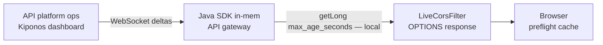

API gateway migration week. You cut traffic from `api-v1` to `api-v2` every afternoon. Browsers still cache preflight responses for **3600 seconds** — because `maxAge(3600)` sits in your `CorsFilter` `@Bean` from 2021 when origins rarely changed.

Frontend teams paste CORS errors into Slack. "Works in curl." Fails in Chrome until cache expires. Someone proposes telling users to hard-refresh.

The API platform lead shrugs:

> "Max-Age is **web platform policy**. Browsers expect stable preflight caching."

Browsers expect what you tell them. During migration you need **short cache** so new `Access-Control-Allow-Origin` headers reach clients in minutes, not hours.

**The Aha:** read `max_age_seconds` from [Kiponos.io](https://kiponos.io) in your CORS filter — ops sets `60` live during gateway churn.

## The problem: frozen Max-Age on every OPTIONS request

```java
@Configuration
public class CorsConfig {

    @Bean
    public CorsFilter corsFilter() {
        CorsConfiguration config = new CorsConfiguration();
        config.setAllowedOriginPatterns(List.of("https://*.example.com"));
        config.setAllowedMethods(List.of("GET", "POST", "PUT", "DELETE", "OPTIONS"));
        config.setMaxAge(3600L);

        UrlBasedCorsConfigurationSource source = new UrlBasedCorsConfigurationSource();
        source.registerCorsConfiguration("/**", config);
        return new CorsFilter(source);
    }
}
```

Frozen at `@Bean` creation. Changing Max-Age means redeploy while frontend engineers lose an hour per mistake. Problems:

1. **Gateway migration** — origins and headers shift hourly
2. **Long Max-Age** — browsers skip preflight — stale policy sticks
3. **Short Max-Age forever** — extra OPTIONS load you do not need in steady state

| What teams say | What production does |
|----------------|---------------------|
| "3600 reduces OPTIONS traffic" | True in steady state, false during migration week |
| "CORS is infra — change via release" | Frontend blocked now |
| "Use a separate staging origin" | Prod users still hit cached preflight |

## The Aha: CORS Max-Age is this week's migration dial

Store CORS policy under `cors/api` in Kiponos. Your filter reads `max_age_seconds` on every OPTIONS response. During migration, ops enables `migration_short_cache` or sets `max_age_seconds: 60`. Steady state returns to `3600` from the dashboard — no redeploy.

**No restart.** The next preflight response carries the new `Access-Control-Max-Age` header.

## What Kiponos.io is — for live CORS headers

[Kiponos.io](https://kiponos.io) gives your API gateway JVM a typed config tree. Connect once, profile `['api']['prod']['cors']`, cache in memory. Dashboard edits are **WebSocket deltas** — one integer patch, not a Spring context refresh.

`kiponos.path("cors", "api").getLong("max_age_seconds")` in the filter is a **local read** — microseconds on the OPTIONS hot path.

`afterValueChanged` logs when platform ops shortens cache for migration windows — useful when frontend teams ask "who changed CORS?"

## Architecture



## Example config tree

```yaml
cors/
  api/
    max_age_seconds: 3600
    migration_short_cache: false
    migration_max_age_seconds: 60
    allowed_origin_patterns: https://*.example.com
    allow_credentials: true
  staging/
    max_age_seconds: 0
    migration_short_cache: true
  headers/
    expose_headers: X-Request-Id,X-Trace-Id
    max_age_floor_seconds: 0
```

## Java integration (Spring Boot live CORS filter)

```java
@Configuration
public class KiponosConfig {

    @Bean
    public Kiponos kiponos(
            @Value("${kiponos.team-id}") String teamId,
            @Value("${kiponos.access-key}") String accessKey,
            @Value("${kiponos.profile-path}") String profilePath) {
        return Kiponos.builder()
                .teamId(teamId)
                .accessKey(accessKey)
                .profilePath(profilePath)
                .build();
    }
}
```

```java
@Component
@Order(Ordered.HIGHEST_PRECEDENCE)
public class LiveCorsFilter implements Filter {

    private final Kiponos kiponos;

    public LiveCorsFilter(Kiponos kiponos) {
        this.kiponos = kiponos;
        kiponos.afterValueChanged(change -> {
            if (change.path().startsWith("cors/api")) {
                log.info("CORS policy changed: {} → {}", change.path(), change.newValue());
            }
        });
    }

    @Override
    public void doFilter(ServletRequest req, ServletResponse res, FilterChain chain)
            throws IOException, ServletException {
        HttpServletRequest httpReq = (HttpServletRequest) req;
        HttpServletResponse httpRes = (HttpServletResponse) res;

        if ("OPTIONS".equalsIgnoreCase(httpReq.getMethod())) {
            applyCorsHeaders(httpRes);
            httpRes.setStatus(HttpServletResponse.SC_OK);
            return;
        }

        applyCorsHeaders(httpRes);
        chain.doFilter(req, res);
    }

    private void applyCorsHeaders(HttpServletResponse res) {
        var api = kiponos.path("cors", "api");
        long maxAge = effectiveMaxAge();

        res.setHeader("Access-Control-Allow-Origin", resolveOrigin());
        res.setHeader("Access-Control-Allow-Methods", "GET,POST,PUT,DELETE,OPTIONS");
        res.setHeader("Access-Control-Allow-Headers", "Authorization,Content-Type");
        res.setHeader("Access-Control-Max-Age", String.valueOf(maxAge));
        if (api.getBool("allow_credentials", true)) {
            res.setHeader("Access-Control-Allow-Credentials", "true");
        }
    }

    private long effectiveMaxAge() {
        var api = kiponos.path("cors", "api");
        if (api.getBool("migration_short_cache", false)) {
            return api.getLong("migration_max_age_seconds", 60);
        }
        long floor = kiponos.path("cors", "headers").getLong("max_age_floor_seconds", 0);
        return Math.max(floor, api.getLong("max_age_seconds", 3600));
    }

    private String resolveOrigin() {
        // Production apps should validate Origin against allowed patterns
        return kiponos.path("cors", "api").get("allowed_origin_patterns", "https://*.example.com");
    }
}
```

Every `getLong()` / `getBool()` is **local** — safe on every OPTIONS and actual request.

## Real scenarios

| Moment | `maxAge(3600)` frozen | Kiponos path |
|--------|----------------------|--------------|
| Gateway migration afternoon | Hour of stale CORS in browsers | `migration_short_cache: true`, `migration_max_age_seconds: 60` |
| Migration complete | Still paying OPTIONS tax if left short | Disable migration mode, `max_age_seconds: 3600` |
| New partner subdomain | PR + deploy + browser cache wait | Update `allowed_origin_patterns` live |
| Staging debugging | Need zero cache | Profile `['api']['staging']['cors']` with `max_age_seconds: 0` |

## Performance — why CORS stays cheap

- `getLong("max_age_seconds")` is O(1) on cached tree — noise vs TLS and app logic
- One WebSocket per gateway JVM; migration toggle patches one boolean and one integer
- No `@RefreshScope` CORS beans — no filter recycle mid-migration

## Compare to alternatives

| Approach | Shorten Max-Age during migration | Per-OPTIONS read cost |
|----------|----------------------------------|----------------------|
| `maxAge(3600)` in `@Bean` | Redeploy | Zero (frozen) |
| `@RefreshScope` CorsFilter | Context refresh | Bean churn |
| CDN edge CORS only | Edge rule deploy | Does not fix app-origin mismatch |
| Tell users to clear cache | Support toil | N/A |
| **Kiponos SDK** | **Dashboard (seconds)** | **Memory read** |

## When not to use Kiponos for CORS Max-Age

| Case | Better approach |
|------|-----------------|
| TLS certificate and hostname policy | Infrastructure baseline in Git |
| Replacing browser CORS with BFF same-origin | Architecture migration |
| `Access-Control-Allow-Origin: *` with credentials | Security review — not a runtime dial |
| Allowed methods list overhaul | Code review for safety |

## Getting started (15 minutes)

1. [TeamPro at kiponos.io](https://kiponos.io) — profile `['api']['prod']['cors']`.
2. Add `io.kiponos:sdk-boot-3` and replace static `CorsFilter` `@Bean` with `LiveCorsFilter`.
3. Create `cors/api` with `max_age_seconds`, `migration_short_cache`, and `migration_max_age_seconds`.
4. Wire `effectiveMaxAge()` into OPTIONS responses.
5. Game day: hit staging from browser, enable `migration_short_cache` live, confirm new preflight cache TTL in DevTools **without pod restart**.

**Further reading:**

- [Developer Quickstart](https://dev.to/kiponos/kiponosio-developer-quickstart-java-python-and-your-first-live-config-change-3kjo)
- [Product tour](https://dev.to/kiponos/getting-started-with-kiponosio-p5k)
- [GETTING-STARTED.md](https://github.com/kiponos-io/kiponos-io/blob/master/docs/GETTING-STARTED.md)
- [github.com/kiponos-io/kiponos-io](https://github.com/kiponos-io/kiponos-io)

---

*Kiponos.io — CORS cache is this week's migration knob, not platform religion.*