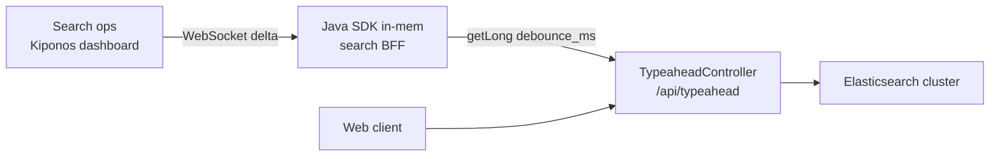

Search meltdown hour 2. Elasticsearch cluster yellow; query latency tripled. Your BFF still fires a typeahead request **300 milliseconds** after each keystroke because `private static final int DEBOUNCE_MS = 300` shipped with the React companion and the Java `TypeaheadController` three years ago.

Product pings:

> "Can we slow typeahead until ES recovers? Users won't notice 800ms."

Engineering:

> "Debounce is **UX design**. That needs a frontend release **and** a BFF deploy."

Meanwhile every marketing email drives traffic to a search box that **amplifies** the outage — 300ms debounce on a dying cluster is not design. It is **load shedding policy** you needed to change ten minutes ago.

## The problem: UX constant driving backend load

The BFF exposes typeahead:

```java
@RestController
public class TypeaheadController {
    private static final int DEBOUNCE_MS = 300;

    @GetMapping("/api/typeahead")
    public List<Suggestion> suggest(@RequestParam String q,
                                    @RequestParam(defaultValue = "300") int clientDebounce) {
        // server-side debounce guard for clients ignoring the constant
        debounceGuard.await(DEBOUNCE_MS);
        return searchClient.query(q);
    }
}
```

When the search backend struggles, **debounce milliseconds are operational** — trade a little perceived latency for cluster survival. Freezing 300ms in `static final` means ops cannot protect Elasticsearch without a coordinated frontend + BFF release during an active incident.

## What teams believe

| What teams say | What production does |
|----------------|---------------------|
| "Debounce is UX — product owns the number" | Backend pays when UX constant is too aggressive |
| "Frontend should read from a config endpoint" | New HTTP hop per keystroke session — or stale cache |
| "300ms is the A/B winner" | A/B winner assumed healthy Elasticsearch |
| "We'll add a feature flag" | Boolean flag cannot express 800ms vs 300ms |

Teams are not wrong that debounce affects feel. They are wrong that the **only** safe home is a constant when the cluster is on fire.

## The Aha

**`DEBOUNCE_MS = 300` feels like product UX cast in code, but debounce milliseconds are operational load policy** — raise to 800 when `backend_overload_mode` is true, restore 300 when the cluster greens. [Kiponos.io](https://kiponos.io) feeds both BFF and optional web config endpoint from one tree — local `getLong()` per suggest call, no redeploy.

## What is Kiponos.io (for typeahead debounce)

[Kiponos.io](https://kiponos.io) holds search policy under profile `['search']['bff']['prod']['live']`. WebSocket deltas update `debounce_ms` and `overload_debounce_ms` in every BFF pod's SDK cache.

`kiponos.path("search", "typeahead").getLong("debounce_ms")` on each `/api/typeahead` request is a **local memory read** — no Redis, no "config microservice" RTT while Elasticsearch is already suffering. Flip `backend_overload_mode` in the dashboard; the **next** keystroke-backed request waits 800ms — protecting the cluster without a frontend npm publish.

## Architecture



1. **Connect once** at BFF startup.
2. **Expose overload mode** ops can flip during yellow cluster.
3. **Read debounce** server-side even if clients ignore hints.
## Config tree

```yaml
search/
  typeahead/
    debounce_ms: 300
    backend_overload_mode: false
    overload_debounce_ms: 800
    min_query_length: 2
    max_suggestions: 10
  limits/
    max_requests_per_ip_per_min: 120
```

## Integration (Spring Boot 3 BFF)

```java
@Configuration
public class KiponosConfig {

    @Bean
    public Kiponos kiponos(
            @Value("${kiponos.team-id}") String teamId,
            @Value("${kiponos.access-key}") String accessKey,
            @Value("${kiponos.profile-path}") String profilePath) {
        return Kiponos.builder()
                .teamId(teamId)
                .accessKey(accessKey)
                .profilePath(profilePath)
                .build();
    }
}
```

```java
@Service
public class LiveDebouncePolicy {

    private final Kiponos kiponos;

    public LiveDebouncePolicy(Kiponos kiponos) {
        this.kiponos = kiponos;
        kiponos.afterValueChanged(c -> {
            if (c.path().startsWith("search/typeahead")) {
                log.info("Typeahead policy: {} → {}", c.path(), c.newValue());
            }
        });
    }

    public long debounceMs() {
        var t = kiponos.path("search", "typeahead");
        return t.getBool("backend_overload_mode", false)
                ? t.getLong("overload_debounce_ms", 800)
                : t.getLong("debounce_ms", 300);
    }

    public int minQueryLength() {
        return kiponos.path("search", "typeahead").getInt("min_query_length", 2);
    }
}
```

```java
@RestController
@RequestMapping("/api/typeahead")
public class TypeaheadController {

    private final LiveDebouncePolicy debounce;
    private final SearchClient searchClient;
    private final ConcurrentHashMap<String, Instant> lastQueryAt = new ConcurrentHashMap<>();

    public TypeaheadController(LiveDebouncePolicy debounce, SearchClient searchClient) {
        this.debounce = debounce;
        this.searchClient = searchClient;
    }

    @GetMapping
    public List<Suggestion> suggest(@RequestParam String q,
                                    @RequestHeader(value = "X-Forwarded-For", required = false) String ip) {
        if (q.length() < debounce.minQueryLength()) {
            return List.of();
        }
        long waitMs = debounce.debounceMs();
        String key = (ip != null ? ip : "anon") + ":" + q;
        Instant last = lastQueryAt.get(key);
        if (last != null && Duration.between(last, Instant.now()).toMillis() < waitMs) {
            return List.of();
        }
        lastQueryAt.put(key, Instant.now());
        return searchClient.query(q, debounce.debounceMs());
    }
}
```

Every `debounceMs()` call is local — safe at typeahead QPS.

## Real scenarios

| Event | Without Kiponos | With Kiponos |
|-------|-----------------|--------------|
| ES cluster yellow | Keystrokes hammer shards at 300ms | Ops enables `backend_overload_mode` |
| Marketing email blast | Search collapses | Pre-raise `overload_debounce_ms` to 1000 |
| Cluster recovery | Another deploy to restore 300ms | Flip overload mode off in dashboard |
| Mobile clients cache old debounce | Server-side guard enforces live policy | Local read on every suggest call |
## Performance — why debounce reads are free

- **One WebSocket** per BFF pod — not a config fetch per keystroke
- **`getLong()` is O(1)** — microseconds vs Elasticsearch query cost
- **Server-side guard** reduces duplicate ES calls even when clients misbehave
- **Delta toggle** on overload mode — two keys, instant merge

Debounce policy reads are invisible next to search I/O.

## Compare to alternatives

| Approach | Change debounce during ES incident | Hot-path read cost | Frontend coordination |
|----------|-----------------------------------|-------------------|----------------------|
| `static final` constant | BFF + web deploy | Zero (frozen) | Required |
| `/config` REST poll | Stale between polls | HTTP per session | Optional |
| Feature-flag boolean | Cannot set 800ms | Network | Partial |
| **Kiponos SDK** | **Dashboard, seconds** | **Memory read** | **Optional /config endpoint** |

## When not to use Kiponos

| Case | Better home |
|------|-------------|
| Search ranking algorithms and analyzers | Git |
| Elasticsearch replica count and shard sizing | Cluster ops / Terraform |
| Animation timing unrelated to backend load | Frontend bundle |
| Replacing typeahead with cached popular queries | Architecture project |

## Getting started (15 minutes)

1. [TeamPro at kiponos.io](https://kiponos.io) — profile `['search']['bff']['prod']['live']`.
2. Add `io.kiponos:sdk-boot-3` to the BFF.
3. Create `search/typeahead` tree from this article.
4. Replace `DEBOUNCE_MS` with `LiveDebouncePolicy`.
5. Load test typeahead, enable overload mode — observe ES QPS drop without pod restart.

## Further reading

- [Developer Quickstart](https://dev.to/kiponos/kiponosio-developer-quickstart-java-python-and-your-first-live-config-change-3kjo)
- [Product tour](https://dev.to/kiponos/getting-started-with-kiponosio-p5k)
- [GETTING-STARTED.md](https://github.com/kiponos-io/kiponos-io/blob/master/docs/GETTING-STARTED.md)
- [github.com/kiponos-io/kiponos-io](https://github.com/kiponos-io/kiponos-io)

---

*Kiponos.io — debounce milliseconds protect backends today, not UX scripture.*