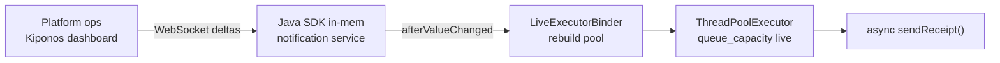

Flash sale minute 4. Push notifications spike **40×**. Your `@Async` notification executor still uses `new LinkedBlockingQueue<>(100)` — capacity picked during a threading design review when SMS volume was a rounding error.

`RejectedExecutionException` floods logs. Marketing asks why receipts stopped. Platform opens a PR to "resize the architecture."

The senior backend engineer says:

> "Queue depth is **part of our concurrency model**. We do not change it without design sign-off."

But the model assumed Tuesday traffic. Tonight is not Tuesday. Queue capacity is not architecture — it is **how much burst you buffer before you fail fast**.

**The Aha:** `queue_capacity` from [Kiponos.io](https://kiponos.io) feeds a live executor binder. Ops raises capacity to `500` during the sale, drops it back Monday — JVM never restarts.

## The problem: sacred queue size on the async hot path

Spring `@EnableAsync` with a frozen factory:

```java
@Configuration
@EnableAsync
public class AsyncConfig {

    @Bean(name = "notificationExecutor")
    public Executor notificationExecutor() {
        return new ThreadPoolExecutor(
                8, 32,
                60, TimeUnit.SECONDS,
                new LinkedBlockingQueue<>(100),
                new ThreadPoolExecutor.CallerRunsPolicy());
    }
}
```

Or a `static final int QUEUE_CAPACITY = 100` in a hand-rolled pool. Either way:

- **Burst exceeds 100** → rejections or caller-runs blocking Tomcat threads
- **Changing capacity** → new `ThreadPoolExecutor` — traditionally a deploy
- **Ops has no dial** — only "scale replicas" or "disable notifications"

| What teams say | What production does |
|----------------|---------------------|
| "100 is plenty for normal load" | Flash sales are not normal load |
| "CallerRunsPolicy is our backpressure" | It blocks request threads — worse than a bigger queue tonight |
| "We'll add Kafka later" | Users want receipts **now** |

## The Aha: queue depth is operational burst policy

`LinkedBlockingQueue` capacity is not tattooed at `@Bean` creation time. Store `core_pool_size`, `max_pool_size`, and `queue_capacity` under `executors/notifications` in Kiponos. A `LiveExecutorBinder` listens with `afterValueChanged` and swaps the delegate executor when ops edits queue policy.

**No restart.** In-flight tasks finish on the old pool; new submissions use the resized pool.

## What Kiponos.io is — for async executors

[Kiponos.io](https://kiponos.io) holds operational knobs in a typed config tree. Your notification service connects once, caches the tree in-process, and receives **WebSocket deltas** when ops changes `queue_capacity` from 100 → 500.

Hot-path submission still calls `executor.execute(task)` — no network. Guards and metrics can read `kiponos.path("executors", "notifications").getInt("queue_capacity")` locally to log queue pressure against the **current** policy.

Profile path example: `['notifications']['prod']['executors']`.

## Architecture



## Example config tree

```yaml
executors/
  notifications/
    core_pool_size: 8
    max_pool_size: 32
    queue_capacity: 100
    keep_alive_sec: 60
    rejection_policy: caller_runs
  webhooks/
    core_pool_size: 4
    max_pool_size: 16
    queue_capacity: 50
  burst/
    flash_sale_mode: false
    flash_queue_capacity: 500
    flash_max_pool_size: 64
```

## Java integration (Spring Boot + live executor binder)

```java
@Configuration
public class KiponosConfig {

    @Bean
    public Kiponos kiponos(
            @Value("${kiponos.team-id}") String teamId,
            @Value("${kiponos.access-key}") String accessKey,
            @Value("${kiponos.profile-path}") String profilePath) {
        return Kiponos.builder()
                .teamId(teamId)
                .accessKey(accessKey)
                .profilePath(profilePath)
                .build();
    }
}
```

```java
@Component("notificationExecutor")
public class LiveNotificationExecutor implements Executor {

    private final Kiponos kiponos;
    private volatile ThreadPoolExecutor delegate;

    public LiveNotificationExecutor(Kiponos kiponos) {
        this.kiponos = kiponos;
        kiponos.afterValueChanged(c -> {
            if (c.path().startsWith("executors/notifications")
                    || c.path().startsWith("executors/burst")) {
                rebuild();
            }
        });
        rebuild();
    }

    @Override
    public void execute(Runnable command) {
        delegate.execute(command);
    }

    private void rebuild() {
        var n = kiponos.path("executors", "notifications");
        var burst = kiponos.path("executors", "burst");
        boolean flash = burst.getBool("flash_sale_mode", false);

        int core = n.getInt("core_pool_size", 8);
        int max = flash ? burst.getInt("flash_max_pool_size", 64) : n.getInt("max_pool_size", 32);
        int queueCap = flash ? burst.getInt("flash_queue_capacity", 500) : n.getInt("queue_capacity", 100);

        ThreadPoolExecutor next = new ThreadPoolExecutor(
                core, max,
                n.getInt("keep_alive_sec", 60), TimeUnit.SECONDS,
                new LinkedBlockingQueue<>(queueCap),
                new ThreadPoolExecutor.CallerRunsPolicy());

        ThreadPoolExecutor old = delegate;
        delegate = next;
        if (old != null) {
            old.shutdown();
        }
        log.info("Notification executor rebuilt: queue={}, max={}", queueCap, max);
    }
}
```

`@Async("notificationExecutor")` methods route through the live delegate. `getInt()` on the hot path is **local**.

## Real scenarios

| Moment | Frozen queue(100) | Kiponos path |
|--------|-------------------|--------------|
| Flash sale burst | Mass rejections | `flash_sale_mode: true`, `flash_queue_capacity: 500` |
| Partner webhook slowdown | Queue fills, caller-runs blocks HTTP | Lower `max_pool_size`, raise `queue_capacity` temporarily |
| Post-sale Monday | Still buffering 500 tasks | Disable `flash_sale_mode`, back to 100 |
| Load test week | Branch per knob | Hub profile `loadtest/notifications` |

Pair with [live Tomcat thread tuning](https://dev.to/kiponos/your-servertomcatthreadsmax200-is-not-architecture-change-it-live-while-traffic-runs-spring-boot-4g8h) — async queue exhaustion and servlet thread exhaustion often arrive together.

## Performance — why async paths stay cheap

- Executor rebuild runs on `afterValueChanged`, not per `execute()` call
- One WebSocket per JVM — not a config poll per notification
- `getInt("queue_capacity")` for metrics is O(1) on the cached tree
- Delta patches — changing queue capacity sends one key, not the full executor YAML
- Old pool shuts down gracefully; in-flight tasks drain without killing the JVM

## Compare to alternatives

| Approach | Resize queue during flash sale | Hot-path submit cost |
|----------|------------------------------|----------------------|
| `new LinkedBlockingQueue<>(100)` in `@Bean` | Redeploy | Zero (frozen) |
| `@RefreshScope` executor bean | Context refresh | Risk of dropping `@Async` mid-flight |
| Horizontal pod scale | Minutes + cost | Does not fix per-pod queue of 100 |
| Unbounded queue | No deploy | OOM risk — worse than rejections |
| **Kiponos SDK** | **Dashboard (seconds)** | **Memory read for guards** |

## When not to use Kiponos for executor queues

| Case | Better approach |
|------|-----------------|
| Replacing async with a durable queue (Kafka, SQS) | Architecture migration |
| Thread pool count per Kubernetes replica | HPA on CPU or custom metrics |
| `core_pool_size` below CPU count on CPU-bound work | Profiling first |
| Unbounded queue "fix" | Explicit capacity planning |

## Getting started (15 minutes)

1. [TeamPro at kiponos.io](https://kiponos.io) — profile `['notifications']['prod']['executors']`.
2. Move `core_pool_size`, `max_pool_size`, and `queue_capacity` out of Java into `executors/notifications`.
3. Add `LiveNotificationExecutor` with `afterValueChanged` rebuild hook.
4. Point `@Async("notificationExecutor")` at the live bean.
5. Game day: flood staging with async tasks, raise `queue_capacity` from the dashboard, watch rejections disappear **without pod restart**.

**Further reading:**

- [Developer Quickstart](https://dev.to/kiponos/kiponosio-developer-quickstart-java-python-and-your-first-live-config-change-3kjo)
- [Product tour](https://dev.to/kiponos/getting-started-with-kiponosio-p5k)
- [GETTING-STARTED.md](https://github.com/kiponos-io/kiponos-io/blob/master/docs/GETTING-STARTED.md)
- [github.com/kiponos-io/kiponos-io](https://github.com/kiponos-io/kiponos-io)

---

*Kiponos.io — queue depth is burst policy, not a design-review fossil.*