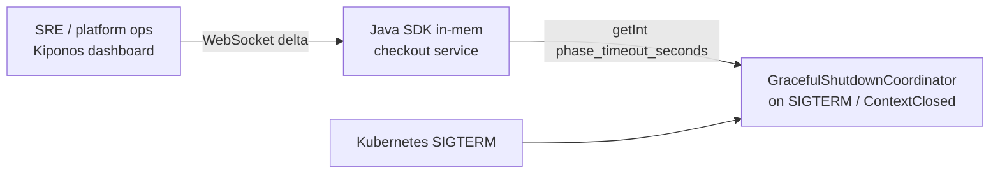

Tuesday 6:14 PM. Kubernetes starts a rolling deploy of the checkout service. `terminationGracePeriodSeconds` is 60, but Spring only waits **30 seconds** for in-flight requests because `spring.lifecycle.timeout-per-shutdown-phase: 30s` was copied from a starter template in 2022 and never touched.

Long-running payment confirmations — the ones that call three acquirers — need 45–70 seconds. Pods get SIGTERM, Spring stops accepting new work, then **kills the context at 30s**. Half-finished checkouts return 502. Support tickets spike before the deploy even finishes.

The platform lead says what every K8s team says eventually:

> "Shutdown timeout is **bootstrap config**. It ships with the chart."

But `timeout-per-shutdown-phase` is not chart archaeology. It is **how long you grant mercy during a drain** — shorter on quiet Tuesdays, longer when peak checkout overlaps a deploy window. Freezing it in YAML means every rollout gambles on the same 30-second coin flip.

## The problem: frozen drain policy on a moving workload

Spring Boot 3 reads shutdown phase timeout once at context startup:

```yaml
spring:
  lifecycle:
    timeout-per-shutdown-phase: 30s
server:
  shutdown: graceful
```

Your custom drain coordinator probably mirrors the same constant:

```java
private static final int SHUTDOWN_PHASE_TIMEOUT_SEC = 30;

@EventListener(ContextClosedEvent.class)
void onClose() {
    drainCoordinator.awaitCompletion(SHUTDOWN_PHASE_TIMEOUT_SEC, TimeUnit.SECONDS);
}
```

On the hot path this constant does not run — but **every pod termination** does. When checkout latency stretches during a partner slowdown, 30 seconds is not architecture. It is **today's operational mistake**, baked into an immutable int.

Worse: Kubernetes `preStop` hooks and Istio sidecar drain often assume the JVM will hold longer than Spring actually waits. The pod looks "ready to die" while requests still execute.

## What teams believe

| What teams say | What production does |
|----------------|---------------------|
| "Graceful shutdown is platform config — set once in Helm" | Peak traffic shape changes hourly; drain needs change with it |
| "If 30s isn't enough, bump terminationGracePeriod" | Spring kills the context before K8s kills the pod |
| "We'll tune shutdown in the next hardening sprint" | Users see 502s during tonight's deploy |
| "Only infra touches lifecycle YAML" | SRE needs a knob **during** the incident, not after retro |

The pain is not ignorance. Teams know long requests exist. They do not have a clean way to **extend drain seconds without rebuilding the image** while the fleet is already rolling.

## The Aha

**`spring.lifecycle.timeout-per-shutdown-phase` behaves like sacred bootstrap config, but drain seconds are an operational dial** — extend to 90 during peak deploys, snap back to 30 when traffic calms. [Kiponos.io](https://kiponos.io) holds `phase_timeout_seconds` in a live tree; your JVM reads it locally and applies it to Spring's shutdown coordinator on the next SIGTERM — no redeploy, no pod spec edit, no `@RefreshScope` recycle.

## What is Kiponos.io (for shutdown policy)

[Kiponos.io](https://kiponos.io) is a real-time configuration hub. Your Spring Boot service connects once at startup over WebSocket; the full config tree for your profile — for example `['checkout']['v3']['prod']['live']` — loads into an in-process cache.

When SRE raises `phase_timeout_seconds` from 30 to 90 in the dashboard, a **delta** patches only that key into memory on every connected JVM. Reads like `kiponos.path("lifecycle", "shutdown").getInt("phase_timeout_seconds")` are **local** — no HTTP round-trip on the shutdown path, no polling Redis between requests.

There is no restart. There is no redeploy. The process keeps serving checkout traffic; the **next** `ContextClosedEvent` (or your custom hook) sees the new timeout. Pair with `afterValueChanged` to log audit trails when ops extends drain during an incident.

## Architecture



1. **Connect once** at startup — `Kiponos.createForCurrentTeam()`.
2. **Organize policy** under `lifecycle/shutdown` in profile `['checkout']['v3']['prod']['live']`.
3. **Read locally** when shutdown begins — zero network on the drain path.
4. **Ops edits live** — extend timeout before the next wave of pod terminations.

## Config tree

```yaml
lifecycle/
  shutdown/
    phase_timeout_seconds: 30
    extend_during_peak: false
    peak_timeout_seconds: 90
    pre_stop_sleep_ms: 5000
  k8s/
    termination_grace_hint_sec: 90
    await_sidecar_drain: true
```

## Integration (Spring Boot 3)

Bootstrap only credentials in `application.yml`. Operational drain floats live in the hub.

```java
@Configuration
public class KiponosConfig {

    @Bean
    public Kiponos kiponos(
            @Value("${kiponos.team-id}") String teamId,
            @Value("${kiponos.access-key}") String accessKey,
            @Value("${kiponos.profile-path}") String profilePath) {
        return Kiponos.builder()
                .teamId(teamId)
                .accessKey(accessKey)
                .profilePath(profilePath)
                .build();
    }
}
```

```java
@Component
public class LiveShutdownPolicy {

    private final Kiponos kiponos;
    private final ConfigurableApplicationContext context;

    public LiveShutdownPolicy(Kiponos kiponos, ConfigurableApplicationContext context) {
        this.kiponos = kiponos;
        this.context = context;
        kiponos.afterValueChanged(change -> {
            if (change.path().startsWith("lifecycle/shutdown")) {
                log.info("Shutdown policy changed: {} → {}", change.path(), change.newValue());
            }
        });
    }

    @EventListener(ContextClosedEvent.class)
    void onContextClosed(ContextClosedEvent event) {
        var shutdown = kiponos.path("lifecycle", "shutdown");
        int timeoutSec = shutdown.getBool("extend_during_peak", false)
                ? shutdown.getInt("peak_timeout_seconds", 90)
                : shutdown.getInt("phase_timeout_seconds", 30);

        log.info("Draining in-flight checkout requests for {}s", timeoutSec);
        Duration budget = Duration.ofSeconds(timeoutSec);
        Instant deadline = Instant.now().plus(budget);

        while (InFlightRequestTracker.count() > 0 && Instant.now().isBefore(deadline)) {
            Thread.sleep(250);
        }
        if (InFlightRequestTracker.count() > 0) {
            log.warn("{} requests still in flight after {}s drain", 
                    InFlightRequestTracker.count(), timeoutSec);
        }
    }
}
```

## Real scenarios

| Event | Without Kiponos | With Kiponos |
|-------|-----------------|--------------|
| Peak-hour rolling deploy | 502s on 40s checkout flows | SRE flips `extend_during_peak: true` → 90s drain |
| Partner slowdown extends p99 | Same 30s timeout kills healthy requests | Raise `phase_timeout_seconds` live before next wave |
| Post-incident cleanup | PR to revert YAML, wait for CI | Set `extend_during_peak: false` in dashboard |
| Game day rehearsal | New branch per timeout value | Same JAR, hub profile `staging/drain-test` |

## Performance — why drain policy reads are free

- **One WebSocket** per JVM — not a config fetch on every SIGTERM
- **`getInt()` is O(1)** on the cached tree — microseconds on the shutdown path
- **Delta updates** — changing `peak_timeout_seconds` sends one patch, not a full YAML reload
- **`afterValueChanged` runs async** — audit logging never blocks request threads

Shutdown is rare; the win is **operational agility**, not microsecond savings. Still, local reads beat polling a config service while pods are dying.

## Compare to alternatives

| Approach | Mid-flight drain change | Read latency on shutdown | Ops story |
|----------|-------------------------|--------------------------|-----------|
| Static `application.yml` | No — PR + rollout | N/A until restart | Git only |
| Kubernetes `terminationGracePeriod` only | Pod spec edit + rollout | N/A | Cluster change window |
| Spring Cloud Config + refresh | After context refresh | Post-refresh local | Pod churn risk |
| Redis poll for timeout | Possible | Network RTT during drain | Custom invalidation |
| **Kiponos SDK** | **Dashboard, seconds** | **Memory read** | **Audit + extend_during_peak flag** |

## When not to use Kiponos

| Case | Better home |
|------|-------------|
| Replica count and HPA targets | Kubernetes GitOps |
| Base `server.shutdown: graceful` wiring (on vs off) | `application.yml` in Git |
| TLS certificates and JVM trust stores | Vault / cert-manager |
| Replacing Tomcat with a reactive stack | Architecture migration |

## Getting started (15 minutes)

1. [TeamPro at kiponos.io](https://kiponos.io) — create profile `['checkout']['v3']['prod']['live']`.
2. Add `implementation 'io.kiponos:sdk-boot-3:4.4.0.250319'` and set `KIPONOS_ID`, `KIPONOS_ACCESS`.
3. **Create the `lifecycle/shutdown` tree** from this article in the dashboard.
4. Wire `LiveShutdownPolicy` with `ContextClosedEvent` and replace `static final` timeout.
5. Game day: start a 50s synthetic checkout, trigger SIGTERM, extend `phase_timeout_seconds` live — request completes without 502.

## Further reading

- [Developer Quickstart](https://dev.to/kiponos/kiponosio-developer-quickstart-java-python-and-your-first-live-config-change-3kjo)
- [Product tour](https://dev.to/kiponos/getting-started-with-kiponosio-p5k)
- [GETTING-STARTED.md](https://github.com/kiponos-io/kiponos-io/blob/master/docs/GETTING-STARTED.md)
- [github.com/kiponos-io/kiponos-io](https://github.com/kiponos-io/kiponos-io)

---

*Kiponos.io — drain seconds are operational mercy, not bootstrap tattoos.*