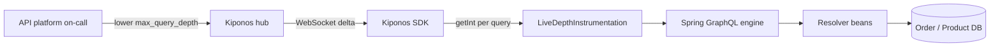

Public GraphQL gateway minute 5. P99 resolver time crosses **8 seconds** while CPU on `graphql-api` pods pins at 94%. A mobile client release shipped a nested `user → orders → items → product → reviews → author` query — depth 12 — but your gateway still enforces `maxQueryDepth=10` only in theory because the **actual** limit of `10` was baked into `GraphQlSource` builder code six months ago and never wired to anything ops can touch.

Worse: ops needs depth **7** right now to block the new client pattern, but changing the constant requires a release. The API platform lead insists:

> "Query depth is **API governance**. We do not change limits without client team review."

But the resolver storm does not wait for client review. Max depth is not governance theater — it is **how deep you let one HTTP request recurse through your JVM tonight**.

**The Aha:** read `max_query_depth` from [Kiponos.io](https://kiponos.io) in your depth instrumentation — ops sets `7` live while the gateway keeps serving traffic.

## The problem: depth limit frozen at GraphQL bootstrap

```java
@Configuration
public class GraphQlConfig {

    private static final int MAX_QUERY_DEPTH = 10;

    @Bean
    public GraphQlSource graphQlSource(ResourcePatternResolver resolver) throws IOException {
        return GraphQlSource.builder()
                .schemaResources(resolver.getResources("classpath:graphql/**/*.graphqls"))
                .configureGraphQl(g -> g.instrumentation(new MaxQueryDepthInstrumentation(MAX_QUERY_DEPTH)))
                .build();
    }
}
```

Or depth buried in `application.yml` with no runtime path:

```yaml
spring:
  graphql:
    schema:
      locations: classpath:graphql/
# maxQueryDepth not even exposed — teams hard-code in Java
```

When a bad client pattern fans out resolvers, you need to **tighten depth immediately** — not open a governance RFC. Problems:

1. **Deploy to tighten** — while CPU burns
2. **One limit for all clients** — mobile vs partner BFF need different guardrails
3. **Emergency disable** — no dashboard knob for "depth 6 until client patch ships"

| What teams say | What production does |
|----------------|---------------------|
| "Depth 10 was signed in API standards" | Client releases change query shapes weekly |
| "Complexity scoring is better than depth" | You need a **now** knob; depth is the fast one |
| "Block bad clients at CDN" | Resolver CPU dies inside the JVM first |
| "GraphQL limits belong in schema repo" | Depth max is operational load protection |

## What is Kiponos.io — for Spring GraphQL limits

[Kiponos.io](https://kiponos.io) stores operational GraphQL knobs under profile `['api']['prod']['graphql']`. WebSocket deltas patch the in-memory tree. `getInt("max_query_depth")` is a **local read** inside instrumentation — no config server RTT per query.

Git keeps **schema files and resolver wiring**; the hub keeps **depth limit this incident**.

## Architecture



## Config tree

```yaml
graphql/
  limits/
    public/
      max_query_depth: 10
      max_query_complexity: 200
      enabled: true
    partner_bff/
      max_query_depth: 15
      enabled: true
  ops/
    resolver_storm_mode: false
    storm_max_depth: 7
    reject_deep_queries: true
  telemetry/
    log_rejected_depth: true
    slow_resolver_warn_ms: 500
```

## Integration (Spring Boot GraphQL)

```java
@Configuration
public class KiponosConfig {

    @Bean
    public Kiponos kiponos(
            @Value("${kiponos.team-id}") String teamId,
            @Value("${kiponos.access-key}") String accessKey,
            @Value("${kiponos.profile-path}") String profilePath) {
        return Kiponos.builder()
                .teamId(teamId)
                .accessKey(accessKey)
                .profilePath(profilePath)
                .build();
    }
}
```

```java
@Component
public class LiveDepthInstrumentation extends SimpleInstrumentation {

    private final Kiponos kiponos;

    public LiveDepthInstrumentation(Kiponos kiponos) {
        this.kiponos = kiponos;
        kiponos.afterValueChanged(change -> {
            if (change.path().startsWith("graphql/limits")
                    || change.path().startsWith("graphql/ops")) {
                log.warn("GraphQL depth policy: {} → {}", change.path(), change.newValue());
            }
        });
    }

    @Override
    public InstrumentationContext<ExecutionResult> beginExecution(
            InstrumentationExecutionParameters parameters,
            InstrumentationState state) {
        int maxDepth = resolveMaxDepth();
        int depth = QueryDepthCalculator.calculate(parameters.getDocument());
        if (depth > maxDepth) {
            if (kiponos.path("graphql", "telemetry").getBool("log_rejected_depth", true)) {
                log.warn("rejecting query depth {} > {}", depth, maxDepth);
            }
            throw new QueryDepthExceededException(depth, maxDepth);
        }
        return super.beginExecution(parameters, state);
    }

    private int resolveMaxDepth() {
        if (kiponos.path("graphql", "ops").getBool("resolver_storm_mode", false)) {
            return kiponos.path("graphql", "ops").getInt("storm_max_depth", 7);
        }
        return kiponos.path("graphql", "limits", "public").getInt("max_query_depth", 10);
    }
}
```

Register instrumentation in `GraphQlSource` builder once — depth value itself comes from Kiponos on **every query execution**.

Resolver storm? Ops enables `resolver_storm_mode` and `storm_max_depth: 7`. Deep mobile queries fail fast — CPU recovers **without gateway restart**.

## Real scenarios

| Event | `MAX_QUERY_DEPTH = 10` governance | Kiponos path |
|-------|-----------------------------------|--------------|
| Nested client query ships | Resolver CPU pegged | `resolver_storm_mode: true` live |
| Client patch rolled out | Still blocking at 7 until deploy | Disable storm mode from dashboard |
| Partner BFF needs depth 15 | Forked constant per branch | `graphql/limits/partner_bff` sibling |
| Post-incident audit | Git blame on Java constant | Dashboard history on `graphql/ops` |

## Performance — why GraphQL stays fast

- **`getInt()` once per query execution** — not per resolver field
- **One WebSocket** per gateway JVM
- **Reject-before-execute** — depth check cheaper than fan-out resolver storm
- **Delta updates** — storm mode toggles two keys instantly
- **Instrumentation already on hot path** — Kiponos read is O(1) vs resolver I/O

## Compare to alternatives

| Approach | Lower depth during resolver storm | Per-query overhead |
|----------|-----------------------------------|-------------------|
| Hard-coded `MAX_QUERY_DEPTH` | Redeploy gateway | Zero (frozen) |
| `@RefreshScope` GraphQlSource | Context recycle | Schema reload risk |
| API gateway WAF rules | Slow to propagate | External to JVM |
| **Kiponos SDK** | **Dashboard (seconds)** | **Memory read** |

## When not to use Kiponos for GraphQL depth

| Case | Better approach |
|------|-----------------|
| Schema type definitions and breaking changes | Git + client versioning |
| Persisted queries rollout | Code + CDN config |
| Replacing depth with full complexity budget redesign | Architecture sprint |
| Setting depth to 2 and breaking all clients | Client coordination first |

## Getting started (15 minutes)

1. [TeamPro at kiponos.io](https://kiponos.io) — profile `['api']['prod']['graphql']`.
2. Add `io.kiponos:sdk-boot-3` to your Spring GraphQL service.
3. Create `graphql/limits/public` with `max_query_depth` and storm keys.
4. Wire `LiveDepthInstrumentation` with `resolveMaxDepth()` local read.
5. Staging: fire deep nested query, enable `resolver_storm_mode`, confirm rejection **without pod restart**.

## Further reading

- [Developer Quickstart](https://github.com/kiponos-io/kiponos-io/blob/master/docs/devto-getting-started-developer-guide.md)
- [Product tour](https://dev.to/kiponos/getting-started-with-kiponosio-p5k)
- [GETTING-STARTED.md](https://github.com/kiponos-io/kiponos-io/blob/master/docs/GETTING-STARTED.md)
- [github.com/kiponos-io/kiponos-io](https://github.com/kiponos-io/kiponos-io)

---

*Kiponos.io — GraphQL max depth is a live guardrail, not governance carved in the schema repo.*