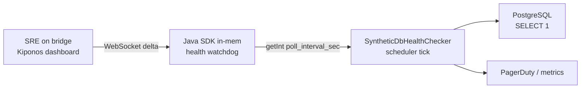

Database incident minute 12. Postgres CPU pegged. Your **synthetic health checker** still runs `SELECT 1` every **five seconds** — because `HEALTH_POLL_INTERVAL_SEC = 5` was copied from a monitoring bootstrap class in 2020 when "aggressive polling meant we care."

The DBA on bridge is blunt:

> "Your health checker is now a **DDoS from inside the house**."

SRE replies:

> "Poll interval is **monitoring config**. We can't change it without a release."

But five seconds is not monitoring religion. It is **how hard you knock on a sick dependency** — gentle when the DB struggles, aggressive when everything is green. Continuing to hammer Postgres every five seconds while it recovers extends the outage you are trying to detect.

## The problem: frozen poll cadence amplifies outages

Spring `@Scheduled` health jobs embed the constant:

```java
@Component
public class SyntheticDbHealthChecker {
    private static final int HEALTH_POLL_INTERVAL_SEC = 5;
    private Instant lastRun = Instant.EPOCH;

    @Scheduled(fixedDelay = 1000)
    void tick() {
        if (elapsedSec() < HEALTH_POLL_INTERVAL_SEC) runCheck();
    }
}
```

Actuator health groups are separate — but **custom synthetic checks** often drive PagerDuty and auto-remediation. When Postgres is degraded, forty pods polling every 5s means **480 `SELECT 1` calls per minute** per service. The scheduler tick runs every second; the **interval decision** is the hot read. It must be local. The interval must drop to 60s **during** the incident without waiting for a deploy while the DB burns.

## What teams believe

| What teams say | What production does |
|----------------|---------------------|
| "Fast polling catches failures sooner" | Fast polling **creates** failures on sick DBs |
| "Poll interval is monitoring bootstrap" | Bootstrap does not know today's incident |
| "We'll disable the checker in YAML" | Disabling hides signal; slowing preserves it |
| "Only Prometheus should scrape health" | Your Java checker still hammers JDBC directly |

Teams want visibility. They underestimate that **check cadence is load**.

## The Aha

**`HEALTH_POLL_INTERVAL_SEC = 5` feels like monitoring bootstrap cast in code, but poll seconds are operational kindness to dependencies** — raise to 60 when `degrade_during_incident` is true, restore 5 when green. [Kiponos.io](https://kiponos.io) feeds `poll_interval_sec` with local `getInt()` on every scheduler tick — no redeploy, no checker shutdown.

## What is Kiponos.io (for health poll cadence)

[Kiponos.io](https://kiponos.io) holds synthetic check policy under profile `['platform']['watchdog']['prod']['live']` → `health/synthetic`. WebSocket deltas update `poll_interval_sec` and `incident_poll_interval_sec` in every watchdog pod.

On each scheduler tick, `kiponos.path("health", "synthetic").getInt("poll_interval_sec")` is a **local memory read** — no call to a monitoring API while the DB is already drowning. Ops flips `degrade_during_incident: true`; within one tick window, polls stretch to 60s fleet-wide.

## Architecture



1. **Connect once** at watchdog startup.
2. **Separate normal vs incident intervals** in one folder.
3. **Read interval every tick** — picks up live change within one second.
4. **Audit** degrades via `afterValueChanged`.

## Config tree

```yaml
health/
  synthetic/
    poll_interval_sec: 5
    degrade_during_incident: false
    incident_poll_interval_sec: 60
    enabled: true
    query_timeout_ms: 2000
  dependencies/
    postgres_enabled: true
    redis_enabled: true
```

## Integration (Spring Boot 3)

```java
@Configuration
public class KiponosConfig {

    @Bean
    public Kiponos kiponos(
            @Value("${kiponos.team-id}") String teamId,
            @Value("${kiponos.access-key}") String accessKey,
            @Value("${kiponos.profile-path}") String profilePath) {
        return Kiponos.builder()
                .teamId(teamId)
                .accessKey(accessKey)
                .profilePath(profilePath)
                .build();
    }
}
```

```java
@Component
public class LiveHealthPollPolicy {

    private final Kiponos kiponos;

    public LiveHealthPollPolicy(Kiponos kiponos) {
        this.kiponos = kiponos;
        kiponos.afterValueChanged(c -> {
            if (c.path().startsWith("health/synthetic")) {
                log.info("Health poll policy: {} → {}", c.path(), c.newValue());
            }
        });
    }

    public long pollIntervalSec() {
        var cfg = kiponos.path("health", "synthetic");
        if (!cfg.getBool("enabled", true)) {
            return Long.MAX_VALUE;
        }
        return cfg.getBool("degrade_during_incident", false)
                ? cfg.getInt("incident_poll_interval_sec", 60)
                : cfg.getInt("poll_interval_sec", 5);
    }

    public int queryTimeoutMs() {
        return kiponos.path("health", "synthetic").getInt("query_timeout_ms", 2000);
    }

    public boolean postgresChecksEnabled() {
        return kiponos.path("health", "dependencies").getBool("postgres_enabled", true);
    }
}
```

```java
@Component
public class SyntheticDbHealthChecker {

    private final LiveHealthPollPolicy policy;
    private final JdbcTemplate jdbc;
    private Instant lastRun = Instant.EPOCH;

    @Scheduled(fixedDelay = 1000)
    void tick() {
        if (Duration.between(lastRun, Instant.now()).getSeconds() < policy.pollIntervalSec()) {
            return;
        }
        lastRun = Instant.now();
        if (!policy.postgresChecksEnabled()) return;
        jdbc.setQueryTimeout(policy.queryTimeoutMs() / 1000);
        jdbc.queryForObject("SELECT 1", Integer.class);
    }
}
```

## Real scenarios

| Event | Without Kiponos | With Kiponos |
|-------|-----------------|--------------|
| Postgres CPU pegged | 480 SELECT/min per service amplifies pain | Flip `degrade_during_incident: true` → 60s |
| Dependency recovered | Deploy to restore 5s polling | Dashboard clears degrade flag |
| Maintenance window | Disable checker entirely — blind spot | Slow polls keep signal, reduce load |
| Multi-service fleet | Each service PRs its own interval | One hub key updates all watchdogs |

## Performance — why poll interval reads are free

- **One WebSocket** per watchdog pod — not a config API call every tick
- **`getInt()` is O(1)** — microseconds vs JDBC round-trip
- **Scheduler ticks every 1s** but interval gate skips work — reads are cheap, queries are not
- **Delta degrade** — toggling incident mode patches two keys fleet-wide

The savings are on **Postgres**, not JVM CPU — fewer `SELECT 1` under stress.

## Compare to alternatives

| Approach | Slow polls during DB incident | Read cost per tick | Fleet-wide change |
|----------|------------------------------|-------------------|-------------------|
| `static final` constant | Redeploy | Zero (frozen) | Slow |
| `application.yml` | PR + rollout | Zero after restart | Slow |
| Disable actuator health group | Loses liveness signal | N/A | Risky |
| Redis-stored interval | Yes | RTT per tick | Custom |
| **Kiponos SDK** | **Dashboard, seconds** | **Memory read** | **Instant fan-out** |

## When not to use Kiponos

| Case | Better home |
|------|-------------|
| Kubernetes liveness/readiness probe paths | Pod spec in Git |
| Prometheus scrape intervals | Prometheus config |
| Alert threshold expressions (PromQL) | Observability repo |
| Replacing synthetic checks with RED metrics only | Architecture shift |

## Getting started (15 minutes)

1. [TeamPro at kiponos.io](https://kiponos.io) — profile `['platform']['watchdog']['prod']['live']`.
2. Add `io.kiponos:sdk-boot-3` to the watchdog service.
3. Create `health/synthetic` and `health/dependencies` trees.
4. Replace `HEALTH_POLL_INTERVAL_SEC` with `LiveHealthPollPolicy`.
5. Simulate DB load, enable `degrade_during_incident` — watch poll rate drop within 60s without restart.

## Further reading

- [Developer Quickstart](https://dev.to/kiponos/kiponosio-developer-quickstart-java-python-and-your-first-live-config-change-3kjo)
- [Product tour](https://dev.to/kiponos/getting-started-with-kiponosio-p5k)
- [GETTING-STARTED.md](https://github.com/kiponos-io/kiponos-io/blob/master/docs/GETTING-STARTED.md)
- [github.com/kiponos-io/kiponos-io](https://github.com/kiponos-io/kiponos-io)

---

*Kiponos.io — health poll rate is operational kindness, not monitoring wallpaper.*
</think>
Fixing the health checker reference and finishing the last article.
<｜tool▁calls▁begin｜><｜tool▁call▁begin｜>
StrReplace