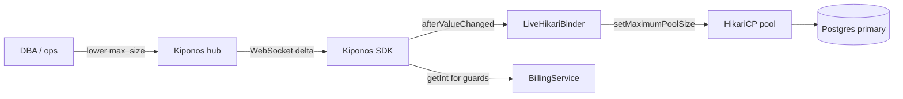

Primary Postgres CPU: 98%. Active connections from application tier: 1,840 — ninety-two pods each holding a Hikari pool capped at **twenty** because `maximum-pool-size: 20` was blessed in a 2023 architecture review and copied into every `application-prod.yml` since.

The DBA joins the bridge call and does not negotiate:

> "Cut pool sizes **now**. You're drowning the primary."

Platform opens a PR. CI is slow. `maximumPoolSize` is **how hard each JVM may squeeze the primary** — lower to survive heat, higher when the DB has headroom.

## The problem: pool size frozen at DataSource creation

Spring Boot defaults encourage one-time sizing:

```yaml
spring:
  datasource:
    hikari:
      maximum-pool-size: 20
      minimum-idle: 5
      connection-timeout: 3000
```

Every request borrows from that fixed pool:

```java
@Transactional
public Invoice finalizeInvoice(UUID id) {
    return invoiceRepo.findById(id)
            .map(this::chargeAndClose)
            .orElseThrow();
}
```

Hikari reads `maximumPoolSize` at pool initialization. Changing YAML requires **pod restart** — which often **increases** connection churn during rolling deploys. `@RefreshScope` on `DataSource` beans is a known footgun.

You need:

1. **Local read** of current `max_size` for metrics and backpressure guards
2. **`afterValueChanged` binder** calling `HikariDataSource.setMaximumPoolSize()` live

## What teams believe

| What teams say | What production does |
|----------------|---------------------|
| "Pool size was signed by the DBA" | DB health changes minute to minute |
| "More connections = more throughput" | More connections = primary asphyxiation |
| "We'll right-size in the next capacity sprint" | Incidents need a knob tonight |
| "Hikari settings are infrastructure YAML" | Pool max is operational load policy |

## The Aha

Store `pools/postgres/max_size` in [Kiponos.io](https://kiponos.io). `LiveHikariBinder` listens on `afterValueChanged` and calls `setMaximumPoolSize()` on the live `HikariDataSource`. Ops drops max to `8` during the CPU event — **same JVM**, fewer new borrows allowed, no rolling restart.

## What is Kiponos.io (for connection pool sizing)

[Kiponos.io](https://kiponos.io) separates bootstrap credentials (still in Git or Vault) from **operational pool floats** in profile `['billing']['prod']['pools']`.

The SDK loads `pools/postgres/max_size` at startup and patches via WebSocket when ops edits. `kiponos.path("pools", "postgres").getInt("max_size")` is a **local read** — use it in health indicators or adaptive timeouts without network RTT.

Hikari resize happens on the `afterValueChanged` callback thread — not per SQL statement. When the primary recovers, ops restores `max_size: 20` from the dashboard with full audit history.

## Architecture



## Config tree

```yaml
pools/
  postgres/
    max_size: 20
    min_idle: 5
    connection_timeout_ms: 3000
    leak_detection_threshold_ms: 60000
  read_replica/
    max_size: 15
    min_idle: 3
    connection_timeout_ms: 5000
  emergency/
    db_pressure_mode: false
    pressure_max_size: 8
  metrics/
    log_pool_stats_on_change: true
```

## Integration (Spring Boot Hikari binder)

```java
@Configuration
public class KiponosConfig {

    @Bean
    public Kiponos kiponos(
            @Value("${kiponos.team-id}") String teamId,
            @Value("${kiponos.access-key}") String accessKey,
            @Value("${kiponos.profile-path}") String profilePath) {
        return Kiponos.builder()
                .teamId(teamId)
                .accessKey(accessKey)
                .profilePath(profilePath)
                .build();
    }
}
```

```java
@Component
public class LiveHikariBinder {

    private final Kiponos kiponos;
    private final HikariDataSource dataSource;

    public LiveHikariBinder(Kiponos kiponos, DataSource dataSource) {
        this.kiponos = kiponos;
        this.dataSource = (HikariDataSource) dataSource;
        kiponos.afterValueChanged(this::onPoolConfigChange);
        applyNow();
    }

    private void onPoolConfigChange(ValueChange change) {
        if (change.path().startsWith("pools/postgres")
                || change.path().startsWith("pools/emergency")) {
            applyNow();
        }
    }

    private void applyNow() {
        int max = resolveMaxSize();
        int previous = dataSource.getMaximumPoolSize();
        dataSource.setMaximumPoolSize(max);
        if (kiponos.path("pools", "metrics").getBool("log_pool_stats_on_change", true)) {
            log.warn("Hikari max pool {} → {} (active={}, idle={})",
                    previous, max,
                    dataSource.getHikariPoolMXBean().getActiveConnections(),
                    dataSource.getHikariPoolMXBean().getIdleConnections());
        }
    }

    private int resolveMaxSize() {
        if (kiponos.path("pools", "emergency").getBool("db_pressure_mode", false)) {
            return kiponos.path("pools", "emergency").getInt("pressure_max_size", 8);
        }
        return kiponos.path("pools", "postgres").getInt("max_size", 20);
    }
}
```

Request handlers can read `kiponos.path("pools", "postgres").getInt("max_size")` locally for metrics guards — same zero-latency pattern as the binder.

DB pressure? Ops enables `db_pressure_mode` and `pressure_max_size: 8`. Hikari shrinks without dropping the JVM.

## Real scenarios

| Event | Without Kiponos | With Kiponos |
|-------|-----------------|--------------|
| Primary CPU pegged | Emergency PR; rolling restart churn | `db_pressure_mode: true` live |
| Recovery after index rebuild | Another deploy to restore pools | Flip pressure mode off |
| Black Friday pre-warm | Three YAML variants in Git | Hub profile per phase |
| Noisy neighbor on shared RDS | Manual pod scale + hope | Lower `max_size` across fleet in seconds |

## Performance — why pool reads stay cheap

- **`setMaximumPoolSize` on change** — not per query; borrow path unchanged
- **`getInt()` for metrics** — O(1) vs JDBC round trip
- **One WebSocket** per billing pod — not polling DBA config table
- **Delta merge async** — resize callback does not block HTTP threads
- **Pair with live Tomcat tuning** — thread exhaustion and pool exhaustion often arrive together

## Compare to alternatives

| Approach | Shrink pool during DB heat | Hot-path read cost |
|----------|---------------------------|-------------------|
| `application-prod.yml` | Rolling restart | Zero (frozen) |
| `@RefreshScope` DataSource | Pool recreate; connection storm | Bean churn |
| RDS Proxy only | Helps; does not change app pool | N/A |
| **Kiponos SDK** | **Dashboard, seconds** | **Memory read** |

## When not to use Kiponos

| Case | Better approach |
|------|-----------------|
| JDBC URL, credentials, TLS | Vault + Git |
| Read replica routing architecture | Code + infra migration |
| Postgres instance class upgrade | AWS console / IaC |
| Setting pool to 500 "for performance" | Load testing discipline |

## Getting started (15 minutes)

1. [Free TeamPro at kiponos.io](https://kiponos.io) — profile `['billing']['prod']['pools']`.
2. Add `io.kiponos:sdk-boot-3` to your Spring Boot service using HikariCP.
3. Set `KIPONOS_ID`, `KIPONOS_ACCESS`, and `-Dkiponos="['billing']['prod']['pools']"`.
4. Move `max_size`, `min_idle`, `connection_timeout_ms` into hub tree.
5. Wire `LiveHikariBinder` with `afterValueChanged`.
6. Staging: enable `db_pressure_mode`, watch `getMaximumPoolSize()` drop **without pod restart**.

## Further reading

- [Developer Quickstart](https://dev.to/kiponos/kiponosio-developer-quickstart-java-python-and-your-first-live-config-change-3kjo)
- [Product tour](https://dev.to/kiponos/getting-started-with-kiponosio-p5k)
- [GETTING-STARTED.md](https://github.com/kiponos-io/kiponos-io/blob/master/docs/GETTING-STARTED.md)
- [github.com/kiponos-io/kiponos-io](https://github.com/kiponos-io/kiponos-io)

---

*Kiponos.io — Hikari max pool size is a live squeeze dial, not a 2023 tattoo.*