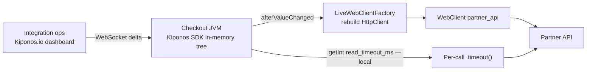

Monday 11:15 AM. Partner API latency jumps from a comfortable **200ms P99** to **8 seconds** — brownout, not hard down. Their status page says "investigating elevated response times." Your integration service uses Reactor Netty `responseTimeout(Duration.ofSeconds(3))` — set in a `@Bean` factory when the partner was healthy and you wanted to fail fast and protect your thread budget.

Now **every call times out at 3 seconds**. Resilience4j circuit breaker opens. Your checkout flow looks broken even though the partner is **eventually** responding at 6–7 seconds. Customer support reports "payment spinner forever" while your metrics scream `TimeoutException`, not `503`.

The integration lead says the line every senior team has rehearsed:

> "Timeout is **client contract**. Changing it needs a release."

But timeout is not a contract with the partner's marketing team. It is **how long you wait today** given **today's** latency distribution. It should move when the partner moves — without a 45-minute deploy while revenue bleeds.

Here is the Aha:

**`responseTimeout` behaves like integration architecture, but timeout milliseconds are operational patience.**

You can bump `read_timeout_ms` to `12000` **while JVMs keep serving checkout** — no redeploy, no restart. New requests use the looser budget; in-flight requests finish on the old client. That is [Kiponos.io](https://kiponos.io).

## The problem — frozen WebClient timeouts

Spring `@Bean` factories freeze timeouts at startup:

```java
@Bean
public WebClient partnerClient() {
    return WebClient.builder()
            .baseUrl("https://partner.example/api")
            .clientConnector(new ReactorClientHttpConnector(
                    HttpClient.create()
                            .responseTimeout(Duration.ofSeconds(3))
                            .option(ChannelOption.CONNECT_TIMEOUT_MILLIS, 1000)))
            .build();
}
```

Partner degrades → you either fail too early (false negatives) or redeploy with looser values and risk thread pile-up when the partner recovers. Senior developers understand timeout tradeoffs. They do not realize the integers can be **operational state** — same class as rate limits and circuit thresholds.

| What teams believe | What production does |
|--------------------|---------------------|
| "3s timeout protects our thread pool" | 3s is wrong when partner P99 is 7s |
| "Loosening timeout needs perf review" | Brownouts do not wait for review |
| "We'll patch next release" | Circuit stays open for hours |
| "One WebClient bean per partner is enough" | Enough until the partner slows down |

## The Aha — live timeout policy per dependency

Move client policy into Kiponos under profile `['integrations']['prod']['http_client']`:

```yaml
http_client/
  partner_api/
    connect_timeout_ms: 1000
    read_timeout_ms: 3000
    max_connections: 80
    rebuild_on_change: true
  internal_billing/
    connect_timeout_ms: 500
    read_timeout_ms: 5000
    max_connections: 40
    rebuild_on_change: true
  fraud_scoring/
    connect_timeout_ms: 800
    read_timeout_ms: 2000
    max_connections: 30
    rebuild_on_change: false
```

Partner slow but recovering? Ops sets `read_timeout_ms: 12000`. `afterValueChanged` rebuilds the `WebClient` when `rebuild_on_change` is true. **In-flight requests** use the old connector; **new requests** use the new timeout. No pod restart.

## What is Kiponos.io — for outbound HTTP patience

Kiponos is a real-time configuration hub. Your integration service connects once, loads a typed tree, and holds timeout integers **in process memory**. Dashboard edits arrive as WebSocket deltas.

You have two integration patterns:

1. **Factory rebuild** — `afterValueChanged` reconstructs `HttpClient` when timeouts shift (clean for connection pools).
2. **Per-call `.timeout()`** — read `read_timeout_ms` locally on each `Mono` chain without rebuilding the bean.

Both use `kiponos.path("http_client", "partner_api").getInt("read_timeout_ms")` — a **local read** with zero network RTT. That is critical when every checkout calls the partner: you cannot poll a config service per request.

Git keeps base URLs and mTLS wiring reviewed; the hub keeps **operational patience** ops needs during partner brownouts.

## Architecture — timeouts without redeploy



1. **Connect once** at startup.
2. **Snapshot** loads `http_client/partner_api/*`.
3. **Delta** when ops raises `read_timeout_ms`.
4. **Factory rebuilds** async — request threads not blocked on network.
5. **Per-call wrapper** optional for fine-grained control without pool churn.

## Bootstrap Kiponos in Spring Boot 3

```java
@Configuration
public class KiponosConfig {

    @Bean
    public Kiponos kiponos(
            @Value("${kiponos.team-id}") String teamId,
            @Value("${kiponos.access-key}") String accessKey,
            @Value("${kiponos.profile-path}") String profilePath) {
        return Kiponos.builder()
                .teamId(teamId)
                .accessKey(accessKey)
                .profilePath(profilePath)
                .build();
    }
}
```

## Integration — LiveWebClientFactory with afterValueChanged

```java
@Component
public class LiveWebClientFactory {

    private final Kiponos kiponos;
    private volatile WebClient partnerClient;

    public LiveWebClientFactory(Kiponos kiponos) {
        this.kiponos = kiponos;
        kiponos.afterValueChanged(c -> {
            if (c.path().startsWith("http_client/partner_api")) {
                var cfg = kiponos.path("http_client", "partner_api");
                if (cfg.getBool("rebuild_on_change", true)) {
                    rebuildPartner();
                }
            }
        });
        rebuildPartner();
    }

    public WebClient partner() {
        return partnerClient;
    }

    private void rebuildPartner() {
        var cfg = kiponos.path("http_client", "partner_api");
        int readMs = cfg.getInt("read_timeout_ms", 3000);
        int connectMs = cfg.getInt("connect_timeout_ms", 1000);
        int maxConn = cfg.getInt("max_connections", 80);

        ConnectionProvider provider = ConnectionProvider.builder("partner")
                .maxConnections(maxConn)
                .build();

        HttpClient http = HttpClient.create(provider)
                .responseTimeout(Duration.ofMillis(readMs))
                .option(ChannelOption.CONNECT_TIMEOUT_MILLIS, connectMs);

        partnerClient = WebClient.builder()
                .baseUrl("https://partner.example/api")
                .clientConnector(new ReactorClientHttpConnector(http))
                .build();
    }
}
```

Per-call timeout wrapper when you prefer not to rebuild the pool on every tweak:

```java
@Service
public class PartnerChargeClient {

    private final LiveWebClientFactory clients;
    private final Kiponos kiponos;

    public Mono<PartnerResponse> charge(PartnerRequest req) {
        int readMs = kiponos.path("http_client", "partner_api")
                .getInt("read_timeout_ms", 3000);
        return clients.partner().post().uri("/charge")
                .bodyValue(req)
                .retrieve()
                .bodyToMono(PartnerResponse.class)
                .timeout(Duration.ofMillis(readMs));
    }
}
```

Partner recovered overnight? Tighten `read_timeout_ms` back to `3000` from the dashboard — circuit closes, false timeouts disappear, **same running pods**.

Pair with [live connection pool tuning](https://github.com/kiponos-io/kiponos-io/blob/master/docs/devto-arch-connection-pool-live.md) — timeout and pool exhaustion often arrive together during partner brownouts.

## Real scenarios

| Event | Frozen `Duration.ofSeconds(3)` | Live timeout via Kiponos |
|-------|--------------------------------|---------------------------|
| Partner brownout | Mass false failures, breaker open | Raise `read_timeout_ms` live |
| Partner recovered | Still waiting 12s per call | Tighten back to `3000` instantly |
| Internal mesh latency shift | PR per downstream service | `http_client/internal_billing/*` |
| Fraud API strict SLO | Cannot afford loose timeouts | Separate tree keys per dependency |
| Load test | Git branch per client | Hub profile `integrations/loadtest` |

## Compare to alternatives

| Approach | Mid-outage tweak | Hot-path read |
|----------|------------------|---------------|
| `@Bean` WebClient | Redeploy (25+ min) | Frozen |
| `@RefreshScope` client bean | Actuator refresh | Bean recycle + pool cold start |
| Poll Redis per request | Dashboard-fast | Network RTT every call |
| Hard-code timeout in each call site | "Fast" once | Unmaintainable sprawl |
| **Kiponos SDK** | **Seconds** | **Memory read** |

## Performance — why integration teams care

- One WebSocket per JVM — not one config fetch per outbound HTTP call
- `getInt("read_timeout_ms")` is O(1) local — safe on every `Mono` chain
- Factory rebuild runs on `afterValueChanged`, not per request
- `rebuild_on_change: false` + per-call `.timeout()` avoids pool churn during fine tuning
- Separate keys per dependency — changing partner timeout does not touch billing client

## When not to use Kiponos for HTTP clients

| Case | Use |
|------|-----|
| Base URL after reviewed partner migration | Git-reviewed change |
| mTLS certificate rotation and trust stores | PKI pipeline |
| HTTP/2 vs HTTP/1 stack choice | Architecture decision in code |
| Replacing WebClient with gRPC | Migration project |

## Getting started (15 minutes)

1. [TeamPro at kiponos.io](https://kiponos.io) — profile `['integrations']['prod']['http_client']`.
2. Externalize **one** partner client's `connect_timeout_ms` and `read_timeout_ms` into the hub.
3. Add `LiveWebClientFactory` with `afterValueChanged` rebuild.
4. Game day: inject 7s latency in staging mock, raise `read_timeout_ms` live, watch success rate recover **without pod restart**.
5. Tighten timeout when mock recovers — verify circuit closes from dashboard alone.
6. Document boundary: Git declares client wiring; hub declares **operational patience**.

## Further reading

- [Developer Quickstart](https://dev.to/kiponos/kiponosio-developer-quickstart-java-python-and-your-first-live-config-change-3kjo)
- [Product tour](https://dev.to/kiponos/getting-started-with-kiponosio-p5k)
- [GETTING-STARTED.md](https://github.com/kiponos-io/kiponos-io/blob/master/docs/GETTING-STARTED.md)
- [github.com/kiponos-io/kiponos-io](https://github.com/kiponos-io/kiponos-io)

---

*Kiponos.io — timeouts are today's patience, not forever.*