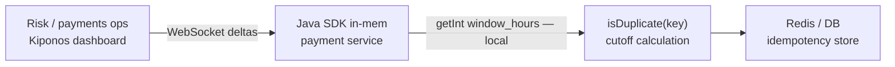

Thursday 09:00. Processor replay dumps **18 hours** of duplicate authorization attempts into your webhook queue. Support tickets multiply. Your dedup store still expires keys after **24 hours** — because `IDEMPOTENCY_WINDOW_HOURS = 24` has been a `public static final` since the PCI review blessed it.

Risk wants a **72-hour** window for this incident only. Engineering schedules a deploy for Friday.

The payments lead says:

> "Twenty-four hours is **regulatory policy**. We cannot change dedup windows without compliance sign-off."

Compliance did not sign off for tonight's replay storm. The window is not a law — it is **how long you remember duplicates today** given **today's** processor behavior.

**The Aha:** read `window_hours` from [Kiponos.io](https://kiponos.io) on each dedup check — ops enables `extended_replay_mode` and sets `replay_window_hours: 72` live.

## The problem: frozen dedup window on the payment hot path

```java
public final class IdempotencyPolicy {
    public static final int WINDOW_HOURS = 24;
}

@Service
public class PaymentIdempotencyService {

    public boolean isDuplicate(String idempotencyKey) {
        Instant cutoff = Instant.now().minus(Duration.ofHours(IdempotencyPolicy.WINDOW_HOURS));
        return store.existsSince(idempotencyKey, cutoff);
    }
}
```

Or `idempotency.window-hours: 24` in YAML — still needs restart. Pain points:

1. **Processor replays** — need longer memory temporarily
2. **Storage cost** — longer windows mean more Redis/DB rows
3. **Compliance theater** — static constant feels safer than a dial ops can turn

| What teams say | What production does |
|----------------|---------------------|
| "24h matches card network guidance" | Tonight's replay is not in the guidance PDF |
| "Changing window needs legal review" | Incidents do not wait for legal |
| "We'll purge duplicates manually" | Manual does not scale at 40k webhooks/hour |

## The Aha: dedup window hours are operational incident policy

Store idempotency policy under `idempotency/payments` in Kiponos. Normal traffic uses `window_hours: 24`. During a replay incident, ops flips `extended_replay_mode: true` and sets `replay_window_hours: 72`. WebSocket delivers a delta; the next `isDuplicate()` call reads the extended window from memory.

**No restart.** When the processor clears the backlog, ops disables extended mode — back to 24h without a deploy.

## What Kiponos.io is — for payment dedup paths

[Kiponos.io](https://kiponos.io) gives your payment JVM a live config tree. Connect once with `Kiponos.createForCurrentTeam()`, profile `['payments']['prod']['idempotency']`. Dashboard edits patch the in-memory cache over WebSocket.

Every `isDuplicate()` evaluation calls `kiponos.path("idempotency", "payments").getInt("window_hours")` — **local read**, no remote flag service on the authorization hot path.

`afterValueChanged` can log window transitions for compliance audit: who extended replay mode, when, and what value.

## Architecture



## Example config tree

```yaml
idempotency/
  payments/
    window_hours: 24
    extended_replay_mode: false
    replay_window_hours: 72
    key_prefix: pay_
    store_ttl_buffer_hours: 2
  refunds/
    window_hours: 48
    extended_replay_mode: false
  compliance/
    min_window_hours: 12
    max_window_hours: 168
    require_audit_log: true
```

## Java integration (Spring Boot payment service)

```java
@Configuration
public class KiponosConfig {

    @Bean
    public Kiponos kiponos(
            @Value("${kiponos.team-id}") String teamId,
            @Value("${kiponos.access-key}") String accessKey,
            @Value("${kiponos.profile-path}") String profilePath) {
        return Kiponos.builder()
                .teamId(teamId)
                .accessKey(accessKey)
                .profilePath(profilePath)
                .build();
    }
}
```

```java
@Service
public class PaymentIdempotencyService {

    private final Kiponos kiponos;
    private final IdempotencyStore store;

    public PaymentIdempotencyService(Kiponos kiponos, IdempotencyStore store) {
        this.kiponos = kiponos;
        this.store = store;
        kiponos.afterValueChanged(change -> {
            if (change.path().startsWith("idempotency/payments")
                    && kiponos.path("idempotency", "compliance").getBool("require_audit_log", true)) {
                log.warn("Idempotency policy changed: {} → {}", change.path(), change.newValue());
            }
        });
    }

    public boolean isDuplicate(String idempotencyKey) {
        Duration window = effectiveWindow();
        Instant cutoff = Instant.now().minus(window);
        return store.existsSince(idempotencyKey, cutoff);
    }

    private Duration effectiveWindow() {
        var p = kiponos.path("idempotency", "payments");
        var compliance = kiponos.path("idempotency", "compliance");

        int hours = p.getBool("extended_replay_mode", false)
                ? p.getInt("replay_window_hours", 72)
                : p.getInt("window_hours", 24);

        int min = compliance.getInt("min_window_hours", 12);
        int max = compliance.getInt("max_window_hours", 168);
        hours = Math.max(min, Math.min(max, hours));
        return Duration.ofHours(hours);
    }
}
```

`getInt()` and `getBool()` are **local** — safe on every webhook and authorize call.

## Real scenarios

| Event | `WINDOW_HOURS = 24` frozen | Kiponos path |
|-------|---------------------------|--------------|
| Processor replay storm | Double charges slip through | `extended_replay_mode: true`, `replay_window_hours: 72` |
| Replay cleared | Still holding 72h of keys | Disable extended mode live |
| Refund abuse wave | Same window for refunds | Tune `idempotency/refunds/window_hours` separately |
| PCI audit question | Git blame on constant | Hub audit + `afterValueChanged` logs |

## Performance — why dedup checks stay fast

- One WebSocket per payment JVM — not a config fetch per authorization
- Window calculation is two `getInt()` calls — microseconds vs Redis EXISTS RTT
- Delta updates — toggling `extended_replay_mode` patches one boolean
- No `@RefreshScope` on payment beans — no context recycle mid-transaction
- Compliance clamp (`min`/`max`) reads locally — no second network hop

## Compare to alternatives

| Approach | Extend window during replay incident | Hot-path read cost |
|----------|--------------------------------------|--------------------|
| `static final WINDOW_HOURS` | Redeploy | Zero (frozen) |
| Spring Cloud Config + refresh | Context refresh | Bean recycle risk |
| Feature-flag boolean only | No hours value | Still need numeric window |
| DBA extends Redis TTL manually | Ops toil | Error-prone |
| **Kiponos SDK** | **Dashboard (seconds)** | **Memory read** |

## When not to use Kiponos for idempotency windows

| Case | Better approach |
|------|-----------------|
| Idempotency key format / hashing algorithm | Code review in Git |
| Storage backend choice (Redis vs Dynamo) | Architecture decision |
| Legal retention policy baseline | Compliance doc + Git default |
| "Window 0" to disable dedup entirely | Kill switch with explicit approval |

## Getting started (15 minutes)

1. [TeamPro at kiponos.io](https://kiponos.io) — profile `['payments']['prod']['idempotency']`.
2. Add `io.kiponos:sdk-boot-3` to your payment service.
3. Create `idempotency/payments` with `window_hours`, `extended_replay_mode`, and `replay_window_hours`.
4. Replace `IDEMPOTENCY_WINDOW_HOURS` with `effectiveWindow()` using `kiponos.path(...)`.
5. Game day: replay webhooks in staging, enable extended mode live, watch duplicates caught **without pod restart**.

**Further reading:**

- [Developer Quickstart](https://dev.to/kiponos/kiponosio-developer-quickstart-java-python-and-your-first-live-config-change-3kjo)
- [Product tour](https://dev.to/kiponos/getting-started-with-kiponosio-p5k)
- [GETTING-STARTED.md](https://github.com/kiponos-io/kiponos-io/blob/master/docs/GETTING-STARTED.md)
- [github.com/kiponos-io/kiponos-io](https://github.com/kiponos-io/kiponos-io)

---

*Kiponos.io — dedup windows match today's incident, not launch-week folklore.*