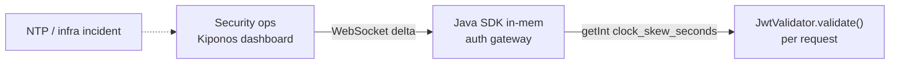

Thursday 9:02 AM. Half your mobile users cannot log in. JWT validation fails on `exp` — not because tokens are stolen, but because **NTP drifted** on two rack switches overnight. Your auth service still allows **60 seconds** of clock skew because `clockSkewSeconds = 60` has been a `private static final` in `JwtValidator` since the MVP.

Security engineering opens a ticket:

> "Skew tolerance is **security policy**. It requires code review and a release."

Meanwhile support quotes the SLA clock. Valid users bounce off `401` while someone debates whether 300 seconds of leeway is "too permissive" for a **temporary infrastructure fault**.

The staff engineer on bridge whispers the uncomfortable truth:

> "We're treating skew like a moral constant. It's a **clock incident knob**."

## The problem: immutable skew on a per-request hot path

Every authenticated API call runs through JWT validation:

```java
public class JwtValidator {
    private static final int CLOCK_SKEW_SECONDS = 60;

    private final JwtParser parser = Jwts.parser()
            .setSigningKey(key)
            .setAllowedClockSkewSeconds(CLOCK_SKEW_SECONDS)
            .build();

    public Claims validate(String token) {
        return parser.parseSignedClaims(token).getPayload();
    }
}
```

Or in Spring Security OAuth2 resource server config — still frozen at deploy time:

```yaml
spring:
  security:
    oauth2:
      resourceserver:
        jwt:
          clock-skew: 60s
```

Sixty seconds is reasonable on a healthy fleet. During NTP recovery it is **catastrophically tight**. The validation path executes thousands of times per second. You need **local reads** of the current skew policy and **async updates** when security ops adjusts tolerance — not a redeploy while login success rate craters.

## What teams believe

| What teams say | What production does |
|----------------|---------------------|
| "Clock skew is security — never change without review" | NTP incidents are operational, not adversarial |
| "We'll fail closed until clocks heal" | Revenue and support cost exceed the risk of temporary leeway |
| "OAuth library config belongs in YAML" | YAML changes still need rollout during the outage |
| "300s skew opens replay windows" | Audited temporary bump with auto-revert beats hours of lockout |

Teams are right to be careful about skew. They are wrong that the only safe lever is a **frozen constant** when infrastructure time itself is wrong.

## The Aha

**`clockSkewSeconds` looks like immutable security policy, but skew tolerance is an operational dial during clock incidents** — raise to 300 with audit, revert to 60 when NTP heals. [Kiponos.io](https://kiponos.io) holds `clock_skew_seconds` in a live tree; every `validate()` reads it locally — no redeploy, no Spring context refresh, no per-token remote call.

## What is Kiponos.io (for JWT validation)

[Kiponos.io](https://kiponos.io) connects your auth service once at startup via WebSocket. The profile `['auth']['gateway']['prod']['live']` loads a typed config tree into memory — integers, booleans, folder paths like `jwt/validation`.

When security ops raises `clock_skew_seconds` from 60 to 300, a **delta** merges into every JVM's cache. The next `kiponos.path("jwt", "validation").getInt("clock_skew_seconds")` inside `validate()` returns 300 — a **local memory read**, not a call to a policy server on the authentication hot path.

No restart. No redeploy. Optional `afterValueChanged` fires structured audit logs and PagerDuty webhooks when skew changes — proving the bump was intentional and time-bounded.

## Architecture



1. **Connect once** — `Kiponos.createForCurrentTeam()`.
2. **Store policy** under `jwt/validation` with audit-friendly keys.
3. **Read skew on every token** — microseconds, zero network.
4. **Revert live** when `ntp_incident_mode` flips false.

## Config tree

```yaml
jwt/
  validation/
    clock_skew_seconds: 60
    max_ttl_seconds: 3600
    ntp_incident_mode: false
    incident_skew_seconds: 300
    require_audience: true
  issuers/
    allowed: https://login.example.com
    leeway_per_issuer: 0
```

## Integration (Spring Boot 3)

```java
@Configuration
public class KiponosConfig {

    @Bean
    public Kiponos kiponos(
            @Value("${kiponos.team-id}") String teamId,
            @Value("${kiponos.access-key}") String accessKey,
            @Value("${kiponos.profile-path}") String profilePath) {
        return Kiponos.builder()
                .teamId(teamId)
                .accessKey(accessKey)
                .profilePath(profilePath)
                .build();
    }
}
```

```java
@Component
public class LiveJwtValidator {

    private final Kiponos kiponos;
    private final SecretKey signingKey;

    public LiveJwtValidator(Kiponos kiponos, @Value("${jwt.signing-key}") String key) {
        this.kiponos = kiponos;
        this.signingKey = Keys.hmacShaKeyFor(key.getBytes(StandardCharsets.UTF_8));
        kiponos.afterValueChanged(change -> {
            if (change.path().startsWith("jwt/validation")) {
                securityAudit.log("jwt_policy_change", change.path(), change.newValue());
            }
        });
    }

    public Claims validate(String token) {
        var policy = kiponos.path("jwt", "validation");
        int skewSec = policy.getBool("ntp_incident_mode", false)
                ? policy.getInt("incident_skew_seconds", 300)
                : policy.getInt("clock_skew_seconds", 60);
        int maxTtl = policy.getInt("max_ttl_seconds", 3600);

        JwtParser parser = Jwts.parser()
                .verifyWith(signingKey)
                .clockSkewSeconds(Duration.ofSeconds(skewSec))
                .requireAudience(policy.getBool("require_audience", true) ? "api" : null)
                .build();

        Claims claims = parser.parseSignedClaims(token).getPayload();
        long ttl = claims.getExpiration().getTime() - claims.getIssuedAt().getTime();
        if (ttl > maxTtl * 1000L) {
            throw new JwtException("ttl_exceeds_policy");
        }
        return claims;
    }
}
```

Every `getInt()` and `getBool()` is a **local cache hit** — safe inside tight auth filters at 10k RPS.

## Real scenarios

| Event | Without Kiponos | With Kiponos |
|-------|-----------------|--------------|
| Rack NTP drift | Hours of login failure or emergency hotfix branch | Flip `ntp_incident_mode: true`, skew 300 live |
| Post-incident revert | Another deploy to restore 60s | Dashboard sets `ntp_incident_mode: false` |
| Pen test window | Frozen skew may mask clock attacks | Lower skew to 30 with audit trail |
| Multi-region clock skew | One global constant in code | Per-env profile `['auth']['eu']['prod']['live']` |

## Performance — why skew reads do not slow auth

- **One WebSocket** per auth pod — not a policy fetch per JWT
- **`getInt()` is O(1)** — noise compared to signature verification crypto
- **Parser rebuilt only when skew changes** — optional optimization via `afterValueChanged`; reading skew per request is still microseconds
- **Delta updates** — incident mode toggle sends two keys, not full security YAML

JWT validation is already CPU-heavy. Kiponos adds no network RTT to the critical path.

## Compare to alternatives

| Approach | Mid-incident skew change | Read latency per token | Audit trail |
|----------|--------------------------|------------------------|-------------|
| `static final` constant | Redeploy | Zero (frozen) | Git blame |
| `application.yml` only | PR + rollout | Zero after restart | Git |
| Spring Cloud Config refresh | Context refresh | Post-refresh local | Config server logs |
| Feature-flag SaaS | Yes (boolean gates only) | Network evaluation | Per-flag product |
| **Kiponos SDK** | **Dashboard, seconds** | **Memory read** | **Dashboard + afterValueChanged** |

## When not to use Kiponos

| Case | Better home |
|------|-------------|
| Signing keys and private key material | Vault / HSM |
| Algorithm choice (RS256 vs ES256) | Code review in Git |
| OAuth client IDs and redirect URIs | Git with security review |
| Replacing JWT with session cookies | Architecture decision |

## Getting started (15 minutes)

1. [TeamPro at kiponos.io](https://kiponos.io) — profile `['auth']['gateway']['prod']['live']`.
2. Add `io.kiponos:sdk-boot-3` and wire `KIPONOS_ID`, `KIPONOS_ACCESS`.
3. Create `jwt/validation` tree with `clock_skew_seconds` and `ntp_incident_mode`.
4. Replace `CLOCK_SKEW_SECONDS` constant with `LiveJwtValidator`.
5. Staging test: skew system clock +2 minutes, flip incident mode — logins succeed without pod restart.

## Further reading

- [Developer Quickstart](https://dev.to/kiponos/kiponosio-developer-quickstart-java-python-and-your-first-live-config-change-3kjo)
- [Product tour](https://dev.to/kiponos/getting-started-with-kiponosio-p5k)
- [GETTING-STARTED.md](https://github.com/kiponos-io/kiponos-io/blob/master/docs/GETTING-STARTED.md)
- [github.com/kiponos-io/kiponos-io](https://github.com/kiponos-io/kiponos-io)

---

*Kiponos.io — skew tolerance is today's incident knob, not a tattoo in security code.*