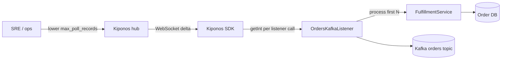

Orders topic. Consumer lag crosses six figures on the dashboard — red long enough that paging escalates to the VP of engineering. Each `poll()` returns up to **500 records** because `max.poll.records=500` has lived in `consumer.properties` since the first deployment template.

Processing one poison message now takes four seconds. Multiply by 500 per poll and you blow `max.poll.interval.ms` — the consumer gets kicked from the group, rebalance storm follows, lag compounds.

SRE instinct: restart with `max.poll.records=50`. But restart means **rebalance storm** across forty pods while brokers are hot. You need smaller batches **now**, inside running JVMs.

## The problem: broker properties frozen at consumer boot

Kafka consumer config is typically immutable without restart:

```properties
bootstrap.servers=broker1:9092,broker2:9092
group.id=orders-fulfillment
max.poll.records=500
max.poll.interval.ms=300000
fetch.max.wait.ms=500
```

Your processing loop assumes the full poll batch:

```java
@KafkaListener(topics = "orders", groupId = "orders-fulfillment")
public void onMessage(ConsumerRecords<String, Order> records) {
    for (ConsumerRecord<String, Order> rec : records) {
        fulfillmentService.process(rec.value()); // unbounded per poll
    }
}
```

`max.poll.records` is set when `KafkaConsumer` is constructed. Lowering it mid-incident historically meant:

1. **Rolling consumer restart** — rebalance amplification
2. **New consumer group** — offset migration risk
3. **Manual traffic pause** — revenue impact

The hot loop needs a **local limit** on how many records you actually process per `poll()` callback — independent of broker fetch size — without recycling the consumer.

## What teams believe

| What teams say | What production does |
|----------------|---------------------|
| "`max.poll.records` is broker tuning — set once" | Effective batch size is an incident dial |
| "Lower records means more polls — wasteful" | Fewer records prevents `max.poll.interval` violations |
| "Fix the slow handler, don't shrink batches" | Both happen; shrinking buys time |
| "Consumer config lives in Git" | Lag spikes do not wait for merge queues |

## The Aha

Read `max_poll_records` from [Kiponos.io](https://kiponos.io) at the top of every listener invocation. Process only the first N records from each `ConsumerRecords` batch; leave the rest for the next poll cycle or pause briefly. Ops sets `max_poll_records: 50` in the dashboard — **running consumers** shrink effective throughput without rebalance.

## What is Kiponos.io (for Kafka consumer policy)

[Kiponos.io](https://kiponos.io) stores operational consumer knobs under profile `['orders']['prod']['kafka']`. The Java SDK maintains an in-memory tree synced via WebSocket deltas.

`getInt("max_poll_records")` is a **local read** inside `@KafkaListener` — no config server RTT. Git keeps **topic names and group id**; the hub keeps **records per callback this hour**.

## Architecture



## Config tree

```yaml
kafka/
  consumer/
    orders/
      max_poll_records: 500
      processing_pause_ms: 0
      enabled: true
      slow_handler_warn_ms: 1000
    payments/
      max_poll_records: 200
      enabled: true
  ops/
    lag_emergency_mode: false
    emergency_max_poll_records: 50
  broker/
    max_poll_interval_ms: 300000
```

## Integration (Spring Kafka listener)

```java
@Configuration
public class KiponosConfig {

    @Bean
    public Kiponos kiponos(
            @Value("${kiponos.team-id}") String teamId,
            @Value("${kiponos.access-key}") String accessKey,
            @Value("${kiponos.profile-path}") String profilePath) {
        return Kiponos.builder()
                .teamId(teamId)
                .accessKey(accessKey)
                .profilePath(profilePath)
                .build();
    }
}
```

```java
@Component
public class OrdersKafkaListener {

    private final Kiponos kiponos;
    private final FulfillmentService fulfillmentService;

    public OrdersKafkaListener(Kiponos kiponos, FulfillmentService fulfillmentService) {
        this.kiponos = kiponos;
        this.fulfillmentService = fulfillmentService;
        kiponos.afterValueChanged(change -> {
            if (change.path().startsWith("kafka/consumer/orders")) {
                log.warn("Consumer policy changed: {} → {}", change.path(), change.newValue());
            }
        });
    }

    @KafkaListener(topics = "orders", groupId = "orders-fulfillment")
    public void onMessage(ConsumerRecords<String, Order> records) {
        var cfg = kiponos.path("kafka", "consumer", "orders");
        if (!cfg.getBool("enabled", true)) return;

        int limit = resolveMaxPollRecords(cfg);
        long pauseMs = cfg.getLong("processing_pause_ms", 0);
        int processed = 0;

        for (ConsumerRecord<String, Order> rec : records) {
            if (++processed > limit) break;
            fulfillmentService.process(rec.value());
        }
        if (pauseMs > 0) {
            try { Thread.sleep(pauseMs); } catch (InterruptedException ignored) { Thread.currentThread().interrupt(); }
        }
    }

    private int resolveMaxPollRecords(ConfigPath cfg) {
        if (kiponos.path("kafka", "ops").getBool("lag_emergency_mode", false)) {
            return kiponos.path("kafka", "ops")
                    .getInt("emergency_max_poll_records", 50);
        }
        return cfg.getInt("max_poll_records", 500);
    }
}
```

Lag emergency? Ops enables `lag_emergency_mode` and sets `emergency_max_poll_records: 50`. Next listener invocations process smaller slices — consumer stays in the group, no rolling restart.

## Real scenarios

| Event | Without Kiponos | With Kiponos |
|-------|-----------------|--------------|
| Lag spike from slow DB | Restart consumers; rebalance storm | `max_poll_records: 50` live |
| Poison message hunt | Stop all consumers | `enabled: false` + targeted replay |
| Broker maintenance window | New properties file per env | Hub profile `maintenance/conservative` |
| Recovery after catch-up | Deploy to restore 500 | Disable `lag_emergency_mode` |

## Performance — why consumer reads stay cheap

- **`getInt()` once per listener callback** — not per record inside the loop
- **One WebSocket** per consumer JVM — not config poll per partition
- **Micro-batching avoids interval violations** — operational win outweighs nanosecond read cost
- **Delta updates** — emergency mode toggles two keys, instant merge
- **No consumer reconstruction** — unlike changing `max.poll.records` in properties

## Compare to alternatives

| Approach | Shrink batch during lag | Per-callback overhead |
|----------|------------------------|----------------------|
| `consumer.properties` | Rolling restart + rebalance | Zero (frozen) |
| Spring Cloud Stream refresh | Context recycle | Bean churn |
| Dynamic `KafkaConsumer` recreate | Complex; still rebalance | High |
| Redis poll per batch | Yes | RTT every poll |
| **Kiponos SDK** | **Dashboard, seconds** | **One memory read** |

## When not to use Kiponos

| Case | Better approach |
|------|-----------------|
| Broker partition count and replication factor | Infrastructure GitOps |
| Consumer group id and topic ACLs | Git + IaC |
| Switching from Kafka to Pulsar | Architecture migration |
| Exactly-once transactional semantics redesign | Code change + review |

## Getting started (15 minutes)

1. [Free TeamPro at kiponos.io](https://kiponos.io) — profile `['orders']['prod']['kafka']`.
2. Add `io.kiponos:sdk-boot-3` to your Spring Kafka consumer service.
3. Set `KIPONOS_ID`, `KIPONOS_ACCESS`, and `-Dkiponos="['orders']['prod']['kafka']"`.
4. Create `kafka/consumer/orders` tree with `max_poll_records` and emergency keys.
5. Wrap listener with `resolveMaxPollRecords()` local read.
6. Staging: inject slow handler, enable `lag_emergency_mode`, confirm smaller batches **without consumer restart**.

## Further reading

- [Developer Quickstart](https://dev.to/kiponos/kiponosio-developer-quickstart-java-python-and-your-first-live-config-change-3kjo)
- [Product tour](https://dev.to/kiponos/getting-started-with-kiponosio-p5k)
- [GETTING-STARTED.md](https://github.com/kiponos-io/kiponos-io/blob/master/docs/GETTING-STARTED.md)
- [github.com/kiponos-io/kiponos-io](https://github.com/kiponos-io/kiponos-io)

---

*Kiponos.io — max poll size is how much you chew per bite, not gospel from day one.*