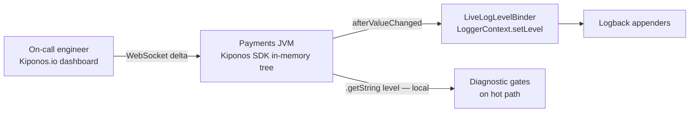

Thursday 3:22 AM. Production is on fire — duplicate charges on a subset of Visa BINs. You need `com.acme.payments.reconcile` at **DEBUG** for twenty minutes to trace idempotency key collisions. Everyone on the bridge knows the rule:

> "Change `logging.level.com.acme.payments` in YAML and **restart** the pod."

So you choose between flying blind during a money incident or recycling a JVM under load — losing warm Caffeine caches, triggering Hikari connection storms, and praying the rolling restart does not amplify the outage.

The staff engineer on call has lived this loop a dozen times. Log levels feel like **bootstrap config** baked into `application-prod.yml`. Spring Boot's docs reinforce it: change logging, redeploy. Actuator loggers exist but are often disabled in prod for security policy. JMX is blocked. You are stuck.

Here is the Aha that changes how senior teams think about observability:

**`logging.level.*` is not schema. It is incident tooling.**

You can flip DEBUG **while the process keeps running** — no redeploy, no restart, no `@RefreshScope` refresh. The next log statement already uses the new level. That is [Kiponos.io](https://kiponos.io).

## The problem — frozen Logback levels

Spring Boot externalizes levels into YAML that only applies at startup:

```yaml
logging:
  level:
    root: INFO
    com.acme.payments: INFO
    com.acme.payments.reconcile: INFO
    org.hibernate.SQL: WARN
    org.springframework.web: WARN
```

| What happens | Cost |
|--------------|------|
| Need DEBUG for one package during incident | PR or ConfigMap + **rolling restart** |
| Forget to revert DEBUG after bridge ends | Disk, log shipper, and SIEM bill explodes |
| `@RefreshScope` on logging config | Rarely wired; still disruptive when it works |
| Actuator `/loggers` endpoint | Often disabled; no audit trail ops trusts |

Teams accept restart culture because Logback levels were always **startup configuration** in the Spring mental model — not operational state you tune like a circuit breaker threshold.

| What teams believe | What production does |
|--------------------|---------------------|
| "DEBUG in prod is dangerous forever" | DEBUG for **twenty minutes** is surgical |
| "Logging config belongs in Git" | Git is great for defaults, terrible for 3 AM |
| "We'll add better metrics next sprint" | Duplicate charges cost money **now** |
| "Restart one pod is fine" | One pod restart triggers connection stampedes |

## The Aha — live levels via Logback binder

Move levels into Kiponos under profile `['payments']['prod']['logging']`:

```yaml
logging/
  levels/
    root: INFO
    com.acme.payments: INFO
    com.acme.payments.reconcile: INFO
    com.acme.payments.idempotency: WARN
    org.hibernate.SQL: WARN
  temporary_debug_ttl_minutes: 0
  verbose_diagnostics_enabled: false
```

On-call sets `com.acme.payments.reconcile` to `DEBUG` in the dashboard. WebSocket **delta** patches the SDK cache. `afterValueChanged` fires. `LiveLogLevelBinder` applies to Logback — **the JVM never stopped**.

## What is Kiponos.io — for incident logging

Kiponos is a real-time configuration hub. Your payment service connects once, loads a typed tree, and holds log levels **in process memory**. Dashboard edits arrive as WebSocket deltas — changing one package does not reload a 40 KB YAML file.

Your binder applies levels to `LoggerContext` on change. Hot-path code that gates expensive diagnostic work can also read locally:

```java
boolean traceDuplicates = kiponos.path("logging", "levels")
        .getString("com.acme.payments.reconcile", "INFO")
        .equals("DEBUG");
```

That `getString()` is a **local memory read** — safe when deciding whether to serialize full request payloads into logs. No HTTP. No polling a config service during the payment hot path.

The hub also gives you an **audit trail** — who flipped DEBUG at 3:24 AM, and whether anyone reverted it. Post-mortems stop being archaeology in merged PRs.

## Architecture — levels without JVM recycle



1. **Connect once** at startup.
2. **Snapshot** loads `logging/levels/*`.
3. **Delta** when on-call edits one package.
4. **Binder applies async** on WebSocket thread — logging threads not blocked.
5. **Reads local** for diagnostic flags on request path.

## Bootstrap Kiponos in Spring Boot 3

```java
@Configuration
public class KiponosConfig {

    @Bean
    public Kiponos kiponos(
            @Value("${kiponos.team-id}") String teamId,
            @Value("${kiponos.access-key}") String accessKey,
            @Value("${kiponos.profile-path}") String profilePath) {
        return Kiponos.builder()
                .teamId(teamId)
                .accessKey(accessKey)
                .profilePath(profilePath)
                .build();
    }
}
```

## Integration — LiveLogLevelBinder with afterValueChanged

```java
@Component
public class LiveLogLevelBinder {

    private static final Logger log = LoggerFactory.getLogger(LiveLogLevelBinder.class);

    private final Kiponos kiponos;
    private final LoggerContext loggerContext;

    public LiveLogLevelBinder(Kiponos kiponos) {
        this.kiponos = kiponos;
        this.loggerContext = (LoggerContext) LoggerFactory.getILoggerFactory();
        kiponos.afterValueChanged(this::onChange);
        applyAll();
    }

    private void onChange(ValueChange change) {
        if (change.path().startsWith("logging/levels")) {
            log.warn("[kiponos] log level change {} → {}", change.path(), change.newValue());
            applyAll();
        }
    }

    private void applyAll() {
        var levels = kiponos.path("logging", "levels");
        levels.keys().forEach(key -> {
            String val = levels.getString(key);
            Logger logger = key.equals("root")
                    ? loggerContext.getLogger(Logger.ROOT_LOGGER_NAME)
                    : loggerContext.getLogger(key);
            logger.setLevel(Level.toLevel(val, Level.INFO));
        });
    }
}
```

Service that gates verbose reconcile logging:

```java
@Service
public class ReconcileService {

    private final Kiponos kiponos;
    private final PaymentLedger ledger;

    public void reconcile(ChargeEvent event) {
        if (kiponos.path("logging", "levels")
                .getString("com.acme.payments.reconcile", "INFO")
                .equals("DEBUG")) {
            log.debug("reconcile input: idempotencyKey={} bin={} amount={}",
                    event.idempotencyKey(), event.bin(), event.amount());
        }
        ledger.apply(event);
    }
}
```

Guardrail: set `temporary_debug_ttl_minutes` in the hub and automate revert via scheduled hub API or runbook hook — DEBUG should not linger because someone closed the bridge tab.

## Real scenarios

| Incident | Old way | Kiponos way |
|----------|---------|-------------|
| Duplicate charge hunt | Restart with DEBUG YAML | `reconcile: DEBUG` live |
| Noisy `org.hibernate.SQL` after deploy | Restart to WARN | Flip one key in hub |
| Post-mortem | Hope someone reverted DEBUG in Git | Hub audit shows who left DEBUG on |
| Load test | Separate log config Git branch | Profile `payments/loadtest/logging` |
| PCI log volume scare | Emergency deploy to INFO | Revert all packages in dashboard |

## Compare to alternatives

| Approach | Flip DEBUG during incident | Risk |
|----------|---------------------------|------|
| YAML + rolling restart | 10–30 min rollout | Restart blast radius + warm cache loss |
| `logging.level` env on pod | Still needs rollout | Same |
| JMX / Actuator loggers | Works when enabled | Often blocked; weak audit |
| Poll Redis for log levels | Fast dashboard | RTT if gating hot-path diagnostics |
| **Kiponos SDK** | **Seconds, audited** | **Revert in dashboard** |

## Performance — why payment teams care

- One WebSocket per JVM — not one config fetch per log statement
- `setLevel()` runs on `afterValueChanged`, not per request
- Diagnostic **gates** use local `getString()` — microseconds, not remote calls
- Delta updates change one package — no full Logback XML reload
- Revert to INFO is instant — SIEM volume drops on next log line

## Guardrails

- Automate revert with `temporary_debug_ttl_minutes` + hub API callback.
- Never put secrets in log format strings — levels only, not payload policy.
- Pair with SIEM alerts on log volume spikes per service.
- Document which packages are safe for DEBUG (no PAN/CVV in those code paths).

## When not to use Kiponos for logging

| Case | Better home |
|------|-------------|
| Log aggregation infrastructure (Loki, ELK) | GitOps for collectors and indexes |
| PII redaction rules and masking layout | Code review + static policy |
| Replacing structured logging schema (JSON fields) | Application design in Git |
| Retention policy and legal hold | Compliance tooling |

## Getting started (15 minutes)

1. [TeamPro at kiponos.io](https://kiponos.io) — profile `['payments']['prod']['logging']`.
2. Mirror your `logging.level.*` YAML into the hub tree under `logging/levels/`.
3. Wire `LiveLogLevelBinder` once per service with `afterValueChanged`.
4. Add one diagnostic gate in a hot-path service using local `getString()`.
5. Game day: trigger synthetic incident, enable DEBUG live, capture trace, revert — **zero pods restarted**.
6. Document boundary: Git declares default levels; hub declares **incident verbosity**.

## Further reading

- [Developer Quickstart](https://dev.to/kiponos/kiponosio-developer-quickstart-java-python-and-your-first-live-config-change-3kjo)
- [Product tour](https://dev.to/kiponos/getting-started-with-kiponosio-p5k)
- [GETTING-STARTED.md](https://github.com/kiponos-io/kiponos-io/blob/master/docs/GETTING-STARTED.md)
- [github.com/kiponos-io/kiponos-io](https://github.com/kiponos-io/kiponos-io)

---

*Kiponos.io — DEBUG is an incident dial, not a deployment event.*