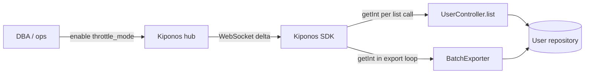

The overnight migration is hour six. Database CPU sits at 94%. Replication lag on the read replica crosses ten minutes. Every admin list endpoint still pulls **fifty rows** because `private static final int PAGE_SIZE = 50` has been untouchable since the first REST controller shipped in 2018.

The DBA pages the API team:

> "Cut your page sizes **now** or we pause the migration."

The API lead pushes back:

> "Page size is part of the **API contract**. Mobile clients expect fifty."

Both are partly right. External mobile apps may document `?size=50`. But internal exporters, nightly ETL jobs, and admin dashboards hammer the same repository with that frozen constant — **`PAGE_SIZE` is load policy**, not semver.

Engineering opens a hotfix branch. CI is backed up. The migration window closes in four hours.

## The problem: sacred constants on every list call

The pattern is everywhere in mature Spring codebases:

```java
@RestController
@RequestMapping("/api/v1/users")
public class UserController {

    private static final int PAGE_SIZE = 50;

    @GetMapping
    public Page<UserDto> list(@RequestParam(defaultValue = "0") int page) {
        return userService.findAll(PageRequest.of(page, PAGE_SIZE));
    }
}
```

And in the repository layer for batch exports:

```java
public void exportAllUsers(Consumer<List<User>> sink) {
    int page = 0;
    Page<User> batch;
    do {
        batch = repo.findAll(PageRequest.of(page++, PAGE_SIZE)); // same constant
        sink.accept(batch.getContent());
    } while (batch.hasNext());
}
```

Every list call touches the database with that fixed window. During migration:

1. **Wide pages amplify lock contention** on rewritten tables
2. **Export jobs multiply load** — 50 rows × thousands of pages × dozens of pods
3. **Lowering size requires redeploy** — too slow for a DBA staring at replication lag

You cannot poll Redis for `page_size` on every `findAll()` without adding RTT to an already DB-bound path. You need **local reads**.

## What teams believe

| What teams say | What production does |
|----------------|---------------------|
| "Page size is in the OpenAPI spec — frozen" | Internal callers dominate DB load during migrations |
| "Clients pass `?size=` so we're fine" | Many code paths ignore query params and use `PAGE_SIZE` |
| "We'll add throttling next quarter" | DBA needs relief in the next fifteen minutes |
| "Smaller pages always mean more round trips" | Smaller pages prevent migration abort |

## The Aha

Read `default_page_size` and a `migration_throttle_mode` flag from [Kiponos.io](https://kiponos.io) on every list invocation. Ops flips throttle mode and sets `throttle_page_size: 10` in the dashboard — the **next** `findAll()` uses ten rows. Same JVM. Same deployment. Restore `50` when replication catches up.

## What is Kiponos.io (for pagination policy)

[Kiponos.io](https://kiponos.io) separates **wiring** (your controllers exist) from **operational floats** (how many rows this hour). Profile `['api']['prod']['pagination']` holds keys under `api/pagination/`.

The Java SDK loads the tree at startup and patches individual keys via WebSocket. `kiponos.path("api", "pagination").getInt("throttle_page_size")` is a **local memory read** — safe inside tight export loops and per-request controller methods alike.

No restart when the DBA asks for smaller pages. No `@RefreshScope` bean recycle that drops in-flight requests. Dashboard edits carry an audit trail — who enabled `migration_throttle_mode` at 02:14.

## Architecture



## Config tree

```yaml
api/
  pagination/
    default_page_size: 50
    max_page_size: 200
    migration_throttle_mode: false
    throttle_page_size: 10
    export_page_size: 25
  clients/
    respect_query_param: true
    fallback_page_size: 50
```

## Integration (Spring Boot service layer)

```java
@Configuration
public class KiponosConfig {

    @Bean
    public Kiponos kiponos(
            @Value("${kiponos.team-id}") String teamId,
            @Value("${kiponos.access-key}") String accessKey,
            @Value("${kiponos.profile-path}") String profilePath) {
        return Kiponos.builder()
                .teamId(teamId)
                .accessKey(accessKey)
                .profilePath(profilePath)
                .build();
    }
}
```

```java
@Service
public class UserService {

    private final UserRepository repo;
    private final Kiponos kiponos;

    public UserService(UserRepository repo, Kiponos kiponos) {
        this.repo = repo;
        this.kiponos = kiponos;
        kiponos.afterValueChanged(change -> {
            if (change.path().startsWith("api/pagination")) {
                log.info("Pagination policy: {} → {}", change.path(), change.newValue());
            }
        });
    }

    public Page<User> findAll(int page) {
        int size = resolvePageSize("api", "pagination");
        return repo.findAll(PageRequest.of(page, size));
    }

    // Export loops use the same resolvePageSize() — one local read per page

    private int resolvePageSize(String... path) {
        var p = kiponos.path(path);
        if (p.getBool("migration_throttle_mode", false)) {
            return p.getInt("throttle_page_size", 10);
        }
        return p.getInt("default_page_size", 50);
    }
}
```

Migration night? Ops enables `migration_throttle_mode` — internal paths using `resolvePageSize()` immediately shed load.

## Real scenarios

| Event | Without Kiponos | With Kiponos |
|-------|-----------------|--------------|
| Overnight migration throttle | Hotfix branch; CI queue | `migration_throttle_mode: true` live |
| Replication lag spike | Pause ETL manually | Drop `export_page_size` to 10 |
| Post-migration restore | Another deploy | Flip throttle off; restore 50 |
| Black Friday admin load | Pre-provision three YAML files | Hub profile per event phase |

## Performance — why pagination reads stay cheap

- **`getInt()` per list call** — microseconds vs milliseconds of SQL execution
- **One WebSocket** for all pagination keys — not N keys × N pods polling S3
- **Export loops benefit equally** — local read every page, no Redis RTT multiplied by page count
- **Delta updates** — toggling throttle mode sends two keys, not full config redeploy
- **No connection pool churn** — unlike recycling `@RefreshScope` repository wrappers

## Compare to alternatives

| Approach | Throttle during migration | Per-list read cost |
|----------|--------------------------|-------------------|
| `static final PAGE_SIZE` | Redeploy | Zero (frozen) |
| `application.yml` only | Rolling restart | Zero after restart |
| Feature flag (boolean only) | Fast toggle | Network eval if SaaS |
| Redis per request | Yes | RTT × QPS |
| **Kiponos SDK** | **Dashboard, seconds** | **Memory read** |

## When not to use Kiponos

| Case | Better approach |
|------|-----------------|
| Public OpenAPI `max` documented in semver | Versioned API + client communication |
| Cursor-based pagination contract redesign | Git + API versioning |
| Database partition strategy | DBA migration runbook in Git |
| Per-tenant page size in billing contract | Tenant row in DB with cache |

## Getting started (15 minutes)

1. [Free TeamPro at kiponos.io](https://kiponos.io) — profile `['api']['prod']['pagination']`.
2. Add `io.kiponos:sdk-boot-3` to your Spring Boot API service.
3. Set `KIPONOS_ID`, `KIPONOS_ACCESS`, and `-Dkiponos="['api']['prod']['pagination']"`.
4. Create the `api/pagination` tree with throttle keys above.
5. Replace `PAGE_SIZE` constant with `resolvePageSize()` local reads.
6. Staging test: enable `migration_throttle_mode`, run export job, confirm smaller SQL windows **without restart**.

## Further reading

- [Developer Quickstart](https://dev.to/kiponos/kiponosio-developer-quickstart-java-python-and-your-first-live-config-change-3kjo)
- [Product tour](https://dev.to/kiponos/getting-started-with-kiponosio-p5k)
- [GETTING-STARTED.md](https://github.com/kiponos-io/kiponos-io/blob/master/docs/GETTING-STARTED.md)
- [github.com/kiponos-io/kiponos-io](https://github.com/kiponos-io/kiponos-io)

---

*Kiponos.io — page size is load policy, not a tattoo from 2018.*