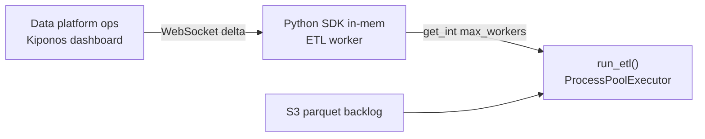

The data platform team migrated ETL workers from 4-core VMs to **32-core Kubernetes nodes**. Throughput barely moved. Profiling shows CPU at 18% while a queue of 40,000 parquet files waits — because `ProcessPoolExecutor(max_workers=4)` has been a module constant since someone prototyped on a laptop in 2018.

The platform lead shrugs:

> "Worker count is **code**. We sized it for the old fleet."

But `max_workers` is not algorithm design. It is **how much parallelism today's metal can absorb** — four on a dev laptop, sixteen on prod nodes, eight when the warehouse is throttling downstream writes. Shipping a new Docker image to change an integer is how batch pipelines stay underfed for quarters.

## The problem: frozen parallelism on every batch submit

Your ETL entrypoint hard-codes the pool:

```python
MAX_WORKERS = 4  # do not change without load testing

def run_etl(items: list[Path]) -> None:
    with ProcessPoolExecutor(max_workers=MAX_WORKERS) as pool:
        list(pool.map(transform_parquet, items))
```

Or in settings:

```python
# settings.py — deployed weekly, tuned never
ETL_POOL_SIZE = int(os.getenv("ETL_POOL_SIZE", "4"))
```

Environment variables help **between** deploys. They do not help when ops needs to **raise workers at 3 AM** during a backlog fire without rolling forty Celery consumers. Each `run_etl()` invocation should read `max_workers` locally — the submit hot path runs hundreds of times per hour during catch-up.

## What teams believe

| What teams say | What production does |
|----------------|---------------------|
| "max_workers is tuned in load tests — freeze it" | New hardware arrives; constant stays at 4 |
| "Set ETL_POOL_SIZE in the Helm chart" | Chart change is still a deploy window |
| "Auto-scale pods instead of workers" | One pod with 4 workers leaves 28 cores idle |
| "Python GIL means more processes always help" | I/O-bound transforms need **right-sized** pools, not blind 64 |

The pain is confusing **parallelism policy** with **application structure**. The transform function stays in Git; the worker count should move with the queue.

## The Aha

**`ProcessPoolExecutor(max_workers=4)` looks like a load-test artifact cast in stone, but worker count is operational capacity** — raise to 16 when new nodes arrive, lower to 6 when the warehouse throttles. [Kiponos.io](https://kiponos.io) feeds `max_workers` via local `get_int()` on every batch submit — no redeploy, no pod rollout.

## What is Kiponos.io (for Python worker pools)

[Kiponos.io](https://kiponos.io) connects your ETL worker once at process startup. Profile `['etl']['parquet']['prod']['live']` loads a config tree into the Python SDK's in-memory cache over WebSocket.

When ops sets `workers/etl/max_workers` to 16, a delta patches every running worker. The next `run_etl()` call reads `kiponos.path("workers", "etl").get_int("max_workers", 4)` — **local RAM**, no HTTP to a config API between parquet files.

No restart. No redeploy. Optional callback on value change logs audit events when parallelism shifts during incident response.

## Architecture



1. **Connect once** in worker `__main__` or Celery boot step.
2. **Store pool policy** under `workers/etl`.
3. **Read max_workers** each batch — new pools pick up new count.
4. **Throttle live** when `enabled: false` pauses submission.

## Config tree

```yaml
workers/
  etl/
    max_workers: 4
    enabled: true
    chunk_size: 500
    backoff_on_warehouse_throttle: true
    throttle_max_workers: 6
  validation/
    max_workers: 8
    enabled: true
```

## Integration (Python ETL worker)

```python
import os
import logging
from concurrent.futures import ProcessPoolExecutor
from pathlib import Path

from kiponos import Kiponos

log = logging.getLogger(__name__)

os.environ.setdefault("KIPONOS_PROFILE", "['etl']['parquet']['prod']['live']")
kiponos = Kiponos.create_for_current_team()


def on_config_change(change):
    if change.path.startswith("workers/etl"):
        log.info("ETL worker policy changed: %s → %s", change.path, change.new_value)


kiponos.after_value_changed(on_config_change)


def resolve_max_workers() -> int:
    cfg = kiponos.path("workers", "etl")
    if not cfg.get_bool("enabled", True):
        return 0
    if cfg.get_bool("backoff_on_warehouse_throttle", False):
        return cfg.get_int("throttle_max_workers", 6)
    return cfg.get_int("max_workers", 4)


def run_etl(items: list[Path]) -> int:
    n = resolve_max_workers()
    if n <= 0:
        log.warning("ETL disabled by policy — skipping %d items", len(items))
        return 0

    chunk = kiponos.path("workers", "etl").get_int("chunk_size", 500)
    processed = 0

    for offset in range(0, len(items), chunk):
        batch = items[offset : offset + chunk]
        with ProcessPoolExecutor(max_workers=n) as pool:
            pool.map(transform_parquet, batch)
        processed += len(batch)
        log.info("ETL batch done workers=%d size=%d", n, len(batch))

    return processed


def transform_parquet(path: Path) -> None:
    ...
```

`resolve_max_workers()` is called once per batch — every `get_int()` hits the local tree.

Long-lived pools can rebuild inside `after_value_changed` when `max_workers` changes — new batches pick up the count immediately either way.

## Real scenarios

| Event | Without Kiponos | With Kiponos |
|-------|-----------------|--------------|
| 32-core nodes provisioned | Weeks until someone notices 4 workers | Ops sets `max_workers: 16` live |
| Snowflake warehouse throttling | Full pool hammers DW | Enable `backoff_on_warehouse_throttle` |
| Nightly backlog spike | Emergency image with new env var | Dashboard bump for 6-hour window |
| Dev laptop runs same code | Wrong prod constant in `.env` | Profile `['etl']['parquet']['dev']['live']` |

## Performance — why pool reads are free

- **One WebSocket** per worker process — not a Consul poll per parquet file
- **`get_int()` is O(1)** on cached tree — microseconds vs minutes of transform CPU
- **New executor per batch** picks up new `max_workers` without process restart
- **Delta updates** — changing 4 → 16 sends one integer patch

Pool creation has overhead; reading policy does not. The win is **right-sizing without redeploy**.

## Compare to alternatives

| Approach | Mid-backlog worker bump | Read cost per batch | Multi-profile dev/prod |
|----------|-------------------------|---------------------|------------------------|
| Module constant | Redeploy | Zero (frozen) | Branch per env |
| `ETL_POOL_SIZE` env var | Pod rollout | Zero after restart | Helm values PR |
| Redis poll | Yes | Network RTT | Custom |
| **Kiponos Python SDK** | **Dashboard, seconds** | **Memory read** | **Profile path per env** |

## When not to use Kiponos

| Case | Better home |
|------|-------------|
| Transform function logic and schema mappings | Git |
| Kubernetes HPA replica count | Cluster autoscaler |
| Secrets (DB passwords, API keys) | Vault |
| Choosing multiprocessing vs threading model | Architecture in code |

## Getting started (15 minutes)

1. [TeamPro at kiponos.io](https://kiponos.io) — profile `['etl']['parquet']['prod']['live']`.
2. `pip install kiponos` — set `KIPONOS_ID`, `KIPONOS_ACCESS`.
3. Create `workers/etl` tree from this article.
4. Replace `MAX_WORKERS = 4` with `resolve_max_workers()`.
5. Run backlog job, raise `max_workers` in dashboard — next batch uses 16 without worker restart.

## Further reading

- [Developer Quickstart](https://dev.to/kiponos/kiponosio-developer-quickstart-java-python-and-your-first-live-config-change-3kjo)
- [Product tour](https://dev.to/kiponos/getting-started-with-kiponosio-p5k)
- [GETTING-STARTED.md](https://github.com/kiponos-io/kiponos-io/blob/master/docs/GETTING-STARTED.md)
- [github.com/kiponos-io/kiponos-io](https://github.com/kiponos-io/kiponos-io)

---

*Kiponos.io — worker counts match today's metal, not yesterday's laptop.*