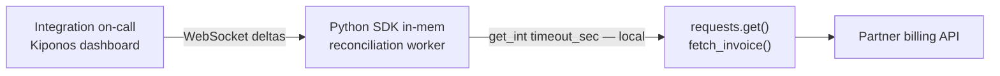

Partner billing API minute 19. P99 latency crosses **12 seconds** — their status page still says "investigating." Your integration worker still passes `timeout=5` because `TIMEOUT = 5` sits at line 4 of `client.py`, copied from the README when the partner averaged 180ms.

Half your reconciliation jobs fail with `ReadTimeout`. Finance sees mismatched ledgers. Someone proposes a hotfix branch.

The integration owner shrugs:

> "Five seconds is our **SLA with the partner**. We do not change client timeouts without their sign-off."

But the partner is not signing anything at 2 AM. Timeout is not a contract — it is **how long you wait tonight** given **tonight's** latency. It should move when the storm moves.

**The Aha:** read `timeout_sec` from [Kiponos.io](https://kiponos.io) on every `requests` call — ops sets `15` live while workers keep running.

## The problem: module-level timeout on the integration hot path

```python
# client.py — unchanged since 2021
TIMEOUT = 5
CONNECT_TIMEOUT = 2

def fetch_invoice(invoice_id: str) -> dict:
    return requests.get(
        f"{BASE}/invoices/{invoice_id}",
        timeout=(CONNECT_TIMEOUT, TIMEOUT),
    ).json()
```

Or timeouts buried in a shared `Session` created once at import. Problems:

1. **Deploy to loosen** — while jobs fail every 5 seconds
2. **Too loose forever** — after recovery you still wait 15s per call unless someone remembers to revert
3. **Per-partner tuning** — env vars per deploy target get messy fast

| What teams say | What production does |
|----------------|---------------------|
| "Fail fast at 5s protects our workers" | False failures flood retries and make things worse |
| "We'll use urllib3 Retry" | Retries × 5s timeout still lose against 12s p99 |
| "Partner will fix it soon" | Your ledger does not wait |

## The Aha: timeout seconds are tonight's patience dial

Store partner HTTP policy under `http/partner` in Kiponos. Each `fetch_invoice()` reads `timeout_sec` and `connect_timeout_sec` from the in-memory tree. When ops bumps `timeout_sec` to `15`, the **next** request waits longer — no worker restart, no redeploy.

When the partner recovers, ops tightens back to `5` from the dashboard. Audit trail shows who extended patience and when.

## What Kiponos.io is — for Python integration workers

[Kiponos.io](https://kiponos.io) is a config hub with Java and Python SDKs. `Kiponos.create_for_current_team()` connects over WebSocket, hydrates the tree for a profile like `['integrations']['prod']['http']`, and serves **local** `get_int()` / `get_float()` on the hot path.

Updates are **async deltas** — changing `timeout_sec` patches one key in memory. Your reconciliation loop never blocks on the network waiting for config.

Optional `after_value_changed` logs policy flips or rebuilds a shared `requests.Session` when connect settings change.

## Architecture



## Example config tree

```yaml
http/
  partner/
    timeout_sec: 5
    connect_timeout_sec: 2
    read_timeout_sec: 5
    storm_mode: false
    storm_timeout_sec: 15
  internal_ledger/
    timeout_sec: 3
    connect_timeout_sec: 1
  retry/
    max_attempts: 3
    backoff_sec: 2
```

## Python integration (reconciliation worker)

```python
import os
import logging
import requests
from kiponos import Kiponos

log = logging.getLogger(__name__)

kiponos = Kiponos.create_for_current_team()
# Profile: ['integrations']['prod']['http'] via KIPONOS_PROFILE env

def _partner_cfg():
    return kiponos.path("http", "partner")

def effective_timeouts() -> tuple[float, float]:
    cfg = _partner_cfg()
    if cfg.get_bool("storm_mode", False):
        return (
            cfg.get_int("connect_timeout_sec", 2),
            cfg.get_int("storm_timeout_sec", 15),
        )
    return (
        cfg.get_int("connect_timeout_sec", 2),
        cfg.get_int("timeout_sec", 5),
    )

def fetch_invoice(invoice_id: str) -> dict:
    connect_s, read_s = effective_timeouts()
    resp = requests.get(
        f"{BASE}/invoices/{invoice_id}",
        timeout=(connect_s, read_s),
    )
    resp.raise_for_status()
    return resp.json()

kiponos.after_value_changed(
    lambda change: log.info("HTTP policy changed: %s → %s", change.path, change.new_value)
    if change.path.startswith("http/partner")
    else None
)
```

Every `get_int()` is a **local memory read** — safe inside tight retry loops over thousands of invoices.

## Real scenarios

| Event | `TIMEOUT = 5` folklore | Kiponos path |
|-------|------------------------|--------------|
| Partner brownout | Mass `ReadTimeout`, ledger drift | `storm_mode: true`, `storm_timeout_sec: 15` |
| Partner recovered | Still waiting 15s unless someone deploys | `storm_mode: false`, back to `timeout_sec: 5` |
| New subsidiary API | Copy-paste constant in new module | `http/internal_ledger` sibling tree |
| Finance audit | "Who changed timeout?" — git blame on `client.py` | Dashboard audit on `http/partner` |

## Performance — why reconciliation stays fast

- One WebSocket per worker process — not one HTTP config fetch per invoice
- `get_int("timeout_sec")` is O(1) on the cached tree — noise next to partner RTT
- Delta updates — storm mode toggle sends two keys, not a full env redeploy
- No process restart — Celery/uwsgi workers keep consuming queue depth
- `after_value_changed` runs on the WebSocket thread; keep callbacks lightweight

## Compare to alternatives

| Approach | Extend timeout during partner storm | Per-request read cost |
|----------|-------------------------------------|------------------------|
| Module constant `TIMEOUT = 5` | Redeploy workers | Zero (frozen) |
| `os.environ["TIMEOUT"]` | Rolling restart | Zero after restart |
| Poll Redis / Consul | Possible | Network RTT × thousands of invoices |
| Feature-flag boolean "slow partner" | No numeric timeout | Still need a number somewhere |
| **Kiponos SDK** | **Dashboard (seconds)** | **Memory read** |

## When not to use Kiponos for HTTP timeouts

| Case | Better approach |
|------|-----------------|
| Partner base URL migration | Git-reviewed config |
| mTLS certificate rotation | PKI / secrets manager |
| Switching `requests` → `httpx` async client | Code change |
| Timeout of 120s on CPU-bound local work | Fix the algorithm |

## Getting started (15 minutes)

1. [TeamPro at kiponos.io](https://kiponos.io) — profile `['integrations']['prod']['http']`.
2. `pip install kiponos` — set `KIPONOS_ID`, `KIPONOS_ACCESS`, `KIPONOS_PROFILE`.
3. Create `http/partner` with `timeout_sec`, `connect_timeout_sec`, and `storm_mode`.
4. Replace module-level `TIMEOUT` with `effective_timeouts()` using `kiponos.path(...)`.
5. Game day: inject latency in staging partner mock, enable `storm_mode` live, watch success rate recover **without worker restart**.

**Further reading:**

- [Developer Quickstart](https://dev.to/kiponos/kiponosio-developer-quickstart-java-python-and-your-first-live-config-change-3kjo)
- [Product tour](https://dev.to/kiponos/getting-started-with-kiponosio-p5k)
- [GETTING-STARTED.md](https://github.com/kiponos-io/kiponos-io/blob/master/docs/GETTING-STARTED.md)
- [github.com/kiponos-io/kiponos-io](https://github.com/kiponos-io/kiponos-io)

---

*Kiponos.io — timeout is today's patience, not module folklore.*