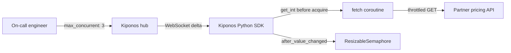

Partner catalog scraper, 03:22 UTC. Forty asyncio workers flood a vendor pricing API. Module import created `SEM = asyncio.Semaphore(10)` — ten concurrent calls felt generous when the partner allowed 100 req/s in the sandbox.

Tonight the partner returns `429 Too Many Requests` on half the calls. Queue depth: 180,000 URLs. On-call wants **three** concurrent calls until rate limits clear. Restarting workers drains the in-memory queue wrong and loses checkpoint state.

Platform: "Concurrency is in code. Roll a new image." But `Semaphore(10)` is **how hard you press the partner API right now**.

## The problem: import-time semaphore on the fetch hot path

The pattern is common in Python asyncio services:

```python
import asyncio
import httpx

SEM = asyncio.Semaphore(10)
client = httpx.AsyncClient(timeout=30.0)

async def fetch(url: str) -> bytes:
    async with SEM:
        response = await client.get(url)
        response.raise_for_status()
        return response.content
```

`SEM` is created once at import. Every `fetch()` acquires from the same gate. Changing concurrency means:

1. **Redeploy workers** — bad during backlog drain
2. **Environment variable at boot** — still requires process recycle
3. **Poll Redis before each acquire** — adds RTT to an already network-bound loop

The fetch hot path needs **local `get_int()`** of current `max_concurrent` and a **resizable gate** updated when ops changes policy.

## What teams believe

| What teams say | What production does |
|----------------|---------------------|
| "Semaphore count was tuned with partner docs" | Partner rate limits change during their incidents |
| "Just backoff on 429" | Backoff without lower concurrency prolongs queue |
| "Concurrency belongs in code review" | On-call needs three permits in three minutes |
| "Restart workers with new env" | Restarts lose in-flight asyncio tasks |

## The Aha

Read `max_concurrent` from [Kiponos.io](https://kiponos.io) before each acquire. Register `after_value_changed` to resize the asyncio gate when ops sets `3` in the dashboard — **same worker process**, gentler pressure on the partner, no image roll.

## What is Kiponos.io (for Python asyncio concurrency)

[Kiponos.io](https://kiponos.io) syncs operational config to Python workers via the same WebSocket delta model as Java. Profile `['scraper']['prod']['concurrency']` holds `concurrency/partner_fetch/max_concurrent`.

`kiponos.path("concurrency", "partner_fetch").get_int("max_concurrent")` is a **local memory read** inside `fetch()` — no HTTP per URL, no Redis round trip across 180k iterations.

`after_value_changed` rebuilds or adjusts the semaphore when policy changes. Git keeps **which partner you scrape**. The hub keeps **how many simultaneous calls this outage allows**.

## Architecture



## Config tree

```yaml
concurrency/
  partner_fetch/
    max_concurrent: 10
    enabled: true
    acquire_timeout_ms: 5000
  outage/
    rate_limit_mode: false
    rate_limit_max_concurrent: 3
  worker/
    batch_pause_ms: 0
    log_acquire_waits: true
```

## Integration (Python asyncio worker)

```python
import asyncio
import logging
import os
from contextlib import asynccontextmanager

import httpx
from kiponos import Kiponos

log = logging.getLogger(__name__)

os.environ.setdefault("KIPONOS_PROFILE", "['scraper']['prod']['concurrency']")
kiponos = Kiponos.create_for_current_team()
client = httpx.AsyncClient(timeout=30.0)


class ResizableSemaphore:
    def __init__(self, initial: int):
        self._capacity = initial
        self._sem = asyncio.Semaphore(initial)

    def reconfigure(self, new_capacity: int) -> None:
        if new_capacity == self._capacity:
            return
        delta = new_capacity - self._capacity
        self._capacity = new_capacity
        if delta > 0:
            for _ in range(delta):
                self._sem.release()

    @asynccontextmanager
    async def acquire(self, timeout_ms: int = 5000):
        await asyncio.wait_for(self._sem.acquire(), timeout=timeout_ms / 1000)
        try:
            yield
        finally:
            self._sem.release()


_gate = ResizableSemaphore(
    kiponos.path("concurrency", "partner_fetch").get_int("max_concurrent", 10)
)


def _on_policy_change(change) -> None:
    if not str(change.path).startswith("concurrency/"):
        return
    max_c = _resolve_max_concurrent()
    _gate.reconfigure(max_c)
    log.info("Concurrency gate resized to %s (trigger=%s)", max_c, change.path)


kiponos.after_value_changed(_on_policy_change)


def _resolve_max_concurrent() -> int:
    outage = kiponos.path("concurrency", "outage")
    if outage.get_bool("rate_limit_mode", False):
        return outage.get_int("rate_limit_max_concurrent", 3)
    return kiponos.path("concurrency", "partner_fetch").get_int("max_concurrent", 10)


async def fetch(url: str) -> bytes:
    cfg = kiponos.path("concurrency", "partner_fetch")
    if not cfg.get_bool("enabled", True):
        r = await client.get(url)
        r.raise_for_status()
        return r.content
    async with _gate.acquire(timeout_ms=cfg.get_int("acquire_timeout_ms", 5000)):
        r = await client.get(url)
        r.raise_for_status()
        return r.content
```

Partner returning 429? Ops enables `rate_limit_mode` and sets `rate_limit_max_concurrent: 3`. Next fetches see lower pressure **without worker restart**.

## Real scenarios

| Event | Without Kiponos | With Kiponos |
|-------|-----------------|--------------|
| Partner 429 storm | Roll new Docker image | `rate_limit_max_concurrent: 3` live |
| Partner recovery | Another deploy | Disable `rate_limit_mode` |
| New partner onboarding | Copy-paste semaphore constant | Hub folder `partner_backup` |
| Nightly bulk scrape | Static 10 — risks ban | Temporarily raise to 20 when allowed |

## Performance — why Python reads stay cheap

- **`get_int()` is in-process** — critical when loop runs 180k URLs
- **One WebSocket per worker** — not config HTTP per `fetch()`
- **`reconfigure` on change only** — not per URL after initial read
- **Delta patch** — one integer change merges async on WS thread
- **No worker recycle** — preserves asyncio queue and checkpoint offsets

## Compare to alternatives

| Approach | Lower concurrency during 429s | Per-fetch overhead |
|----------|------------------------------|-------------------|
| Module-level `Semaphore(10)` | Redeploy image | Zero (frozen) |
| `os.environ` at boot | Restart workers | Zero after restart |
| Redis INCR/lease per URL | Yes | RTT × URLs |
| Feature flag SaaS | Boolean only | Network eval |
| **Kiponos SDK** | **Dashboard, seconds** | **Memory read** |

## When not to use Kiponos

| Case | Better approach |
|------|-----------------|
| Worker replica count and K8s HPA | Cluster autoscaling |
| Partner API keys and OAuth secrets | Vault |
| Switching from asyncio to Celery | Architecture migration |
| Hard partner contract cap (never exceed 2) | Compliance constant in code |

## Getting started (15 minutes)

1. [Free TeamPro at kiponos.io](https://kiponos.io) — profile `['scraper']['prod']['concurrency']`.
2. `pip install kiponos` in your worker project.
3. Set `KIPONOS_ID`, `KIPONOS_ACCESS`, and `KIPONOS_PROFILE`.
4. Create `concurrency/partner_fetch` tree with outage keys.
5. Replace module `SEM` with `ResizableSemaphore` + `_resolve_max_concurrent()`.
6. Run worker, enable `rate_limit_mode` in dashboard, confirm gentler fetch rate **without restart**.

## Further reading

- [Developer Quickstart](https://dev.to/kiponos/kiponosio-developer-quickstart-java-python-and-your-first-live-config-change-3kjo)
- [Product tour](https://dev.to/kiponos/getting-started-with-kiponosio-p5k)
- [GETTING-STARTED.md](https://github.com/kiponos-io/kiponos-io/blob/master/docs/GETTING-STARTED.md)
- [github.com/kiponos-io/kiponos-io](https://github.com/kiponos-io/kiponos-io)

---

*Kiponos.io — asyncio semaphores are live partner diplomacy, not import-time forever.*