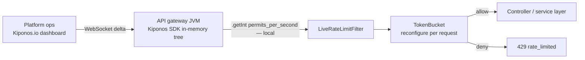

Launch day, 10:00 AM sharp. Product doubled the marketing spend without telling platform — again. Your public API `RateLimiter` allows **10 permits per second** because `@RateLimiter(name = "publicApi", fallbackMethod = "queue")` was configured once in `application.yml` during beta when ten concurrent users felt optimistic.

By 10:18 AM, legitimate customers see `429 Too Many Requests`. Mobile apps retry aggressively and make it worse. Twitter notices before your HPA adds a second pod — and a second pod still enforces the same frozen **10**.

Someone in the war room screams:

> "Just raise the limit!"

The platform lead responds with the reflex every senior team has trained into muscle memory:

> "That's a **config change**. We need a release."

But permits per second are not brand identity. They are **capacity policy for this hour** — how much traffic you absorb before you shed load to protect the database and downstream partners. Freezing them in YAML is how launches fail while a PR waits in CI.

Here is the Aha:

**`limitForPeriod` behaves like architecture, but rate limits are incident dials.**

You can change `permits_per_second` **while pods keep serving HTTP** — no redeploy, no restart, no actuator refresh. The next request already sees the new permit budget. That is [Kiponos.io](https://kiponos.io).

## The problem — frozen permits on every request

Resilience4j makes it easy to bake limits into YAML:

```yaml
resilience4j.ratelimiter:
  instances:
    publicApi:
      limitForPeriod: 10
      limitRefreshPeriod: 1s
      timeoutDuration: 0
```

Or worse — a Guava `RateLimiter.create(10.0)` in `@PostConstruct`, **frozen for the JVM lifetime** unless you rebuild the bean:

```java
@PostConstruct
void init() {
    this.limiter = RateLimiter.create(10.0);
}
```

Every HTTP request through your filter chain hits that number. Marketing cannot turn the dial. Abuse response cannot tighten instantly. The pain is not that teams ignore rate limiting — they **over-trust** the permanence of integers chosen in a planning meeting.

| What teams believe | What production does |
|--------------------|---------------------|
| "10 req/s is our SLA ceiling" | Launch traffic shape changes in minutes |
| "Rate limits need architecture review" | Incidents do not wait for review boards |
| "We'll raise limits in the next release" | Customers churn during the queue |
| "Resilience4j config is good enough" | Good enough until the config is frozen |

## The Aha — live permits while requests flow

Move permit policy into Kiponos. Boot wiring stays minimal — **live limits** live in the hub:

```yaml
limits/
  public_api/
    permits_per_second: 10
    burst: 20
    enabled: true
    dry_run: false
  partner_acme/
    permits_per_second: 200
    burst: 400
    enabled: true
  internal_admin/
    permits_per_second: 5
    burst: 10
    enabled: true
```

Marketing spike? Ops sets `permits_per_second: 40` in the dashboard. WebSocket delivers a **delta**. Your filter reads `getInt()` on the next request — local memory, zero network. Pods keep running. Abuse wave? Drop to `2` instantly without a rollout.

## What is Kiponos.io — for API capacity policy

Kiponos is a real-time configuration hub. Your Spring Boot service connects once, loads a typed tree for profile `['api']['prod']['limits']`, and holds values **in process memory**. Dashboard edits arrive as WebSocket deltas. Every filter invocation calls `kiponos.path("limits", "public_api").getInt("permits_per_second")` — a **local read** safe at the top of the request hot path.

That separation matters: you cannot poll Redis or call a feature-flag SaaS on **every** HTTP request and stay within latency budgets. Kiponos gives you dashboard-speed changes with memory-speed reads. Git keeps team id and profile path; the hub keeps operational floats that launch day demands.

`afterValueChanged` can bridge into Resilience4j's registry when you still want annotation-based fallbacks — rebuild the limiter when permits change, without restarting the JVM.

## Architecture — permits without redeploy



1. **Connect once** at startup.
2. **Full snapshot** for `['api']['prod']['limits']`.
3. **Delta patch** when ops edits one permit key.
4. **Filter reads locally** — request thread never blocks on network.
5. **Token bucket reconfigures** when integers change — no bean recycle.

## Bootstrap Kiponos in Spring Boot 3

```java
@Configuration
public class KiponosConfig {

    @Bean
    public Kiponos kiponos(
            @Value("${kiponos.team-id}") String teamId,
            @Value("${kiponos.access-key}") String accessKey,
            @Value("${kiponos.profile-path}") String profilePath) {
        return Kiponos.builder()
                .teamId(teamId)
                .accessKey(accessKey)
                .profilePath(profilePath)
                .build();
    }
}
```

## Integration — filter with zero-latency reads

```java
@Component
@Order(Ordered.HIGHEST_PRECEDENCE + 5)
public class LiveRateLimitFilter extends OncePerRequestFilter {

    private final Kiponos kiponos;
    private final ConcurrentHashMap<String, TokenBucket> buckets = new ConcurrentHashMap<>();

    public LiveRateLimitFilter(Kiponos kiponos) {
        this.kiponos = kiponos;
        kiponos.afterValueChanged(c -> {
            if (c.path().startsWith("limits/")) {
                buckets.clear(); // force clean reconfigure on policy flip
            }
        });
    }

    @Override
    protected void doFilterInternal(HttpServletRequest req, HttpServletResponse res,
                                    FilterChain chain) throws ServletException, IOException {
        String tenant = resolveTenant(req); // e.g. "public_api" or "partner_acme"
        var cfg = kiponos.path("limits", tenant);

        if (!cfg.getBool("enabled", true)) {
            chain.doFilter(req, res);
            return;
        }
        if (cfg.getBool("dry_run", false)) {
            chain.doFilter(req, res);
            return;
        }

        int permits = cfg.getInt("permits_per_second", 10);
        int burst = cfg.getInt("burst", 20);
        TokenBucket bucket = buckets.computeIfAbsent(tenant,
                k -> TokenBucket.builder().permits(permits).burst(burst).build());
        bucket.reconfigure(permits, burst);

        if (!bucket.tryConsume()) {
            res.setStatus(429);
            res.setHeader("Retry-After", "1");
            res.getWriter().write("{\"error\":\"rate_limited\"}");
            return;
        }
        chain.doFilter(req, res);
    }
}
```

Launch surge? Ops sets `permits_per_second: 40`. **Next HTTP request** sees it. DDoS-ish retry storm from one tenant? Tighten `partner_acme/permits_per_second` without touching public API limits.

Related: [API rate limits and circuit breakers article](https://github.com/kiponos-io/kiponos-io/blob/master/docs/devto-rate-limits-circuit-breakers.md).

## Real scenarios

| Moment | YAML reflex | Kiponos path |
|--------|-------------|--------------|
| Launch surge | Emergency deploy to raise `limitForPeriod` | `limits/public_api/permits_per_second: 40` |
| Credential-stuffing attack | Deploy lower limit; wait for rollout | Drop to `2` in seconds |
| Partner SLA tier | Copy-paste YAML per tenant | `limits/partner_acme/*` tree |
| Load test week | New Git branch per knob | Hub profile `api/loadtest/live` |
| Post-incident | Debate "correct" steady-state limit | Tune with audit trail in hub |

## Compare to alternatives

| Approach | Launch-hour tweak | Hot-path read cost |
|----------|-------------------|---------------------|
| YAML + Resilience4j | 20–45 min rollout | Zero (frozen) |
| `@RefreshScope` rate limiter bean | Actuator refresh | Bean churn + bucket reset |
| Redis sliding window | Fast dashboard | RTT every request |
| Edge CDN rate limits only | Fast at edge | No per-tenant JVM policy |
| **Kiponos SDK** | **Seconds** | **Memory read** |

## Performance — why API teams care

- One WebSocket per process — not one config fetch per HTTP request
- `getInt()` is O(1) on cached tree — safe in `OncePerRequestFilter`
- `bucket.reconfigure()` no-ops when values unchanged — avoids allocator churn
- `afterValueChanged` clears buckets only on policy path changes — not per request
- `dry_run: true` lets you rehearse new limits without shedding real traffic

## When not to use Kiponos for rate limits

| Case | Use instead |
|------|-------------|
| Edge CDN / WAF rate limits (first line of defense) | Cloudflare, Akamai, AWS WAF |
| Per-user OAuth quotas backed by identity DB | Auth service + persistent store |
| DDoS volumetric attacks | Network layer + scrubbing center |
| Rate limit algorithm research (leaky bucket vs GCRA) | Code + load tests in Git |

## Getting started (15 minutes)

1. [TeamPro at kiponos.io](https://kiponos.io) — profile `['api']['prod']['limits']`.
2. Move **one** `RateLimiter` instance from YAML to Kiponos reads in a servlet filter.
3. Add `afterValueChanged` to clear bucket map on policy flips.
4. Launch rehearsal: throttle to `5` permits, watch `429` rate climb, raise to `40` live, watch success recover **without rollout**.
5. Document boundary: Git declares filter wiring; hub declares **operational capacity**.

## Further reading

- [Developer Quickstart](https://dev.to/kiponos/kiponosio-developer-quickstart-java-python-and-your-first-live-config-change-3kjo)
- [Product tour](https://dev.to/kiponos/getting-started-with-kiponosio-p5k)
- [GETTING-STARTED.md](https://github.com/kiponos-io/kiponos-io/blob/master/docs/GETTING-STARTED.md)
- [github.com/kiponos-io/kiponos-io](https://github.com/kiponos-io/kiponos-io)

---

*Kiponos.io — permits per second are incident dials, not launch-day tattoos.*