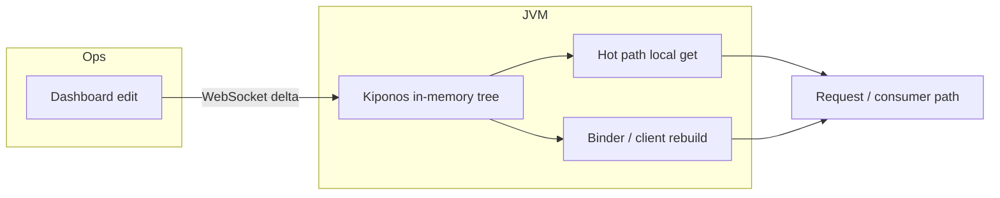

Wednesday 14:07. Checkout wraps the payment client in Resilience4j TimeLimiter at 2s. The acquirer is slow but alive. Your limiter cancels work that would have finished at 2.4s — and the circuit starts opening on your impatience, not their death.

Someone opens the runbook and points at the frozen knob:

```
resilience4j.timelimiter.instances.payment.timeoutDuration
```

```yaml
resilience4j.timelimiter:
  instances:
    payment:
      timeoutDuration: 2s
      cancelRunningFuture: true
```

That value was read when the process (or client bean) was born. Changing it means a new revision while the storm is already here. The senior engineer says the sentence every on-call knows:

> "TimeLimiter is a resilience contract. Change tickets only."

You do not need a new architecture tonight. You need an **operational ceiling** that can move **now**.

**The Aha:** timeoutDuration is an incident dial — a budget, not a religion. With [Kiponos.io](https://kiponos.io) you hold the dials live and rebuild or re-bind from local gets — zero network on the hot path, dashboard delta in seconds, no redeploy.

## The hard-coded belief

Teams treat framework timeouts as **bootstrap philosophy**:

| What teams say | What production does |
|----------------|---------------------|
| "This number is correct forever" | Peak hours, partial outages, and partners disagree |
| "We can only change it in a release" | Incidents do not wait for CI |
| "One global value is simpler" | Checkout, catalog, and reports need different budgets |
| "Async / pool / gateway already protects us" | Each layer has a **different** clock — misalignment multiplies pain |

The pain is not missing a fancy mesh. It is treating **traffic and dependency budgets** like compile-time constants.

## What is Kiponos.io (for this incident)

[Kiponos.io](https://kiponos.io) is a live operational config hub. Your JVM opens **one WebSocket**, receives a tree snapshot for profile path `['checkout']['v3']['prod']['base']`, then **deltas only** when someone edits a key. Hot-path `getInt()` / `getLong()` reads are **local memory** — no HTTP RTT on the request path.

You keep wiring in Git (beans, routes, security). You move **operational floats** — timeouts, concurrency, cancel flags — into the hub so on-call can act without recycling pods. Secrets stay in a secret manager. Live trees hold policy, not passwords.

## Architecture



1. Connect once at startup — `Kiponos.createForCurrentTeam()` or builder with team id + access key.  
2. Snapshot loads; operational keys are already in memory.  
3. Dashboard edit → **delta** merge on a worker thread.  
4. Binder rebuilds client / refreshes container / applies session policy.  
5. Hot path keeps calling `getLong` / `getInt` locally when it needs the current budget.

## Config tree

```yaml
resilience_ops/
  timelimiter/
    payment/
      timeout_ms: 2000
      cancel_running: true
    inventory/
      timeout_ms: 800
      cancel_running: true
    fraud/
      timeout_ms: 1500
      cancel_running: true
  circuit/
    payment/
      failure_rate_threshold: 50
      wait_open_ms: 30000
```

Same JAR. Staging may use softer ceilings. Prod stays tight. A load-test profile can open budgets without copying YAML onto a laptop.

## Integration — Spring Boot 3

Bootstrap (secrets stay in env / secrets manager; **timeouts do not**):

```java
@Configuration
public class KiponosConfig {

    @Bean(destroyMethod = "disconnect")
    public Kiponos kiponos() {
        return Kiponos.createForCurrentTeam();
        // or builder: teamId, accessKey, profilePath ['checkout']['v3']['prod']['base']
    }
}
```

Live binder sketch for this knob family (`TimeLimiterConfig + decorator`):

```java
@Component
public class LiveOpsBinder {

    private final Kiponos kiponos;
    private final AtomicReference<Long> budgetMs = new AtomicReference<>(8_000L);

    public LiveOpsBinder(Kiponos kiponos) {
        this.kiponos = kiponos;
        refresh();
        kiponos.afterValueChanged(ch -> {
            if (ch.path() != null && ch.path().contains("ops")) {
                refresh();
            }
        });
    }

    private void refresh() {
        // Read the topic tree (gateway / timelimiter / tx / kafka / lettuce / async)
        long ms = kiponos.getRootFolder()
            .folderOrCreate("edge_ops") // adapt folder to article tree
            .getLong("response_timeout_ms", 8000L);
        // Prefer typed path helpers in real code; keep hot path local
        budgetMs.set(ms);
        // rebuild client / setConcurrency / TransactionDefinition / DeferredResult supplier
    }

    public long budgetMs() {
        return budgetMs.get(); // hot path — local memory only
    }
}
```

Wire the budget into the **real** framework object for this article:

- Gateway: rebuild `HttpClient` / per-route response timeout metadata  
- TimeLimiter: rebuild `TimeLimiterConfig` + decorate supplier  
- Transactions: `DefaultTransactionDefinition#setTimeout` / `TransactionTemplate`  
- Kafka: `ConcurrentMessageListenerContainer#setConcurrency` then stop/start carefully  
- Lettuce: rebuild `ClientOptions` + swap `AtomicReference` connection  
- MVC async: construct `DeferredResult(timeoutMs)` / `WebAsyncTask` from live supplier  

## Scenarios

| Moment | Frozen reflex | Live dial |
|--------|---------------|-----------|
| Partial dependency outage | Hope + page | Tighten fail-fast budget |
| Known long report / export | Global short timeout kills work | Open only that route/use-case |
| Peak event | Guess in a war room | Pre-staged profile values |
| Load test | Hard-coded YAML | Hub `loadtest` tree |

## Before / after

| Approach | Mid-incident change | Hot path cost |
|----------|---------------------|---------------|
| YAML + redeploy | Minutes–hours | Frozen |
| Config server poll each call | Possible | Extra RTT on the hot path |
| **Kiponos** | **Seconds** | **Local get** |

## When not to use a live dial

| Case | Prefer |
|------|--------|
| Secret / cert / mTLS material | Secret manager + controlled restart |
| Topology redesign (new partitions, new routes) | Architecture + deploy |
| Auth filter logic bugs | Code fix + review |
| Unsupported language SDKs (Node, Go, .NET, …) | **Not supported** — Kiponos ships **Java (Spring Boot 2/3) and Python only** |

## Performance notes

- Rebuilds on delta are cheap compared to an outage; prefer that over polling a remote config store on every call.  
- `getInt` / `getLong` remain O(1) local memory — safe inside request and consumer loops.  
- Do not put base URLs that encode environments, passwords, or certificates in the live tree — only **operational floats**.  
- Align sibling layers (edge timeout, MVC async, client timeout, TX/SQL ceilings) so one dial does not lie about another.

## Getting started

1. Move the frozen constant(s) into a Kiponos tree with min/max guards where relevant.  
2. Bootstrap `Kiponos` once; bind refresh on `afterValueChanged`.  
3. Game day: inject latency or lag; prove the dial moves without a redeploy.  
4. Document which profile owns which dependency so on-call never edits the wrong tree.  
5. Keep GitHub as the source of truth for the essay and example links.

### Related

- [devto-aha-circuit-breaker-threshold.md](https://github.com/kiponos-io/kiponos-io/blob/master/docs/devto-aha-circuit-breaker-threshold.md)
- [devto-aha-bulkhead-concurrent.md](https://github.com/kiponos-io/kiponos-io/blob/master/docs/devto-aha-bulkhead-concurrent.md)
- [devto-aha-okhttp-timeouts.md](https://github.com/kiponos-io/kiponos-io/blob/master/docs/devto-aha-okhttp-timeouts.md)

Resources: [github.com/kiponos-io/kiponos-io](https://github.com/kiponos-io/kiponos-io) · [GETTING-STARTED](https://github.com/kiponos-io/kiponos-io/blob/master/GETTING-STARTED.md)

---

*Kiponos.io — operational ceilings should move before the redeploy does.*
