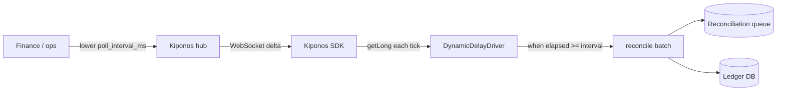

Month-end close, hour three. The reconciliation queue depth graph looks like a staircase — 48,000 rows waiting, climbing every minute. Your ledger poller runs on `@Scheduled(fixedDelay = 60_000)`: one pass per minute, fine for normal Tuesdays, catastrophic when finance needs books closed by midnight.

The platform lead gets pinged in `#incident-ledger`:

> "Can we run reconciliation every five seconds until the queue drains?"

The answer comes back predictable:

> "Change the cron? That's a **release**. We don't hot-patch schedulers."

But `fixedDelay` is not system design. It is **how hungry the poller is right now** — sleepy at 60 seconds during calm weeks, aggressive at 5 seconds when the queue is on fire.

Someone finds the constant baked into an annotation. There is no dashboard knob. There is a deploy pipeline between finance's deadline and your JVM.

## The problem: annotation-frozen intervals

Spring makes scheduling deceptively permanent:

```java
@Component
public class ReconciliationPoller {

    @Scheduled(fixedDelay = 60_000)
    public void reconcile() {
        reconciliationService.processNextBatch(200);
    }
}
```

`fixedDelay = 60_000` compiles into the bytecode story teams tell themselves: "the poller runs once a minute." Changing it requires:

1. **Code change + deploy** — unacceptable during month-end
2. **`fixedDelayString = "${...}"` in YAML** — still needs restart or refresh to pick up new property
3. **External cron / K8s CronJob** — operational complexity; not in-process batch control

The poller's hot loop reads queue depth and writes ledger rows. The **interval between runs** is operational capacity — like thread pool size or batch chunk size. It should move when backlog moves.

```java
// What finance needs during the incident — but cannot get without a deploy
@Scheduled(fixedDelay = 5_000)  // was 60_000
```

## What teams believe

| What teams say | What production does |
|----------------|---------------------|
| "Polling interval is part of the service contract" | Backlog depth changes hourly during close |
| "Faster polling will overload downstream" | Slower polling guarantees missed SLA |
| "We'll add a config property next sprint" | Finance needs the queue drained tonight |
| "`@Scheduled` values belong in code review" | Ops needs a dial, not a PR |

## The Aha

Read `poll_interval_ms` from [Kiponos.io](https://kiponos.io) each scheduling tick. A lightweight driver runs every second; it compares elapsed time against the live interval from the hub. Ops sets `poll_interval_ms: 5000` in the dashboard — the poller accelerates **while the same JVM keeps running**. No redeploy. No `@RefreshScope`. No annotation recompile.

## What is Kiponos.io (for scheduler intervals)

[Kiponos.io](https://kiponos.io) holds operational config in a hub; your Spring Boot service holds a live copy in memory. Profile path `['reconciliation']['prod']['scheduler']` maps to folders like `scheduler/reconciliation/poll_interval_ms`.

The SDK connects once at startup, loads the full tree, then receives **WebSocket deltas** when ops edits a key. `kiponos.path("scheduler", "reconciliation").getLong("poll_interval_ms")` is a **local read** on the scheduler thread — no HTTP round trip, no database poll before each batch.

Optional `afterValueChanged` can log interval shifts for audit or flip an `enabled` flag to pause the poller during maintenance. Git declares **that you have a reconciliation poller**. The hub declares **how often it runs this week**.

## Architecture



## Config tree

```yaml
scheduler/
  reconciliation/
    poll_interval_ms: 60000
    enabled: true
    batch_size: 200
    max_batches_per_run: 5
  settlement/
    poll_interval_ms: 300000
    enabled: true
    batch_size: 500
  maintenance/
    pause_all_schedulers: false
    drain_mode_batch_multiplier: 2
```

## Integration (Spring Boot dynamic scheduler)

```java
@Configuration
@EnableScheduling
public class KiponosConfig {

    @Bean
    public Kiponos kiponos(
            @Value("${kiponos.team-id}") String teamId,
            @Value("${kiponos.access-key}") String accessKey,
            @Value("${kiponos.profile-path}") String profilePath) {
        return Kiponos.builder()
                .teamId(teamId)
                .accessKey(accessKey)
                .profilePath(profilePath)
                .build();
    }
}
```

```java
@Component
public class LiveReconciliationScheduler {

    private final Kiponos kiponos;
    private final ReconciliationService reconciliationService;
    private volatile long lastRunEpochMs = 0;

    public LiveReconciliationScheduler(Kiponos kiponos,
                                       ReconciliationService reconciliationService) {
        this.kiponos = kiponos;
        this.reconciliationService = reconciliationService;
        kiponos.afterValueChanged(change -> {
            if (change.path().startsWith("scheduler/reconciliation")) {
                log.info("Scheduler policy changed: {} → {}", change.path(), change.newValue());
            }
        });
    }

    @Scheduled(fixedDelay = 1_000)
    public void dynamicDelayTick() {
        var cfg = kiponos.path("scheduler", "reconciliation");
        if (!cfg.getBool("enabled", true)) return;
        if (kiponos.path("scheduler", "maintenance").getBool("pause_all_schedulers", false)) {
            return;
        }

        long intervalMs = cfg.getLong("poll_interval_ms", 60_000);
        long now = System.currentTimeMillis();
        if (now - lastRunEpochMs < intervalMs) return;

        int batchSize = cfg.getInt("batch_size", 200);
        int maxBatches = cfg.getInt("max_batches_per_run", 5);
        for (int i = 0; i < maxBatches; i++) {
            if (!reconciliationService.processNextBatch(batchSize)) break;
        }
        lastRunEpochMs = now;
    }
}
```

Month-end? Ops sets `poll_interval_ms: 5000` and `batch_size: 400`. The next eligible tick runs within five seconds. After the queue drains, restore `60000` from the dashboard.

## Real scenarios

| Event | Without Kiponos | With Kiponos |
|-------|-----------------|--------------|
| Month-end queue spike | Wait for deploy; miss close deadline | `poll_interval_ms: 5000` live |
| Downstream DB maintenance | Poller hammers sick database | Raise interval + enable `pause_all_schedulers` |
| Post-close calm | Leave aggressive interval until next release | Restore `60000` in seconds |
| Load test week | Branch per interval | Hub profile `loadtest/fast-poll` |

## Performance — why scheduler reads stay cheap

- **1 Hz driver tick** with one `getLong()` — negligible vs batch I/O to ledger DB
- **Single WebSocket** per process — not a config service call per reconciliation row
- **Delta merge is async** — changing interval does not block the poller thread
- **`batch_size` co-located** in the same tree — one profile path, zero extra connections
- **No Spring context recycle** — unlike `@RefreshScope` on `@Scheduled` beans

## Compare to alternatives

| Approach | Change interval during backlog | Read cost on scheduler thread |
|----------|-------------------------------|------------------------------|
| `fixedDelay` in code | PR + deploy | N/A (frozen) |
| YAML `${poll.interval}` | Restart or refresh | Zero after restart |
| Quartz external store | DB round-trip for triggers | JDBC per reschedule |
| **Kiponos SDK** | **Dashboard, seconds** | **Memory read** |

## When not to use Kiponos

| Case | Better approach |
|------|-----------------|
| Cron expressions for business-calendar jobs | Quartz / K8s CronJob with GitOps |
| Exactly-once distributed scheduling | Leader election + dedicated scheduler service |
| Replacing Spring `@Scheduled` entirely | Architecture decision in Git |
| Sub-millisecond timing precision | Dedicated timing infrastructure |

## Getting started (15 minutes)

1. [Free TeamPro at kiponos.io](https://kiponos.io) — profile `['reconciliation']['prod']['scheduler']`.
2. Add `io.kiponos:sdk-boot-3` to your Spring Boot ledger service.
3. Set `KIPONOS_ID`, `KIPONOS_ACCESS`, and `-Dkiponos="['reconciliation']['prod']['scheduler']"`.
4. Create the `scheduler/reconciliation` tree with `poll_interval_ms`, `batch_size`, `enabled`.
5. Replace `@Scheduled(fixedDelay = 60_000)` with `LiveReconciliationScheduler` driver pattern.
6. Staging game day: seed a backlog, drop `poll_interval_ms` to `5000`, watch queue drain **without pod restart**.

## Further reading

- [Developer Quickstart](https://dev.to/kiponos/kiponosio-developer-quickstart-java-python-and-your-first-live-config-change-3kjo)
- [Product tour](https://dev.to/kiponos/getting-started-with-kiponosio-p5k)
- [GETTING-STARTED.md](https://github.com/kiponos-io/kiponos-io/blob/master/docs/GETTING-STARTED.md)
- [github.com/kiponos-io/kiponos-io](https://github.com/kiponos-io/kiponos-io)

---

*Kiponos.io — polling intervals are not carved in annotations. They are live operational hunger.*