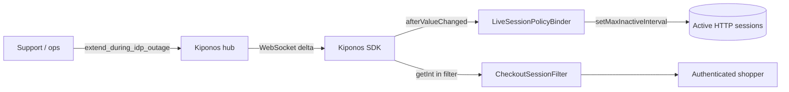

Checkout hour on a retail Sunday. Your identity provider latency doubles — token refresh that took 200ms now takes eight seconds. Users complete payment, get redirected through SSO, and land on a login screen. Carts abandon. Support volume triples.

`server.servlet.session.timeout: 30m` was set once in `application-prod.yml` during a calm security review. Nobody touched it since.

Support lead asks in the war room:

> "Can we extend sessions **for the next two hours** while Okta recovers?"

Engineering: "That's `server.servlet.session.timeout`. We need a **deploy**." During an IdP outage, session duration is **how long you keep shoppers inside the storefront** without a sick login path.

## The problem: bootstrap timeout on every session touch

Spring Boot bakes session lifetime into server config:

```yaml
server:
  servlet:
    session:
      timeout: 30m
      cookie:
        max-age: 1800
```

Your checkout filter touches sessions on every request:

```java
@Component
public class CheckoutSessionFilter extends OncePerRequestFilter {

    @Override
    protected void doFilterInternal(HttpServletRequest req, HttpServletResponse res,
                                    FilterChain chain) throws ServletException, IOException {
        HttpSession session = req.getSession(false);
        if (session != null) {
            session.setAttribute("lastTouch", Instant.now());
            // max inactive interval was fixed at JVM boot from YAML
        }
        chain.doFilter(req, res);
    }
}
```

At startup Spring sets `setMaxInactiveInterval(1800)` for new sessions. Existing sessions keep their interval unless something updates them. Changing YAML means:

1. **Rolling restart** — drops in-memory sessions on every pod
2. **`@RefreshScope`** — risky recycle during active checkout traffic
3. **Manual cookie domain changes** — ops cannot move fast

The hot path needs a **local read** of current policy and a **binder** that pushes new intervals to live sessions when ops flips a flag.

## What teams believe

| What teams say | What production does |
|----------------|---------------------|
| "Session timeout is a security baseline in Git" | IdP outages are time-bounded operational events |
| "Longer sessions increase risk" | Forced re-login during IdP lag increases abandonment |
| "We'll communicate 'try again later'" | Revenue loss is measured in minutes |
| "Only security team may change timeout" | Support needs a knob during incidents |

## The Aha

Store `max_inactive_interval_seconds` and an `extend_during_idp_outage` flag in [Kiponos.io](https://kiponos.io). A `LiveSessionPolicyBinder` listens on `afterValueChanged` and calls `session.setMaxInactiveInterval()` on active sessions. Ops enables outage mode — **existing checkout sessions survive** without pod restart.

## What is Kiponos.io (for session policy)

[Kiponos.io](https://kiponos.io) gives ops a dashboard for operational floats while your portal JVM holds authoritative in-memory values. Profile `['portal']['prod']['session']` maps to `session/policy/*` keys.

Binders read `getInt("max_inactive_interval_seconds")` locally. When the IdP recovers, ops disables `extend_during_idp_outage` — audit trail shows who extended sessions and when.

## Architecture



## Config tree

```yaml
session/
  policy/
    max_inactive_interval_seconds: 1800
    extend_during_idp_outage: false
    outage_interval_seconds: 3600
    cookie_max_age_seconds: 1800
  security/
    require_reauth_for_payment: true
    sliding_refresh_enabled: true
  idp/
    vendor: okta
    degraded_mode_auto_extend: false
```

## Integration (Spring Boot session binder)

```java
@Configuration
public class KiponosConfig {

    @Bean
    public Kiponos kiponos(
            @Value("${kiponos.team-id}") String teamId,
            @Value("${kiponos.access-key}") String accessKey,
            @Value("${kiponos.profile-path}") String profilePath) {
        return Kiponos.builder()
                .teamId(teamId)
                .accessKey(accessKey)
                .profilePath(profilePath)
                .build();
    }
}
```

```java
@Component
public class LiveSessionPolicyBinder {

    private final Kiponos kiponos;
    private final SessionRegistry sessionRegistry;

    public LiveSessionPolicyBinder(Kiponos kiponos, SessionRegistry sessionRegistry) {
        this.kiponos = kiponos;
        this.sessionRegistry = sessionRegistry;
        kiponos.afterValueChanged(this::onSessionPolicyChange);
        applyToAllSessions();
    }

    private void onSessionPolicyChange(ValueChange change) {
        if (!change.path().startsWith("session/policy")) return;
        log.info("Session policy changed: {} → {}", change.path(), change.newValue());
        applyToAllSessions();
    }

    private void applyToAllSessions() {
        int seconds = resolveSeconds();
        sessionRegistry.getAllSessions(null, false).forEach(session ->
                session.setMaxInactiveInterval(seconds));
    }

    int resolveSeconds() {
        var p = kiponos.path("session", "policy");
        if (p.getBool("extend_during_idp_outage", false)) {
            return p.getInt("outage_interval_seconds", 3600);
        }
        return p.getInt("max_inactive_interval_seconds", 1800);
    }
}
```

IdP degraded? Ops sets `extend_during_idp_outage: true`. Binder pushes 3600 seconds to every active session within one WebSocket delta.

## Real scenarios

| Event | Without Kiponos | With Kiponos |
|-------|-----------------|--------------|
| Okta latency spike | Deploy; sessions lost on restart | `extend_during_idp_outage: true` live |
| Post-outage tighten | Another deploy | Flip flag off; restore 1800s |
| Marketing event long checkout | Pre-bake YAML variant | Temporarily raise `outage_interval_seconds` |
| Security drill | Maintenance window + restart | Scheduled hub profile switch |

## Performance — why session policy reads stay cheap

- **Binder runs on change** — not per HTTP request; filter optional read is O(1)
- **One WebSocket** per portal cluster node — not Redis per session touch
- **`SessionRegistry` update is O(active sessions)** — acceptable on rare ops events
- **No Spring Security context recycle** — unlike `@RefreshScope` security beans
- **Delta patch** — toggling one boolean does not reload entire session config

## Compare to alternatives

| Approach | Extend sessions during IdP outage | Hot-path read cost |
|----------|----------------------------------|-------------------|
| `server.servlet.session.timeout` in YAML | Rolling restart | N/A until restart |
| Redis external session store alone | Still need interval source change | RTT if polling |
| `@RefreshScope` session beans | Context refresh | Bean churn |
| **Kiponos SDK** | **Dashboard, seconds** | **Memory read** |

## When not to use Kiponos

| Case | Better approach |
|------|-----------------|
| Session storage mechanism (Redis vs JDBC) | Infrastructure in Git |
| OAuth client secrets and signing keys | Vault |
| Absolute session hardening (max 15m regulatory) | Compliance baseline in code |
| Stateless JWT-only APIs with no server session | Not applicable |

## Getting started (15 minutes)

1. [Free TeamPro at kiponos.io](https://kiponos.io) — profile `['portal']['prod']['session']`.
2. Add `io.kiponos:sdk-boot-3` and spring-session if you use `SessionRegistry`.
3. Set `KIPONOS_ID`, `KIPONOS_ACCESS`, and `-Dkiponos="['portal']['prod']['session']"`.
4. Create `session/policy` tree with outage keys.
5. Wire `LiveSessionPolicyBinder` with `afterValueChanged`.
6. Staging: log in, enable `extend_during_idp_outage`, confirm session interval extends **without pod restart**.

## Further reading

- [Developer Quickstart](https://dev.to/kiponos/kiponosio-developer-quickstart-java-python-and-your-first-live-config-change-3kjo)
- [Product tour](https://dev.to/kiponos/getting-started-with-kiponosio-p5k)
- [GETTING-STARTED.md](https://github.com/kiponos-io/kiponos-io/blob/master/docs/GETTING-STARTED.md)
- [github.com/kiponos-io/kiponos-io](https://github.com/kiponos-io/kiponos-io)

---

*Kiponos.io — session timeouts are operational compassion during IdP storms, not immutable YAML.*