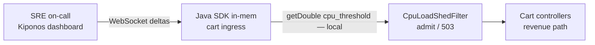

Heat wave night. Data center inlet temps climb. Every cart pod runs **88% CPU** — still serving, still profitable. Your ingress filter sheds load at **85%** because `SHED_CPU_THRESHOLD = 0.85` was copied from a Google SRE blog post and never revisited.

Paying customers get `503` while CPU has headroom left. On-call wants to hold **92%** before rejecting traffic tonight — not debate it in a PR at 01:40.

The SRE lead insists:

> "Eighty-five percent is our **capacity guardrail**. It is coded for a reason."

The reason was a cool October. Tonight is different. Shed threshold is not architecture — it is **the tradeoff between melting hardware and rejecting revenue**.

**The Aha:** read `cpu_threshold` from [Kiponos.io](https://kiponos.io) on each admission decision — ops sets `0.92` live while JVMs keep running.

## The problem: frozen shed constant on the request hot path

```java
public class CpuLoadShedFilter implements Filter {

    private static final double SHED_CPU_THRESHOLD = 0.85;

    @Override
    public void doFilter(ServletRequest req, ServletResponse res, FilterChain chain)
            throws IOException, ServletException {
        double cpu = OperatingSystemMetrics.processCpuLoad();
        if (cpu > SHED_CPU_THRESHOLD) {
            ((HttpServletResponse) res).setStatus(503);
            return;
        }
        chain.doFilter(req, res);
    }
}
```

Wait — even "dynamic" filters often hard-code the float. YAML does not help mid-heat-wave without restart. Problems:

1. **Weather ≠ code** — thresholds valid in autumn fail in July
2. **Revenue vs survival** — ops needs a dial, not a religion
3. **Per-route nuance** — `/health` should never shed; `/search` can wait

| What teams say | What production does |
|----------------|---------------------|
| "85% leaves headroom for GC spikes" | Tonight you have headroom customers never reach |
| "Shed early, recover fast" | You recover revenue never attempted |
| "HPA will scale us" | Scale takes minutes; shed fires now |

## The Aha: CPU shed threshold is tonight's tradeoff dial

Store load-shed policy under `load_shed/ingress` in Kiponos. Each request reads `cpu_threshold` locally. When ops raises it to `0.92`, the next admission check uses the new float — no redeploy, no pod restart.

When temps normalize, ops tightens back to `0.85`. Dashboard audit shows who held the line during the heat wave.

## What Kiponos.io is — for ingress admission

[Kiponos.io](https://kiponos.io) is a real-time config hub. Your cart JVM connects once (`Kiponos.createForCurrentTeam()`), profile `['cart']['prod']['load_shed']`, holds the tree in memory. Dashboard edits send **WebSocket deltas**.

`kiponos.path("load_shed", "ingress").getDouble("cpu_threshold")` on the filter path is a **local read** — no remote evaluation service per HTTP request.

`afterValueChanged` logs threshold moves for post-incident review — critical when revenue traded against hardware risk.

## Architecture



## Example config tree

```yaml
load_shed/
  ingress/
    enabled: true
    cpu_threshold: 0.85
    heat_wave_mode: false
    heat_wave_threshold: 0.92
    shed_non_critical_only: true
  routes/
    always_admit_prefixes: /health,/metrics
    shed_first_prefixes: /search,/recommendations
  metrics/
    gc_pause_threshold_ms: 200
    combine_gc_and_cpu: false
```

## Java integration (Spring Boot ingress filter)

```java
@Configuration
public class KiponosConfig {

    @Bean
    public Kiponos kiponos(
            @Value("${kiponos.team-id}") String teamId,
            @Value("${kiponos.access-key}") String accessKey,
            @Value("${kiponos.profile-path}") String profilePath) {
        return Kiponos.builder()
                .teamId(teamId)
                .accessKey(accessKey)
                .profilePath(profilePath)
                .build();
    }
}
```

```java
@Component
@Order(Ordered.HIGHEST_PRECEDENCE + 10)
public class CpuLoadShedFilter implements Filter {

    private final Kiponos kiponos;

    public CpuLoadShedFilter(Kiponos kiponos) {
        this.kiponos = kiponos;
        kiponos.afterValueChanged(change -> {
            if (change.path().startsWith("load_shed/ingress")) {
                log.warn("Load shed policy changed: {} → {}", change.path(), change.newValue());
            }
        });
    }

    @Override
    public void doFilter(ServletRequest req, ServletResponse res, FilterChain chain)
            throws IOException, ServletException {
        HttpServletRequest httpReq = (HttpServletRequest) req;
        var ingress = kiponos.path("load_shed", "ingress");

        if (!ingress.getBool("enabled", true)) {
            chain.doFilter(req, res);
            return;
        }
        if (isAlwaysAdmit(httpReq.getRequestURI())) {
            chain.doFilter(req, res);
            return;
        }

        double threshold = effectiveCpuThreshold();
        double cpu = OperatingSystemMetrics.processCpuLoad();
        if (cpu > threshold && shouldShedRoute(httpReq.getRequestURI())) {
            ((HttpServletResponse) res).setStatus(503);
            res.getWriter().write("overloaded");
            return;
        }
        chain.doFilter(req, res);
    }

    private double effectiveCpuThreshold() {
        var ingress = kiponos.path("load_shed", "ingress");
        if (ingress.getBool("heat_wave_mode", false)) {
            return ingress.getDouble("heat_wave_threshold", 0.92);
        }
        return ingress.getDouble("cpu_threshold", 0.85);
    }

    private boolean isAlwaysAdmit(String uri) {
        String prefixes = kiponos.path("load_shed", "routes")
                .get("always_admit_prefixes", "/health,/metrics");
        return Arrays.stream(prefixes.split(",")).anyMatch(uri::startsWith);
    }

    private boolean shouldShedRoute(String uri) {
        if (!kiponos.path("load_shed", "ingress").getBool("shed_non_critical_only", true)) {
            return true;
        }
        String prefixes = kiponos.path("load_shed", "routes")
                .get("shed_first_prefixes", "/search,/recommendations");
        return Arrays.stream(prefixes.split(",")).anyMatch(uri::startsWith);
    }
}
```

Every `getDouble()` / `getBool()` is **local** — safe on every request.

## Real scenarios

| Moment | `SHED_CPU_THRESHOLD = 0.85` | Kiponos path |
|--------|------------------------------|--------------|
| Heat wave night | 503 while CPU < 92% | `heat_wave_mode: true`, `heat_wave_threshold: 0.92` |
| GC pause storm | CPU metric lies | `combine_gc_and_cpu: true` live |
| Post-incident | Debate "correct" threshold | Hub audit trail |
| Marketing push hour | Shed search, keep checkout | `shed_non_critical_only: true` |

## Performance — why shedding stays cheap

- CPU check dominates cost — `getDouble()` is O(1) noise on cached tree
- One WebSocket per JVM; delta updates patch single keys, not full policy trees
- No `@RefreshScope` — raising threshold does not recycle filter beans mid-traffic

## Compare to alternatives

| Approach | Raise shed threshold during heat wave | Per-request read cost |
|----------|---------------------------------------|----------------------|
| `static final` threshold | Redeploy | Zero (frozen) |
| Kubernetes CPU limit only | Throttle at cgroup | No per-route nuance |
| `@RefreshScope` filter | Context refresh | Bean churn |
| Poll Redis for threshold | Possible | Network RTT × RPS |
| **Kiponos SDK** | **Dashboard (seconds)** | **Memory read** |

## When not to use Kiponos for load shedding

| Case | Better approach |
|------|-----------------|
| Horizontal scale-out replica count | HPA / cluster autoscaler |
| Circuit breaker to downstream services | Resilience4j policy (separate knob) |
| Global traffic shift to another region | DNS / GSLB |
| "Threshold 1.0" to disable shedding | Explicit `enabled: false` key |

## Getting started (15 minutes)

1. [TeamPro at kiponos.io](https://kiponos.io) — profile `['cart']['prod']['load_shed']`.
2. Add `io.kiponos:sdk-boot-3` and wire `CpuLoadShedFilter`.
3. Create `load_shed/ingress` with `cpu_threshold`, `heat_wave_mode`, and `enabled`.
4. Replace hard-coded `SHED_CPU_THRESHOLD` with `effectiveCpuThreshold()`.
5. Game day: load staging to 87% CPU, enable `heat_wave_mode` live, watch 503 rate drop **without pod restart**.

**Further reading:**

- [Developer Quickstart](https://dev.to/kiponos/kiponosio-developer-quickstart-java-python-and-your-first-live-config-change-3kjo)
- [Product tour](https://dev.to/kiponos/getting-started-with-kiponosio-p5k)
- [GETTING-STARTED.md](https://github.com/kiponos-io/kiponos-io/blob/master/docs/GETTING-STARTED.md)
- [github.com/kiponos-io/kiponos-io](https://github.com/kiponos-io/kiponos-io)

---

*Kiponos.io — shed thresholds are tonight's tradeoff, not blog-post tattoos.*