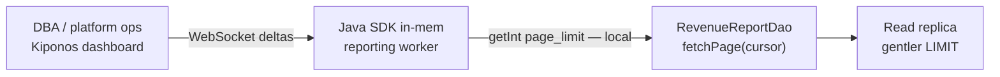

Tuesday 14:22. The analytics replica is **45 minutes behind** primary. Disk I/O on the read node is flat red. The nightly revenue export is still paging through **1000 rows at a time** — a `LIMIT` someone copied from a Stack Overflow answer in 2022 and never revisited.

The DBA pings the channel:

> "Drop page size to **200** right now or we lose the replica."

Engineering replies with what every batch team says under pressure:

> "`LIMIT` is in the repository layer. We ship a fix tomorrow."

Tomorrow the replica is gone. The limit was never schema. It was **how much mercy you show the database today**.

Here is the staff-engineer flip:

**`page_limit` behaves like a safety constant, but it is an operational throttle you need when replicas cough.**

You can change that throttle **while the JVM keeps draining the job queue** — no redeploy, no restart, no Spring context refresh. The next page fetch reads the new cap from memory.

That is [Kiponos.io](https://kiponos.io).

## The problem: frozen LIMIT on a hot read path

Your reporting service probably looks like this:

```java
@Repository
public class RevenueReportDao {

    private static final int PAGE_LIMIT = 1000;

    public List<RevenueRow> fetchPage(long cursor) {
        return em.createQuery(
                "SELECT r FROM RevenueRow r WHERE r.id > :cursor ORDER BY r.id",
                RevenueRow.class)
            .setParameter("cursor", cursor)
            .setMaxResults(PAGE_LIMIT)
            .getResultList();
    }
}
```

Or worse — `LIMIT 1000` embedded in native SQL. Either way:

1. **YAML never helped** — nobody puts JPQL limits in `application.yml`
2. **Constants feel correct** — "we must cap runaway scans"
3. **Incidents need the opposite** — smaller pages *during* stress, larger pages when healthy

The pain is not ignorance. Teams **know** big pages hurt lagging replicas. They do not have a clean way to shrink the page **without a release train**.

| What teams say | What production does |
|----------------|---------------------|
| "LIMIT protects us from OOM" | Replica lag is the real OOM risk tonight |
| "We'll add a feature flag" | Boolean flags do not express `200` vs `1000` well |
| "DBA can kill the query" | Killed jobs restart and hammer again |

## The Aha: page size is operational, not architectural

Wire query policy into Kiponos. Your job scheduler still runs the same JAR — but **live fetch caps** live in the hub under `queries/reporting`. When the DBA asks for mercy, ops toggles `throttle_mode` and sets `throttle_limit: 200`. WebSocket delivers a **delta**; only those keys patch the SDK tree. The next `fetchPage()` call reads the smaller limit locally.

No restart. The export keeps running — just gentler on the replica.

## What Kiponos.io is — for batch read paths

[Kiponos.io](https://kiponos.io) is a real-time config hub. Your Java SDK connects once at startup (`Kiponos.createForCurrentTeam()`), loads the full tree for a profile like `['analytics']['prod']['reporting']`, and holds it **in memory**.

Dashboard edits send **WebSocket deltas** — not a 30 KB YAML redeploy. Your repository reads `kiponos.path("queries", "reporting").getInt("page_limit")` on every page; that is a **local memory read**, microseconds, safe inside tight loops over millions of rows.

`afterValueChanged` is optional here — page limits naturally apply on the next fetch. Use a listener if you want to log when ops flips throttle mode for audit.

## Architecture



## Example config tree

```yaml
queries/
  reporting/
    page_limit: 1000
    throttle_mode: false
    throttle_limit: 200
    max_pages_per_run: 500
    inter_page_sleep_ms: 0
  exports/
    nightly_revenue/
      enabled: true
      priority: normal
  safety/
    hard_ceiling_limit: 5000
    allow_unbounded: false
```

## Java integration (Spring Boot reporting service)

```java
@Configuration
public class KiponosConfig {

    @Bean
    public Kiponos kiponos(
            @Value("${kiponos.team-id}") String teamId,
            @Value("${kiponos.access-key}") String accessKey,
            @Value("${kiponos.profile-path}") String profilePath) {
        return Kiponos.builder()
                .teamId(teamId)
                .accessKey(accessKey)
                .profilePath(profilePath)
                .build();
    }
}
```

```java
@Service
public class RevenueReportDao {

    private final Kiponos kiponos;
    private final EntityManager em;

    public RevenueReportDao(Kiponos kiponos, EntityManager em) {
        this.kiponos = kiponos;
        this.em = em;
        kiponos.afterValueChanged(change -> {
            if (change.path().startsWith("queries/reporting")) {
                log.info("Query policy changed: {} → {}", change.path(), change.newValue());
            }
        });
    }

    public List<RevenueRow> fetchPage(long cursor) {
        int limit = effectivePageLimit();
        return em.createQuery(
                "SELECT r FROM RevenueRow r WHERE r.id > :cursor ORDER BY r.id",
                RevenueRow.class)
            .setParameter("cursor", cursor)
            .setMaxResults(limit)
            .getResultList();
    }

    private int effectivePageLimit() {
        var q = kiponos.path("queries", "reporting");
        int base = q.getInt("page_limit", 1000);
        if (q.getBool("throttle_mode", false)) {
            return q.getInt("throttle_limit", 200);
        }
        int ceiling = kiponos.path("queries", "safety").getInt("hard_ceiling_limit", 5000);
        return Math.min(base, ceiling);
    }
}
```

Every `getInt()` is **local** — no HTTP round-trip inside the pagination loop.

## Real scenarios

| Event | Hard-coded LIMIT | Kiponos path |
|-------|------------------|--------------|
| Replica lag spike | Kill job, wait for deploy | `throttle_mode: true`, `throttle_limit: 200` |
| Black Friday catch-up | Still paging 1000 | Raise `page_limit` to 2500 when replica healthy |
| New analyst export | PR per query class | Same DAO, different profile `exports/nightly_revenue` |
| Post-incident review | Debate "correct" limit in Slack | Hub audit shows who throttled when |

## Performance — why pagination stays fast

- One WebSocket per JVM — not one config fetch per page
- `getInt()` is O(1) on the cached tree — noise next to JDBC fetch time
- Delta updates — changing `throttle_limit` sends one patch, not the full `queries/` tree
- No `@RefreshScope` — shrinking LIMIT does not recycle Spring beans mid-export
- Optional `inter_page_sleep_ms` key lets ops add backoff without redeploying sleep logic

## Compare to alternatives

| Approach | Change LIMIT during replica crisis | Read cost per page |
|----------|----------------------------------|--------------------|
| `static final PAGE_LIMIT` | Redeploy | Zero (frozen) |
| Spring Cloud Config + refresh | Context refresh | Bean churn mid-job |
| Poll Redis for limit | Possible | Network RTT × millions of pages |
| DBA-only kill switch | Stops work entirely | N/A |
| **Kiponos SDK** | **Dashboard delta (seconds)** | **Memory read** |

## When not to use Kiponos for query limits

| Case | Better approach |
|------|-----------------|
| Table DDL, indexes, partition strategy | Migration in Git |
| Query shape and JOIN design | Code review |
| Connection pool sizing | Live Hikari tuning (separate knob) |
| "LIMIT 0" to disable feature entirely | Feature flag product or kill switch |

## Getting started (15 minutes)

1. [TeamPro at kiponos.io](https://kiponos.io) — profile `['analytics']['prod']['reporting']`.
2. Add `io.kiponos:sdk-boot-3` to your Spring Boot reporting service.
3. Wire `KIPONOS_ID`, `KIPONOS_ACCESS`, and `-Dkiponos="['analytics']['prod']['reporting']"`.
4. Create the `queries/reporting` tree with `page_limit`, `throttle_mode`, and `throttle_limit`.
5. Replace `static final PAGE_LIMIT` with `effectivePageLimit()` using `kiponos.path(...)`.
6. Game day: run export against staging replica, flip `throttle_mode` live, watch row fetch size shrink **without pod restart**.

**Further reading:**

- [Developer Quickstart](https://dev.to/kiponos/kiponosio-developer-quickstart-java-python-and-your-first-live-config-change-3kjo)
- [Product tour](https://dev.to/kiponos/getting-started-with-kiponosio-p5k)
- [GETTING-STARTED.md](https://github.com/kiponos-io/kiponos-io/blob/master/docs/GETTING-STARTED.md)
- [github.com/kiponos-io/kiponos-io](https://github.com/kiponos-io/kiponos-io)

---

*Kiponos.io — LIMIT is today's database mercy, not repository folklore.*