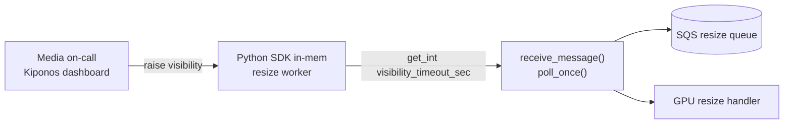

Image processing queue minute 47. CloudWatch shows **duplicate resize jobs** climbing — same `s3_key` processed three times in ten minutes. Your Lambda-alternative worker still uses `VisibilityTimeout=30` because `VISIBILITY_TIMEOUT = 30` sits at line 9 of `sqs_worker.py`, matching the Terraform module from when thumbnails averaged four seconds.

GPU nodes hit thermal throttle. Each resize now takes 55–90 seconds. Messages become visible again at 30s while the first attempt still runs — classic SQS double-delivery storm.

The infra lead says:

> "Visibility timeout is **queue infrastructure**. We change it in Terraform, not in application code."

But Terraform plans queue behind your incident bridge. Visibility timeout is not IaC religion tonight — it is **how long SQS hides a message while your handler finishes**.

**The Aha:** read `visibility_timeout_sec` from [Kiponos.io](https://kiponos.io) on every `receive_message` and `change_message_visibility` — ops sets `120` live while workers keep polling.

## The problem: visibility timeout frozen in worker bootstrap

```python
# sqs_worker.py — unchanged since Terraform v3
VISIBILITY_TIMEOUT = 30
QUEUE_URL = os.environ["RESIZE_QUEUE_URL"]

def poll_once():
    resp = sqs.receive_message(
        QueueUrl=QUEUE_URL,
        MaxNumberOfMessages=10,
        WaitTimeSeconds=20,
        VisibilityTimeout=VISIBILITY_TIMEOUT,
    )
    for msg in resp.get("Messages", []):
        process_resize(msg)
```

Or visibility set only in Terraform — changing it means `terraform apply` while duplicates poison downstream idempotency. Problems:

1. **Duplicate processing** — visibility expires before handler finishes
2. **Poison multiplier** — retries × GPU load makes throttle worse
3. **Per-queue env vars** — messy across staging, prod, and burst fleets

| What teams say | What production does |
|----------------|---------------------|
| "30s matches our p99 handler time" | p99 moves when GPUs throttle |
| "Change timeout in Terraform" | Apply pipelines do not run at 2 AM |
| "Make handlers idempotent and move on" | You still waste GPU on duplicates |
| "SQS params are infrastructure" | Visibility seconds are operational patience |

## What is Kiponos.io — for SQS consumer policy

[Kiponos.io](https://kiponos.io) is a config hub with Java and Python SDKs. `Kiponos.create_for_current_team()` connects over WebSocket, hydrates the tree for profile `['media']['prod']['sqs']`, and serves **local** `get_int()` on the hot path.

Updates are **async deltas** — changing `visibility_timeout_sec` patches one key in memory. Your poll loop never blocks on the network waiting for config.

## Architecture



## Config tree

```yaml
sqs/
  queues/
    resize/
      visibility_timeout_sec: 30
      max_messages: 10
      wait_time_sec: 20
      enabled: true
    thumbnail/
      visibility_timeout_sec: 45
      max_messages: 5
  ops/
    gpu_throttle_mode: false
    throttle_visibility_sec: 120
    extend_on_receive: true
  heartbeat/
    extend_every_sec: 45
    extension_sec: 60
```

## Python integration (resize worker)

```python
import os
import logging
import boto3
from kiponos import Kiponos

log = logging.getLogger(__name__)
sqs = boto3.client("sqs")
kiponos = Kiponos.create_for_current_team()
# Profile: ['media']['prod']['sqs'] via KIPONOS_PROFILE env

QUEUE_URL = os.environ["RESIZE_QUEUE_URL"]

def _resize_cfg():
    return kiponos.path("sqs", "queues", "resize")

def effective_visibility_timeout() -> int:
    ops = kiponos.path("sqs", "ops")
    if ops.get_bool("gpu_throttle_mode", False):
        return ops.get_int("throttle_visibility_sec", 120)
    return _resize_cfg().get_int("visibility_timeout_sec", 30)

def poll_once():
    cfg = _resize_cfg()
    if not cfg.get_bool("enabled", True):
        return

    visibility = effective_visibility_timeout()
    resp = sqs.receive_message(
        QueueUrl=QUEUE_URL,
        MaxNumberOfMessages=cfg.get_int("max_messages", 10),
        WaitTimeSeconds=cfg.get_int("wait_time_sec", 20),
        VisibilityTimeout=visibility,
    )
    for msg in resp.get("Messages", []):
        receipt = msg["ReceiptHandle"]
        if kiponos.path("sqs", "ops").get_bool("extend_on_receive", True):
            sqs.change_message_visibility(
                QueueUrl=QUEUE_URL,
                ReceiptHandle=receipt,
                VisibilityTimeout=visibility,
            )
        process_resize(msg)

kiponos.after_value_changed(
    lambda change: log.info("SQS policy changed: %s → %s", change.path, change.new_value)
    if change.path.startswith("sqs/")
    else None
)
```

GPU throttle? Ops enables `gpu_throttle_mode` and `throttle_visibility_sec: 120`. **Next poll cycle** uses longer visibility — no worker restart, no Terraform apply.

## Real scenarios

| Event | `VISIBILITY_TIMEOUT = 30` scripture | Kiponos path |
|-------|---------------------------------------|--------------|
| GPU thermal throttle | Duplicate resize storm | `gpu_throttle_mode: true` live |
| GPUs cooled down | Still 120s unless someone applies TF | Disable throttle mode from dashboard |
| Burst fleet scale-out | Same constant in every AMI | Hub profile shared across workers |
| Idempotency audit | "Who changed timeout?" — git blame Terraform | Dashboard audit on `sqs/ops` |

## Performance — why polling stays fast

- One WebSocket per worker process — not one HTTP config fetch per message
- `get_int("visibility_timeout_sec")` is O(1) on cached tree — noise next to SQS long-poll
- Delta updates — throttle toggle sends two keys, not full env redeploy
- No process restart — systemd/Celery workers keep consuming queue depth
- `change_message_visibility` uses same live read — consistent extension policy

## Compare to alternatives

| Approach | Raise visibility during GPU stall | Per-poll read cost |
|----------|-----------------------------------|-------------------|
| Module constant `VISIBILITY_TIMEOUT = 30` | Redeploy workers | Zero (frozen) |
| `terraform apply` on queue | Minutes; affects all consumers | N/A |
| `os.environ` rolling restart | Worker recycle | Zero after restart |
| Poll Redis per message | Possible | RTT × receive batch |
| **Kiponos SDK** | **Dashboard (seconds)** | **Memory read** |

## When not to use Kiponos for SQS visibility

| Case | Better approach |
|------|-----------------|
| Queue creation, DLQ ARN, KMS encryption | Terraform / IaC |
| Switching SQS → Kinesis architecture | Migration project |
| IAM policy and cross-account access | Infrastructure GitOps |
| Visibility of 12 hours without handler design review | Fix handler or step functions |

## Getting started (15 minutes)

1. [TeamPro at kiponos.io](https://kiponos.io) — profile `['media']['prod']['sqs']`.
2. `pip install kiponos` — set `KIPONOS_ID`, `KIPONOS_ACCESS`, `KIPONOS_PROFILE`.
3. Create `sqs/queues/resize` with `visibility_timeout_sec` and throttle keys.
4. Replace module-level `VISIBILITY_TIMEOUT` with `effective_visibility_timeout()`.
5. Game day: inject slow handler in staging, enable `gpu_throttle_mode`, confirm duplicates stop **without worker restart**.

## Further reading

- [Developer Quickstart](https://github.com/kiponos-io/kiponos-io/blob/master/docs/devto-getting-started-developer-guide.md)
- [Product tour](https://dev.to/kiponos/getting-started-with-kiponosio-p5k)
- [GETTING-STARTED.md](https://github.com/kiponos-io/kiponos-io/blob/master/docs/GETTING-STARTED.md)
- [github.com/kiponos-io/kiponos-io](https://github.com/kiponos-io/kiponos-io)

---

*Kiponos.io — SQS visibility is how long the queue trusts your handler, not Terraform scripture.*