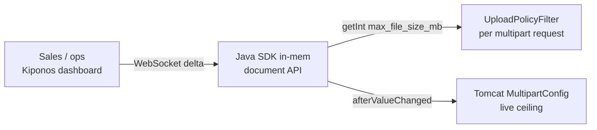

Monday 2:47 PM. Your largest enterprise customer uploads 18MB compliance PDFs to the document API. Spring rejects them at the servlet boundary — `max-file-size: 10MB` has lived in `application.yml` since 2019 when "ten megabytes felt generous."

Sales pings the VP:

> "They'll renew if we fix this **today**."

Engineering responds:

> "Multipart limits are **servlet config**. That's a release."

The customer does not care that Tomcat's `MultipartConfigElement` was sized during a sprint when uploads were profile photos. They care that **business policy** — how large an enterprise tenant may send — is frozen until CI finishes.

## The problem: bootstrap limits vs tenant policy

Spring Boot sets multipart caps at startup:

```yaml
spring:
  servlet:
    multipart:
      max-file-size: 10MB
      max-request-size: 12MB
```

Your validation layer duplicates the same number:

```java
private static final long MAX_UPLOAD_BYTES = 10L * 1024 * 1024;

public void validateUpload(MultipartFile file, String tenant) {
    if (file.getSize() > MAX_UPLOAD_BYTES) {
        throw new PayloadTooLargeException("max 10MB");
    }
}
```

Two problems stack. First, **YAML changes need redeploy** to move Tomcat's hard ceiling. Second, enterprise overrides belong in **runtime policy** — different tenants, different caps — not a single constant compiled into the JAR.

The upload hot path runs on every `POST /documents`. You need local reads of `max_file_size_mb` and optional `enterprise_override_mb` without a database round-trip per multipart parse.

## What teams believe

| What teams say | What production does |
|----------------|---------------------|
| "Multipart size is servlet bootstrap — set in YAML once" | Sales deals change tenant limits weekly |
| "We'll bump to 25MB in the next release" | Contract signature window is this afternoon |
| "Use S3 presigned URLs for big files" | Half your API still accepts direct multipart |
| "Ingress max body size is the real limit" | App rejects before the edge even matters |

The pain is treating **tenant upload policy** like **container wiring**. They are different layers.

## The Aha

**`spring.servlet.multipart.max-file-size` feels like sacred servlet bootstrap, but megabyte caps are operational business policy** — raise enterprise override to 25 live, snap back when the audit window closes. [Kiponos.io](https://kiponos.io) feeds both servlet binder limits and per-request validation from one tree — local `getInt()` on every upload, no redeploy.

## What is Kiponos.io (for upload policy)

[Kiponos.io](https://kiponos.io) holds typed upload policy under profile `['documents']['api']['prod']['live']`. WebSocket deltas patch `max_file_size_mb` or `enterprise_override_mb` into every API pod's in-memory cache.

Your `UploadPolicyFilter` reads `kiponos.path("upload", "policy").getInt("enterprise_override_mb")` — **zero network** on the multipart hot path. Ops changes the dashboard; the **next** upload sees the new cap. Use `afterValueChanged` to push the same values into Tomcat's `MultipartConfigElement` so the servlet container and application logic stay aligned without restart.

## Architecture



1. **Connect once** at API startup.
2. **Split policy** — defaults vs enterprise override vs global servlet cap.
3. **Validate locally** before streaming to object storage.
4. **Bind Tomcat** when servlet-level ceiling must move too.

## Config tree

```yaml
upload/
  policy/
    max_file_size_mb: 10
    max_request_size_mb: 12
    enterprise_override_mb: 25
    enterprise_tenant_ids: acme-corp,globex-llc
    allowed_mime_types: application/pdf,image/png
  servlet/
    max_file_size_mb: 25
    max_request_size_mb: 30
```

## Integration (Spring Boot 3)

```java
@Configuration
public class KiponosConfig {

    @Bean
    public Kiponos kiponos(
            @Value("${kiponos.team-id}") String teamId,
            @Value("${kiponos.access-key}") String accessKey,
            @Value("${kiponos.profile-path}") String profilePath) {
        return Kiponos.builder()
                .teamId(teamId)
                .accessKey(accessKey)
                .profilePath(profilePath)
                .build();
    }
}
```

```java
@Component
@Order(Ordered.HIGHEST_PRECEDENCE + 10)
public class LiveUploadPolicyFilter extends OncePerRequestFilter {

    private final Kiponos kiponos;

    public LiveUploadPolicyFilter(Kiponos kiponos) {
        this.kiponos = kiponos;
    }

    @Override
    protected void doFilterInternal(HttpServletRequest req, HttpServletResponse res,
                                    FilterChain chain) throws ServletException, IOException {
        if (!isMultipart(req)) {
            chain.doFilter(req, res);
            return;
        }
        String tenant = req.getHeader("X-Tenant-Id");
        long maxBytes = resolveMaxBytes(tenant);
        req.setAttribute("upload.maxBytes", maxBytes);
        chain.doFilter(req, res);
    }

    long resolveMaxBytes(String tenant) {
        var policy = kiponos.path("upload", "policy");
        boolean enterprise = policy.get("enterprise_tenant_ids", "")
                .contains(tenant != null ? tenant : "");
        int maxMb = enterprise
                ? policy.getInt("enterprise_override_mb", 25)
                : policy.getInt("max_file_size_mb", 10);
        return maxMb * 1024L * 1024L;
    }

    public void validateSize(long bytes, String tenant) {
        if (bytes > resolveMaxBytes(tenant)) {
            throw new ResponseStatusException(HttpStatus.PAYLOAD_TOO_LARGE,
                    "upload exceeds policy for tenant " + tenant);
        }
    }
}
```

Pair the filter with `afterValueChanged` on `upload/servlet` to push the same megabyte values into `MultipartConfigElement` — servlet ceiling and app policy stay aligned without restart.

`resolveMaxBytes()` runs per upload — every `getInt()` is a local memory read.

## Real scenarios

| Event | Without Kiponos | With Kiponos |
|-------|-----------------|--------------|
| Enterprise deal closes | Wait for next sprint release | Set `enterprise_override_mb: 25` live |
| Abuse spike on large uploads | Frozen 25MB helps attackers | Drop `max_file_size_mb` to 5 temporarily |
| Compliance audit window ends | PR to revert YAML | Clear enterprise tenant list in dashboard |
| Staging load test | Branch per size limit | Hub profile `staging/upload-test` |

## Performance — why upload policy reads are free

- **One WebSocket** per API pod — not a policy DB query per multipart
- **`getInt()` is O(1)** — microseconds vs streaming megabytes to S3
- **Tenant check is string contains on local config** — no remote feature-flag hop
- **`afterValueChanged` updates Tomcat async** — servlet resize off the request thread

Upload I/O dominates latency. Kiponos policy reads are unmeasurable noise.

## Compare to alternatives

| Approach | Same-day enterprise bump | Per-tenant limits | Hot-path read cost |
|----------|--------------------------|-------------------|-------------------|
| Static YAML | No | No — one global cap | Zero (frozen) |
| Database config table | Yes | Yes | JDBC per upload |
| Redis cache | Yes | Yes | RTT + invalidation |
| Feature-flag SaaS | Slow for numeric MB | Usually boolean only | Network |
| **Kiponos SDK** | **Dashboard, seconds** | **Yes via tenant lists** | **Memory read** |

## When not to use Kiponos

| Case | Better home |
|------|-------------|
| S3 bucket names and IAM roles | GitOps / Terraform |
| Virus scanning pipeline on/off | Code-reviewed feature wiring |
| TLS and WAF body limits at edge | CDN / ingress config |
| Replacing multipart with gRPC streaming | Architecture migration |

## Getting started (15 minutes)

1. [TeamPro at kiponos.io](https://kiponos.io) — profile `['documents']['api']['prod']['live']`.
2. Add `io.kiponos:sdk-boot-3` and env credentials.
3. Create `upload/policy` and `upload/servlet` trees from this article.
4. Wire `LiveUploadPolicyFilter` and `LiveMultipartBinder`.
5. Upload 18MB PDF as enterprise tenant — fails at 10MB; raise override in dashboard — succeeds on retry without restart.

## Further reading

- [Developer Quickstart](https://dev.to/kiponos/kiponosio-developer-quickstart-java-python-and-your-first-live-config-change-3kjo)
- [Product tour](https://dev.to/kiponos/getting-started-with-kiponosio-p5k)
- [GETTING-STARTED.md](https://github.com/kiponos-io/kiponos-io/blob/master/docs/GETTING-STARTED.md)
- [github.com/kiponos-io/kiponos-io](https://github.com/kiponos-io/kiponos-io)

---

*Kiponos.io — upload megabytes are business policy, not servlet tattoos.*