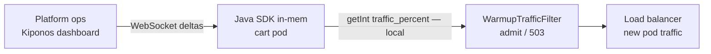

Deploy wave 3 of 12. Twelve new pods join the cart cluster during peak. Each pod runs a `WarmupFilter` that admits only **10%** of requests — `WARMUP_TRAFFIC_PERCENT = 10` set when someone worried about C2 compilation on cold JVMs.

Five minutes later JIT has done its job. Latency on new pods matches veterans. But the filter still throttles **90%** of traffic destined for fresh instances because nobody redeployed after warmup completed.

The platform lead mutters:

> "Warmup percent is **deployment policy**. We baked it into the chart values."

Deployment policy assumed cold code cache. These pods are hot. Admission percent is not policy — it is **how much traffic you dare send to instances that just joined the pool**.

**The Aha:** read `traffic_percent` from [Kiponos.io](https://kiponos.io) in your warmup filter — ops ramps to `80` live while pods keep serving.

## The problem: frozen warmup gate on the request hot path

```java
public class WarmupTrafficFilter implements Filter {

    private static final int WARMUP_TRAFFIC_PERCENT = 10;

    @Override
    public void doFilter(ServletRequest req, ServletResponse res, FilterChain chain)
            throws IOException, ServletException {
        if (isWarming() && ThreadLocalRandom.current().nextInt(100) >= WARMUP_TRAFFIC_PERCENT) {
            ((HttpServletResponse) res).setStatus(503);
            return;
        }
        chain.doFilter(req, res);
    }
}
```

Or `warmup.traffic-percent: 10` in Helm values — change means rolling restart. Problems:

1. **Pods warm fast** — gate stays at 10% too long
2. **Incident scale-out** — you need 50% immediately, not tomorrow's chart bump
3. **Per-environment nuance** — staging wants 100%, prod wants a dial

| What teams say | What production does |
|----------------|---------------------|
| "10% protects us from cold JIT" | Pods are warm; customers still get 503 |
| "Kubernetes readiness handles warmup" | Readiness passes before JIT peaks |
| "We'll delete the filter later" | Later never comes |

## The Aha: warmup traffic percent is today's rollout dial

Store JVM warmup policy under `warmup/jvm` in Kiponos. Your filter reads `traffic_percent` on every request (local `getInt()`). When ops sees new pods healthy in Grafana, they raise `traffic_percent` from 10 → 80 in the dashboard. WebSocket delta patches memory; the next admitted request uses the new ratio.

**No restart.** Disable `warmup_enabled` when the fleet is fully hot — same JAR, same pods.

## What Kiponos.io is — for live admission control

[Kiponos.io](https://kiponos.io) holds operational floats in a typed tree. Cart service connects once, profile `['cart']['prod']['warmup']`, caches config in-process. Dashboard edits are **WebSocket deltas** — not a Helm values PR.

`kiponos.path("warmup", "jvm").getInt("traffic_percent")` on the filter hot path is a **memory read** — microseconds, no call to the control plane per HTTP request.

`afterValueChanged` can log ramp events or notify Slack when ops changes admission policy.

## Architecture



## Example config tree

```yaml
warmup/
  jvm/
    warmup_enabled: true
    traffic_percent: 10
    auto_ramp_enabled: false
    ramp_step_percent: 20
    ramp_interval_sec: 60
  pod/
    min_uptime_sec: 120
    require_jit_ready_probe: true
  events/
    black_friday_fast_ramp: false
    fast_ramp_percent: 60
```

## Java integration (Spring Boot cart service)

```java
@Configuration
public class KiponosConfig {

    @Bean
    public Kiponos kiponos(
            @Value("${kiponos.team-id}") String teamId,
            @Value("${kiponos.access-key}") String accessKey,
            @Value("${kiponos.profile-path}") String profilePath) {
        return Kiponos.builder()
                .teamId(teamId)
                .accessKey(accessKey)
                .profilePath(profilePath)
                .build();
    }
}
```

```java
@Component
@Order(Ordered.HIGHEST_PRECEDENCE)
public class WarmupTrafficFilter implements Filter {

    private final Kiponos kiponos;
    private final Instant podStart = Instant.now();

    public WarmupTrafficFilter(Kiponos kiponos) {
        this.kiponos = kiponos;
        kiponos.afterValueChanged(c -> {
            if (c.path().startsWith("warmup/jvm")) {
                log.info("Warmup policy changed: {} → {}", c.path(), c.newValue());
            }
        });
    }

    @Override
    public void doFilter(ServletRequest req, ServletResponse res, FilterChain chain)
            throws IOException, ServletException {
        if (!shouldAdmit()) {
            ((HttpServletResponse) res).setStatus(503);
            res.getWriter().write("warming");
            return;
        }
        chain.doFilter(req, res);
    }

    private boolean shouldAdmit() {
        var cfg = kiponos.path("warmup", "jvm");
        if (!cfg.getBool("warmup_enabled", true)) {
            return true;
        }
        long uptimeSec = Duration.between(podStart, Instant.now()).getSeconds();
        if (uptimeSec < kiponos.path("warmup", "pod").getInt("min_uptime_sec", 120)) {
            int pct = effectiveTrafficPercent();
            return ThreadLocalRandom.current().nextInt(100) < pct;
        }
        return true;
    }

    private int effectiveTrafficPercent() {
        var cfg = kiponos.path("warmup", "jvm");
        var events = kiponos.path("warmup", "events");
        if (events.getBool("black_friday_fast_ramp", false)) {
            return events.getInt("fast_ramp_percent", 60);
        }
        return cfg.getInt("traffic_percent", 10);
    }
}
```

Every `getInt()` / `getBool()` is **local** — safe on every request through the filter chain.

## Real scenarios

| Moment | `WARMUP_TRAFFIC_PERCENT = 10` | Kiponos path |
|--------|------------------------------|--------------|
| Scale-out during peak | New pods starved 90% | `traffic_percent: 60` live |
| JIT warm in 3 min | Still throttling | `warmup_enabled: false` |
| Black Friday deploy | Chart says 10% | `black_friday_fast_ramp: true` |
| Staging full traffic | Separate Helm file | Profile `['cart']['staging']['warmup']` |

Pair with [live Tomcat thread tuning](https://dev.to/kiponos/your-servertomcatthreadsmax200-is-not-architecture-change-it-live-while-traffic-runs-spring-boot-4g8h) — admission and servlet capacity move together during rollouts.

## Performance — why filters stay cheap

- `getInt("traffic_percent")` is O(1) on the cached tree — noise vs cart business logic
- One WebSocket per pod lifetime — not a control-plane poll per request
- Delta updates — ramping 10 → 80 sends one integer patch
- No `@RefreshScope` filter beans — no context recycle during deploy wave
- `afterValueChanged` fires async; filter hot path only reads memory

## Compare to alternatives

| Approach | Ramp warmup during scale-out | Per-request read cost |
|----------|------------------------------|----------------------|
| `static final` percent | Redeploy / Helm roll | Zero (frozen) |
| Init container sleep | Fixed delay, not adaptive | N/A |
| `@RefreshScope` filter | Context refresh | Bean recycle mid-traffic |
| Poll Redis for percent | Possible | Network RTT per request |
| **Kiponos SDK** | **Dashboard (seconds)** | **Memory read** |

## When not to use Kiponos for warmup gates

| Case | Better approach |
|------|-----------------|
| Pod replica count | Kubernetes HPA |
| Readiness probe thresholds | Manifest in Git |
| Replacing filter with service mesh traffic split | Architecture migration |
| Disabling warmup entirely by default | Remove filter in code |

## Getting started (15 minutes)

1. [TeamPro at kiponos.io](https://kiponos.io) — profile `['cart']['prod']['warmup']`.
2. Move `traffic_percent` and `warmup_enabled` out of constants into `warmup/jvm`.
3. Wire `WarmupTrafficFilter` with `kiponos.path(...).getInt()` admission.
4. Add `afterValueChanged` logging for ramp audit.
5. Game day: roll new pods in staging, raise `traffic_percent` from dashboard, watch 503 rate drop **without pod restart**.

**Further reading:**

- [Developer Quickstart](https://dev.to/kiponos/kiponosio-developer-quickstart-java-python-and-your-first-live-config-change-3kjo)
- [Product tour](https://dev.to/kiponos/getting-started-with-kiponosio-p5k)
- [GETTING-STARTED.md](https://github.com/kiponos-io/kiponos-io/blob/master/docs/GETTING-STARTED.md)
- [github.com/kiponos-io/kiponos-io](https://github.com/kiponos-io/kiponos-io)

---

*Kiponos.io — warmup gates are today's rollout dial, not chart fossils.*