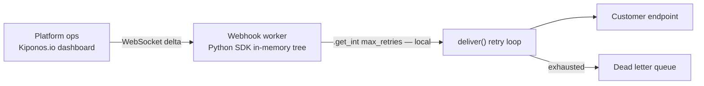

Wednesday 2:05 PM. Your webhook delivery fleet is drowning. A major customer endpoint returns `502 Bad Gateway` for roughly half of their traffic — intermittent, mean, and just healthy enough to keep your workers honest. The queue depth graph looks like a skateboard ramp. The DLQ is filling faster than customer success can apologize.

The worker module still has:

```python
MAX_RETRIES = 5
BACKOFF_SECONDS = [1, 2, 4, 8, 16]
TIMEOUT_SEC = 10
```

— constants since the first commit in 2019. Your senior Python dev says what every mature codebase whispers during outages:

> "Retry backoff is **module-level config**. Ship a fix tomorrow."

But tomorrow means **lost delivery windows**, **manual DLQ replays**, and a customer who thinks your platform is punishing their flaky endpoint with aggressive hammering. Backoff is not style. It is **how hard you lean on a sick URL this hour**.

Here is the Aha:

**`MAX_RETRIES` behaves like folklore at the top of the file, but retry policy is operational resilience.**

You can soften backoff **while workers keep consuming the queue** — no redeploy, no process restart, no rolling worker recycle. The next delivery attempt reads new integers from local memory. That is [Kiponos.io](https://kiponos.io).

## The problem — frozen retry policy on the delivery loop

The delivery loop bakes policy in at import time:

```python
MAX_RETRIES = 5
BACKOFF_SECONDS = [1, 2, 4, 8, 16]
TIMEOUT_SEC = 10

async def deliver(payload: dict, url: str) -> None:
    for attempt in range(MAX_RETRIES):
        try:
            await post_with_timeout(url, payload, TIMEOUT_SEC)
            return
        except TransientWebhookError:
            await asyncio.sleep(BACKOFF_SECONDS[attempt])
    raise DeadLetterError(url)
```

Every worker process shares the same frozen curve. When the customer endpoint flaps, you either hammer it with 1-second retries or redeploy with softer values — while the queue backs up during rollout.

| What teams believe | What production does |
|--------------------|---------------------|
| "Constants are clear and testable" | Clear does not help at 2 PM on a bridge call |
| "Change env var + restart workers" | Queue drains with wrong policy while processes bounce |
| "Celery will retry for us" | Celery still reads frozen policy from code or env at boot |
| "DLQ replay fixes tomorrow" | Tomorrow is a SLA breach today |

## The Aha — live retry tree on every attempt

Move policy into Kiponos under profile `['webhooks']['prod']['delivery']`:

```yaml
webhook/
  delivery/
    max_retries: 5
    backoff_seconds: [1, 2, 4, 8, 16]
    timeout_sec: 10
    enabled: true
    jitter_ms: 0
  high_priority/
    max_retries: 8
    backoff_seconds: [2, 4, 8, 16, 32]
    timeout_sec: 15
    enabled: true
  maintenance/
    enabled: false
```

Customer endpoint flapping? Ops sets `max_retries: 8` and stretches backoff to `[2, 4, 8, 16, 32, 64]`. **Next delivery attempt** picks up new policy — WebSocket delta already merged into SDK memory. Workers never restarted.

## What is Kiponos.io — for webhook workers

Kiponos is a real-time configuration hub. Your asyncio worker connects once at startup via `Kiponos.create_for_current_team()`, loads a typed tree, and holds values **in process memory**. Each retry iteration calls `cfg.get_int("max_retries")` and `cfg.get_list("backoff_seconds")` — **local reads** with zero network RTT on the hot path.

That matters because webhook fleets run thousands of concurrent delivery tasks. You cannot query S3, Consul, or Redis on **every** retry sleep without adding seconds of latency to an already struggling queue. Kiponos separates bootstrap env vars (`KIPONOS_ID`, `KIPONOS_ACCESS`, `KIPONOS_PROFILE`) from operational floats ops needs during customer outages.

`after_value_changed` hooks let you log policy shifts into structured logs — essential when customer success asks "what changed at 2:17 PM?"

## Architecture — backoff without worker restart



1. **Connect once** at worker pool startup.
2. **Snapshot** loads `webhook/delivery/*`.
3. **Delta** when ops softens backoff.
4. **Each attempt reads locally** — asyncio sleep uses fresh integers.
5. **`enabled: false`** pauses aggressive retries without killing processes.

## Integration — Python worker with local reads

```python
import os
import asyncio
import logging
import random
from kiponos import Kiponos

log = logging.getLogger(__name__)

os.environ.setdefault("KIPONOS_ID", "...")
os.environ.setdefault("KIPONOS_ACCESS", "...")
os.environ.setdefault("KIPONOS_PROFILE", "['webhooks']['prod']['delivery']")

kiponos = Kiponos.create_for_current_team()

kiponos.after_value_changed(
    lambda c: log.warning("[kiponos] webhook policy %s → %s", c.path, c.new_value)
)


async def deliver(payload: dict, url: str, profile: str = "delivery") -> None:
    cfg = kiponos.path("webhook", profile)

    if not cfg.get_bool("enabled", True):
        await post_with_timeout(url, payload, cfg.get_int("timeout_sec", 10))
        return

    max_retries = cfg.get_int("max_retries", 5)
    backoff = cfg.get_list("backoff_seconds", [1, 2, 4, 8, 16])
    timeout = cfg.get_int("timeout_sec", 10)
    jitter_ms = cfg.get_int("jitter_ms", 0)

    last_err: Exception | None = None
    for attempt in range(max_retries):
        try:
            await post_with_timeout(url, payload, timeout)
            return
        except TransientWebhookError as e:
            last_err = e
            if attempt >= max_retries - 1:
                break
            delay = backoff[min(attempt, len(backoff) - 1)]
            if jitter_ms > 0:
                delay += random.uniform(0, jitter_ms / 1000)
            await asyncio.sleep(delay)

    raise DeadLetterError(url) from last_err
```

Celery task wrapper — same local reads inside the task body:

```python
@celery_app.task(bind=True, max_retries=0)
def deliver_webhook(self, payload: dict, url: str) -> None:
    asyncio.run(deliver(payload, url))
```

Maintenance window? Ops sets `webhook/maintenance/enabled: false` and `webhook/delivery/max_retries: 1` — workers keep running but stop amplifying load against a known-down endpoint.

## Real scenarios

| Event | Module constants | Live policy via Kiponos |
|-------|----------------|-------------------------|
| Customer 502 storm | Restart workers with new env | Hub tweak in seconds |
| Endpoint recovered | Still over-retrying, queue laggy | Tighten `max_retries` live |
| Planned maintenance | Deploy to pause deliveries | `enabled: false` instantly |
| High-priority tenant SLA | Fork code per customer | `webhook/high_priority/*` profile |
| Load test | Branch per backoff curve | Profile `webhooks/loadtest/delivery` |

Pair with [live HTTP timeout tuning](https://github.com/kiponos-io/kiponos-io/blob/master/docs/devto-aha-http-timeout.md) — retries and timeouts are siblings on outbound integration paths.

## Compare to alternatives

| Approach | Mid-outage change | Read per attempt |
|----------|-------------------|------------------|
| Module-level constants | Redeploy workers | Zero (frozen) |
| Env var + rolling restart | 10–20 min | Zero until bounce completes |
| Poll S3/Redis/Consul | Dashboard possible | Network RTT every attempt |
| Hard-code per-customer classes | "Fast" for one tenant | Code explosion |
| **Kiponos SDK** | **Dashboard** | **Memory** |

## Performance — why webhook fleets care

- One WebSocket per worker process — not one config fetch per retry
- `get_int()` / `get_list()` are O(1) on cached tree — safe inside tight retry loops
- `after_value_changed` logs policy shifts without blocking delivery tasks
- Jitter reads locally — spread thundering herds when ops adds `jitter_ms`
- `enabled: false` short-circuits without process supervisor restarts

## When not to use Kiponos for webhook policy

| Case | Use |
|------|-----|
| Webhook signing secrets and HMAC keys | Vault |
| Payload schema versioning | Git-reviewed contracts |
| DLQ storage infrastructure (SQS, Kafka topic config) | Infra-as-code |
| Idempotency key generation rules | Application code |

## Getting started (15 minutes)

1. [TeamPro at kiponos.io](https://kiponos.io) — profile `['webhooks']['prod']['delivery']`.
2. Replace module-level `MAX_RETRIES` and `BACKOFF_SECONDS` in one worker with `kiponos.path()` reads.
3. Add `after_value_changed` logging for audit during customer bridges.
4. Staging drill: inject 502s, soften backoff live, watch queue depth fall **without worker restart**.
5. Document boundary: Git declares delivery wiring; hub declares **operational retry curve**.

## Further reading

- [Developer Quickstart](https://dev.to/kiponos/kiponosio-developer-quickstart-java-python-and-your-first-live-config-change-3kjo)
- [Product tour](https://dev.to/kiponos/getting-started-with-kiponosio-p5k)
- [GETTING-STARTED.md](https://github.com/kiponos-io/kiponos-io/blob/master/docs/GETTING-STARTED.md)
- [github.com/kiponos-io/kiponos-io](https://github.com/kiponos-io/kiponos-io)

---

*Kiponos.io — webhook backoff is operational, not module folklore.*