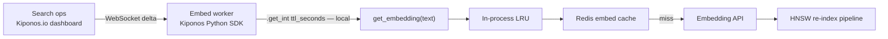

Monday 4:00 AM. Search engineering kicks off a full re-embed of 18 million product descriptions — new embedding model, new vector dimension, new HNSW index building in parallel. Your ingestion workers cache text→vector results in Redis with `EMBEDDING_CACHE_TTL = 86400` because "one day is fine" landed in `cache.py` during a prototype sprint.

By 8:30 AM, the hybrid search API still returns **yesterday's vectors** for SKUs already re-embedded. Merchandising sees ranking inversions — new items sink, stale synonyms match wrong categories. The search lead calls:

> "Drop embedding cache TTL to **60 seconds** for re-index week. Do not restart embed workers — we're halfway through the queue."

But TTL is a module constant. Shortening it means recycling forty Celery workers, flushing local LRU layers inconsistently, and replaying rate-limited calls to the embedding API. Ingest is healthy. **Cache freshness policy** is wrong for the re-index event happening *right now*.

Here is the Aha:

**`EMBEDDING_CACHE_TTL` behaves like a performance tuning constant, but TTL is operational freshness policy during corpus mutation.**

You can change `ttl_seconds`, `negative_ttl_seconds`, and `invalidate_on_model_change` **while embed workers keep draining the queue** — no redeploy, no restart, no Redis poll per text chunk. The next cache miss already respects the new TTL. That is [Kiponos.io](https://kiponos.io).

## The problem — frozen embedding TTL on the embed hot path

```python
# cache.py
EMBEDDING_CACHE_TTL = 86400       # 24 hours
NEGATIVE_CACHE_TTL = 300          # missing text
MAX_CACHE_ENTRIES = 500_000
```

Every embed call consults that policy:

```python
import hashlib
import time

_cache: dict[str, tuple[list[float], float]] = {}

def get_embedding(text: str, client) -> list[float]:
    key = hashlib.sha256(text.encode()).hexdigest()
    hit = _cache.get(key)
    if hit:
        vector, ts = hit
        if time.time() - ts < EMBEDDING_CACHE_TTL:
            return vector

    vector = client.embed(text)
    _cache[key] = (vector, time.time())
    return vector
```

Re-index week needs sixty-second freshness so re-embedded SKUs propagate quickly. Ops cannot patch running workers. Teams **know** stale embeddings corrupt search — they do not know TTL can move **without recycling the embed fleet**.

| What teams believe | What production does |
|------------------|---------------------|
| "Long TTL saves embedding API cost" | Stale vectors = wrong search ranking during re-index |
| "We'll shorten TTL in the next release" | Re-index finishes Wednesday; PR merges Friday |
| "Redis TTL is set once at connection" | Operational events need **hourly** freshness policy |
| "Local LRU + Redis is enough" | Two layers need **synchronized** TTL policy |

## The Aha — live embedding cache policy while workers run

```yaml
embed_cache/
  vectors/
    ttl_seconds: 86400
    max_entries: 500000
    negative_ttl_seconds: 300
  reindex/
    reindex_mode: false
    reindex_ttl_seconds: 60
    invalidate_on_model_change: true
  redis/
    key_prefix: emb:v2
    sync_local_on_policy_change: true
```

Search ops enables `reindex/reindex_mode`. Dashboard sets `reindex_ttl_seconds: 60`. **Next cache miss** uses sixty seconds — local `get_int()`, zero network.

## What is Kiponos.io — for embedding cache freshness

Kiponos syncs cache policy to Python embed workers for profile `['search-embed']['prod']['embed_cache']`. `kiponos.path("embed_cache", "vectors").get_int("ttl_seconds")` is a **local memory read** on every `get_embedding()` — no HTTP per chunk across millions of texts.

`after_value_changed` can flush local LRU and signal Redis namespaced keys when `invalidate_on_model_change` flips — so a model version bump does not leave day-old vectors behind.

Git keeps **embedding client wiring**. The hub keeps **how stale vectors may be this re-index hour**.

## Architecture



1. **Connect once** at worker boot.
2. **Snapshot** for `['search-embed']['prod']['embed_cache']`.
3. **Delta** on TTL edit.
4. **Async merge** on WebSocket thread.
5. **Local reads** on embed hot path.

## Config tree

```yaml
embed_cache/
  vectors/
    ttl_seconds: 86400
    max_entries: 500000
    negative_ttl_seconds: 300
    record_stats: true
  reindex/
    reindex_mode: false
    reindex_ttl_seconds: 60
    invalidate_on_model_change: true
    model_version: text-embedding-3-large-v2
  redis/
    key_prefix: emb:v2
    sync_local_on_policy_change: true
    flush_batch_size: 1000
  throttle/
    max_embed_qps: 200
    burst_qps: 40
```

## Integration — Kiponos-backed embedding cache

```python
import hashlib
import logging
import os
import time
from dataclasses import dataclass

from kiponos import Kiponos

log = logging.getLogger(__name__)

os.environ.setdefault("KIPONOS_PROFILE", "['search-embed']['prod']['embed_cache']")
kiponos = Kiponos.create_for_current_team()

_cache: dict[str, tuple[list[float] | None, float, bool]] = {}


@dataclass(frozen=True)
class EmbedCachePolicy:
    ttl_seconds: int
    negative_ttl_seconds: int
    max_entries: int


def _load_policy() -> EmbedCachePolicy:
    reindex = kiponos.path("embed_cache", "reindex")
    vectors = kiponos.path("embed_cache", "vectors")
    if reindex.get_bool("reindex_mode", False):
        return EmbedCachePolicy(
            ttl_seconds=reindex.get_int("reindex_ttl_seconds", 60),
            negative_ttl_seconds=vectors.get_int("negative_ttl_seconds", 300),
            max_entries=vectors.get_int("max_entries", 500_000),
        )
    return EmbedCachePolicy(
        ttl_seconds=vectors.get_int("ttl_seconds", 86400),
        negative_ttl_seconds=vectors.get_int("negative_ttl_seconds", 300),
        max_entries=vectors.get_int("max_entries", 500_000),
    )


def _evict_if_needed(policy: EmbedCachePolicy) -> None:
    if len(_cache) <= policy.max_entries:
        return
    oldest = sorted(_cache.items(), key=lambda kv: kv[1][1])[: len(_cache) - policy.max_entries]
    for k, _ in oldest:
        _cache.pop(k, None)


def _on_policy_change(change) -> None:
    if not str(change.path).startswith("embed_cache/"):
        return
    reindex = kiponos.path("embed_cache", "reindex")
    if reindex.get_bool("invalidate_on_model_change", False):
        _cache.clear()
        log.warning("Cleared local embed cache after policy change: %s", change.path)
    redis_cfg = kiponos.path("embed_cache", "redis")
    if redis_cfg.get_bool("sync_local_on_policy_change", True):
        log.info("Redis prefix=%s — schedule flush via worker task", redis_cfg.get("key_prefix", "emb:v2"))


kiponos.after_value_changed(_on_policy_change)


def get_embedding(text: str, client, redis=None) -> list[float]:
    policy = _load_policy()
    key = hashlib.sha256(text.encode()).hexdigest()
    prefix = kiponos.path("embed_cache", "redis").get("key_prefix", "emb:v2")
    redis_key = f"{prefix}:{key}"

    hit = _cache.get(key)
    now = time.time()
    if hit:
        vector, ts, is_negative = hit
        ttl = policy.negative_ttl_seconds if is_negative else policy.ttl_seconds
        if now - ts < ttl:
            if is_negative:
                raise ValueError("Text previously failed embedding")
            return vector

    if redis is not None:
        cached = redis.get(redis_key)
        if cached:
            import json
            payload = json.loads(cached)
            _cache[key] = (payload["vector"], now, False)
            return payload["vector"]

    try:
        vector = client.embed(text)
    except Exception:
        _cache[key] = (None, now, True)
        raise

    _cache[key] = (vector, now, False)
    _evict_if_needed(policy)

    if redis is not None:
        import json
        redis.setex(redis_key, policy.ttl_seconds, json.dumps({"vector": vector}))

    if kiponos.path("embed_cache", "vectors").get_bool("record_stats", True):
        log.debug("embed_cache_size=%s ttl=%s", len(_cache), policy.ttl_seconds)

    return vector
```

Re-index starts? Enable `reindex_mode`. **Next miss** uses sixty-second TTL. Model version bumps with `invalidate_on_model_change: true`? Local cache clears without worker restart.

## Real scenarios

| Event | Without Kiponos | With Kiponos |
|-------|-----------------|--------------|
| 18M SKU re-embed | Redeploy or accept stale rankings | `reindex_ttl_seconds: 60` live |
| Embedding API rate limit | Long TTL amplifies wrong vectors | Short TTL + lower `max_embed_qps` |
| Model version cutover | Manual Redis FLUSHALL playbook | `invalidate_on_model_change: true` |
| Post-reindex steady state | Leave aggressive TTL burning API | Disable `reindex_mode` |
| Negative cache on toxic text | Static 300s blocks retries | Drop `negative_ttl_seconds` instantly |

Pair with [RAG chunk and top-k tuning](https://github.com/kiponos-io/kiponos-io/blob/master/docs/devto-ai-rag-chunk-topk.md) when re-index and retrieval policy shift together.

## Compare to alternatives

| Approach | Mid-reindex TTL change | Read cost on hot path |
|----------|------------------------|------------------------|
| `cache.py` constants | PR + worker recycle | Zero (frozen) |
| Redis `CONFIG SET` | Ops playbook | Not per-key embed policy |
| Poll S3 for TTL policy | Dashboard-fast | RTT × chunks |
| Env var + rolling restart | ConfigMap rollout | Restart blast radius |
| **Kiponos SDK** | **Dashboard delta (seconds)** | **Memory read** |

## Performance — why embed teams care

- **`get_int("ttl_seconds")` is in-process** — safe across millions of embed calls
- **One WebSocket per worker** — not config HTTP per text chunk
- **`_evict_if_needed` uses hub `max_entries`** — capacity policy moves live too
- **`after_value_changed` clears LRU once** — not per request
- **Redis TTL written on miss** — local policy drives remote expiry consistently

## When not to use Kiponos for embed cache policy

| Case | Better approach |
|------|-----------------|
| Embedding model weights and architecture | Versioned model artifact + deploy |
| Redis cluster topology | GitOps / infra-as-code |
| Vector index HNSW `ef_construction` | Index rebuild pipeline |
| API keys for embedding provider | Vault |
| Switching from Redis to purely local cache | Architecture migration |

## Getting started (15 minutes)

1. [TeamPro at kiponos.io](https://kiponos.io) — profile `['search-embed']['prod']['embed_cache']`.
2. Move `EMBEDDING_CACHE_TTL`, `NEGATIVE_CACHE_TTL`, and `MAX_CACHE_ENTRIES` into the hub.
3. Wrap cache logic with `_load_policy()` on every `get_embedding()`.
4. Add `after_value_changed` for `invalidate_on_model_change`.
5. Rehearsal: enable `reindex_mode` in staging, verify faster vector freshness **without worker restart**.
6. Document boundary: Git declares embed client; hub declares **operational cache freshness**.

## Further reading

- [Developer Quickstart](https://github.com/kiponos-io/kiponos-io/blob/master/docs/devto-getting-started-developer-guide.md)
- [Product tour](https://dev.to/kiponos/getting-started-with-kiponosio-p5k)
- [GETTING-STARTED.md](https://github.com/kiponos-io/kiponos-io/blob/master/docs/GETTING-STARTED.md)
- [github.com/kiponos-io/kiponos-io](https://github.com/kiponos-io/kiponos-io)

---

*Kiponos.io — embedding TTL is how stale your vectors may be, not cache.py forever.*