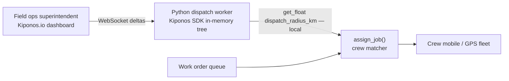

Tuesday 6:45 AM. A lane closure on the I-95 connector adds **90 minutes** to cross-town routes. Three emergency HVAC jobs sit unassigned while your dispatch worker still matches crews within `DISPATCH_RADIUS_KM = 25` — a constant in `dispatch_policy.py` from when the fleet was half its current size.

The field operations superintendent calls dispatch:

> "Stretch radius to **40 km** for **urgent** tickets and prioritize **electrical** — we cannot restart workers while customers have no heat."

Crew GPS feeds are live. Job queue is live. Only the radius policy is frozen until someone redeploys Python workers.

**`DISPATCH_RADIUS_KM` is not fleet design — it is today's traffic and urgency dial.**

[Kiponos.io](https://kiponos.io) feeds Python dispatch orchestrators live radius policy — WebSocket deltas, in-memory reads on every assignment evaluation.

## The problem: module constants on the dispatch hot path

```python
# dispatch_policy.py — unchanged since fleet expansion
DISPATCH_RADIUS_KM = 25
URGENT_RADIUS_KM = 35
MAX_CREW_UTILIZATION = 0.85

def assign_job(job: WorkOrder, crews: list[Crew]) -> Assignment | None:
    eligible = [
        c for c in crews
        if c.distance_km_to(job.site) <= DISPATCH_RADIUS_KM
        and c.utilization() < MAX_CREW_UTILIZATION
    ]
    if job.priority == Priority.URGENT:
        eligible = [c for c in crews if c.distance_km_to(job.site) <= URGENT_RADIUS_KM]
    return pick_best(eligible, job)
```

Problems:

1. **Redeploy dispatch workers** — while SLA timers tick on emergency tickets
2. **Per-region env vars** — bridge closures are hyper-local and temporary
3. **Poll dispatch config API** — adds RTT inside assignment loops over hundreds of crews

| What teams say | What production does |
|----------------|---------------------|
| "Radius is a union / labor rule" | Today's detour is an **ops override**, not a contract change |
| "We'll manually assign the three jobs" | Manual does not scale past morning rush |
| "GPS ETA will sort it out" | You still need a **hard eligibility gate** before optimization |
| "Fleet grew — we'll update constants next quarter" | Traffic surprises do not wait |

## The Aha: dispatch radius is operational field policy

Store dispatch policy under `dispatch/radius` in Kiponos. Each `assign_job()` reads trade-specific `dispatch_radius_km`, `urgent_radius_km`, and traffic override flags from the in-memory tree. When ops stretches urgent radius to `40`, the **next** assignment evaluation uses it — no worker restart.

## What is Kiponos.io — for Python construction dispatch

[Kiponos.io](https://kiponos.io) is a config hub with Java and Python SDKs. `Kiponos.create_for_current_team()` connects over WebSocket, hydrates the tree for a profile like `['construction']['prod']['dispatch']`, and serves **local** `get_float()` / `get_int()` on the hot path.

Updates are **async deltas** — changing `urgent_radius_km` patches one key in memory. Your dispatch loop never blocks on the network waiting for config.

`after_value_changed` logs radius flips or invalidates precomputed distance caches when `bridge_closure_mode` toggles.

## Architecture



## Example config tree

```yaml
dispatch/
  radius/
    default/
      dispatch_radius_km: 25
      urgent_radius_km: 35
      max_crew_utilization: 0.85
    trades/
      electrical/
        dispatch_radius_km: 30
        urgent_radius_km: 45
        priority_boost: 1.2
      hvac/
        dispatch_radius_km: 25
        urgent_radius_km: 40
  traffic/
    bridge_closure_mode: true
    radius_multiplier: 1.6
    affected_corridor: I95_connector
  surge/
    morning_rush_mode: false
    min_crews_available_floor: 8
  sla/
    urgent_response_minutes: 120
    escalate_unassigned_after_minutes: 45
```

## Python integration (dispatch worker)

```python
import logging
from kiponos import Kiponos

log = logging.getLogger(__name__)

kiponos = Kiponos.create_for_current_team()
# Profile: ['construction']['prod']['dispatch'] via KIPONOS_PROFILE env


def _trade_cfg(trade: str):
    path = kiponos.path("dispatch", "radius", "trades", trade)
    return path if path.exists() else kiponos.path("dispatch", "radius", "default")


def effective_radius_km(trade: str, urgent: bool) -> float:
    cfg = _trade_cfg(trade)
    base = cfg.get_float("urgent_radius_km" if urgent else "dispatch_radius_km", 25.0)

    traffic = kiponos.path("dispatch", "traffic")
    if traffic.get_bool("bridge_closure_mode", False):
        mult = traffic.get_float("radius_multiplier", 1.0)
        return base * mult
    return base


def assign_job(job: WorkOrder, crews: list[Crew]) -> Assignment | None:
    urgent = job.priority == Priority.URGENT
    radius = effective_radius_km(job.trade(), urgent)
    max_util = _trade_cfg(job.trade()).get_float("max_crew_utilization", 0.85)

    eligible = [
        c for c in crews
        if c.distance_km_to(job.site) <= radius
        and c.utilization() < max_util
        and c.trade() == job.trade()
    ]
    if not eligible and urgent:
        escalate_after = kiponos.path("dispatch", "sla").get_int("escalate_unassigned_after_minutes", 45)
        if job.minutes_unassigned() >= escalate_after:
            log.warning("Escalating unassigned urgent job %s", job.id())
    return pick_best(eligible, job)


kiponos.after_value_changed(
    lambda change: log.info("Dispatch policy changed: %s → %s", change.path, change.new_value)
    if change.path.startswith("dispatch/")
    else None
)
```

Every `get_float()` is a **local memory read** — safe inside assignment loops that evaluate hundreds of crew–job pairs every minute.

## Real scenarios

| Event | `DISPATCH_RADIUS_KM = 25` folklore | Kiponos path |
|-------|-----------------------------------|--------------|
| Bridge / highway closure | Redeploy dispatch workers | `dispatch/traffic/bridge_closure_mode: true` |
| Polar vortex HVAC surge | Manual phone tree | Raise `dispatch/radius/trades/hvac/urgent_radius_km` |
| Electrical inspector shortage | Spreadsheet overrides | Lower `max_crew_utilization` live |
| Morning rush unassigned pile | Ops war room | Enable `dispatch/surge/morning_rush_mode` |
| Closure cleared | Forgotten constant | Disable `bridge_closure_mode` with audit trail |

## Performance — why dispatch loops stay fast

- One WebSocket per dispatch worker — not one config fetch per crew–job pair
- `get_float("dispatch_radius_km")` is O(1) on the cached tree
- Delta updates — urgent radius change sends one patch
- No process restart — Celery/asyncio workers keep consuming job queue
- `after_value_changed` invalidates distance cache when corridor closure toggles — not per assignment

## Compare to alternatives

| Approach | Stretch radius during closure | Per-assignment read cost | Trade-specific rules |
|----------|------------------------------|--------------------------|----------------------|
| Module constant in `dispatch_policy.py` | Redeploy workers | Zero (frozen) | Code branches |
| Per-region `.env` on workers | SSH / container recycle | Zero after edit | Ops bottleneck |
| Poll dispatch admin API | Possible | Network RTT × assignments | Coupled UI |
| **Kiponos SDK** | **Dashboard (seconds)** | **Memory read** | **Folder per trade** |

## When not to use Kiponos for dispatch

| Case | Better approach |
|------|-----------------|
| Crew union jurisdiction boundaries | Contract / HR system of record |
| Vehicle DOT compliance limits | Fleet management platform |
| Replacing matcher with VRP solver | Architecture migration |
| Customer site geocoding accuracy | GIS data pipeline |

## Getting started (15 minutes)

1. [TeamPro at kiponos.io](https://kiponos.io) — profile `['construction']['prod']['dispatch']`.
2. `pip install kiponos` — set `KIPONOS_ID`, `KIPONOS_ACCESS`, `KIPONOS_PROFILE`.
3. Create `dispatch/radius/default` with `dispatch_radius_km`, `urgent_radius_km`, `max_crew_utilization`.
4. Replace module-level `DISPATCH_RADIUS_KM` with `effective_radius_km(trade, urgent)`.
5. Game day: queue urgent job in staging, enable `bridge_closure_mode` live, re-run assignment — eligible crews expand **without worker restart**.

**Further reading:**

- [Developer Quickstart](https://github.com/kiponos-io/kiponos-io/blob/master/docs/devto-getting-started-developer-guide.md)
- [Product tour](https://dev.to/kiponos/getting-started-with-kiponosio-p5k)
- [GETTING-STARTED.md](https://github.com/kiponos-io/kiponos-io/blob/master/docs/GETTING-STARTED.md)
- [github.com/kiponos-io/kiponos-io](https://github.com/kiponos-io/kiponos-io)

---

*Kiponos.io — real-time config for Python field ops. Reach urgent jobs while crews keep moving.*