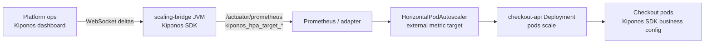

Tuesday 14:40 UTC. Checkout latency P99 crosses **1.8 seconds** while CPU sits at **52%**. Your HPA is configured for `targetCPUUtilizationPercentage: 70` — written in `charts/checkout/values-prod.yaml` six months ago when the service was CPU-bound, not I/O-bound on fraud and tax partners.

HPA will not add a pod until average CPU hits 70%. Customers see slow checkout; Kubernetes sees "healthy utilization." SRE opens a PR to drop the target to **55** and add a custom RPS metric. Argo CD sync is **25 minutes** away. Traffic is peaking now.

The platform lead says:

> "HPA targets are **cluster desired state**. They belong in Git."

But **when** you scale is an operational decision — same class as rate limits and circuit thresholds. The integer `70` is not sacred infrastructure; it is **today's saturation guess**. It should move when latency says you are saturated before CPU does.

**The Aha:** expose scaling targets from [Kiponos.io](https://kiponos.io) through a small Java **metrics bridge** Deployment. HPA watches `kiponos_hpa_target_utilization`; ops lowers `target_cpu_utilization_percent` to `55` in the dashboard; the bridge publishes the new target within seconds — **no Helm merge, no HPA YAML edit, no checkout pod restart**.

## The problem — frozen HPA targets in Git

```yaml
# charts/checkout/templates/hpa.yaml — unchanged since Q3
apiVersion: autoscaling/v2
kind: HorizontalPodAutoscaler
metadata:
  name: checkout-api
spec:
  scaleTargetRef:
    apiVersion: apps/v1
    kind: Deployment
    name: checkout-api
  minReplicas: 6
  maxReplicas: 48
  metrics:
    - type: Resource
      resource:
        name: cpu
        target:
          type: Utilization
          averageUtilization: 70
```

Your checkout pods already embed the Kiponos SDK for fraud thresholds and partner timeouts. HPA, however, still reads a **static** `70` from etcd — decoupled from the live knobs ops tunes during incidents.

Pain on the scaling path:

1. **Latency saturates before CPU** — HPA waits; SLO burns
2. **GitOps latency** — PR → review → sync while traffic spikes
3. **Per-environment forks** — staging wants 80, prod wants 55; two Helm value files drift
4. **Custom metrics targets** — `averageValue` for RPS per pod is another YAML constant

| What teams believe | What production does |
|--------------------|---------------------|
| "70% CPU is industry standard" | Your service went I/O-bound last quarter |
| "We'll patch HPA in the incident PR" | Incident ends before merge |
| "Custom metrics fix it" | Custom metric **target** is still frozen in YAML |
| "Cluster autoscaler handles capacity" | Autoscaler adds nodes; HPA still under-scales pods |

## What Kiponos.io is — for HPA target policy

[Kiponos.io](https://kiponos.io) holds **operational scaling policy** in a live tree. A dedicated Java **scaling-bridge** process (one Deployment per cluster or per namespace) connects via WebSocket, caches `scaling/hpa/*` in memory, and exposes Prometheus gauges the HPA consumes as **external metrics**.

Profile path:

```
['checkout']['prod']['scaling']
```

Checkout pods keep using Kiponos for business config ([no restart updates](https://github.com/kiponos-io/kiponos-io/blob/master/docs/devto-k8s-no-restart.md)). The bridge reads the **same profile** (or a `scaling` sub-profile) so ops has one dashboard for fraud limits **and** HPA targets.

**WebSocket delta → in-memory tree → local `get*()` in the bridge → Prometheus gauge → HPA external metric.** No checkout pod restart when the target moves.

## Architecture — HPA reads live targets, not Helm



The bridge is **not** on the checkout request path. It is a low-QPS control-plane reader — one WebSocket, local reads, gauge export every 15s.

## Config tree (scaling policy, five folders)

```yaml
scaling/
  hpa/
    target_cpu_utilization_percent: 70
    target_memory_utilization_percent: 80
    target_rps_per_pod: 420
    external_metric_name: kiponos_hpa_target_utilization
    publish_interval_seconds: 15
  behavior/
    scale_up_stabilization_seconds: 0
    scale_down_stabilization_seconds: 300
    emergency_scale_up_enabled: false
  guards/
    max_replicas_cap: 48
    min_replicas_floor: 6
    latency_saturate_mode: false
    latency_saturate_target_cpu: 55
  profiles/
    black_friday_mode: false
    black_friday_target_cpu: 50
    black_friday_target_rps: 280
  audit/
    last_changed_by: platform-oncall
    change_reason: ""
```

Fourteen keys across **hpa**, **behavior**, **guards**, **profiles**, and **audit** — enough for ops to flip `latency_saturate_mode` without opening Helm.

## Integration — Java scaling bridge + HPA external metric

Spring Boot 3 bridge Deployment:

```java
@Configuration
public class KiponosScalingConfig {

    @Bean
    public Kiponos kiponos(
            @Value("${kiponos.team-id}") String teamId,
            @Value("${kiponos.access-key}") String accessKey) {
        return Kiponos.builder()
                .teamId(teamId)
                .accessKey(accessKey)
                .profilePath("['checkout']['prod']['scaling']")
                .build();
    }
}
```

```java
@Component
public class HpaTargetExporter {

    private final Kiponos kiponos;
    private final MeterRegistry registry;
    private final AtomicReference<Double> cpuTarget = new AtomicReference<>(70.0);

    public HpaTargetExporter(Kiponos kiponos, MeterRegistry registry) {
        this.kiponos = kiponos;
        this.registry = registry;
        Gauge.builder("kiponos_hpa_target_utilization", cpuTarget, AtomicReference::get)
                .tag("deployment", "checkout-api")
                .description("Live HPA CPU target percent from Kiponos")
                .register(registry);
        refresh();
        kiponos.afterValueChanged(change -> {
            if (change.path().startsWith("scaling/hpa")
                    || change.path().startsWith("scaling/guards")
                    || change.path().startsWith("scaling/profiles")) {
                refresh();
            }
        });
    }

    private void refresh() {
        var guards = kiponos.path("scaling", "guards");
        var hpa = kiponos.path("scaling", "hpa");
        var profiles = kiponos.path("scaling", "profiles");

        double target;
        if (profiles.getBool("black_friday_mode", false)) {
            target = profiles.getInt("black_friday_target_cpu", 50);
        } else if (guards.getBool("latency_saturate_mode", false)) {
            target = guards.getInt("latency_saturate_target_cpu", 55);
        } else {
            target = hpa.getInt("target_cpu_utilization_percent", 70);
        }
        cpuTarget.set(target);
    }
}
```

HPA manifest — target value can stay a placeholder; **adapter maps** `kiponos_hpa_target_utilization` as the desired average, or you run a small loop that patches `spec.metrics[].resource.target.averageUtilization` when the gauge changes. Many teams point KEDA or a custom **HPA writer** at the same gauge; the integration principle is unchanged: **target comes from Kiponos, not Git**.

Checkout hot path (unchanged — local reads):

```java
@Service
public class CheckoutLimiter {
    private final Kiponos kiponos = Kiponos.createForCurrentTeam();

    public boolean admit(String tenantId) {
        int rpm = kiponos.path("limits", tenantId).getInt("rpm");
        return tenantCounter(tenantId).tryAcquire(rpm);
    }
}
```

## Real scenarios

| Event | Frozen `averageUtilization: 70` | Live target via Kiponos |
|-------|--------------------------------|---------------------------|
| Latency saturates at 52% CPU | HPA idle; SLO breach | `latency_saturate_mode: true`, target `55` |
| Black Friday morning | Weekend Helm PR | `black_friday_mode: true`, `black_friday_target_cpu: 50` |
| Post-incident over-scale | Manual HPA edit + drift | Raise target to `75` from dashboard |
| Staging load test | Separate values file | Profile `['checkout']['staging']['scaling']` |
| Noisy CPU metrics | Flapping replicas | Raise target + longer scale-down window live |

## Performance — bridge-specific notes

- Bridge process: **one WebSocket**, not one connection per checkout pod
- `getInt("target_cpu_utilization_percent")` on refresh is **O(1) local** — safe every 15s
- Delta patches touch one key — no full tree reload over the network
- Checkout request path **never** calls the bridge; HPA polls Prometheus, not your API
- New HPA pods from scale-up connect their own Kiponos SDK independently ([per-pod pattern](https://github.com/kiponos-io/kiponos-io/blob/master/docs/devto-k8s-sdk-per-pod.md))

## Compare to alternatives

| Approach | Mid-traffic-spike target change | Coupled to app saturation signal |
|----------|--------------------------------|----------------------------------|
| Helm `values-prod.yaml` | 25+ min GitOps | Manual guess |
| `kubectl edit hpa` | Seconds, no audit | Breaks GitOps drift detection |
| KEDA ScaledObject only | PR for `pollingInterval` | Metric source still static |
| Vertical Pod Autoscaler | Different problem | Does not set HPA target |
| **Kiponos + metrics bridge** | **Dashboard seconds** | **Ops + `latency_saturate_mode`** |

## When not to use Kiponos for HPA targets

| Case | Better approach |
|------|-----------------|
| `minReplicas` / `maxReplicas` structural bounds | GitOps — changes are rare and reviewed |
| Cluster node pool max size | Terraform / cluster autoscaler limits |
| Replacing HPA with Knative / serverless | Architecture migration |
| PCI requirement that all cluster YAML is Git-only | Document break-glass; sync hub → Git post-incident |

## Getting started (15 minutes)

1. [TeamPro at kiponos.io](https://kiponos.io) — profile `['checkout']['prod']['scaling']`.
2. Create `scaling/hpa` with `target_cpu_utilization_percent` and `external_metric_name`.
3. Deploy a small Spring Boot **scaling-bridge** with `KIPONOS_ID`, `KIPONOS_ACCESS`, Micrometer Prometheus registry.
4. Register gauge `kiponos_hpa_target_utilization`; wire HPA external metric or adapter.
5. Game day: inject latency in staging, enable `latency_saturate_mode`, watch HPA add pods **before** CPU hits 70 — **without** editing Helm.
6. Document boundary: Git declares `maxReplicas`; hub declares **target utilization**.

**Further reading:**

- [Developer Quickstart](https://github.com/kiponos-io/kiponos-io/blob/master/docs/devto-getting-started-developer-guide.md)
- [Product tour](https://dev.to/kiponos/getting-started-with-kiponosio-p5k)
- [GETTING-STARTED.md](https://github.com/kiponos-io/kiponos-io/blob/master/docs/GETTING-STARTED.md)
- [Config without pod restart](https://github.com/kiponos-io/kiponos-io/blob/master/docs/devto-k8s-no-restart.md)
- [github.com/kiponos-io/kiponos-io](https://github.com/kiponos-io/kiponos-io)

---

*Kiponos.io — HPA targets reflect today's saturation, not last quarter's Helm chart.*