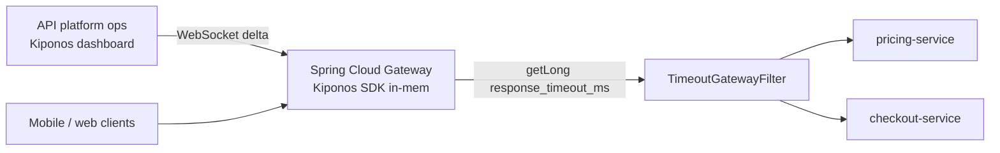

Mobile clients time out at 30 seconds. Your Spring Cloud Gateway still waits **120 seconds** for the legacy pricing service — because `response-timeout: 120s` landed in `gateway-routes.yml` when that team promised a rewrite "next quarter."

Traffic shift day. Pricing p99 jumps to 45 seconds. Gateway thread pools saturate. Unrelated routes return **504** while pricing limps along within its generous budget.

The API platform lead:

> "We need **15s on pricing** and **60s on checkout** — **now**, not after a gateway redeploy during peak."

Upstream timeouts are not API design philosophy. They are **operational circuit boundaries** that must move with dependency health.

## Why gateway timeouts break with static routes

Typical Spring Cloud Gateway route:

```yaml
spring:
  cloud:
    gateway:
      routes:
        - id: pricing
          uri: lb://pricing-service
          metadata:
            response-timeout: 120000
            connect-timeout: 5000
```

Those milliseconds usually come from:

1. **Static route YAML** — change means rolling every gateway pod
2. **Per-environment Helm overlays** — staging and prod drift; incident fixes hit wrong cluster
3. **Hard-coded `HttpClient` builders** — bypass the YAML entirely in custom filters

Gateway timeout decisions run on **every proxied request**. You need local memory reads — same contract as [live rate limits and circuit breakers](https://github.com/kiponos-io/kiponos-io/blob/master/docs/devto-rate-limits-circuit-breakers.md).

## What teams believe

| What teams say | What production does |
|----------------|---------------------|
| "Generous timeouts prevent false 504s" | Generous timeouts **hold threads** and amplify cascades |
| "Clients should retry" | Clients retry into a **already saturated** gateway |
| "Timeout belongs in service mesh" | Mesh policies still need **live tuning** during incidents |
| "One global timeout keeps it simple" | Checkout and analytics have **different SLOs** |

## The Aha

**`response-timeout: 120s` feels like route metadata cast in YAML, but upstream budgets are incident knobs** — tighten pricing when p99 spikes, loosen checkout when payment partner is slow but succeeding. [Kiponos.io](https://kiponos.io) feeds per-route `response_timeout_ms` and `connect_timeout_ms` with local `getLong()` in the gateway filter chain — no redeploy, no Spring context refresh.

## What is Kiponos.io (for API gateways)

[Kiponos.io](https://kiponos.io) holds gateway upstream policy under profile `['api']['prod']['gateway']` → `routes/*`. WebSocket deltas update timeout fields in every gateway JVM on the edge.

On each request, `kiponos.path("routes", "pricing").getLong("response_timeout_ms")` is a **local memory read** — no round trip to a config server while the gateway thread pool is already stressed.

## Architecture: one tree, edge gateways



When NOC lowers `pricing.response_timeout_ms`, **all gateway pods** enforce the new budget on the next request.

## Gateway timeout config tree

```yaml
routes/
  pricing/
    response_timeout_ms: 15000
    connect_timeout_ms: 3000
    retry_on_timeout: false
    fallback_route_enabled: true
  checkout/
    response_timeout_ms: 60000
    connect_timeout_ms: 5000
    retry_on_timeout: true
    max_retries: 1
  analytics/
    response_timeout_ms: 5000
    connect_timeout_ms: 2000
  global/
    default_response_timeout_ms: 30000
    degrade_mode: false
    degrade_multiplier: 0.5
```

Platform ops edits **one folder** per route; the gateway filter reads the matching subtree on every match.

## Java integration (Spring Cloud Gateway)

```java
import io.kiponos.sdk.Kiponos;
import org.springframework.cloud.gateway.filter.GatewayFilterChain;
import org.springframework.cloud.gateway.filter.GlobalFilter;
import org.springframework.stereotype.Component;
import org.springframework.web.server.ServerWebExchange;
import reactor.core.publisher.Mono;

@Component
public class LiveUpstreamTimeoutFilter implements GlobalFilter {
    private final Kiponos kiponos = Kiponos.createForCurrentTeam();

    @Override
    public Mono<Void> filter(ServerWebExchange exchange, GatewayFilterChain chain) {
        String routeId = exchange.getAttribute("org.springframework.cloud.gateway.support.ServerWebExchangeUtils.gatewayRouteId");
        var cfg = kiponos.path("routes", routeId != null ? routeId : "global");
        long responseMs = cfg.getLong("response_timeout_ms",
            kiponos.path("routes", "global").getLong("default_response_timeout_ms", 30000));
        if (kiponos.path("routes", "global").getBool("degrade_mode")) {
            responseMs = (long) (responseMs * kiponos.path("routes", "global").getDouble("degrade_multiplier", 0.5));
        }
        exchange.getAttributes().put("kiponos.response_timeout_ms", responseMs);
        exchange.getAttributes().put("kiponos.connect_timeout_ms", cfg.getLong("connect_timeout_ms", 3000));
        return chain.filter(exchange);
    }
}
```

Downstream `HttpClient` wiring reads attributes set by the filter — **local Kiponos lookups** per request, not per connection pool rebuild.

Audit when ops tightens timeouts mid-incident:

```java
kiponos.afterValueChanged(change ->
    log.warn("Gateway timeout changed: {} → {} ms", change.path(), change.newValue())
);
```

## Real-world scenarios

| Scenario | Without Kiponos | With Kiponos |
|----------|-----------------|--------------|
| Pricing p99 spike | Gateway roll + route YAML edit | Set `pricing.response_timeout_ms: 15000` live |
| Payment partner slow | 504 storm on checkout | Raise `checkout.response_timeout_ms` without touching other routes |
| Fleet-wide degradation | Manual per-route Helm diffs | Enable `global.degrade_mode` — halve all budgets |
| False 504 on analytics | Same global timeout as checkout | Independent `analytics.response_timeout_ms: 5000` |

## Performance

- **One WebSocket** per gateway pod — not a config fetch per HTTP request
- **Reads are O(1)** on the SDK cache — microseconds added to filter chain
- **Delta patches** — one route timeout change does not reload all routes
- **No `@RefreshScope` storm** — thread pools stay warm during timeout edits

## Compare to alternatives

| Approach | Per-route tuning mid-day | Per-request read cost |
|----------|--------------------------|------------------------|
| Static `application.yml` | Rolling restart | Zero after restart |
| Spring Cloud Config refresh | Context refresh hit | Refresh latency spike |
| Service mesh timeout CRD | Cluster roll / sync delay | Sidecar overhead |
| **Kiponos SDK** | **Dashboard** | **Zero (local)** |

## When not to use Kiponos

| Situation | Better approach |
|-----------|-----------------|
| Client-side deadline propagation | gRPC `deadline` / `Context` — end-to-end contract |
| mTLS and cert rotation | Infra pipeline — not runtime timeout |
| WAF block rules | Security-specific policy layer |
| GraphQL query depth limits | Separate guardrail tree |

## Getting started (15 minutes)

1. [Free TeamPro at kiponos.io](https://kiponos.io) — profile `routes/*` under `['api']['prod']['gateway']`
2. Add `io.kiponos:sdk-boot-3` to Spring Cloud Gateway service
3. Mirror route IDs to Kiponos folder names (`pricing`, `checkout`, …)
4. Replace static `metadata.response-timeout` with `LiveUpstreamTimeoutFilter`
5. Staging game day: throttle pricing mock, lower `response_timeout_ms` in dashboard, confirm 504s move to pricing only

## Further reading

- [Developer Quickstart](https://github.com/kiponos-io/kiponos-io/blob/master/docs/devto-getting-started-developer-guide.md)
- [Product tour](https://dev.to/kiponos/getting-started-with-kiponosio-p5k)
- [Rate limits and circuit breakers](https://github.com/kiponos-io/kiponos-io/blob/master/docs/devto-rate-limits-circuit-breakers.md)
- [GETTING-STARTED.md](https://github.com/kiponos-io/kiponos-io/blob/master/docs/GETTING-STARTED.md)
- [github.com/kiponos-io/kiponos-io](https://github.com/kiponos-io/kiponos-io)

## What is next

Gateway timeouts complement **service discovery grace periods** and **saga step timeouts** — edge and orchestration budgets in one operational hub.

---

*Kiponos.io — real-time config for Java. Bound upstream waits without bounding your deploy train.*