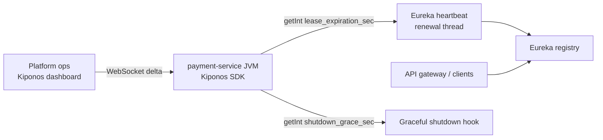

Friday deploy. You roll payment-service v2.3.1 — forty pods, maxUnavailable 25%. Within ninety seconds, checkout logs **503 NO_INSTANCES_AVAILABLE** spikes. Eureka still lists terminating pods because `eureka.instance.lease-expiration-duration-in-seconds` and Spring's **shutdown grace** were copied from a 2019 template and never revisited.

The SRE on bridge:

> "Clients hit **ghost instances** for two full lease periods. Can we widen grace **during** this roll without editing Helm?"

Discovery timing is not framework defaults. It is **how long you tolerate stale registry entries** when the fleet is moving.

## Why discovery grace breaks with static lease config

Typical Spring Cloud Eureka settings:

```yaml
eureka:
  instance:
    lease-renewal-interval-in-seconds: 30
    lease-expiration-duration-in-seconds: 90
spring:
  lifecycle:
    timeout-per-shutdown-phase: 30s
```

Those seconds usually come from:

1. **Bootstrap YAML** — change means rolling every microservice
2. **Copy-paste templates** — payment and inventory share numbers that fit neither
3. **Platform-wide constants** — Black Friday rolls need **longer** grace; steady state needs **shorter** TTL

Lease renewal runs on **heartbeat threads** and shutdown hooks. The effective grace period is a **runtime policy read** — not a value you set once in git.

## What teams believe

| What teams say | What production does |
|----------------|---------------------|
| "Default Eureka timings are fine" | Defaults assume **slow, gentle** deploys — not K8s surge rolls |
| "K8s readiness probe is enough" | Registry can list pods **after** readiness fails |
| "Clients should retry 503" | Retry storms **lengthen** incident blast radius |
| "Shutdown grace is 30s everywhere" | Long-running requests need **route-specific** drain windows |

## The Aha

**`lease-expiration-duration-in-seconds: 90` feels like Spring Cloud boilerplate, but discovery grace is deploy-window policy** — extend expiration during fleet rolls, tighten when the registry is noisy. [Kiponos.io](https://kiponos.io) feeds `lease_expiration_sec`, `renewal_interval_sec`, and `shutdown_grace_sec` with local `getInt()` on heartbeat and shutdown paths — no redeploy, no Eureka server restart.

## What is Kiponos.io (for service discovery)

[Kiponos.io](https://kiponos.io) holds discovery timing under profile `['platform']['prod']['discovery']` → `eureka/payment-service`. WebSocket deltas reach every payment-service JVM; heartbeats pick up new lease values on the next renewal cycle.

`kiponos.path("eureka", "payment-service").getInt("lease_expiration_sec")` is a **local memory read** — no poll to a config server during an active roll.

## Architecture: one tree, registering services



When ops enables `deploy_mode` and raises grace seconds, **all registering pods** adopt the new timing without a new image.

## Discovery grace config tree

```yaml
eureka/
  payment-service/
    renewal_interval_sec: 30
    lease_expiration_sec: 90
    shutdown_grace_sec: 45
    deploy_mode: false
    deploy_lease_expiration_sec: 120
    deploy_shutdown_grace_sec: 90
  inventory-service/
    renewal_interval_sec: 30
    lease_expiration_sec: 60
    shutdown_grace_sec: 30
  global/
    prefer_ip_address: true
    alert_on_empty_registry: true
    min_healthy_instances: 3
```

Each service reads **its** subtree; platform flips `deploy_mode` per service during coordinated rolls.

## Java integration (Eureka client tuning)

```java
import io.kiponos.sdk.Kiponos;
import com.netflix.appinfo.ApplicationInfoManager;
import org.springframework.scheduling.annotation.Scheduled;
import org.springframework.context.event.ContextClosedEvent;
import org.springframework.context.event.EventListener;
import org.springframework.stereotype.Component;

@Component
public class LiveDiscoveryGrace {
    private final Kiponos kiponos = Kiponos.createForCurrentTeam();
    private final ApplicationInfoManager appInfo;

    public LiveDiscoveryGrace(ApplicationInfoManager appInfo) {
        this.appInfo = appInfo;
    }

    @Scheduled(fixedDelay = 10_000)
    public void syncLeaseFromKiponos() {
        var cfg = kiponos.path("eureka", "payment-service");
        boolean deploy = cfg.getBool("deploy_mode");
        int expiration = deploy
            ? cfg.getInt("deploy_lease_expiration_sec", 120)
            : cfg.getInt("lease_expiration_sec", 90);
        int renewal = cfg.getInt("renewal_interval_sec", 30);
        appInfo.getLeaseInfo().setDurationInSecs(expiration);
        appInfo.getLeaseInfo().setRenewalIntervalInSecs(renewal);
    }

    @EventListener(ContextClosedEvent.class)
    public void onShutdown() throws InterruptedException {
        int grace = kiponos.path("eureka", "payment-service").getBool("deploy_mode")
            ? kiponos.path("eureka", "payment-service").getInt("deploy_shutdown_grace_sec", 90)
            : kiponos.path("eureka", "payment-service").getInt("shutdown_grace_sec", 45);
        Thread.sleep(grace * 1000L);
    }
}
```

`getInt()` on the scheduled sync is a **local cache lookup** — safe on the heartbeat path.

Audit deploy-mode toggles:

```java
kiponos.afterValueChanged(change -> {
    if (change.path().endsWith("deploy_mode")) {
        log.info("Discovery deploy_mode: {}", change.newValue());
    }
});
```

## Real-world scenarios

| Scenario | Without Kiponos | With Kiponos |
|----------|-----------------|--------------|
| Surge roll 40 pods | 503 spike until leases expire naturally | Enable `deploy_mode`, extend `deploy_lease_expiration_sec` |
| Stale instance storm | Edit YAML, restart Eureka clients | Lower `lease_expiration_sec` live in steady state |
| Long payment capture | Pod killed mid-request | Raise `shutdown_grace_sec` during deploy window |
| Registry flapping | Manual per-service config diffs | Tune `renewal_interval_sec` per service from dashboard |

## Performance

- **One WebSocket** per service JVM — not a config fetch per heartbeat
- **Reads are O(1)** on the SDK cache — microseconds on 10s sync tick
- **Delta patches** — deploy_mode flip does not reload entire discovery tree
- **No Eureka server coupling** — clients adopt new lease values locally

## Compare to alternatives

| Approach | Mid-roll grace change | Per-heartbeat read cost |
|----------|----------------------|-------------------------|
| Static `bootstrap.yml` | Rolling restart | Zero after restart |
| Eureka server overrides | Server deploy | Server RTT |
| K8s preStop sleep only | Pod-level only | N/A — registry unaware |
| **Kiponos SDK** | **Dashboard** | **Zero (local)** |

## When not to use Kiponos

| Situation | Better approach |
|-----------|-----------------|
| Kubernetes-native service mesh discovery | Istio/Linkerd endpoint slices — different model |
| DNS-based discovery | TTL at DNS layer |
| Multi-cluster federation | Federation control plane |
| mTLS identity rotation | Cert manager — infra concern |

## Getting started (15 minutes)

1. [Free TeamPro at kiponos.io](https://kiponos.io) — profile `eureka/<service-name>/*`
2. Add `io.kiponos:sdk-boot-3` to each Eureka-registering service
3. Create folder per service mirroring `spring.application.name`
4. Wire `LiveDiscoveryGrace` scheduled sync + shutdown listener
5. Staging roll: enable `deploy_mode`, watch 503 rate vs baseline

## Further reading

- [Developer Quickstart](https://github.com/kiponos-io/kiponos-io/blob/master/docs/devto-getting-started-developer-guide.md)
- [Product tour](https://dev.to/kiponos/getting-started-with-kiponosio-p5k)
- [API gateway timeouts live](https://github.com/kiponos-io/kiponos-io/blob/master/docs/devto-microservices-api-gateway-timeout.md)
- [GETTING-STARTED.md](https://github.com/kiponos-io/kiponos-io/blob/master/docs/GETTING-STARTED.md)
- [github.com/kiponos-io/kiponos-io](https://github.com/kiponos-io/kiponos-io)

## What is next

Discovery grace pairs with **gateway upstream timeouts** and **handoff lease TTLs** — registry, edge, and workflow timing in one live tree.

---

*Kiponos.io — real-time config for Java. Drain instances gracefully while the registry catches up.*