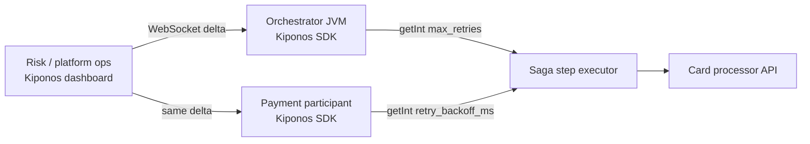

Payment capture returns `503` for the fourth hour. Your checkout saga still allows **two retries** with **500ms backoff** — because `RetryPolicy` was compiled into the orchestrator when the card processor averaged 120ms p99.

The incident commander asks:

> "Can we give payment **five retries** and **2s backoff** without redeploying twelve services?"

SRE answers with a Helm ticket number. Meanwhile compensations fire on transient blips because retry budgets are **frozen in git**, not tuned for today's partner outage.

## Why saga retries break with static policy

Typical saga step wrapper:

```java
@Retryable(maxAttempts = 2, backoff = @Backoff(delay = 500))
public StepResult capturePayment(SagaContext ctx) {
    return paymentClient.capture(ctx.orderId(), ctx.amount());
}
```

Those constants usually come from:

1. **Annotation literals** — change means recompile and redeploy every participant
2. **Per-service YAML** — orchestrator says 2 retries, payment adapter says 4; policies diverge
3. **Shared enum in a library** — version bump across the fleet for a one-line tweak

Saga retries are **high-frequency policy reads** on every failure branch. You need local memory and async updates — same contract as [saga step timeouts](https://github.com/kiponos-io/kiponos-io/blob/master/docs/devto-microservices-saga.md).

## What teams believe

| What teams say | What production does |
|----------------|---------------------|
| "Retry policy is code — belongs in annotations" | Partner outages need **operational** retry budgets |
| "Exponential backoff in Resilience4j is enough" | Static backoff does not match **hour-long** upstream degradation |
| "Only the orchestrator should own retries" | Participants with mismatched `max_retries` cause **duplicate side effects** |
| "We'll fix it in the next library release" | Orders compensate while the release train is **days away** |

## The Aha

**`max_retries = 2` feels like resilience philosophy cast in annotations, but retry budgets are incident knobs** — raise attempts when a partner is flaky but recovering, tighten when duplicate charges are the bigger risk. [Kiponos.io](https://kiponos.io) feeds `max_retries`, `retry_backoff_ms`, and `retry_on_status_codes` with local `getInt()` on every saga step — no redeploy, no annotation recompile.

## What is Kiponos.io (for saga retries)

[Kiponos.io](https://kiponos.io) extends the checkout saga tree under profile `['orders']['v2']['prod']['sagas']` → `checkout/*/retry`. WebSocket deltas update retry fields in orchestrator **and** participant JVMs simultaneously.

On each retry decision, `kiponos.path("sagas", "checkout", "payment").getInt("max_retries")` is a **local memory read** — no call to a workflow engine API while the step executor is already on the failure path.

## Architecture: one tree, orchestrator and participants



When ops raises `payment.max_retries`, **every JVM** in the checkout saga profile sees the new budget on the next attempt.

## Saga retry config tree

```yaml
sagas/
  checkout/
    payment/
      max_retries: 2
      retry_backoff_ms: 500
      retry_backoff_multiplier: 2.0
      retry_on_status_codes: [502, 503, 504]
      jitter_ms: 100
      compensate_after_exhausted: true
    inventory/
      max_retries: 3
      retry_backoff_ms: 300
      idempotent_hold: true
    shipping/
      max_retries: 1
      retry_backoff_ms: 1000
      fallback_on_exhausted: true
    global/
      log_every_retry: true
      alert_after_retry_count: 5
```

Platform ops edits **one folder**; payment, inventory, and shipping each read **their** retry subtree locally.

## Java integration (saga participant)

```java
import io.kiponos.sdk.Kiponos;

@Component
public class PaymentSagaStep {
    private final Kiponos kiponos = Kiponos.createForCurrentTeam();
    private final PaymentClient paymentClient;

    public StepResult execute(SagaContext ctx, int attempt) {
        var cfg = kiponos.path("sagas", "checkout", "payment");
        int maxRetries = cfg.getInt("max_retries");
        if (attempt > maxRetries) {
            return cfg.getBool("compensate_after_exhausted")
                ? compensate(ctx) : StepResult.fail("retries exhausted");
        }
        try {
            return paymentClient.capture(ctx.orderId(), ctx.amount());
        } catch (UpstreamException ex) {
            var retryable = cfg.getList("retry_on_status_codes", Integer.class);
            if (!retryable.contains(ex.statusCode())) {
                return StepResult.fail(ex.getMessage());
            }
            long backoff = cfg.getLong("retry_backoff_ms") * attempt
                + cfg.getInt("jitter_ms");
            return StepResult.retryAfter(backoff);
        }
    }
}
```

`getInt()` and `getList()` are **local cache lookups** — safe on the saga failure hot path.

Audit when ops changes retry policy during an incident:

```java
kiponos.afterValueChanged(change -> {
    if (change.path().contains("max_retries")) {
        log.warn("Saga retry policy changed: {} → {}", change.path(), change.newValue());
    }
});
```

## Real-world scenarios

| Scenario | Without Kiponos | With Kiponos |
|----------|-----------------|--------------|
| Card processor 503 storm | Emergency deploy to all saga services | Bump `payment.max_retries` and `retry_backoff_ms` once |
| Duplicate charge risk | Frozen retries too high | Lower `max_retries` live, enable stricter `compensate_after_exhausted` |
| Inventory API slow | Compensations from exhausted fast retries | Extend `inventory.max_retries` without touching orchestrator code |
| Post-mortem tuning | Ticket + next sprint | Adjust `jitter_ms` during replay tests in staging profile |

## Performance

- **One WebSocket** per JVM — not a policy fetch per retry attempt
- **Reads are O(1)** on the SDK cache — microseconds on the failure branch
- **Delta patches** — changing one step's `max_retries` does not reload the full saga tree
- **No DB poll** on the workflow hot path — retry decisions stay in-process

## Compare to alternatives

| Approach | Cross-service consistency | Mid-incident change | Read latency |
|----------|---------------------------|---------------------|--------------|
| `@Retryable` annotations | Drift across services | Recompile + redeploy | Zero after deploy |
| Central workflow engine UI | Vendor-locked | Minutes to propagate | Engine RTT |
| Redis policy hash | Possible | Poll or pub/sub per step | Milliseconds |
| **Kiponos shared tree** | **Single source of truth** | **Dashboard edit** | **Zero (local)** |

## When not to use Kiponos

| Situation | Better approach |
|-----------|-----------------|
| Idempotency key design | Application-level dedup — retries depend on it |
| Circuit breaker open state | Resilience4j half-open logic — separate concern |
| Regulatory max-attempt caps | Hard legal limits belong in code review + audit |
| Cross-saga global rate limits | Dedicated rate limiter service |

## Getting started (15 minutes)

1. [Free TeamPro at kiponos.io](https://kiponos.io) — extend profile `sagas/checkout/*` from saga timeouts article
2. Add `io.kiponos:sdk-boot-3` to orchestrator and each saga participant
3. Replace `@Retryable` literals with `kiponos.path("sagas", "checkout", ...).getInt(...)`
4. Run chaos test — mock 503s, raise `max_retries` in dashboard, confirm compensations stop misfiring
5. Wire `afterValueChanged` to your saga audit log for retry policy edits

## Further reading

- [Developer Quickstart](https://github.com/kiponos-io/kiponos-io/blob/master/docs/devto-getting-started-developer-guide.md)
- [Product tour](https://dev.to/kiponos/getting-started-with-kiponosio-p5k)
- [Saga compensation timeouts](https://github.com/kiponos-io/kiponos-io/blob/master/docs/devto-microservices-saga.md)
- [Cross-service handoff signals](https://github.com/kiponos-io/kiponos-io/blob/master/docs/devto-microservices-handoff.md)
- [github.com/kiponos-io/kiponos-io](https://github.com/kiponos-io/kiponos-io)

## What is next

Retry policy sits beside **step timeouts** and **handoff lease TTLs** — three operational levers for the same checkout saga in one live hub.

---

*Kiponos.io — real-time config for Java. Retry smarter while orders are still in flight.*