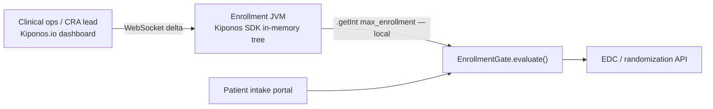

Phase III site 14 hits **50 enrolled** at 9:22 AM — the cap hard-coded in `trial-enrollment.yml` since protocol amendment v3. Meanwhile site 7 has idle capacity and a waiting list of screened patients who qualify.

The clinical operations manager emails engineering with subject **URGENT — enrollment rebalancing**:

> "We need **+15 slots at site 7** and a **pause at site 14** until monitoring catches up. Protocol team approved an hour ago."

Your intake API still accepts patients against frozen caps. Every hour of deploy latency is a patient turned away at a site with chairs empty.

**`max_enrollment_per_site` is not immutable protocol — tonight it is capacity operations.**

[Kiponos.io](https://kiponos.io) lets clinical ops move enrollment policy **while intake services keep running** — WebSocket deltas, in-memory reads on every screening evaluation.

## The problem: static caps on the enrollment hot path

```java
@Service
public class LegacyEnrollmentGate {
    @Value("${trial.phase3.max_enrollment_per_site:50}")
    private int maxPerSite;

    @Value("${trial.phase3.min_eligibility_score:0.72}")
    private double minEligibilityScore;

    public EnrollmentDecision evaluate(IntakeRequest req, Site site) {
        if (site.currentEnrollment() >= maxPerSite) {
            return EnrollmentDecision.reject("site_cap_reached");
        }
        if (req.eligibilityScore() < minEligibilityScore) {
            return EnrollmentDecision.reject("below_eligibility_floor");
        }
        return EnrollmentDecision.accept();
    }
}
```

Enrollment caps usually come from:

1. **YAML at amendment publish** — ops adjustments lag protocol approval by days
2. **CRA spreadsheet → ticket queue** — not wired to the live intake API
3. **Database poll** — adds latency on patient-facing screening flows

| What teams say | What production does |
|----------------|---------------------|
| "Caps are protocol — only amendments change them" | Amendment approved ≠ JVM restarted |
| "Sites call the CRA manually" | Patients hit the web intake first |
| "We'll batch-update caps nightly" | Mid-day rebalancing needs **now** |
| "Eligibility logic is in the rules engine" | **Numeric floors** are operational knobs |

## The Aha: enrollment limits are operational capacity, not just legal text

Store trial ops policy under `trials/phase3` in Kiponos. Each `evaluate()` reads site-specific `max_enrollment`, `intake_paused`, and global eligibility floors from the in-memory tree. When ops raises site 7's cap to `65` and pauses site 14, the **next** intake request sees it — no service restart.

Kiponos controls **operational thresholds and pause flags**, not the clinical eligibility algorithm itself. Pair with your existing 21 CFR Part 11 audit logging; use `afterValueChanged` for change records.

## What is Kiponos.io — for trial orchestration

Kiponos connects your Spring Boot enrollment service to a live config tree. Profile `['pharma']['prod']['trials']` hydrates at startup. Dashboard edits are **WebSocket deltas**. `kiponos.path("trials", "phase3", "sites", siteId).getInt("max_enrollment")` is a **local read** — no remote call on every patient screening click.

## Architecture



## Example config tree

```yaml
trials/
  phase3/
    global/
      min_eligibility_score: 0.72
      halt_new_enrollment: false
      screening_buffer_days: 3
    sites/
      site_07/
        max_enrollment: 50
        intake_paused: false
        priority_waitlist: true
      site_14/
        max_enrollment: 50
        intake_paused: true
        monitoring_backlog: high
    cohorts/
      arm_a/
        max_total: 400
        enrollment_open: true
  audit/
    require_change_reason: true
```

## Bootstrap and integration (Spring Boot 3)

```java
@Configuration
public class KiponosConfig {

    @Bean
    public Kiponos kiponos(
            @Value("${kiponos.team-id}") String teamId,
            @Value("${kiponos.access-key}") String accessKey,
            @Value("${kiponos.profile-path}") String profilePath) {
        return Kiponos.builder()
                .teamId(teamId)
                .accessKey(accessKey)
                .profilePath(profilePath)
                .build();
    }
}
```

```java
@Service
public class KiponosEnrollmentGate {

    private final Kiponos kiponos;

    public KiponosEnrollmentGate(Kiponos kiponos) {
        this.kiponos = kiponos;
        kiponos.afterValueChanged(change -> {
            if (change.path().startsWith("trials/phase3")) {
                auditLog.record("enrollment_policy", change.path(), change.newValue());
            }
        });
    }

    public EnrollmentDecision evaluate(IntakeRequest req, Site site) {
        var global = kiponos.path("trials", "phase3", "global");
        if (global.getBool("halt_new_enrollment", false)) {
            return EnrollmentDecision.reject("global_halt");
        }

        var sitePolicy = kiponos.path("trials", "phase3", "sites", site.id());
        if (sitePolicy.getBool("intake_paused", false)) {
            return EnrollmentDecision.reject("site_paused");
        }

        int maxEnrollment = sitePolicy.getInt("max_enrollment", 50);
        if (site.currentEnrollment() >= maxEnrollment) {
            if (sitePolicy.getBool("priority_waitlist", false)) {
                return EnrollmentDecision.waitlist();
            }
            return EnrollmentDecision.reject("site_cap_reached");
        }

        double minScore = global.getFloat("min_eligibility_score", 0.72);
        if (req.eligibilityScore() < minScore) {
            return EnrollmentDecision.reject("below_eligibility_floor");
        }
        return EnrollmentDecision.accept();
    }
}
```

Every `getInt()` / `getBool()` is a **local memory read** — safe on patient-facing intake paths.

## Real scenarios

| Event | Frozen YAML reflex | Kiponos path |
|-------|-------------------|--------------|
| Site monitoring backlog | Deploy to pause intake | `trials/phase3/sites/site_14/intake_paused: true` |
| Under-enrolled high performer | Amendment ticket → deploy | Raise `site_07/max_enrollment` live post-approval |
| Safety signal review | Global stop | `trials/phase3/global/halt_new_enrollment: true` |
| Cohort balance drift | Analyst spreadsheet | Tune `cohorts/arm_a/max_total` from dashboard |
| Eligibility calibration | Temporary floor adjustment | Lower `min_eligibility_score` with audit trail |

## Performance — why intake stays responsive

- One WebSocket per enrollment JVM — not one config fetch per screening
- `getInt("max_enrollment")` is O(1) on the cached tree
- Delta updates — site cap change sends one patch per site
- Patient-facing threads never block on ops database polls
- `afterValueChanged` feeds Part 11–friendly change logs when CRAs move caps

## Compare to alternatives

| Approach | Rebalance caps same day | Per-intake read cost | Site-specific policy |
|----------|------------------------|----------------------|----------------------|
| `trial-enrollment.yml` | PR + deploy | Zero (frozen) | Code branches |
| EDC manual override | CRA workflow only | N/A for web intake | Disconnected systems |
| Poll clinical ops DB | Possible | DB RTT per screening | Schema coupling |
| **Kiponos SDK** | **Dashboard (seconds)** | **Memory read** | **Folder per site** |

## When not to use Kiponos for trial enrollment

| Case | Better approach |
|------|-----------------|
| Protocol inclusion/exclusion criteria text | Regulated document control |
| Randomization algorithm | Validated stats software |
| Replacing eligibility with ML classifier | Offline model validation |
| IRB-approved protocol version bump | Formal amendment workflow |

## Getting started (15 minutes)

1. [TeamPro at kiponos.io](https://kiponos.io) — profile `['pharma']['prod']['trials']`.
2. Add `io.kiponos:sdk-boot-3` to your enrollment orchestration service.
3. Create `trials/phase3/sites/site_07` with `max_enrollment`, `intake_paused`.
4. Replace `@Value` cap reads with `kiponos.path(...)`.
5. Game day: simulate cap hit in staging, raise `max_enrollment` live, re-submit intake — acceptance changes **without pod restart**.

**Further reading:**

- [Developer Quickstart](https://github.com/kiponos-io/kiponos-io/blob/master/docs/devto-getting-started-developer-guide.md)
- [Product tour](https://dev.to/kiponos/getting-started-with-kiponosio-p5k)
- [GETTING-STARTED.md](https://github.com/kiponos-io/kiponos-io/blob/master/docs/GETTING-STARTED.md)
- [github.com/kiponos-io/kiponos-io](https://github.com/kiponos-io/kiponos-io)

---

*Kiponos.io — real-time config for Java pharma ops. Rebalance enrollment while patients wait.*