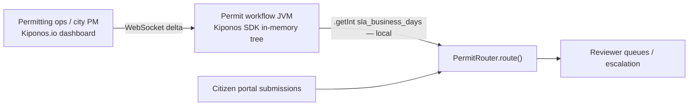

Construction boom month 4. Building permit applications up **47%** year-over-year. Your SLA dashboard bleeds red — median review time crossed **26 business days** while the workflow engine still escalates at `sla_business_days: 21` from `permit-ops.yml` set before the housing initiative launched.

The city operations director tells the permitting PM:

> "Council wants **15-day targets** for residential additions and **automatic escalation** at day 10 — we cannot wait six weeks for a vendor release."

Citizens keep submitting applications. Inspectors keep working. Only the **operational SLA knobs** are frozen until someone restarts Java services.

**`sla_business_days` is not legislation — it is how aggressively you route and escalate this quarter's backlog.**

[Kiponos.io](https://kiponos.io) lets civic ops move permit SLA policy **while the permitting portal keeps accepting applications** — WebSocket deltas, in-memory reads on every queue routing decision.

## The problem: static SLA constants on the routing hot path

```java
@Service
public class LegacyPermitRouter {
    @Value("${permit.sla.business_days:21}")
    private int slaBusinessDays;

    @Value("${permit.queue.planning.max_pending:120}")
    private int planningQueueCap;

    public RoutingDecision route(PermitApplication app) {
        int ageDays = app.businessDaysSinceSubmission();
        if (ageDays >= slaBusinessDays) {
            return RoutingDecision.escalate("sla_breach");
        }
        if (app.department() == Department.PLANNING
                && app.queueDepth() >= planningQueueCap) {
            return RoutingDecision.redirect(Department.FAST_TRACK);
        }
        return RoutingDecision.standardQueue(app.department());
    }
}
```

SLA thresholds usually come from:

1. **YAML at annual budget cycle** — construction surges do not follow fiscal calendars
2. **Policy PDF → engineering ticket** — ops decisions wait on deploy windows
3. **Shared config DB poll** — adds latency on every status check and nightly batch report

| What teams say | What production does |
|----------------|---------------------|
| "SLA targets are council resolutions" | Resolution passed ≠ JVM updated |
| "We'll hire more reviewers" | Routing rules still gate which desk sees work |
| "Citizen portal shows statutory timelines" | **Internal escalation** floats move faster than law |
| "Fast-track is a separate microservice" | Both still read the same frozen YAML |

## The Aha: SLA days and queue caps are operational routing policy

Store permit ops config under `permits/sla` in Kiponos. Each `route()` reads permit-type-specific `sla_business_days`, `escalation_day`, and department queue caps from the in-memory tree. When ops tightens residential SLA to `15` and lowers escalation to `10`, the **next** application evaluation sees it — no service restart.

## What is Kiponos.io — for public-sector permitting

Kiponos connects your Spring Boot permitting workflow service to a live config tree. Profile `['permits']['prod']['sla']` hydrates at startup. Dashboard edits are **WebSocket deltas**. `kiponos.path("permits", "sla", app.permitType()).getInt("sla_business_days")` is a **local read** — no remote call on every routing decision during backlog surges.

Kiponos controls **operational SLA thresholds and queue routing flags**, not statutory legal text or fee schedules codified in ordinance.

## Architecture



## Example config tree

```yaml
permits/
  sla/
    residential_addition/
      sla_business_days: 21
      escalation_day: 18
      fast_track_eligible: true
    commercial_new/
      sla_business_days: 45
      escalation_day: 35
      fast_track_eligible: false
    default/
      sla_business_days: 30
      escalation_day: 25
  queues/
    planning/
      max_pending: 120
      redirect_when_full: true
    building/
      max_pending: 95
      overflow_to_contractor: false
  surge/
    construction_boom_mode: true
    auto_escalate_enabled: true
    public_status_message: "High volume — thank you for your patience"
```

## Bootstrap and integration (Spring Boot 3)

```java
@Configuration
public class KiponosConfig {

    @Bean
    public Kiponos kiponos(
            @Value("${kiponos.team-id}") String teamId,
            @Value("${kiponos.access-key}") String accessKey,
            @Value("${kiponos.profile-path}") String profilePath) {
        return Kiponos.builder()
                .teamId(teamId)
                .accessKey(accessKey)
                .profilePath(profilePath)
                .build();
    }
}
```

```java
@Service
public class KiponosPermitRouter {

    private final Kiponos kiponos;

    public KiponosPermitRouter(Kiponos kiponos) {
        this.kiponos = kiponos;
        kiponos.afterValueChanged(change -> {
            if (change.path().startsWith("permits/sla")) {
                log.info("Permit SLA policy changed: {} → {}", change.path(), change.newValue());
            }
        });
    }

    public RoutingDecision route(PermitApplication app) {
        var sla = kiponos.path("permits", "sla", app.permitType());
        if (!sla.exists()) {
            sla = kiponos.path("permits", "sla", "default");
        }

        int ageDays = app.businessDaysSinceSubmission();
        int escalationDay = sla.getInt("escalation_day", sla.getInt("sla_business_days", 21) - 3);
        int slaDays = sla.getInt("sla_business_days", 21);

        var surge = kiponos.path("permits", "surge");
        if (surge.getBool("auto_escalate_enabled", false) && ageDays >= escalationDay) {
            return RoutingDecision.escalate("surge_escalation");
        }
        if (ageDays >= slaDays) {
            return RoutingDecision.escalate("sla_breach");
        }

        var queue = kiponos.path("permits", "queues", app.department().key());
        int cap = queue.getInt("max_pending", 200);
        if (app.queueDepth() >= cap && queue.getBool("redirect_when_full", false)) {
            if (sla.getBool("fast_track_eligible", false)) {
                return RoutingDecision.fastTrack();
            }
            return RoutingDecision.redirect(Department.OVERFLOW);
        }
        return RoutingDecision.standardQueue(app.department());
    }
}
```

Every `getInt()` is a **local memory read** — safe when nightly SLA reports evaluate thousands of open applications.

## Real scenarios

| Event | Frozen YAML reflex | Kiponos path |
|-------|-------------------|--------------|
| Construction boom | Vendor change request | `permits/sla/residential_addition/sla_business_days: 15` |
| Department queue overload | Manual triage spreadsheet | Lower `permits/queues/planning/max_pending` + enable redirect |
| Council PR crisis | Emergency deploy | `permits/surge/auto_escalate_enabled: true` |
| Seasonal slowdown | Forgotten YAML revert | Ops relaxes SLA from dashboard with audit |
| Fast-track pilot | Per-type code branch | Toggle `fast_track_eligible` per permit type live |

## Performance — why permitting workflows stay responsive

- One WebSocket per workflow JVM — not one config fetch per application status poll
- `getInt("sla_business_days")` is O(1) on the cached tree
- Delta updates — residential SLA change sends one patch
- Citizen-facing threads never block on ops config database
- `afterValueChanged` documents who moved escalation thresholds — public records friendly

## Compare to alternatives

| Approach | Tighten SLA during backlog surge | Per-routing read cost | Permit-type specificity |
|----------|----------------------------------|----------------------|-------------------------|
| `permit-ops.yml` | PR + deploy | Zero (frozen) | Code branches |
| Vendor BPM rule import | Weeks | N/A until import | Consultant cycle |
| Poll shared config DB | Possible | DB RTT × routing volume | Schema migrations |
| **Kiponos SDK** | **Dashboard (seconds)** | **Memory read** | **Folder per permit type** |

## When not to use Kiponos for permit SLA

| Case | Better approach |
|------|-----------------|
| Statutory maximum fees in municipal code | Legal codification system |
| GIS zoning geometry | Spatial data platform |
| Replacing workflow engine | Procurement / migration project |
| Identity verification provider URLs | Secrets manager |

## Getting started (15 minutes)

1. [TeamPro at kiponos.io](https://kiponos.io) — profile `['permits']['prod']['sla']`.
2. Add `io.kiponos:sdk-boot-3` to your permitting workflow service.
3. Create `permits/sla/residential_addition` with `sla_business_days`, `escalation_day`.
4. Replace `@Value` SLA reads with `kiponos.path(...)`.
5. Game day: simulate aged application in staging, lower `escalation_day` live, re-route — escalation triggers **without pod restart**.

**Further reading:**

- [Developer Quickstart](https://github.com/kiponos-io/kiponos-io/blob/master/docs/devto-getting-started-developer-guide.md)
- [Product tour](https://dev.to/kiponos/getting-started-with-kiponosio-p5k)
- [GETTING-STARTED.md](https://github.com/kiponos-io/kiponos-io/blob/master/docs/GETTING-STARTED.md)
- [github.com/kiponos-io/kiponos-io](https://github.com/kiponos-io/kiponos-io)

---

*Kiponos.io — real-time config for Java civic ops. Route permits faster while applications keep arriving.*