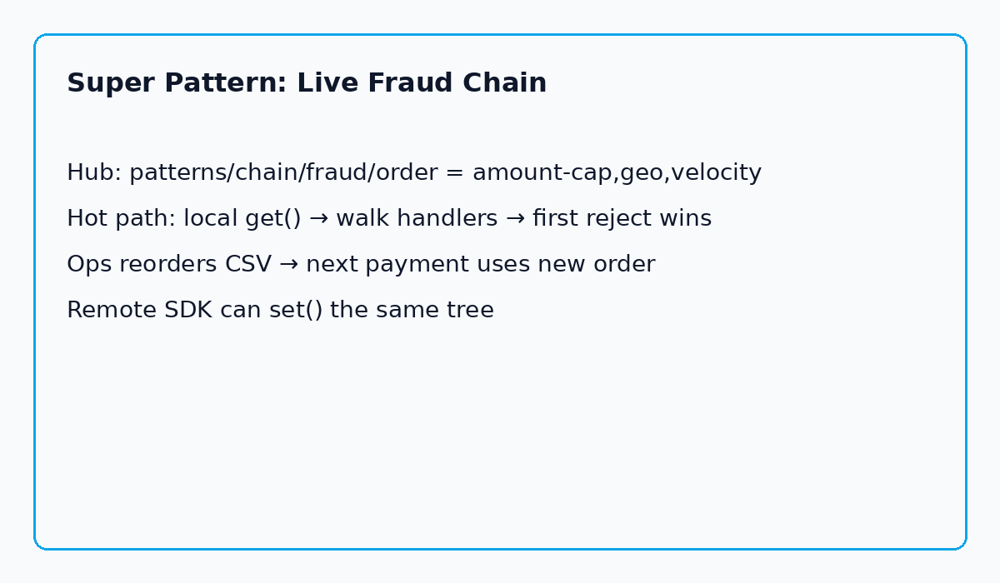

**The Aha:** The handlers were fine. The **order** was wrong for that week of the world. Put `order` + caps in [Kiponos.io](https://kiponos.io); the next payment walks a new chain with zero redeploy.

## The problem: a PR to change the order of thought

Classic Chain of Responsibility looks perfect on a whiteboard:

```text
Payment → AmountCap → Geo → Velocity → allow / reject
```

Each handler may pass or stop. Order matters. Parameters matter.

Production story: amount-cap first, geo second, velocity third — frozen in code. A regional promo makes high-value carts normal. Velocity eats good customers. Bots slip under the amount ceiling. Someone says:

> “We’ll cut a PR to reorder the chain.”

A PR. To change who speaks first while money is still moving.

| Belief | Production |
|--------|------------|
| “We have a chain, so we’re flexible” | Order is compile-time |
| “Handlers are pure” | True — **selection of sequence** is not |
| “Flags cover this” | Flag still ships through CI |
| “We’ll retune after the attack” | After is already too late |

## The Aha: Chain + live order = Super Pattern

Keep handlers as pure functions. Move **order and knobs** into a realtime tree:

```yaml
patterns/
  chain/
    fraud/
      order: amount-cap,geo,velocity
      amount-cap-cents: 100000
      blocked-countries: KP,IR,SY
      velocity-max: 5
```

Hot path:

```java
for (String id : orderFromHub) {
    Decision step = handlers.get(id).check(payment);
    if (!step.allowed()) return step; // stop the chain
}
return Decision.pass("all handlers passed");
```

Ops sets `order` to `geo,velocity,amount-cap`. A remote risk service can `set("velocity-max", "3")`. WebSocket deltas patch the SDK. Payment threads keep calling **local** `get()` — no hub RTT per charge.

> **Classic pattern structure + Kiponos policy tree = Super Pattern**

## Architecture



1. Connect once — `Kiponos.createForCurrentTeam()`.  
2. Ensure `patterns/chain/fraud` defaults.  
3. On each payment: local CSV order + knobs.  
4. Run pure handlers (reviewed, versioned, tested).  
5. Disconnect on shutdown.

## Clone and run (golden example)

```bash
git clone https://github.com/kiponos-io/kiponos-io.git
cd kiponos-io/examples/java/pattern-chain-live-fraud
cp kiponos.local.env.example kiponos.local.env   # tokens from kiponos.io → Connect
./gradlew test run
./gradlew run --args='25000 US 2'
```

Python parity: [`examples/python/pattern-chain-live-fraud`](https://github.com/kiponos-io/kiponos-io/tree/master/examples/python/pattern-chain-live-fraud)

Full source is the product. This post only shows the nerve.

## Scenarios

| Moment | Frozen chain | Super Pattern |
|--------|--------------|---------------|
| Bot farm spikes velocity | PR + deploy | Lower `velocity-max` live |
| Geo blocklist update | Config file roll | Edit `blocked-countries` CSV |
| Promo week high tickets | Wrong order for weeks | Reorder `order` CSV |
| Risk service reacts | Manual ticket | Remote SDK `set()` |

## Performance

- Hot path: **local get** after connect.  
- Handlers stay in-process — no remote execution of business logic.  
- Delta: only changed keys on the wire.

## Alternatives (honest)

| Approach | Reorder mid-incident | Hot-path cost |
|----------|----------------------|---------------|
| Redeploy | Minutes–hours | Low after boot |
| YAML + restart | Restarts | Boot cost |
| Flag SaaS | If wired | Extra hop |
| **Kiponos Super Pattern** | Seconds — dashboard + SDK | Local get |

## When not to use live chain order

| Case | Why |
|------|-----|
| Handler body must change | That’s still a code change |
| Compliance requires code-reviewed policy only | Keep matrix in code; use hub for non-regulated knobs |
| You need a full rules engine | Interpreter Super Pattern or a dedicated engine |

## Moral

A chain of responsibility is only as fast as your ability to change who speaks first.

Ship the judgment path once. Leave the **order of judgment** in the hub.

---

*Series: Kiponos Super Patterns (GoF + live policy).*  
*Runnable: [pattern-chain-live-fraud](https://github.com/kiponos-io/kiponos-io/tree/master/examples/java/pattern-chain-live-fraud)*

## Try it tonight

```bash
cd examples/java/pattern-chain-live-fraud
./gradlew test run
```

1. Run default order — see which handler speaks first.
2. Reorder hub `order` CSV — prove next evaluation changes without rebuild.
3. Lower `velocity-max` live — bot farm response in seconds, not a release.

## Why this is not “just another flag”

Feature flags are often product gates. Super Patterns are **ops posture on a Gang of Four shape**.

You still allowlist keys. You still test defaults. You still refuse secrets in the hub. What changes is the **distance between human judgment and the next request** — from a release train to a hub write.

That is the entire point of electrifying the patterns.
