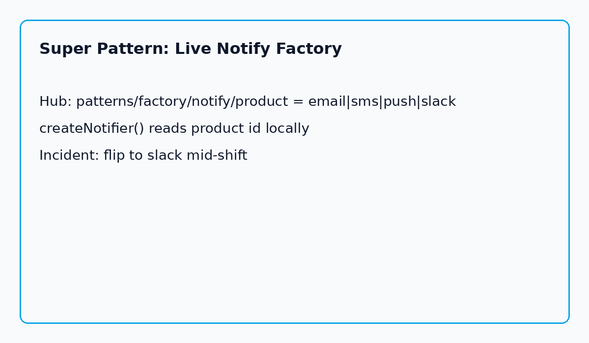

**The Aha:** Factories create objects. Super factories create the *right* object for the next minute of production. Put `product` in [Kiponos.io](https://kiponos.io); `createNotifier()` follows.

## The problem: “defer instantiation” that still waits for a release

Factory Method promises: defer which class to instantiate.

In most codebases, “defer” means “until the next release.” Email is hard-coded. Slack is a weekend branch. SMS is a comment that says `// TODO`.

An incident needs pages in Slack **now**, not after pipeline green.

## The Aha: Factory + live product id = Super Pattern

```yaml
patterns/
  factory/
    notify/
      product: email          # email | sms | push | slack
      from-email: noreply@example.com
      slack-hook: "#ops-alerts"
```

```java
Notifier n = switch (read(policy, "product", "email")) {
    case "sms" -> new SmsNotifier();
    case "slack" -> new SlackNotifier(hook);
    default -> new EmailNotifier(from);
};
```

Ops sets `product=slack`. Next page uses Slack. Remote on-call bot can flip it back when the channel is noisy.

## Architecture



Products stay versioned code. **Selection** is hub state. Hot path is local `get()`.

## Clone and run

```bash
git clone https://github.com/kiponos-io/kiponos-io.git
cd kiponos-io/examples/java/pattern-factory-live-channel
cp kiponos.local.env.example kiponos.local.env
./gradlew test run --args='Warehouse delay on order 9'
```

Python: [`examples/python/pattern-factory-live-channel`](https://github.com/kiponos-io/kiponos-io/tree/master/examples/python/pattern-factory-live-channel)

## Scenarios

| Moment | Frozen factory | Super Pattern |
|--------|----------------|---------------|
| Pager channel outage | Redeploy | `product=sms` |
| Marketing campaign | Wait for ship | `product=push` |
| Cost control | PR | Prefer `email` live |

## Moral

Factories create objects. Super factories create the right object for the next minute of production.

---

*Runnable: [pattern-factory-live-channel](https://github.com/kiponos-io/kiponos-io/tree/master/examples/java/pattern-factory-live-channel)*
