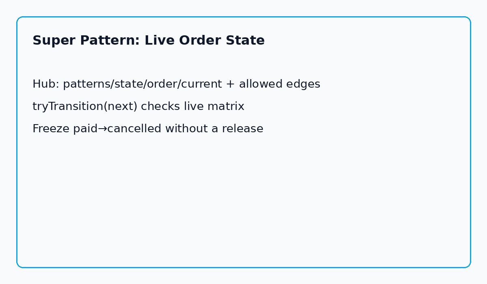

**The Aha:** State describes *where you are*. Policy describes *where you may go next*. Policy should not wait for CI. Put `current` + `allowed` edges in [Kiponos.io](https://kiponos.io).

## The problem: grammar frozen in enums

Every order system grows a private dialect: `draft`, `paid`, `shipped`, `cancelled`.

The dialect is easy. The **grammar of what may follow what** is where nights go to die.

Someone wants to freeze `paid → cancelled` during a refund exploit. Someone else needs `draft → paid` to stay hot. The state machine is correct in code — and unreachable until the next jar lands.

| Belief | Production |
|--------|------------|
| “We modeled State correctly” | Transitions are `switch` / enum methods |
| “Ops can freeze refunds” | Ops can open a ticket |
| “Feature flags help” | Flag still ships or is a second brain |

## The Aha: State + live matrix = Super Pattern

```yaml
patterns/
  state/
    order/
      current: draft
      allowed: draft>paid,paid>shipped,paid>cancelled,draft>cancelled
```

```java
String edge = from + ">" + to;
if (!edges.contains(edge)) {
    return TransitionResult.denied(from, to, edge);
}
policy.set("current", to);
```

Ops deletes `paid>cancelled` from the CSV. Next refund attempt is denied. No redeploy. Remote compliance tooling can restore the edge when the incident closes.

## Architecture



1. Ensure defaults under `patterns/state/order`.  
2. `tryTransition(next)` reads live `allowed`.  
3. On success, write `current` (or keep current in app DB and only enforce with hub matrix — pick one source of truth per design).  
4. Local reads on the hot path.

## Clone and run

```bash
git clone https://github.com/kiponos-io/kiponos-io.git
cd kiponos-io/examples/java/pattern-state-live-order
cp kiponos.local.env.example kiponos.local.env
./gradlew test run --args='paid'
```

Python: [`examples/python/pattern-state-live-order`](https://github.com/kiponos-io/kiponos-io/tree/master/examples/python/pattern-state-live-order)

## Scenarios

| Moment | Frozen machine | Super Pattern |
|--------|----------------|---------------|
| Refund exploit | Emergency hotfix | Remove `paid>cancelled` live |
| Warehouse backlog | Code change | Block `paid>shipped` temporarily |
| Partner cancels early | Ticket | Allow `draft>cancelled` only |

## Moral

State machines describe what may happen next. Kiponos lets you rewrite “may” without rewriting the jar.

---

*Runnable: [pattern-state-live-order](https://github.com/kiponos-io/kiponos-io/tree/master/examples/java/pattern-state-live-order)*
