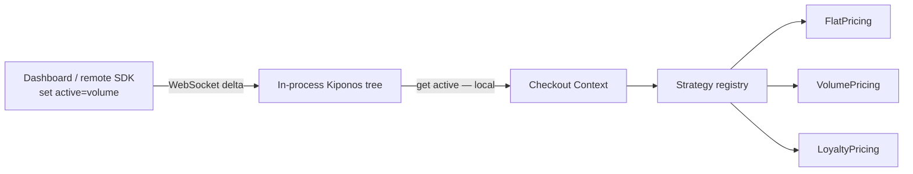

**The Aha:** Strategy was never the hard part. **Selection** was. Put `active` (and strategy params) in [Kiponos.io](https://kiponos.io); the next `priceCart()` uses a different algorithm with zero redeploy — and remote SDKs can flip it too.

## The problem: “runtime” that still ships through CI

Every senior engineer has drawn Strategy on a whiteboard:

```text
Context ──uses──▶ PricingStrategy
                      △
          ┌───────────┼───────────┐
       Flat        Volume      Loyalty
```

The story we tell juniors: *encapsulate the algorithm so you can swap it at runtime.*

The story production tells back: the “swap” is a pull request.

| Belief | Production |
|--------|------------|
| “We have Strategy, so we’re flexible” | Active strategy is a bean name or `switch` |
| “Runtime means the JVM is up” | Runtime *choice* still waits for a release |
| “Feature flags cover this” | Flag still needs a deploy pipeline or a second system |
| “Algorithms are code” | True — **selection** does not have to be |

Checkout does not care about your elegant interface if merchandising cannot turn on volume pricing during the sale window without a jar.

## The Aha: Strategy + live selection = Super Pattern

Keep the GoF shape. Move **which strategy is active** into a realtime config tree:

```yaml
patterns/
  strategy/
    checkout/
      active: flat          # flat | volume | loyalty
      volume-threshold: 10000
      loyalty-bps: 150
```

Your context object (or service) does this on the hot path:

```java
String id = policy.get("active"); // local in-memory tree
PricingStrategy strategy = registry.getOrDefault(id, flat);
return strategy.priceCents(ctx);
```

Ops sets `active` to `volume` in the dashboard. A promotions service can `set("active", "loyalty")` from another process. WebSocket **deltas** patch the SDK tree. Request threads keep calling local `get()` — no network per cart.

That is the Super Pattern thesis of this series:

> **Classic pattern structure + Kiponos policy tree = Super Pattern**  
> Humans *and* remote SDKs rewrite the pattern’s inner variables on demand.

## Architecture



1. Connect once — `Kiponos.createForCurrentTeam()`.  
2. Ensure `patterns/strategy/checkout` defaults.  
3. On each decision: **local** read of `active` + knobs.  
4. Run pure strategy code (reviewed, versioned, tested).  
5. Disconnect on shutdown.

No `@RefreshScope` recycle. No full YAML reload. One key change, one delta.

## Minimal Java sketch

```java
static Quote priceCart(Folder policy, long cartCents, boolean member) {
    String id = readActive(policy); // flat | volume | loyalty
    PricingStrategy s = STRATEGIES.getOrDefault(id, STRATEGIES.get("flat"));
    var ctx = new StrategyContext(
            cartCents, member,
            readInt(policy, "volume-threshold", 10_000),
            readInt(policy, "loyalty-bps", 150));
    return new Quote(id, s.priceCents(ctx), s.describe(ctx));
}
```

Full runnable example (public repo):

[examples/java/pattern-strategy-live-router](https://github.com/kiponos-io/kiponos-io/tree/master/examples/java/pattern-strategy-live-router)

## Scenarios table

| Moment | Frozen Strategy | Super Pattern |
|--------|-----------------|---------------|
| Flash sale starts | PR + canary | `active=volume` from dashboard |
| Loyalty campaign | Wait for release train | `active=loyalty`, tune `loyalty-bps` |
| Incident: bad formula | Redeploy previous build | Flip back to `flat` in seconds |
| Partner system decides | Manual ticket | Remote SDK `set("active", …)` |

## Performance notes

- Hot path: **O(1) local get** after connect.  
- Delta: only the changed key travels the wire.  
- Strategies stay in-process code — no remote execution of business logic.

## Alternatives (honest)

| Approach | Swap strategy mid-sale | Hot-path cost |
|----------|------------------------|---------------|
| Redeploy / config file | Minutes–hours | Low after boot |
| `@RefreshScope` bean | Often recycles more than selection | Restart-ish |
| Feature-flag SaaS | Yes, if wired | Extra hop or SDK |
| **Kiponos Super Pattern** | Yes — dashboard + remote SDK | Local get |

## When not to use live Strategy selection

| Case | Why |
|------|-----|
| Algorithm must be compile-time only (regulatory freeze) | Use signed releases, not live ids |
| Free-form script upload as “strategy” | Security — allowlist ids only |
| Secrets inside strategy params | Keep secrets out of the hub |

## Getting started

1. Clone [kiponos-io](https://github.com/kiponos-io/kiponos-io).  
2. `cd examples/java/pattern-strategy-live-router`  
3. Copy `kiponos.local.env.example` → tokens from [kiponos.io](https://kiponos.io).  
4. `./gradlew test run`  
5. In the hub, set `patterns/strategy/checkout/active` to `volume` and re-run.

## Series note

This is **chapter 1** of *Kiponos Super Patterns* — rewriting Gang of Four so each pattern’s **runtime freedom** is real: not only for humans in a UI, but for **other systems with an SDK** that need to change your process’s behavior remotely.

Next up: Live Decorator Chain, Live Chain of Responsibility, Live State Machine, Live Factory Method.

---

*Kiponos.io — Strategy always wanted a pulse. Now selection has one.*
