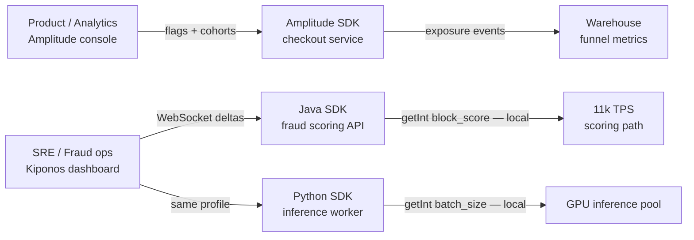

Monday 14:22. The product analytics team reviews **checkout funnel lift** from an Amplitude Experiment — flag `express_shipping_default`, 10% exposure, results joined to warehouse events for signup-to-purchase conversion. Same afternoon, fraud detects a coordinated card-testing wave: they need `block_score` at 74, `velocity_per_hour` at 12, and the Python scoring worker needs `batch_size` reduced from 128 to 48 because inference queues are backing up.

The analytics lead asks:

> "Amplitude Experiment has **remote config payloads** — store the fraud threshold there. One analytics platform, experiment exposure already flows to the warehouse."

The staff engineer on the authorization service pushes back:

> "Amplitude is built for **which users enter the cohort** and **what we measure downstream**. Our scoring path runs **11k evaluations per second** for floats that change during incidents — not for user-bucketed config with analytics event overhead."

[Amplitude Experiment](https://amplitude.com/amplitude-experiment) is a strong **analytics-native experimentation platform** — cohort bucketing tied to product funnels, warehouse-native result analysis, and exposure events that feed directly into Amplitude's behavioral analytics. [Kiponos.io](https://kiponos.io) is a **live operational config hub** — nested trees, WebSocket deltas, and local `get*()` reads in Java and Python on the money path. Mature product orgs use Amplitude where funnel metrics matter; Kiponos where production survives fraud spikes and inference saturation.

## The problem — analytics experiment payloads on the fraud scoring hot path

Typical Amplitude Experiment integration for a product test:

```java
// Product path — correct use of Amplitude Experiment
ExperimentUser user = ExperimentUser.builder()
        .userId(customerId)
        .userProperty("plan", "premium")
        .build();
Variant variant = experiment.fetch(user, "express_shipping_default");
boolean showExpressDefault = "treatment".equals(variant.getValue());
```

Teams then extend remote config for ops:

```java
// Anti-pattern — ops float stuffed into experiment infrastructure
ExperimentUser systemUser = ExperimentUser.builder()
        .userId("system-fraud-ops")
        .build();
Variant fraudConfig = experiment.fetch(systemUser, "fraud_tuning");
int blockScore = fraudConfig.getPayload().getInt("block_score", 85);

if (riskScore >= blockScore) {
    return FraudDecision.block();
}
```

Problems compound quickly:

- **User context required** — fraud thresholds are **system-bound**, not identity-bound; synthetic system users pollute analytics cohorts
- **Exposure + analytics pipeline** — optimized for funnel measurement, not bare-metal hot-path floats
- **Flat payload namespaces** — `fraud.block_score`, `resilience.payments.wait_ms`, and `ml.batch_size` lack a shared ops tree across services
- **Python workers and Java APIs** — same remote config duplicated or synced through custom glue
- **Warehouse join latency** — experiment analysis is async; incident knobs need **immediate** propagation, not batch analytics

Amplitude remote config is legitimate for **product-tunable parameters** (default tab, onboarding step order). It is the wrong primitive for **incident knobs** on saturated fraud scoring paths.

## What teams believe vs production reality

| Belief | Production reality |
|--------|-------------------|
| "Amplitude remote config replaces a config hub" | Built for **experiment payloads**, not nested ops trees |
| "One analytics platform simplifies architecture" | Funnel experiments and fraud floats have **different latency budgets** |
| "Exposure events are free on the hot path" | At 11k TPS, even lightweight analytics **adds up** |
| "Warehouse joins give us everything" | Ops incident response is **seconds**, not ETL cycles |
| "We will use Redis for the rest" | Now you operate **Amplitude + Redis + YAML** for one platform |

## The Aha

**Amplitude Experiment decides which users enter the cohort and how lift shows up in the warehouse. Kiponos decides how hard production runs when fraud spikes and inference queues saturate.** Keep `express_shipping_default` in Amplitude with full funnel analysis. Move `block_score`, `velocity_per_hour`, and `batch_size` to Kiponos — local reads, no per-transaction experiment evaluation.

## What Kiponos.io is for Amplitude-heavy product orgs

Kiponos is a real-time configuration hub. Java and Python SDKs connect once via WebSocket, hydrate a typed profile tree, and serve `getInt()`, `getDouble()`, and `getBoolean()` from **in-process memory**. Dashboard edits push **single-key deltas** — change `fraud/thresholds/block_score` from 85 to 74; every pod sees it without redeploy.

Profile path for this comparison:

```
['fraud']['scoring']['prod']['live']
```

Product experiments stay in Amplitude. Operational knobs live beside them in Kiponos if you want one mental model for "live values" — but the **read contract** is always local cache lookup, not cohort fetch with analytics exposure.

## Architecture — Amplitude experiment plane vs Kiponos ops plane



Hybrid is the norm: Amplitude owns **identity-bound** experiments with warehouse analytics; Kiponos owns **system-bound** thresholds both runtimes read.

## Config tree — ops keys that do not belong in experiment payloads

```yaml
fraud/
  thresholds/
    block_score: 74
    review_score: 58
    velocity_per_hour: 12
    card_testing_mode: true
  scoring/
    model_version: v3.2
    ensemble_weight_primary: 0.72
resilience/
  payments/
    failure_rate_threshold: 26
    wait_duration_open_ms: 20000
    half_open_permitted_calls: 10
  inference/
    queue_depth_threshold: 800
    shed_load_enabled: true
ml/
  inference/
    batch_size: 48
    worker_pool_size: 16
    max_sequence_length: 256
    timeout_ms: 1200
limits/
  partner_api/
    rpm: 9000
    burst: 1100
amplitude_bridge/
  # Optional: document which experiments remain on Amplitude
  express_shipping_default: amplitude_owned
  onboarding_flow_experiment: amplitude_owned
```

## Java integration — fraud scoring path stays local

```java
@Configuration
public class KiponosConfig {

    @Bean
    public Kiponos kiponos(
            @Value("${kiponos.team-id}") String teamId,
            @Value("${kiponos.access-key}") String accessKey,
            @Value("${kiponos.profile-path}") String profilePath) {
        return Kiponos.builder()
                .teamId(teamId)
                .accessKey(accessKey)
                .profilePath(profilePath)
                .build();
    }
}
```

```java
@Service
public class FraudThresholdEvaluator {

    private final Kiponos kiponos;

    public FraudThresholdEvaluator(Kiponos kiponos) {
        this.kiponos = kiponos;
    }

    public FraudDecision evaluate(double riskScore, int hourlyVelocity) {
        var thresholds = kiponos.path("fraud", "thresholds");
        int blockScore = thresholds.getInt("block_score");
        int velocityLimit = thresholds.getInt("velocity_per_hour");

        if (riskScore >= blockScore || hourlyVelocity > velocityLimit) {
            return FraudDecision.block();
        }
        return FraudDecision.allow();
    }
}
```

Product experiment — keep Amplitude on the checkout path where funnel analytics matter:

```java
public boolean defaultToExpressShipping(String customerId, String plan) {
    ExperimentUser user = ExperimentUser.builder()
            .userId(customerId)
            .userProperty("plan", plan)
            .build();
    Variant variant = experiment.fetch(user, "express_shipping_default");
    return "treatment".equals(variant.getValue());
    // Do not route fraud.block_score through this SDK
}
```

## Python integration — inference worker reads same ops tree

```python
import os
from kiponos import Kiponos

os.environ["KIPONOS_PROFILE"] = "['fraud']['scoring']['prod']['live']"
kiponos = Kiponos.create_for_current_team()

def current_batch_size() -> int:
    return kiponos.path("ml", "inference").get_int("batch_size", 128)

def on_config_change(change):
    if change.path.startswith("ml/inference/batch_size"):
        resize_inference_batch(int(change.new_value))

kiponos.after_value_changed(on_config_change)
```

Amplitude has no first-class story for a **Python GPU inference worker** and a **Java fraud scoring cluster** sharing `ml/inference/batch_size` with sub-second incident edits.

## Real scenarios

| Event | Amplitude alone | Amplitude + Kiponos |
|-------|-----------------|---------------------|
| Launch `express_shipping_default` at 10% with funnel analysis | **Native flag + warehouse joins** | Keep Amplitude; unchanged |
| Card-testing wave — lower block score | Remote config hack + system user | `fraud/thresholds/block_score` live |
| Velocity spike — tighten hourly limit | Wrong tool / awkward payload | `fraud/thresholds/velocity_per_hour` in seconds |
| Inference queue saturation — shrink batch | Not the tool | `ml/inference/batch_size` in Python |
| Cross-service fraud + payments alignment | Flat payload keys | Shared nested `fraud/` and `resilience/` trees |
| Measure signup-to-purchase lift in warehouse | **Amplitude Experiment analytics** | Keep Amplitude; ops keys in Kiponos audit log |
| Behavioral cohort segmentation for product tests | **Amplitude analytics** | Keep Amplitude; unrelated to ops |

## Performance — hot path economics on fraud scoring

- **Amplitude variant fetch** — user context, bucketing, exposure pipeline — right for **product paths at human scale**
- **Amplitude remote config on scoring** — per-evaluation payload fetch semantics; not designed for **11k bare floats/sec**
- **Kiponos `getInt()`** — in-memory tree lookup; no network on read path
- **Delta updates** — incident changes one key; no full remote config document redeploy
- **One WebSocket per JVM/worker** — background sync; hot path never blocks on vendor RTT
- **Polyglot parity** — Java Spring Boot 3 and Python workers share one profile; Amplitude SDK coverage varies by runtime role

## Honest comparison table

| Criterion | Amplitude Experiment | Kiponos | Honest verdict |
|-----------|---------------------|---------|----------------|
| Cohort experiments + funnel analysis | **Excellent** | Ops change log only | Amplitude for measured experiments |
| Warehouse-native result joins | **Core strength** | Not an analytics tool | Amplitude for behavioral lift |
| Remote config for product params | **Good** | Good for ops trees | Amplitude for UX tuning |
| Numeric incident knobs (fraud, circuits) | Awkward fit | **First-class** | Kiponos on money path |
| Nested cross-service ops trees | Flat payloads | **Hierarchical paths** | Kiponos for platform ops |
| Hot-path read at 11k TPS | Evaluation model | **Local cache** | Kiponos on scoring path |
| Java + Python same hub | Partial / role-dependent | **Both SDKs** | Kiponos for polyglot ops |
| Behavioral analytics integration | **Built-in** | Not a product analytics tool | Complementary |
| Card-testing / velocity incident response | Wrong tool | **Seconds to live** | Kiponos during incidents |
| Pricing model | Analytics / MAU oriented | Team/hub pricing | Model your experiment vs ops split |

## When not to use Kiponos

| Use case | Better tool |
|----------|-------------|
| Cohort-based experiments with warehouse funnel analysis | **Amplitude Experiment** |
| Behavioral segmentation for product tests | **Amplitude** |
| Exposure-to-conversion lift measurement | **Amplitude Experiment** |
| Bootstrap secrets and API keys | Vault / cloud secret manager |
| Infrastructure desired state | GitOps / Terraform |

## Getting started (15 minutes) — split analytics experiments from ops

1. Inventory every live key: mark **product experiment** (flag, cohort, UX param) vs **operational knob** (fraud, circuit, pool).
2. [TeamPro at kiponos.io](https://kiponos.io) — profile `['fraud']['scoring']['prod']['live']`.
3. Migrate **three ops keys** off Amplitude remote config: `block_score`, `velocity_per_hour`, one `batch_size`.
4. Wire Java `FraudThresholdEvaluator` and Python inference worker to the same profile.
5. Document RFC: *"Amplitude owns experiments with warehouse analytics; Kiponos owns ops floats on hot paths."*

## Further reading

- [Developer Quickstart](https://github.com/kiponos-io/kiponos-io/blob/master/docs/devto-getting-started-developer-guide.md)
- [Product tour](https://dev.to/kiponos/getting-started-with-kiponosio-p5k)
- [GETTING-STARTED.md](https://github.com/kiponos-io/kiponos-io/blob/master/docs/GETTING-STARTED.md)
- [Feature flags vs config hub (architecture)](https://github.com/kiponos-io/kiponos-io/blob/master/docs/devto-arch-feature-flags-vs-config-hub.md)
- [Kiponos vs Statsig](https://github.com/kiponos-io/kiponos-io/blob/master/docs/devto-vs-statsig.md)
- [Fraud payment routing](https://github.com/kiponos-io/kiponos-io/blob/master/docs/devto-fraud-payment-routing.md)
- [Rate limits & circuit breakers](https://github.com/kiponos-io/kiponos-io/blob/master/docs/devto-rate-limits-circuit-breakers.md)
- [github.com/kiponos-io/kiponos-io](https://github.com/kiponos-io/kiponos-io)

---

*Kiponos.io — Amplitude for which users enter the cohort and how lift shows in the warehouse. Live hub for how hard production runs during the incident.*