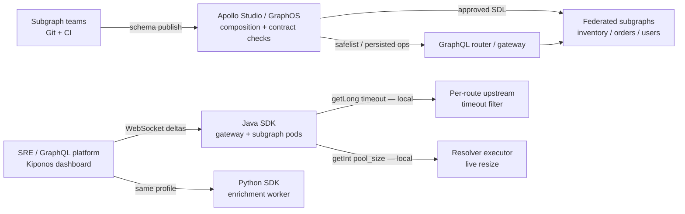

Wednesday 11:08. The federated commerce graph just passed **Apollo Studio** contract checks — `inventory` subgraph composition green, `@key` directives validated, operation safelist approved for the mobile BFF. Then checkout P99 explodes: the `orders` subgraph resolver pool is saturated, gateway upstream timeouts are still **45 seconds** from last quarter's YAML, and a partner integration is hammering the public endpoint at 4k RPM.

The GraphQL platform lead opens Apollo Studio:

> "Can we lower `maxQueryDepth` and tighten gateway timeouts **right now** without a subgraph deploy?"

Apollo's answer is correct for what it was built for: **schema lifecycle**, **federation composition**, **breaking-change detection**, and **persisted operation governance**. It is not a runtime float config plane for gateway thread pools and per-tenant rate limits.

[Apollo Studio / GraphOS](https://www.apollographql.com/docs/graphos/) is excellent for **schema contracts across subgraphs** — composition, checks in CI, safelists, and schema history. [Kiponos.io](https://kiponos.io) is excellent for **live GraphQL gateway operational knobs** — timeout budgets, resolver pool sizes, depth limits during resolver storms — with **WebSocket deltas** and **local hot-path reads** in Java and Python. Run both: Apollo for **what the graph is allowed to expose**; Kiponos for **how the gateway behaves tonight**.

## The problem — schema registry standing in for gateway ops

Typical Apollo-managed federation estate:

```yaml
# gateway/application-prod.yml — not in Apollo Studio's domain
spring:
  cloud:
    gateway:
      routes:
        - id: graphql-public
          uri: lb://graphql-router
          metadata:
            response-timeout: 45000
```

```java
// Subgraph resolver pool — frozen at bootstrap
@Configuration
public class GraphQlConfig {

    private static final int MAX_QUERY_DEPTH = 12;
    private static final int RESOLVER_POOL_SIZE = 80;

    @Bean
    public GraphQlSource graphQlSource(ResourcePatternResolver resolver) throws IOException {
        return GraphQlSource.builder()
                .schemaResources(resolver.getResources("classpath:graphql/**/*.graphqls"))
                .configureGraphQl(g -> g
                        .instrumentation(new MaxQueryDepthInstrumentation(MAX_QUERY_DEPTH))
                        .executionIdGenerator(ExecutionIdGenerator.DEFAULT))
                .build();
    }
}
```

Apollo Studio validates that `Product.sku` did not break when `inventory` shipped v2.3. It does **not** help when:

- **Gateway timeouts** need tightening during a subgraph brownout — still a Helm PR
- **Per-tenant GraphQL RPM** must drop for an abusive partner — no Studio knob
- **Resolver pool size** should shrink to protect Postgres — JVM restart or static constant
- **Python batch enrichment workers** and **Java subgraph pods** need the same `fraud/block_score` — outside Apollo's schema graph

Apollo is not wrong. **Runtime gateway floats on the GraphQL hot path** are the mismatch.

## What teams believe vs production reality

| Belief | Production reality |
|--------|-------------------|
| "Apollo governs our GraphQL platform" | Apollo governs **schema and operations** — not JVM pool sizes |
| "Federation checks catch production incidents" | Checks catch **breaking schema changes** — not resolver CPU storms |
| "Safelists protect the gateway" | Safelists protect **which operations run** — not **how fast they timeout** |
| "One GraphOS project for all GraphQL concerns" | Gateway timeouts and rate limits live in **YAML, env, or Java constants** |
| "Subgraph deploy is fast enough for ops tweaks" | Incident knobs need **seconds**, not CI + rolling restart |

## The Aha

**Apollo Studio owns schema lifecycle, federation composition, and operation contract checks. Kiponos owns gateway timeout knobs, rate limits, resolver pool sizes, and depth guardrails that must change in seconds during incidents — with local reads on every GraphQL request.** Complementary layers: Apollo for **schema contracts**; Kiponos for **live gateway ops**.

## What Kiponos.io is in an Apollo federation estate

Kiponos is a real-time configuration hub. Your Java SDK connects once at startup over WebSocket, loads a typed tree for profile `['graphql']['federation']['prod']['gateway']`, and serves `getInt()` / `getLong()` from **in-process memory**. Dashboard edits arrive as **delta patches** — changing `routes/public/response_timeout_ms` does not retransmit the whole tree.

Apollo Studio still owns subgraph SDL, composition checks, and persisted query rollout in CI. Everything under `graphql_gateway_ops/` is hub-native — the layer Apollo was never designed to hold.

Works the same on router pods, subgraph JVMs, and Python enrichment workers — not locked to Apollo's cloud project boundary.

## Architecture — Apollo schema plane vs Kiponos gateway ops plane



Apollo validates **what fields exist**. Kiponos tunes **how long the gateway waits and how hard it throttles**.

## Config tree — gateway ops Apollo does not model

```yaml
graphql_gateway_ops/
  routes/
    public/
      response_timeout_ms: 15000
      connect_timeout_ms: 3000
      max_query_depth: 10
      rpm: 1200
    partner_bff/
      response_timeout_ms: 30000
      max_query_depth: 15
      rpm: 8000
  resolver_pools/
    orders/
      core_pool_size: 40
      max_pool_size: 80
      queue_capacity: 200
    inventory/
      core_pool_size: 24
      max_pool_size: 48
  incident/
    resolver_storm_mode: false
    storm_max_depth: 7
    storm_rpm_multiplier: 0.5
  enrichment/
    batch_size: 64
    partner_timeout_ms: 8000
```

## Java integration — federated subgraph with live gateway policy

```java
@Configuration
public class KiponosConfig {

    @Bean
    public Kiponos kiponos(
            @Value("${kiponos.team-id}") String teamId,
            @Value("${kiponos.access-key}") String accessKey,
            @Value("${kiponos.profile-path}") String profilePath) {
        return Kiponos.builder()
                .teamId(teamId)
                .accessKey(accessKey)
                .profilePath(profilePath)
                .build();
    }
}
```

```java
@Component
@Order(Ordered.HIGHEST_PRECEDENCE + 15)
public class LiveGraphQlGatewayPolicyFilter extends OncePerRequestFilter {

    private final Kiponos kiponos;
    private final Map<String, Semaphore> tenantSemaphores = new ConcurrentHashMap<>();

    public LiveGraphQlGatewayPolicyFilter(Kiponos kiponos) {
        this.kiponos = kiponos;
        kiponos.afterValueChanged(change -> {
            if (change.path().startsWith("graphql_gateway_ops/resolver_pools/orders")) {
                resizeOrdersPool(Integer.parseInt(change.newValue()));
            }
        });
    }

    @Override
    protected void doFilterInternal(
            HttpServletRequest req, HttpServletResponse res, FilterChain chain)
            throws ServletException, IOException {
        String tenant = req.getHeader("X-Tenant-Id");
        String route = tenant == null ? "public" : "partner_bff";
        int rpm = effectiveRpm(route);
        if (!acquireRpm(tenantOrDefault(tenant), rpm)) {
            res.setStatus(429);
            return;
        }
        long timeoutMs = kiponos.path("graphql_gateway_ops", "routes", route)
                .getLong("response_timeout_ms", 15000);
        req.setAttribute("graphql.upstream.timeout.ms", timeoutMs);
        chain.doFilter(req, res);
    }

    private int effectiveRpm(String route) {
        int base = kiponos.path("graphql_gateway_ops", "routes", route).getInt("rpm", 1200);
        if (kiponos.path("graphql_gateway_ops", "incident").getBool("resolver_storm_mode", false)) {
            double mult = kiponos.path("graphql_gateway_ops", "incident")
                    .getDouble("storm_rpm_multiplier", 0.5);
            return (int) (base * mult);
        }
        return base;
    }
}
```

`getLong()` and `getInt()` are local — no Apollo Router config push on every GraphQL request.

## Python integration — enrichment worker off the subgraph hot path

```python
import os
from kiponos import Kiponos

os.environ["KIPONOS_PROFILE"] = "['graphql']['federation']['prod']['gateway']"
kiponos = Kiponos.create_for_current_team()

def enrich_order_batch(orders: list[dict]) -> list[dict]:
    batch_size = kiponos.path("graphql_gateway_ops", "enrichment").get_int("batch_size", 64)
    timeout_ms = kiponos.path("graphql_gateway_ops", "enrichment").get_int("partner_timeout_ms", 8000)
    # batch partner calls with live timeout budget ...
    return enriched

def on_config_change(change):
    if change.path.startswith("graphql_gateway_ops/enrichment/batch_size"):
        reconfigure_worker_pool(int(change.new_value))

kiponos.after_value_changed(on_config_change)
```

Same profile as Java gateway pods — Apollo Studio has no tree for Python enrichment batch sizes.

## Real scenarios

| Event | Apollo Studio / GraphOS alone | Apollo + Kiponos |
|-------|-------------------------------|------------------|
| `inventory` subgraph breaks `@key` | **Composition check fails in CI** | Keep Apollo; unchanged |
| Resolver storm — tighten depth | Schema deploy or router restart | `incident/resolver_storm_mode` live |
| Partner hammers public endpoint | Safelist does not throttle RPM | `routes/public/rpm` immediate |
| Orders subgraph pool exhausts threads | Rolling restart with new constant | `resolver_pools/orders/max_pool_size` |
| Subgraph brownout — shorten timeouts | Gateway Helm PR | `routes/public/response_timeout_ms` in seconds |
| Persisted query rollout for mobile | **Native GraphOS workflow** | Keep Apollo for this path |

## Performance — GraphQL gateway hot path specifics

- **Apollo composition checks** — CI-time; zero hot-path benefit during live incident
- **Kiponos read** — in-process tree lookup on every gateway filter invocation
- **Delta size** — single `rpm` or `response_timeout_ms` change is bytes, not full router config
- **Resolver pool bind** — `afterValueChanged` resizes executor without subgraph pod recycle
- **Storm mode** — two-key toggle (`resolver_storm_mode` + `storm_max_depth`) propagates faster than safelist edits
- **Polyglot enrichment** — Python worker and Java gateway share one hub; Apollo schema graph does not span batch workers

## Honest comparison table

| Criterion | Apollo Studio / GraphOS | Kiponos | Honest verdict |
|-----------|-------------------------|---------|----------------|
| Schema registry & federation composition | **Excellent** | Not a schema tool | Apollo for subgraph contracts |
| Breaking-change checks in CI | **Native** | Out of scope | Apollo for SDL governance |
| Operation safelists / persisted queries | **Core strength** | Not a query allowlist | Apollo for operation governance |
| Live gateway timeout tuning | Router YAML / deploy | **Dashboard delta** | Kiponos for incident budgets |
| Per-tenant GraphQL rate limits | Not designed for this | **Path-based limits** | Kiponos on abusive partners |
| Resolver pool size during storm | JVM constant or restart | **`afterValueChanged` bind** | Kiponos for pool knobs |
| Hot-path read at 3k+ GraphQL RPM | N/A — schema plane | **SDK memory** | Kiponos on gateway filters |
| Java + Python same ops tree | Schema graph is GraphQL-only | **Both SDKs** | Kiponos for enrichment + gateway |
| Audit trail for schema changes | **GraphOS history** | Hub change log for ops keys | Both — different artifacts |
| Cost at scale | GraphOS pricing per requests/checks | Team/hub pricing | Scope each narrowly |

## When not to use Kiponos

| Use case | Better tool |
|----------|-------------|
| Federated schema composition and `@key` validation | **Apollo Studio / GraphOS** |
| Breaking-change detection before subgraph publish | **Apollo schema checks** |
| Persisted query rollout and operation safelists | **GraphOS** |
| GraphQL type definitions and resolver wiring | Git + subgraph repos |
| Replacing Apollo Router or subgraph code | Architecture — not config |

## Getting started (15 minutes) — keep Apollo for schema contracts

1. Keep Apollo Studio for **subgraph composition**, **contract checks**, and **safelists** — unchanged.
2. [TeamPro at kiponos.io](https://kiponos.io) — profile `['graphql']['federation']['prod']['gateway']`.
3. Mount Kiponos credentials via K8s Secret; add `sdk-boot-3` to gateway and `orders` subgraph Deployments.
4. Migrate **three keys** off static YAML: `routes/public/response_timeout_ms`, `routes/public/rpm`, `resolver_pools/orders/max_pool_size`.
5. Run game day: enable `incident/resolver_storm_mode` while Apollo composition stays green — confirm gateway throttles **without** subgraph schema deploy.

## Further reading

- [Developer Quickstart](https://github.com/kiponos-io/kiponos-io/blob/master/docs/devto-getting-started-developer-guide.md)
- [Product tour](https://dev.to/kiponos/getting-started-with-kiponosio-p5k)
- [GETTING-STARTED.md](https://github.com/kiponos-io/kiponos-io/blob/master/docs/GETTING-STARTED.md)
- [GraphQL query depth Aha](https://github.com/kiponos-io/kiponos-io/blob/master/docs/devto-aha-graphql-query-depth.md)
- [API gateway timeouts live](https://github.com/kiponos-io/kiponos-io/blob/master/docs/devto-microservices-api-gateway-timeout.md)
- [Rate limits and circuit breakers](https://github.com/kiponos-io/kiponos-io/blob/master/docs/devto-rate-limits-circuit-breakers.md)
- [github.com/kiponos-io/kiponos-io](https://github.com/kiponos-io/kiponos-io)

---

*Kiponos.io — Apollo for schema contracts. Live hub for gateway timeouts, limits, and resolver pools that cannot wait for subgraph deploy.*