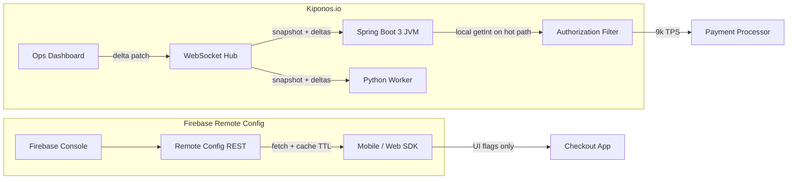

Wednesday 11:08. The mobile squad ships a checkout redesign using **Firebase Remote Config** — `show_bnpl_banner`, `min_app_version`, A/B cohorts. Product loves the dashboard. Then payments pages: a processor brownout needs `partner_failure_rate_threshold` dropped from 48 to 32 **while authorization holds at 9k TPS** on Spring Boot pods in GKE.

Someone asks whether the Android Remote Config SDK can drive the JVM circuit breaker. The platform architect answers with a sigh:

> "Firebase fetches config on a **client schedule** and caches it locally. Our payment filter runs **per request** — we cannot wait for a twelve-hour fetch interval or a mobile rollout template."

[Firebase Remote Config](https://firebase.google.com/docs/remote-config) is excellent for **mobile and web feature delivery** with Google Analytics experiments and gradual percentage rollouts. [Kiponos.io](https://kiponos.io) is excellent for **server-side operational trees** with **WebSocket deltas** and **zero-network `getInt()`** on the authorization hot path in Java and Python. Different layers, not competitors.

## The problem — fetch/cache semantics on a saturated JVM filter

Typical Firebase integration on Android or web:

```javascript
// Client SDK — simplified fetch + activate pattern
const remoteConfig = getRemoteConfig(app);
remoteConfig.settings.minimumFetchIntervalMillis = 43200000; // 12 hours prod
await fetchAndActivate(remoteConfig);
const showBanner = getValue(remoteConfig, "show_bnpl_banner").asBoolean();
```

That model is intentional: **protect the client battery**, batch fetches, cache aggressively, roll out UI flags to cohorts. Server teams who mirror the pattern on JVM hit friction:

```java
// Anti-pattern — polling Firebase Admin or REST on every authorize()
int threshold = firebaseRemoteConfig.getInt("partner_failure_rate_threshold"); // network
if (failureRate > threshold) {
    return Decision.degrade();
}
```

Even with server-side caching you inherit:

- **Fetch interval semantics** — not sub-second single-key ops during incidents
- **Key-value flat model** — no nested `payments_ops/resilience/partner/` trees across microservices
- **Client-first A/B** — excellent for UI; awkward for **circuit thresholds** shared with Python fraud workers
- **No JVM/Python first-class SDK contract** for in-process hot-path reads at 9k TPS

Firebase is not wrong. **Operational floats on the payment authorization path** are the mismatch.

## What teams believe vs production reality

| Belief | Production reality |
|--------|-------------------|
| "Remote Config is real-time everywhere" | **Fetch-and-activate real-time** — minutes to hours on clients; server mirrors inherit cache TTL |
| "One Firebase project covers mobile + backend" | Backend needs **process-local reads**, not GA-linked experiment cohorts |
| "Admin SDK on the server is enough" | Admin fetch is still **HTTP pull**, not delta push to in-memory tree |
| "A/B testing covers all rollout needs" | Processor circuit knobs need **instant global apply**, not 10% UI cohorts |
| "We will add a Redis cache in front" | You rebuilt a **polling hub** — without structured ops trees or dashboard deltas |

## The Aha

**Firebase Remote Config owns client-side feature delivery and experiments. Kiponos owns operational knobs that JVM and Python services read on every request — with local memory, no fetch interval, no activate step.** Run both: Firebase for mobile `show_bnpl_banner` and forced-update gates; Kiponos for fraud scores, tenant RPM limits, and resilience thresholds your payment filter reads in nanoseconds.

## What Kiponos.io is alongside Firebase

Kiponos is a real-time configuration hub. SDK connects via WebSocket to `wss://kiponos.io/api/io-kiponos-sdk`, loads profile `['payments']['gke']['prod']['live']`, holds values in an in-memory tree. Dashboard edit → delta patch → next `getInt("failure_rate_threshold")` sees it — **no fetchAndActivate, no minimumFetchIntervalMillis, no pod restart**.

Profile path is your environment boundary:

```
['payments']['gke']['prod']['live']
```

Firebase Remote Config still owns **client-visible flags** tied to Analytics audiences. Everything under `payments_ops/` is hub-native — shared by Java authorization pods and Python batch fraud workers without duplicating keys in two consoles.

## Architecture — Firebase fetch/cache vs Kiponos deltas



## Config tree — server ops separate from client flags

```yaml
payments_ops/
  resilience/
    partner/
      failure_rate_threshold: 32
      wait_duration_open_ms: 18000
      half_open_calls: 5
    inventory/
      failure_rate_threshold: 40
      wait_duration_open_ms: 30000
  limits/
    default/
      rpm: 1200
    tenant_mega_corp/
      rpm: 9000
      burst: 1200
  fraud/
    block_score: 85
    review_score: 70
    velocity_per_hour: 16
  firebase_bridge/
    # Mirror slow-roll client flags still on Firebase — documentation only
    show_bnpl_banner: true
    min_supported_app_version: "4.2.0"
```

## Java integration — Spring Boot 3 filter, local reads

```java
@Configuration
public class KiponosConfig {

    @Bean
    public Kiponos kiponos(
            @Value("${kiponos.team-id}") String teamId,
            @Value("${kiponos.access-key}") String accessKey,
            @Value("${kiponos.profile-path}") String profilePath) {
        Kiponos client = Kiponos.builder()
                .teamId(teamId)
                .accessKey(accessKey)
                .profilePath(profilePath)
                .build();
        client.afterValueChanged(change -> {
            if (change.path().contains("resilience/partner")) {
                partnerCircuitRegistry.reset("partner");
            }
        });
        return client;
    }
}
```

```java
@Component
@Order(Ordered.HIGHEST_PRECEDENCE + 15)
public class PartnerCircuitAuthorizationFilter extends OncePerRequestFilter {

    private final Kiponos kiponos;

    public PartnerCircuitAuthorizationFilter(Kiponos kiponos) {
        this.kiponos = kiponos;
    }

    @Override
    protected void doFilterInternal(
            HttpServletRequest req, HttpServletResponse res, FilterChain chain)
            throws ServletException, IOException {
        int threshold = kiponos.path("payments_ops", "resilience", "partner")
                .getInt("failure_rate_threshold", 40);
        if (shouldDegradePartner(threshold)) {
            res.setStatus(503);
            res.getWriter().write("{\"reason\":\"partner_degraded\"}");
            return;
        }
        chain.doFilter(req, res);
    }
}
```

`getInt()` is in-process — no Firebase Admin round-trip on every authorization at 9k TPS.

## Python integration — fraud velocity worker

```python
import os
from kiponos import Kiponos

os.environ["KIPONOS_ID"] = os.environ["KIPONOS_ID"]
os.environ["KIPONOS_ACCESS"] = os.environ["KIPONOS_ACCESS"]
os.environ["KIPONOS_PROFILE"] = "['payments']['gke']['prod']['live']"

kiponos = Kiponos.create_for_current_team()

def evaluate_fraud_velocity(txn_count_last_hour: int, card_bin: str) -> str:
    block_score = kiponos.path("payments_ops", "fraud").get_int("block_score", 82)
    velocity_limit = kiponos.path("payments_ops", "fraud").get_int("velocity_per_hour", 14)
    score = score_bin(card_bin)
    if score >= block_score:
        return "block"
    if txn_count_last_hour > velocity_limit:
        return "review"
    return "allow"
```

Same `payments_ops/fraud/` tree as Java pods — no second Firebase parameter namespace per runtime.

## Real scenarios

| Event | Firebase Remote Config alone | Firebase + Kiponos |
|-------|------------------------------|---------------------|
| Processor brownout — tune circuit | Not on client RC; server poll is slow | `resilience/partner/failure_rate_threshold` in seconds |
| Launch BNPL banner on iOS | **Native strength** — A/B cohort | Keep Firebase for this path |
| BIN attack — raise block score | No server hot-path contract | `fraud/block_score` immediate across JVM + Python |
| Tenant onboarding — raise RPM | Flat key awkward across services | `limits/tenant_mega_corp/rpm` live |
| Force app upgrade gate | **min_supported_app_version** rollout | Keep Firebase for client enforcement |
| Python + Java same fraud thresholds | Duplicate keys or custom sync | One tree, two SDKs |

## Performance — authorization path specifics

- **Firebase client fetch** — background; UI reads from **local RC cache** after activate
- **Firebase Admin on server** — HTTP pull; unsuitable for **per-request filter** at 9k TPS
- **Kiponos read** — in-process tree lookup on every `authorize()` — no network on hot path
- **Delta size** — single `failure_rate_threshold` change is bytes, not full Remote Config template
- **Incident latency** — dashboard edit vs waiting for fetch interval + cache expiry on any server mirror

## Honest comparison table

| Criterion | Firebase Remote Config | Kiponos | Honest verdict |
|-----------|------------------------|---------|----------------|
| Mobile / web feature flags | **Excellent** | Not a client SDK | Firebase for UI and forced updates |
| A/B experiments with Analytics | **Native** | Not experiment-oriented | Firebase for product cohorts |
| JVM hot-path filter at 9k TPS | Fetch/cache mismatch | **Local SDK memory** | Kiponos on payment filters |
| Sub-second ops tweak during incident | Client TTL bound | **WebSocket delta** | Kiponos for SRE knobs |
| Structured nested ops trees | Flat parameters | **Path-based tree** | Kiponos for `resilience/partner/` |
| Java + Python same thresholds | No unified server SDK | **Both SDKs** | Kiponos for polyglot backends |
| Google ecosystem integration | **Native** | External hub — evaluate policy | Firebase when GA-linked |
| Cost model | Firebase pricing tiers | Team/hub pricing | Model MAU vs pod count separately |

## When not to use Kiponos

| Use case | Better tool |
|----------|-------------|
| Mobile UI feature flag with Analytics A/B | **Firebase Remote Config** |
| Forced app upgrade and store compliance gates | **Firebase Remote Config** |
| Push notifications and FCM campaign targeting | **Firebase Cloud Messaging** |
| Client-side personalization with cohort bucketing | **Firebase + GA4** |
| Secrets and API keys in server bootstrap | **Secret Manager / Vault** — not live ops hub |

## Getting started (15 minutes) with Firebase still in place

1. Keep Firebase Remote Config for **client-visible flags** and experiments — unchanged.
2. [TeamPro at kiponos.io](https://kiponos.io) — profile `['payments']['gke']['prod']['live']`.
3. Add `sdk-boot-3` to payments Deployment; mount Kiponos credentials via K8s Secret.
4. Migrate **three server keys**: partner circuit threshold, one tenant RPM, `fraud/block_score`.
5. Run game day: dashboard tweak on JVM filter while mobile team continues Firebase BNPL rollout independently.

## Further reading

- [Developer Quickstart](https://github.com/kiponos-io/kiponos-io/blob/master/docs/devto-getting-started-developer-guide.md)
- [Product tour](https://dev.to/kiponos/getting-started-with-kiponosio-p5k)
- [GETTING-STARTED.md](https://github.com/kiponos-io/kiponos-io/blob/master/docs/GETTING-STARTED.md)
- [Rate limits live](https://github.com/kiponos-io/kiponos-io/blob/master/docs/devto-rate-limits-circuit-breakers.md)
- [K8s without ConfigMaps](https://github.com/kiponos-io/kiponos-io/blob/master/docs/devto-k8s-no-configmaps.md)
- [github.com/kiponos-io/kiponos-io](https://github.com/kiponos-io/kiponos-io)

---

*Kiponos.io — Firebase for mobile fetch-and-cache experiments. Live hub for JVM and Python ops knobs that cannot wait for activate.*