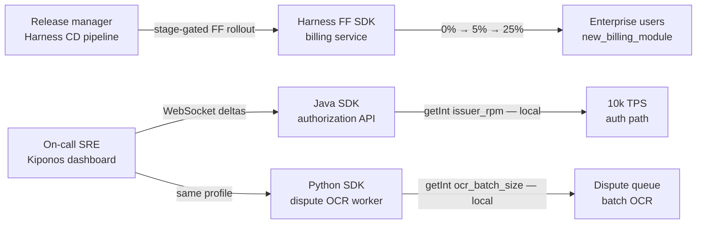

Monday 03:17. The enterprise platform team ships through **Harness CD** — every production deploy triggers a **Feature Flag pipeline stage**: `new_billing_module` rolls from 0% → 5% → 25% on a schedule wired to the release train. Governance loves it. At 03:17 the card processor degrades and the incident commander needs `resilience/processor_failure_rate` at 30, `limits/issuer_rpm` dropped to 4200, and the Python dispute worker needs `ocr_batch_size` cut from 200 to 50 — **now**, while the Harness pipeline for last night's billing deploy is still at 25% and change advisory won't approve an emergency FF promotion until standup.

The release manager asks:

> "Harness has **targeting rules** and **pipeline-gated rollouts** — add the processor threshold as a flag. It stays in the same governance model."

The on-call SRE replies:

> "Harness rollouts ride the **deployment train**. Incident knobs change **outside** that train — globally, in seconds, with no pipeline stage and no percentage ramp on a circuit breaker float."

[Harness Feature Flags](https://www.harness.io/products/feature-flags) sit inside a broader **enterprise CI/CD platform** — pipeline-gated rollouts, environment promotion, audit trails tied to deployments, and org-wide governance. [Kiponos.io](https://kiponos.io) is a **live operational config hub** — nested trees, WebSocket deltas, and local `get*()` reads in Java Spring Boot 3 and Python that SREs change during incidents without touching the release pipeline.

## The problem — pipeline-gated rollouts on the authorization hot path

Typical Harness FF integration gated to a CD stage:

```java
// Product path — correct Harness usage tied to deployment lifecycle
HarnessFFClient ffClient = HarnessFFClient.builder()
        .apiKey(apiKey)
        .target(Target.builder().identifier(userId).build())
        .build();

boolean billingV2 = ffClient.boolVariation("new_billing_module", false);
if (billingV2) {
    return renderBillingV2(account);
}
return renderBillingV1(account);
```

Teams then add incident knobs to the same flag store:

```java
// Anti-pattern — circuit threshold through FF pipeline semantics
boolean processorDegraded = ffClient.boolVariation("processor_degraded_mode", false);
int failureThreshold = ffClient.intVariation("processor_failure_rate", 45);

if (rollingFailureRate > failureThreshold) {
    return AuthDecision.degrade();
}
```

The mismatch is operational, not technical:

- **Rollout pipelines** — designed for **release-train cadence**; incident response runs on **minutes-to-seconds**
- **Percentage targeting on flags** — correct for `new_billing_module`; wrong mental model for a **global** `issuer_rpm` cap during processor brownout
- **Pipeline stage coupling** — changing a float waits on **CD workflow approval**, not SRE dashboard authority
- **Deployment audit vs incident audit** — FF history ties to releases; fraud threshold changes need **runbook linkage** and ops ownership
- **Python dispute OCR workers and Java authorization cluster** — same threshold duplicated across Harness targets or synced through pipeline artifacts

Harness FF is excellent for **governed feature promotion across environments**. It is the wrong control plane for **knobs SREs twist at 03:17 outside any deploy**.

## What teams believe vs production reality

| Belief | Production reality |
|--------|-------------------|
| "One Harness platform for CD and all runtime config" | Release flags and incident knobs share **pipeline semantics** awkwardly |
| "Pipeline-gated rollouts are real-time enough" | Real-time for **deployments** — minutes or hours, not sub-second fraud tweaks |
| "FF targeting rules cover ops limits" | Percentage ramps make sense for **features**, not global rate limits |
| "Governance uniformity reduces risk" | Incident response needs **SRE authority**, not change-advisory on a float |
| "We will use Redis for incident keys" | Now you operate **Harness FF + Redis + YAML** for one platform |

## The Aha

**Harness Feature Flags own enterprise rollout pipelines tied to deployments and environment promotion. Kiponos owns operational knobs that SREs change during incidents — globally, instantly, outside the release train.** Keep `new_billing_module` in Harness with pipeline-gated percentage ramps. Move `processor_failure_rate`, `issuer_rpm`, and `ocr_batch_size` to Kiponos — local reads on the hot path, dashboard edits with ops audit.

## What Kiponos.io is on Harness-heavy enterprise estates

Kiponos is a real-time configuration hub. Java and Python SDKs connect via WebSocket, load profile `['billing']['enterprise']['prod']['live']`, and hold values in memory. Dashboard edit → delta → next `getInt()` sees it — **no pipeline stage, no deployment promotion, no percentage ramp wait**.

Works the same whether last night's Harness deploy is at 25% or 100% — incident knobs are **orthogonal to the release train**.

Profile path for this comparison:

```
['billing']['enterprise']['prod']['live']
```

## Architecture — Harness rollout pipeline vs Kiponos incident plane



Mature estates run both: Harness owns **release-governed** feature promotion; Kiponos owns **incident-governed** system thresholds.

## Config tree — incident knobs outside the FF pipeline

```yaml
resilience/
  processor/
    failure_rate_threshold: 30
    wait_duration_open_ms: 18000
    half_open_permitted_calls: 5
  issuer_gateway/
    failure_rate_threshold: 35
    slow_call_threshold_ms: 2800
limits/
  issuer/
    rpm: 4200
    burst: 600
    per_card_velocity: 8
  partner_api/
    rpm: 11000
    concurrent_max: 400
fraud/
  thresholds/
    block_score: 83
    review_score: 66
    velocity_per_hour: 20
dispute/
  ocr/
    batch_size: 50
    max_parallel_jobs: 12
    timeout_seconds: 90
harness_bridge/
  # Flags that remain on Harness pipeline rollouts
  new_billing_module: harness_owned
  enterprise_portal_redesign: harness_owned
```

## Java integration — authorization filter reads local ops tree

```java
@Configuration
public class KiponosConfig {

    @Bean
    public Kiponos kiponos(
            @Value("${kiponos.team-id}") String teamId,
            @Value("${kiponos.access-key}") String accessKey,
            @Value("${kiponos.profile-path}") String profilePath) {
        return Kiponos.builder()
                .teamId(teamId)
                .accessKey(accessKey)
                .profilePath(profilePath)
                .build();
    }
}
```

```java
@Component
@Order(Ordered.HIGHEST_PRECEDENCE + 15)
public class IssuerRateLimitFilter extends OncePerRequestFilter {

    private final Kiponos kiponos;

    public IssuerRateLimitFilter(Kiponos kiponos) {
        this.kiponos = kiponos;
    }

    @Override
    protected void doFilterInternal(
            HttpServletRequest req, HttpServletResponse res, FilterChain chain)
            throws ServletException, IOException {
        String issuer = req.getHeader("X-Issuer-Id");
        int rpm = kiponos.path("limits", "issuer").getInt("rpm", 6000);
        if (rateExceeded(issuer, rpm)) {
            res.setStatus(429);
            return;
        }
        chain.doFilter(req, res);
    }
}
```

```java
@Service
public class ProcessorCircuitEvaluator {

    private final Kiponos kiponos;

    public ProcessorCircuitEvaluator(Kiponos kiponos) {
        this.kiponos = kiponos;
    }

    public CircuitState evaluate(double rollingFailureRate) {
        var resilience = kiponos.path("resilience", "processor");
        int threshold = resilience.getInt("failure_rate_threshold");
        long waitMs = resilience.getLong("wait_duration_open_ms");

        if (rollingFailureRate > threshold) {
            return CircuitState.open(waitMs);
        }
        return CircuitState.closed();
    }
}
```

Product flag — keep Harness on the billing module where pipeline governance matters:

```java
public BillingView routeBilling(Account account) {
    Target target = Target.builder()
            .identifier(account.getId())
            .attribute("tier", account.getTier())
            .build();
    boolean v2 = harnessFf.boolVariation(target, "new_billing_module", false);
    return v2 ? billingV2(account) : billingV1(account);
    // Do not route resilience/processor/failure_rate_threshold through Harness
}
```

## Python integration — dispute OCR worker on same profile

```python
import os
from kiponos import Kiponos

os.environ["KIPONOS_PROFILE"] = "['billing']['enterprise']['prod']['live']"
kiponos = Kiponos.create_for_current_team()

def ocr_batch_size() -> int:
    return kiponos.path("dispute", "ocr").get_int("batch_size", 200)

def on_config_change(change):
    if change.path.startswith("dispute/ocr/batch_size"):
        drain_and_resize_pool(int(change.new_value))

kiponos.after_value_changed(on_config_change)
```

Harness FF has no natural home for a **Python OCR worker** and a **Java authorization cluster** sharing `dispute/ocr/batch_size` with sub-second edits while a CD pipeline stage is frozen at 25%.

## Real scenarios

| Event | Harness FF alone | Harness FF + Kiponos |
|-------|------------------|------------------------|
| Pipeline-gated `new_billing_module` 0→5→25% | **Native CD integration** | Keep Harness; unchanged |
| Environment promotion Dev→Stage→Prod flags | **Core strength** | Keep Harness; unchanged |
| Processor brownout at 03:17 — open circuit | FF change waits on pipeline/CAB | `resilience/processor/failure_rate_threshold` live |
| Issuer gateway saturation — lower RPM | Percentage targeting wrong model | `limits/issuer/rpm` global, immediate |
| Dispute queue backlog — shrink OCR batches | Not the tool | `dispute/ocr/batch_size` in Python |
| Fraud spike during processor outage | Awkward FF integer flag | `fraud/thresholds/block_score` in seconds |
| Audit tied to release vs incident | **Harness deploy audit** | Harness for releases; Kiponos ops log for incidents |

## Performance — authorization path during processor degradation

- **Harness FF evaluation** — targeting context, pipeline-synced flag state — right for **release-governed product paths**
- **Harness percentage ramp** — correct for `new_billing_module`; adds **latency to ops thinking** when you need global circuit change
- **Kiponos `getInt()` on rate limit filter** — in-memory lookup every request at 10k TPS; no FF SDK hop
- **Delta updates** — SRE changes `issuer_rpm` once; all pods see it without pipeline rerun
- **Incident orthogonality** — Kiponos knobs work while Harness deploy is mid-stage; no coupling to CD workflow state
- **One WebSocket per process** — background sync; authorization hot path never blocks on Harness API RTT

## Honest comparison table

| Criterion | Harness Feature Flags | Kiponos | Honest verdict |
|-----------|----------------------|---------|----------------|
| Pipeline-gated enterprise rollouts | **Excellent** | Not a CD platform | Harness wins release train |
| Environment promotion (Dev/Stage/Prod) | **Native** | Profile paths | Harness for governed promotion |
| Deployment audit & compliance | **Strong** | Ops change log | Harness for release audit |
| Incident knobs outside release train | Pipeline-bound mindset | **Dashboard delta** | Kiponos for 03:17 response |
| Global ops limits (RPM, circuits) | Percentage targeting awkward | **First-class** | Kiponos on saturated paths |
| Nested cross-service ops trees | Flat flag keys | **Hierarchical paths** | Kiponos for platform ops |
| Hot-path read at 10k TPS | FF SDK evaluation | **Local cache** | Kiponos on authorization filters |
| Java + Python same hub | Partial | **Both SDKs** | Kiponos for polyglot ops |
| CI/CD platform integration | **Core Harness value** | Complementary SDK | Different layers |
| Pricing model | Enterprise platform bundle | Team/hub pricing | Model release vs incident split |

## When not to use Kiponos

| Use case | Better tool |
|----------|-------------|
| Feature flag rollout gated to Harness CD pipeline stages | **Harness Feature Flags** |
| Environment-scoped flag promotion with deployment audit | **Harness** |
| Org-wide governance tying flags to release approvals | **Harness** |
| Bootstrap secrets and API keys | Vault / enterprise secret manager |
| Infrastructure desired state | Harness IaCM / Terraform |

## Getting started (15 minutes) — separate release train from incident knobs

1. Inventory keys: mark **pipeline-governed feature flag** vs **incident operational knob** (circuit, RPM, fraud, batch size).
2. [TeamPro at kiponos.io](https://kiponos.io) — profile `['billing']['enterprise']['prod']['live']`.
3. Migrate **three ops keys** off Harness FF: `processor_failure_rate`, one `issuer_rpm`, one `ocr_batch_size`.
4. Wire Java `IssuerRateLimitFilter` + `ProcessorCircuitEvaluator` and Python dispute worker to same profile.
5. Update incident runbook: *"Harness FF for release-governed features; Kiponos for knobs changed outside the deploy pipeline."*

## Further reading

- [Developer Quickstart](https://github.com/kiponos-io/kiponos-io/blob/master/docs/devto-getting-started-developer-guide.md)
- [Product tour](https://dev.to/kiponos/getting-started-with-kiponosio-p5k)
- [GETTING-STARTED.md](https://github.com/kiponos-io/kiponos-io/blob/master/docs/GETTING-STARTED.md)
- [Feature flags vs config hub (architecture)](https://github.com/kiponos-io/kiponos-io/blob/master/docs/devto-arch-feature-flags-vs-config-hub.md)
- [Kiponos vs LaunchDarkly](https://github.com/kiponos-io/kiponos-io/blob/master/docs/devto-vs-launchdarkly-feature-flags.md)
- [Kiponos vs AWS AppConfig](https://github.com/kiponos-io/kiponos-io/blob/master/docs/devto-vs-aws-appconfig.md)
- [Rate limits & circuit breakers](https://github.com/kiponos-io/kiponos-io/blob/master/docs/devto-rate-limits-circuit-breakers.md)
- [github.com/kiponos-io/kiponos-io](https://github.com/kiponos-io/kiponos-io)

---

*Kiponos.io — Harness for flags on the release train. Live hub for knobs SREs turn when the train is not the answer.*