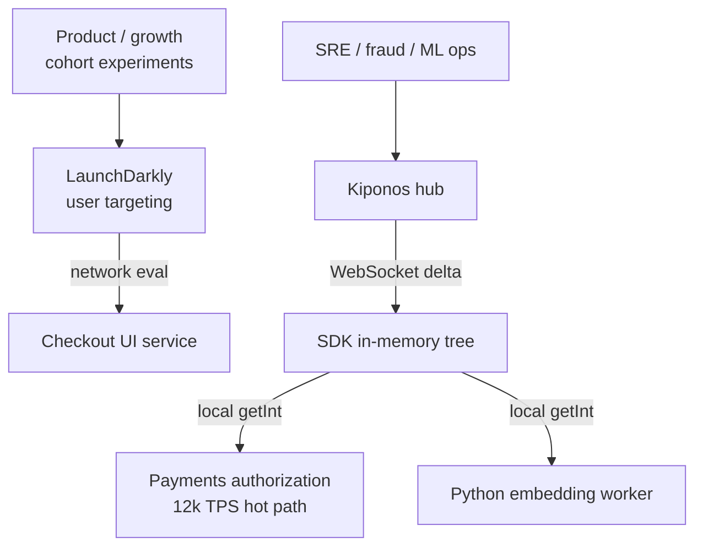

Wednesday 11:08. Product wants a **5% canary** on the new checkout UI — classic feature-flag territory. At the same moment, fraud sees a BIN attack and needs `block_score` moved from 90 to 82, the payments circuit `failure_rate_threshold` dropped to 35, and the ML routing service needs `embedding_batch_size` cut from 64 to 32 because GPUs are saturated.

The PM says: "We already pay for LaunchDarkly — put the fraud score in a JSON flag."

The staff engineer pushes back:

> "LD is brilliant for **who sees the new checkout**. It is the wrong primitive for **how hard we block cards** on a 12k TPS authorization path."

[LaunchDarkly](https://launchdarkly.com) and peers solve **product experimentation** — boolean rollouts, user targeting, percentage exposure tied to identity. [Kiponos.io](https://kiponos.io) solves **operational configuration** — floats, nested trees, cross-service shared state, and **local reads** on the hot path. Mature platforms use both — or consolidate ops keys into Kiponos and keep LD for cohort experiments.

## The problem — one vendor shoehorned into two jobs

Teams buy feature-flag SaaS for product. Six months later the SRE board looks like this:

| Need | Stuffed into LaunchDarkly? |
|------|---------------------------|
| `new_checkout_enabled` for 5% of logged-in users | **Yes — native** |
| `fraud.block_score = 82` | JSON flag value — awkward |
| `resilience.payments.failure_rate_threshold` | Wrong mental model |
| `ml.embedding_batch_size` | Wrong tool |
| Shared `saga/step_timeout_ms` across 4 services | No shared ops tree |
| Hot-path read at 12k TPS | SDK evaluation — **network-bound** |

Authorization services cannot afford per-transaction remote flag evaluation for a float that changes hourly. Product flags and ops knobs have different **latency budgets**, **ownership**, and **audit stories**.

## What teams believe vs production reality

| Belief | Production reality |
|--------|-------------------|
| "One flag platform for everything" | Product and ops keys **fight for the same dashboard** |
| "JSON flag values cover numeric tuning" | No schema, no tree, hard to grep across services |
| "Flag SDK cache is good enough" | Still **evaluation network**; not the same as local `getInt()` |
| "LD audit is enough for compliance" | Fraud threshold changes need **ops runbook linkage**, not experiment history |
| "We will add Redis for the floats" | Now you operate **three** systems: LD + Redis + YAML |

## The Aha

**Feature flags decide what features users see. A live config hub decides how systems behave under load.** Store `features/new_checkout_enabled` in Kiponos if you want one SDK — or keep LaunchDarkly for cohort targeting and feed **weights** from Kiponos. Never route fraud scores through boolean-flag infrastructure.

## What Kiponos.io is for ops-heavy estates

Kiponos is a real-time configuration hub. Java and Python SDKs connect via WebSocket, hold a typed tree in memory, and serve `get*()` with **zero network on the read path**. Dashboard edits push **deltas** — one key changes, one patch arrives.

Profile path for this comparison:

```
['checkout']['v3']['prod']['live']
```

Product booleans and ops floats live in the **same tree** if you want consolidation — but the **read pattern** is always local cache, not per-user flag evaluation.

## Architecture — product flags vs ops hub



Hybrid is common: LD for **identity-bound** UI experiments; Kiponos for **system-bound** thresholds both Java and Python read.

## Config tree — product + ops in one hub (optional consolidation)

```yaml
features/
  new_checkout_enabled: true
  checkout_canary_percent: 5
  strong_auth_required: false
fraud/
  thresholds/
    block_score: 82
    review_score: 68
    velocity_per_hour: 15
resilience/
  payments/
    failure_rate_threshold: 35
    wait_duration_open_ms: 25000
ml/
  embedding/
    batch_size: 32
    max_sequence_length: 512
    cache_ttl_seconds: 300
limits/
  partner_launch/
    rpm: 8000
    burst: 1200
```

## Java integration — hot path stays local

```java
@Configuration
public class KiponosConfig {

    @Bean
    public Kiponos kiponos(
            @Value("${kiponos.team-id}") String teamId,
            @Value("${kiponos.access-key}") String accessKey,
            @Value("${kiponos.profile-path}") String profilePath) {
        return Kiponos.builder()
                .teamId(teamId)
                .accessKey(accessKey)
                .profilePath(profilePath)
                .build();
    }
}
```

```java
@Service
public class PaymentRiskEngine {

    private final Kiponos kiponos;

    public PaymentRiskEngine(Kiponos kiponos) {
        this.kiponos = kiponos;
    }

    public RouteDecision evaluate(Transaction txn, int riskScore) {
        var fraud = kiponos.path("fraud", "thresholds");
        int blockScore = fraud.getInt("block_score");
        int reviewScore = fraud.getInt("review_score");

        if (riskScore >= blockScore) {
            return RouteDecision.block("score_exceeded");
        }
        if (riskScore >= reviewScore) {
            return RouteDecision.manualReview();
        }
        return RouteDecision.standard();
    }
}
```

Product canary percentage — still a local read if consolidated:

```java
public boolean routeToNewCheckout(String userId) {
    int percent = kiponos.path("features").getInt("checkout_canary_percent", 0);
    return bucket(userId) < percent;
    // For rich cohort rules, keep LaunchDarkly here instead
}
```

## Python integration — ML worker reads same ops tree

```python
import os
from kiponos import Kiponos

os.environ["KIPONOS_PROFILE"] = "['checkout']['v3']['prod']['live']"
kiponos = Kiponos.create_for_current_team()

def embedding_batch_size() -> int:
    return kiponos.path("ml", "embedding").get_int("batch_size", 64)

def on_config_change(change):
    if change.path.startswith("ml/embedding/batch_size"):
        resize_worker_pool(change.new_value)

kiponos.after_value_changed(on_config_change)
```

LaunchDarkly has no first-class story for **Python training workers** and **Java payment services** sharing `ml/embedding/batch_size`.

## Real scenarios

| Event | LaunchDarkly alone | LaunchDarkly + Kiponos (or Kiponos only) |
|-------|-------------------|------------------------------------------|
| 5% checkout UI canary | **Native cohort rollout** | LD for targeting; or `checkout_canary_percent` + app bucketing |
| BIN attack — lower block score | JSON flag hack | `fraud/thresholds/block_score` live |
| GPU saturation | Not the tool | `ml/embedding/batch_size` live in Python |
| Circuit breaker tuning | Not the tool | `resilience/payments/failure_rate_threshold` |
| Cross-service saga timeout | Not the tool | Shared `saga/` tree — see collaboration article |
| Audit product experiment | **LD experiment history** | Keep LD; ops keys in Kiponos log |

## Performance — hot path economics

- **LaunchDarkly evaluation** — optimized SDK, still built around **flag decisions** and targeting context
- **Kiponos `getInt()`** — pure in-memory tree lookup on authorization path
- **Delta updates** — fraud changes `block_score` only; no full config redeploy
- **One WebSocket per process** — not per-request vendor RTT
- **Python + Java** — same hub connection model; LD coverage varies by SDK maturity per language

## Honest comparison table

| Criterion | LaunchDarkly | Kiponos | Honest verdict |
|-----------|--------------|---------|----------------|
| User/cohort targeting | **Excellent** | App logic + profile paths | LD wins product experiments |
| Percentage rollouts tied to identity | **Native** | Possible with bucketing | LD for rich targeting rules |
| Numeric ops thresholds | Awkward JSON | **First-class** | Kiponos for floats |
| Nested config trees | Flat flag keys | **Hierarchical paths** | Kiponos for ops structure |
| Hot-path read at 12k TPS | Network evaluation | **Local cache** | Kiponos on money path |
| Cross-service shared ops state | No | **Yes** | Kiponos for platform trees |
| Experiment analytics | **Built-in** | Ops change log | LD for product metrics |
| Java + Python same hub | Partial | **Both SDKs** | Kiponos for polyglot ops |
| Pricing model | Per-seat / MAU | Team/hub pricing | Depends on scale |

## When not to use Kiponos

| Use case | Better tool |
|----------|-------------|
| Multivariate UI experiments with audience rules | **LaunchDarkly** (or similar) |
| Non-technical PM self-serve cohort targeting | **LaunchDarkly** |
| Bootstrap secrets and API keys | Vault |
| Infrastructure desired state | GitOps |

## Getting started (15 minutes) — draw the boundary

1. Inventory keys: mark each as **product experiment** vs **operational knob**.
2. [TeamPro at kiponos.io](https://kiponos.io) — profile `['checkout']['v3']['prod']['live']`.
3. Migrate **three ops keys** off LD JSON hacks: `block_score`, one circuit threshold, one ML batch size.
4. Wire Java `PaymentRiskEngine` and Python embedding worker to same profile.
5. Document RFC: *"LD owns cohort UI experiments; Kiponos owns ops floats."*

## Further reading

- [Developer Quickstart](https://github.com/kiponos-io/kiponos-io/blob/master/docs/devto-getting-started-developer-guide.md)
- [Product tour](https://dev.to/kiponos/getting-started-with-kiponosio-p5k)
- [GETTING-STARTED.md](https://github.com/kiponos-io/kiponos-io/blob/master/docs/GETTING-STARTED.md)
- [Feature flags vs config hub (architecture)](https://github.com/kiponos-io/kiponos-io/blob/master/docs/devto-arch-feature-flags-vs-config-hub.md)
- [Fraud payment routing](https://github.com/kiponos-io/kiponos-io/blob/master/docs/devto-fraud-payment-routing.md)
- [github.com/kiponos-io/kiponos-io](https://github.com/kiponos-io/kiponos-io)

---

*Kiponos.io — LaunchDarkly for who sees the feature. Live hub for how hard production runs.*